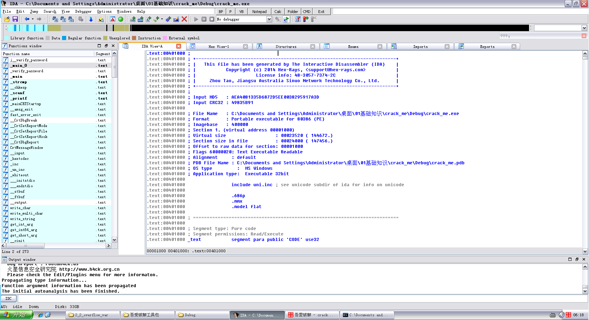
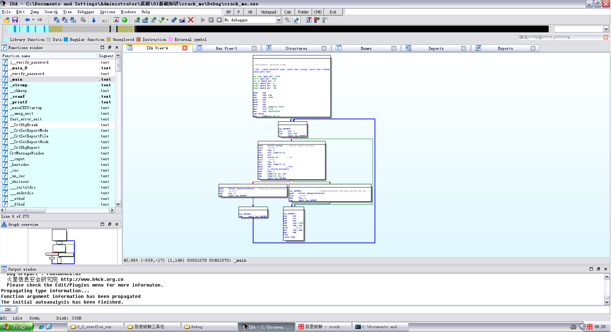
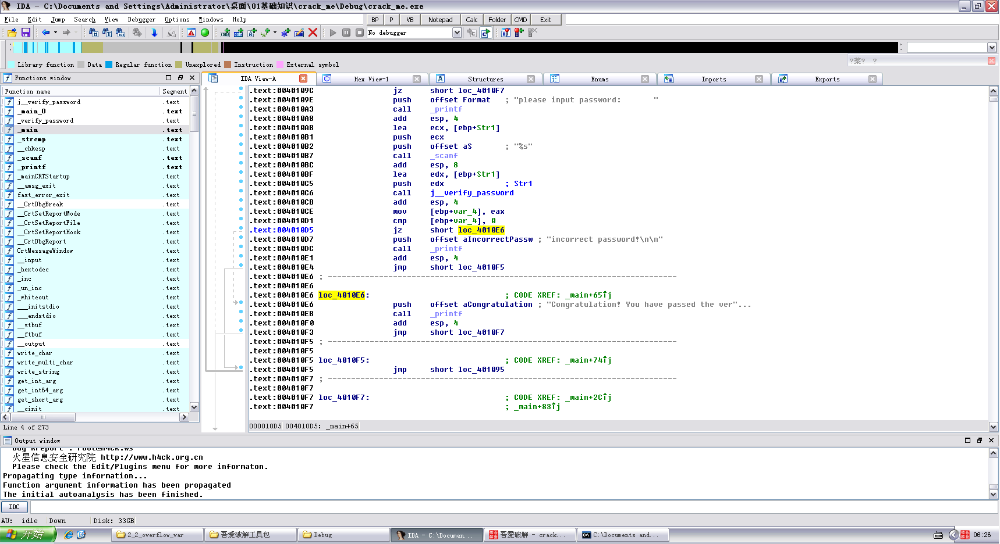
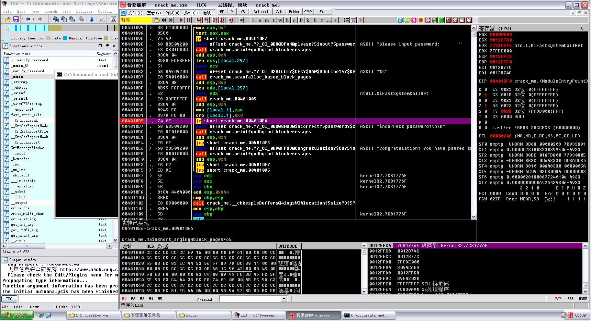
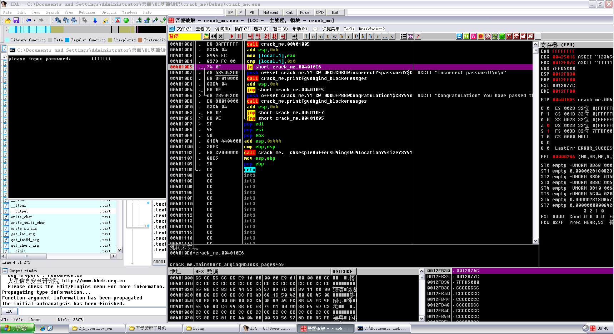
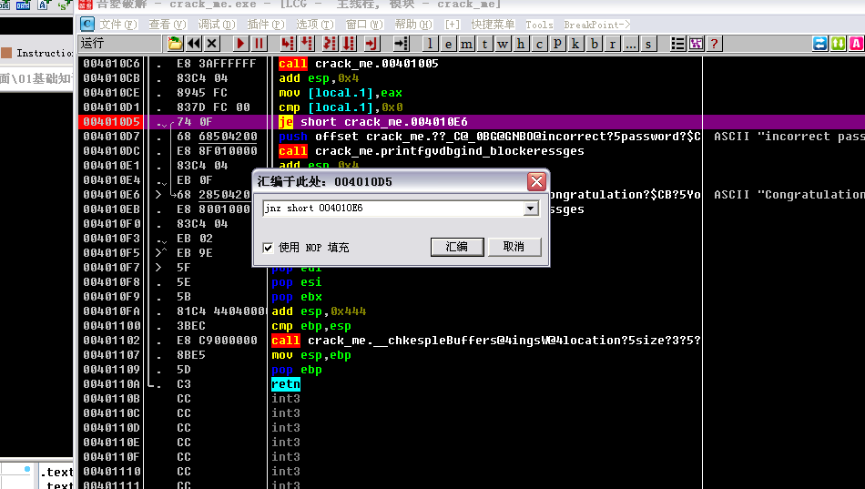

# How to crack a PE file

**Author：wnagzihxain
Mail：tudouboom@163.com**

```
#include "stdio.h"

#define PASSWORD "1234567"

int verify_password (char *password)
{
	int authenticated;
	authenticated=strcmp(password, PASSWORD);
	return authenticated;
}
 
int main()
{
	int valid_flag = 0;
	char password[1024];
	while(1)
	{
		printf("please input password:       ");
		scanf("%s", password);
		valid_flag = verify_password(password);
		if(valid_flag)
		{
			printf("incorrect password!\n\n");
		}
		else
		{
			printf("Congratulation! You have passed the verification!\n");
			break;
		}
	}
    system("pause");
	return 0;
}
```

预备知识：

 - F2：下断点
 - F7：跟入单步（比如一个call，会进入这个call的内部）
 - F8：不跟入单步（比如一个call，不会进入这个call内部，而是直接执行这个call里面所有语句）
 - F9：运行

使用VC++6.0编译，生成PE文件

程序逻辑比较简单，一个控制台程序，如果输入的是"1234567"就正确，反之错误

我们跟着0day2的排版走，使用IDA Pro载入这个PE，如果你是第一次用IDA Pro的话，一直ok下去，那些可以关掉的提示就永远关了



左边都是函数之类的模块，都已经标记好了，比如上面的main就是main函数，点进去看看，然后按空格就可以看到流程图了，很明显看出来if所在



如图亮点，第一个黄色正是if判断的跳转语句，记下VA，VA全名virtual address，是虚拟内存地址，还记不记得RVA，RVA是relative virtual address，是相对虚拟地址，Image Base是装载基址，PE被载入内存的时候，Image Base是最开始的地址，然后加上RVA就是VA，公式是VA = Image Base + RVA



上面搞清楚了之后讲一下节偏移：

之所以有节偏移的存在是因为文件数据的存放单位和内存数据的存放单位不一样，PE文件中的数据按照磁盘数据存放，以0x200字节为基本单位，当一个数据节不足0x200字节时，多余的填充0x00，超过0x200字节的使用下一0x200字节的空间，所以PE数据节的大小为0x200的整数倍

但是在内存里单位就不是0x200字节了，而是0x1000，所以就出现了节偏移

那么文件偏移地址的计算公式就是：文件偏移地址 = VA - Image Base - 节偏移 = RVA-节偏移

打开OD，载入控制台程序，找到刚刚那句跳转指令，Ctrl+G，直接输入VA：004010D5

在跳转指令下个断点，F2或者直接双击都能下断点



运行程序，控制台程序一载入OD就运行起来没有关系，F8单步走下去就好了，或者F9直接运行

这里F9直接运行起来，输入“1111111”，回车，断在我们刚才下的断点处，先观察一下，可以看到je跳转未实现，那么修改的方法就比较多了，可以修改为jnz，或者直接jmp到下面去，或者直接修改寄存器的值



这里修改je为jnz，这两个跳转指令的条件刚好相反



复制到可执行文件然后保存所有修改

再运行即可