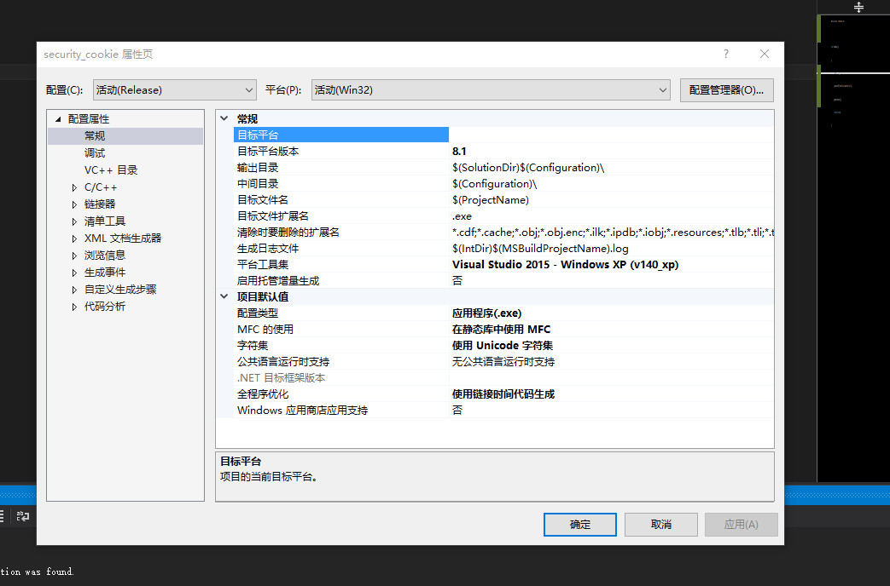
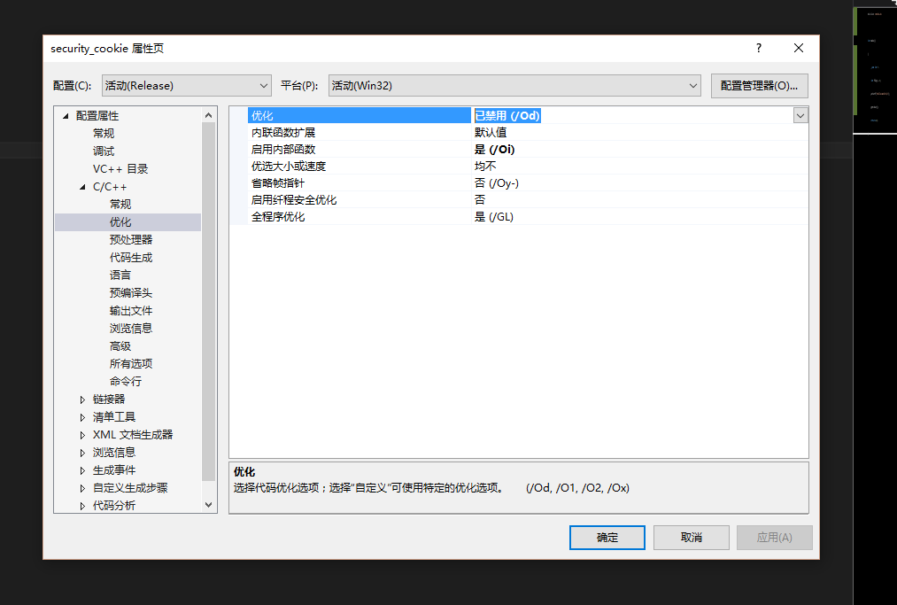
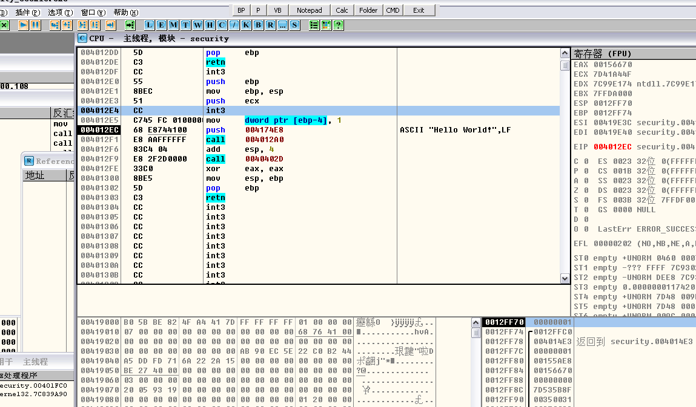
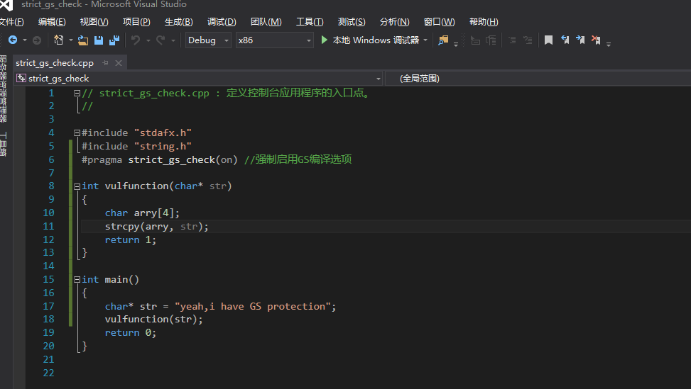
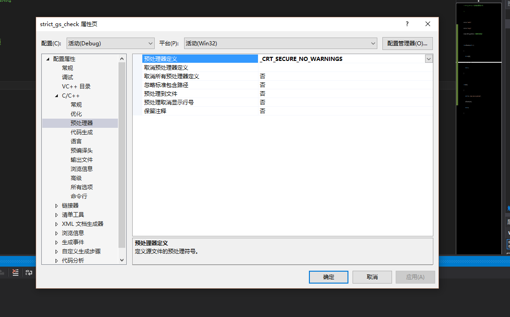
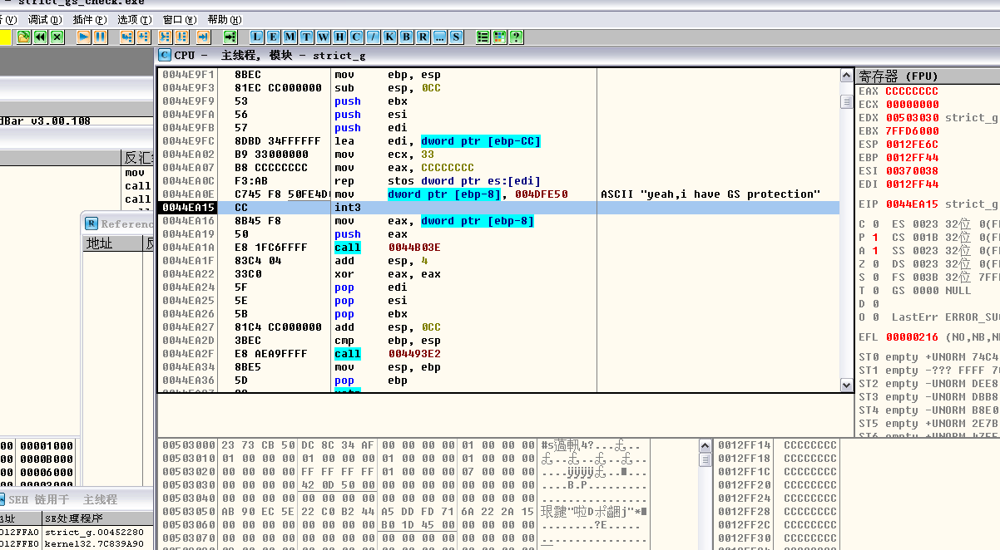
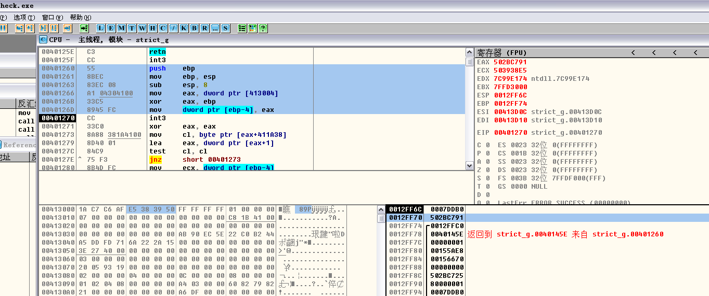
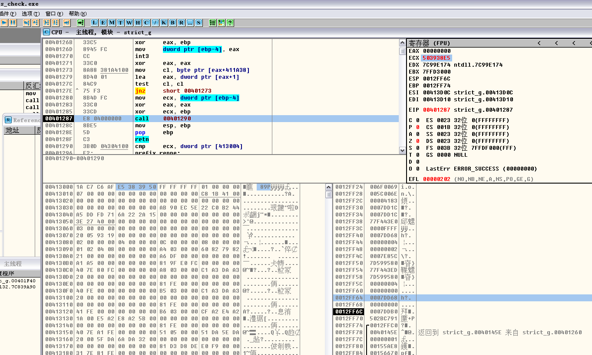
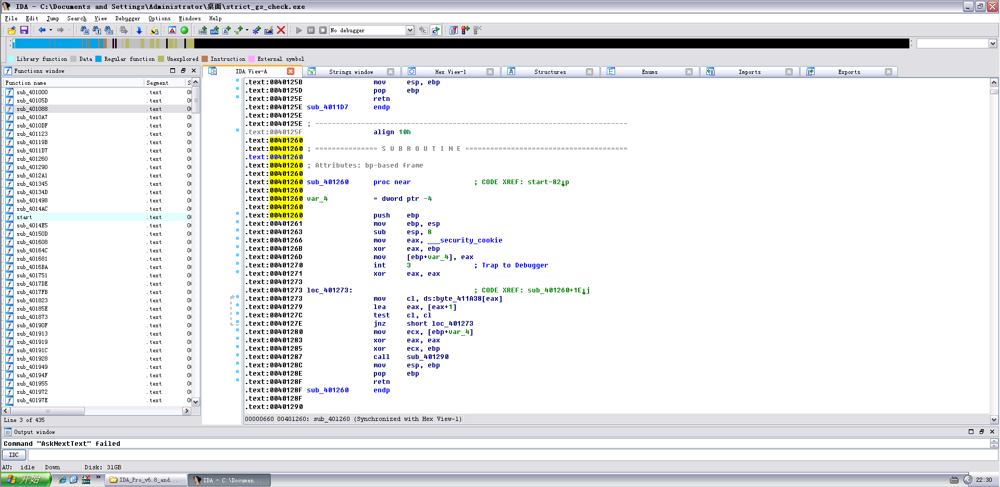

# The principles of GS

**Author：wnagzihxain
Mail：tudouboom@163.com**

这一章的调试都需要用到VS，设置VS的编译选项是个技术活，因为设置不好的话生成的exe在XP下运行不了

像这样设置，平台工具集和MFC的使用两个选项注意要选择对



然后是优化的选项，选择禁止优化



然后生成的exe就可以在XP下运行了

写个小程序来看看效果



现在来看看《0day2》里面使用的程序



但是这个程序直接编译是编译不起来的，因为`strcpy`是`unsafe`的函数，所以需要修改一下预处理器的选项，如下添加这一句，只需要直接复制引号里面的东西就行了，不需要其他操作，`_CRT_SECURE_NO_WARNINGS`



咱们来改一下，加个断点省的找入口 
``` 
// strict_gs_check.cpp : 定义控制台应用程序的入口点
//

#include "stdafx.h"
#include "string.h"
#pragma strict_gs_check(on) //强制启用GS编译选项

int vulfunction(char* str)
{
	char arry[4];
	strcpy(arry, str);
	return 1;
}

int main()
{
	__asm int 3
	char* str = "yeah, i have GS protection";
	vulfunction(str);
    return 0;
}
```



为了直观我们修改一下断点的位置，改为vulfunction的入口，直接运行，attach



标注部分是生成Security Cookie的过程，先是取种子，种子在数据区已经标出来了，存入EAX，然后和EBP异或，算出的结果存在EAX，然后存入`ss:[EBP-4]`的位置，也就是上图栈区标注的部分，啥子？不会异或，将每位上的数拆成四位二进制数，然后上下比较，不同为1，相同为0，比如`0x0012FF74`和`0x503938E5`进行异或，我们来看看第三位怎么运算
```
1->0001，3->0011
```

不同为1，结果是`0010->2`，所以种子的第三位是2，其它同理

然后往下看，找到校验Security Cookie的地方



可以看到，先是把Security Cookie取出来放到ECX里面，然后和EBP进行异或还原，完了看到右上角ECX寄存器的值已经和数据区的Cookie种子的值一样，然后下面的call就是校验两者是否相同的

来看看《0day2》里面对生成Security Cookie的分析

1. 系统以data节的第一个双子作为Cookie的种子，或称原始Cookie（所有函数的Cookie都用这个DWORD生成）

2. 在程序每次运行时Cookie的种子都不同，因此种子具有很强的随机性

3. 在栈帧初始化以后系统用ESP异或种子，作为当前函数的Cookie，以此作为不同函数之间的区别，并增加Cookie的随机性

4. 在函数返回前，用ESP还原出（异或）Cookie的种子

对上面的用ESP异或Cookie，而我们用EBP来异或Cookie，是因为上面执行了mov ebp,esp

对了，整个实验都是使用的release版本

最后我们来看看在IDA里面这个函数是怎么显示的，挺难找的



那么这节其实就是对Security Cookie有个大概的了解顺便设置VS的编译选项来适应后面的调试