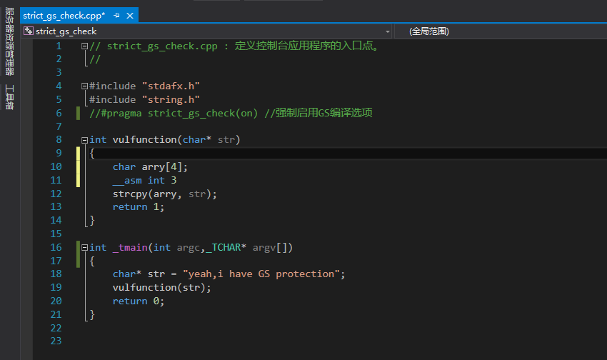
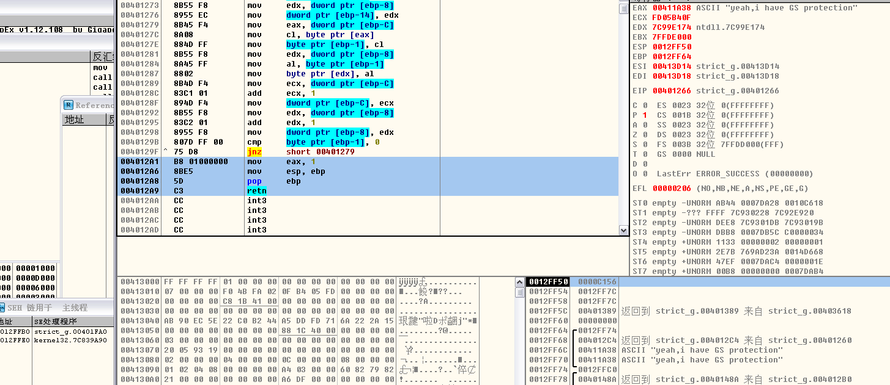

# Using unprotected memory area bypass GS

**Author：wnagzihxain
Mail：tudouboom@163.com**

这篇比较短，就是利用未被保护的内存来突破GS

VS的设置和上一篇一样，都是禁用优化，启用GS

生成release之后打开，会发现断下来了

如图，没有Security Cookie，那么我们就可以正常部署shellcode了

《0day2》里面对VS是否启用GS做了解释：

1. 函数不包含缓冲区

2. 函数被定义为具有变量参数列表

3. 函数使用无保护的关键字标记

4. 函数在第一个语句中包含内嵌汇编代码

5. 缓冲区不是8字节类型且大小不大于4个字节

有例外就有机会，这一篇比较简单，下面的文章就会开始调试各种对抗GS的方法