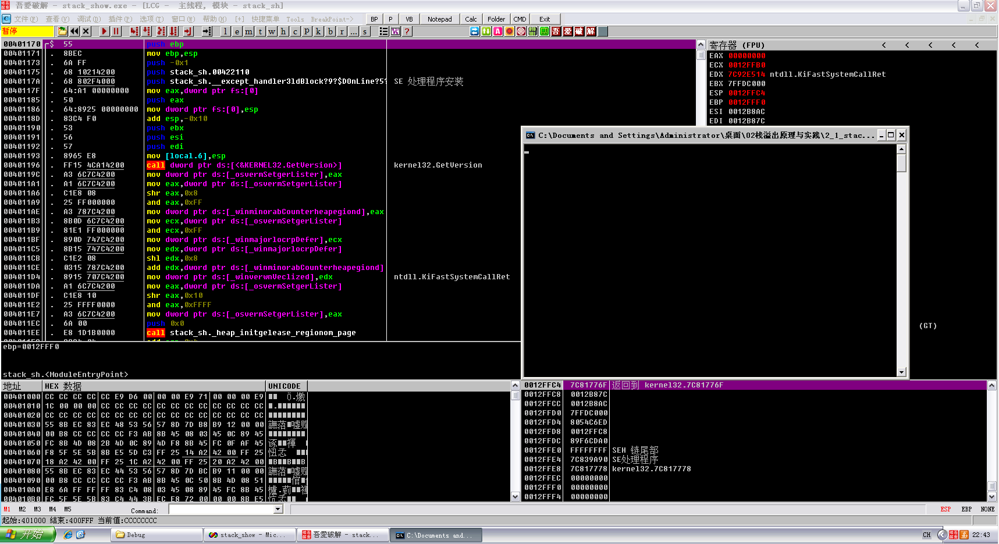
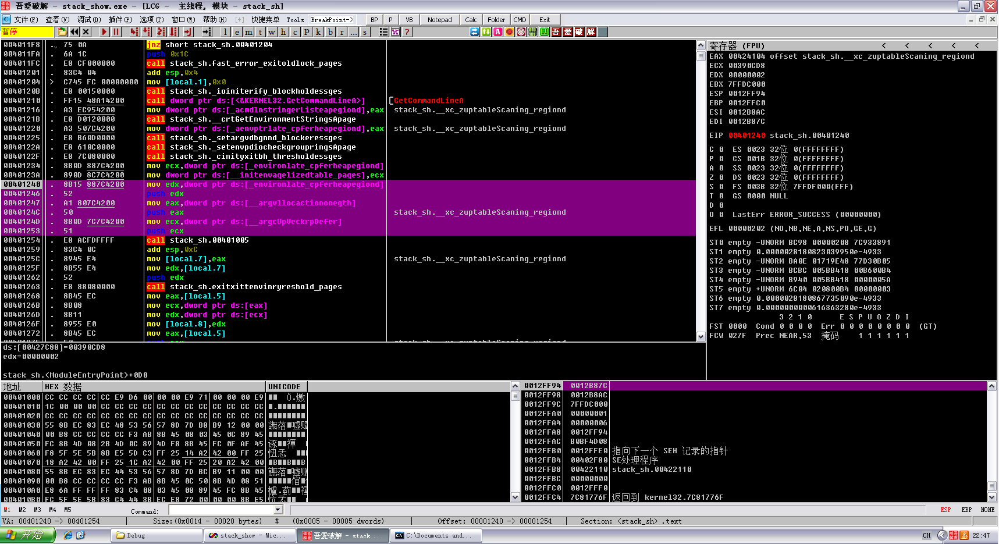
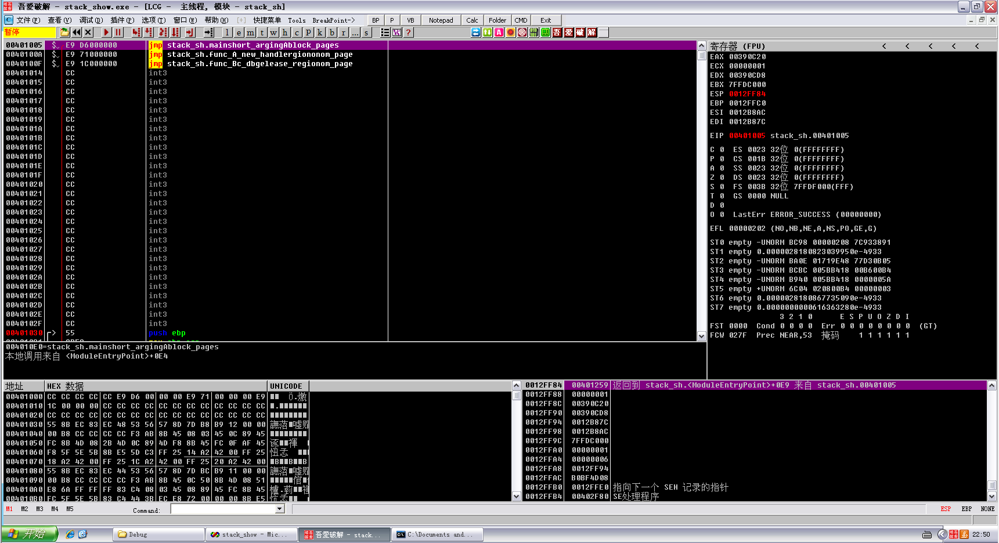
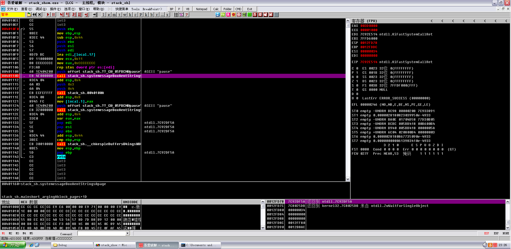
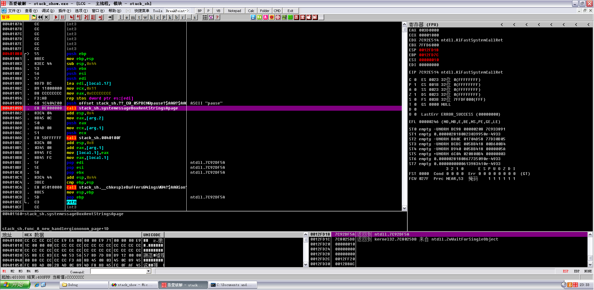

# How stack works

**Author：wnagzihxain
Mail：tudouboom@163.com**

```
int func_B(int arg_B1, int arg_B2)
{
	int var_B1, var_B2;
	var_B1 = arg_B1 + arg_B2;
	var_B2 = arg_B1 - arg_B2;
	return var_B1 * var_B2;
}

int func_A(int arg_A1, int arg_A2)
{
	int var_A;
	system("pause");
	var_A = func_B(arg_A1,arg_A2) + arg_A1 ;
	return var_A;
}
 
int main(int argc, char **argv, char **envp)
{
	int var_main;
	system("pause");
	var_main = func_A(4, 3);
	system("pause");
	return 0;
}
```

小修改了一下代码，适合做笔记也适合观察指令执行的过程

生成PE文件，载入OD



F8单步走下去,这三次明显的压栈操作，就是把main函数的三个参数压入栈里，从名字也可以看出来三个参数的压栈顺序

```
int main(int argc, char **argv, char **envp)
```



然后下面的call就是调用main函数了

F7跟进去，发现三个jmp



F8单步走啊走，碰到自个儿加的暂停，停下来观察一下，这里就是main函数的领空了



想找到第一个pause的位置，直接F9，然后暂停，按k，然后就可以看到调用了，右键显示调用即可，然后先给下个断点

结合刚刚的三个jmp，然后分析这三个片段，可以猜测这三个片段就是三个函数，继续往下分析

```
00401005   $ /E9 E6000000   jmp stack_sh.mainshort_argingAblock_page>
0040100A   $ |E9 71000000   jmp stack_sh.func_A_new_handlergiononom_>
0040100F   $ |E9 1C000000   jmp stack_sh.func_Bc_dbgelease_regionom_>
00401014     |CC            int3
00401015     |CC            int3
00401016     |CC            int3
00401017     |CC            int3
00401018     |CC            int3
00401019     |CC            int3
0040101A     |CC            int3
0040101B     |CC            int3
0040101C     |CC            int3
0040101D     |CC            int3
0040101E     |CC            int3
0040101F     |CC            int3
00401020     |CC            int3
00401021     |CC            int3
00401022     |CC            int3
00401023     |CC            int3
00401024     |CC            int3
00401025     |CC            int3
00401026     |CC            int3
00401027     |CC            int3
00401028     |CC            int3
00401029     |CC            int3
0040102A     |CC            int3
0040102B     |CC            int3
0040102C     |CC            int3
0040102D     |CC            int3
0040102E     |CC            int3
0040102F     |CC            int3
00401030 >/> |55            push ebp
00401031  |. |8BEC          mov ebp,esp
00401033  |. |83EC 48       sub esp,0x48
00401036  |. |53            push ebx
00401037  |. |56            push esi
00401038  |. |57            push edi
00401039  |. |8D7D B8       lea edi,[local.18]
0040103C  |. |B9 12000000   mov ecx,0x12
00401041  |. |B8 CCCCCCCC   mov eax,0xCCCCCCCC
00401046  |. |F3:AB         rep stos dword ptr es:[edi]
00401048  |. |8B45 08       mov eax,[arg.1]
0040104B  |. |0345 0C       add eax,[arg.2]
0040104E  |. |8945 FC       mov [local.1],eax
00401051  |. |8B4D 08       mov ecx,[arg.1]
00401054  |. |2B4D 0C       sub ecx,[arg.2]
00401057  |. |894D F8       mov [local.2],ecx
0040105A  |. |8B45 FC       mov eax,[local.1]
0040105D  |. |0FAF45 F8     imul eax,[local.2]                       ;  kernel32.7C802608
00401061  |. |5F            pop edi                                  ;  ntdll.7C92DF5A
00401062  |. |5E            pop esi                                  ;  ntdll.7C92DF5A
00401063  |. |5B            pop ebx                                  ;  ntdll.7C92DF5A
00401064  |. |8BE5          mov esp,ebp
00401066  |. |5D            pop ebp                                  ;  ntdll.7C92DF5A
00401067  \. |C3            retn
00401068     |CC            int3
00401069     |CC            int3
0040106A     |CC            int3
0040106B     |CC            int3
0040106C     |CC            int3
0040106D     |CC            int3
0040106E     |CC            int3
0040106F     |CC            int3
00401070     |CC            int3
00401071     |CC            int3
00401072     |CC            int3
00401073     |CC            int3
00401074     |CC            int3
00401075     |CC            int3
00401076     |CC            int3
00401077     |CC            int3
00401078     |CC            int3
00401079     |CC            int3
0040107A     |CC            int3
0040107B     |CC            int3
0040107C     |CC            int3
0040107D     |CC            int3
0040107E     |CC            int3
0040107F     |CC            int3
00401080 >/> |55            push ebp
00401081  |. |8BEC          mov ebp,esp
00401083  |. |83EC 44       sub esp,0x44
00401086  |. |53            push ebx
00401087  |. |56            push esi
00401088  |. |57            push edi
00401089  |. |8D7D BC       lea edi,[local.17]
0040108C  |. |B9 11000000   mov ecx,0x11
00401091  |. |B8 CCCCCCCC   mov eax,0xCCCCCCCC
00401096  |. |F3:AB         rep stos dword ptr es:[edi]
00401098  |. |68 1C404200   push offset stack_sh.??_C@_05PBCN@pause?>;  ASCII "pause"
0040109D  |. |E8 BE000000   call stack_sh.systemessageBoxAentStrings>
004010A2  |. |83C4 04       add esp,0x4
004010A5  |. |8B45 0C       mov eax,[arg.2]
004010A8  |. |50            push eax
004010A9  |. |8B4D 08       mov ecx,[arg.1]
004010AC  |. |51            push ecx
004010AD  |. |E8 5DFFFFFF   call stack_sh.0040100F
004010B2  |. |83C4 08       add esp,0x8
004010B5  |. |0345 08       add eax,[arg.1]
004010B8  |. |8945 FC       mov [local.1],eax
004010BB  |. |8B45 FC       mov eax,[local.1]
004010BE  |. |5F            pop edi                                  ;  ntdll.7C92DF5A
004010BF  |. |5E            pop esi                                  ;  ntdll.7C92DF5A
004010C0  |. |5B            pop ebx                                  ;  ntdll.7C92DF5A
004010C1  |. |83C4 44       add esp,0x44
004010C4  |. |3BEC          cmp ebp,esp
004010C6  |. |E8 A5010000   call stack_sh.__chkespleBuffers@4ingsW@4>
004010CB  |. |8BE5          mov esp,ebp
004010CD  |. |5D            pop ebp                                  ;  ntdll.7C92DF5A
004010CE  \. |C3            retn
004010CF     |CC            int3
004010D0     |CC            int3
004010D1     |CC            int3
004010D2     |CC            int3
004010D3     |CC            int3
004010D4     |CC            int3
004010D5     |CC            int3
004010D6     |CC            int3
004010D7     |CC            int3
004010D8     |CC            int3
004010D9     |CC            int3
004010DA     |CC            int3
004010DB     |CC            int3
004010DC     |CC            int3
004010DD     |CC            int3
004010DE     |CC            int3
004010DF     |CC            int3
004010E0     |CC            int3
004010E1     |CC            int3
004010E2     |CC            int3
004010E3     |CC            int3
004010E4     |CC            int3
004010E5     |CC            int3
004010E6     |CC            int3
004010E7     |CC            int3
004010E8     |CC            int3
004010E9     |CC            int3
004010EA     |CC            int3
004010EB     |CC            int3
004010EC     |CC            int3
004010ED     |CC            int3
004010EE     |CC            int3
004010EF     |CC            int3
004010F0 >/> \55            push ebp
004010F1  |.  8BEC          mov ebp,esp
004010F3  |.  83EC 44       sub esp,0x44
004010F6  |.  53            push ebx
004010F7  |.  56            push esi
004010F8  |.  57            push edi
004010F9  |.  8D7D BC       lea edi,[local.17]
004010FC  |.  B9 11000000   mov ecx,0x11
00401101  |.  B8 CCCCCCCC   mov eax,0xCCCCCCCC
00401106  |.  F3:AB         rep stos dword ptr es:[edi]
00401108  |.  68 1C404200   push offset stack_sh.??_C@_05PBCN@pause?>;  ASCII "pause"
0040110D  |.  E8 4E000000   call stack_sh.systemessageBoxAentStrings>
00401112  |.  83C4 04       add esp,0x4
00401115  |.  6A 03         push 0x3
00401117  |.  6A 04         push 0x4
00401119  |.  E8 ECFEFFFF   call stack_sh.0040100A
0040111E  |.  83C4 08       add esp,0x8
00401121  |.  8945 FC       mov [local.1],eax
00401124  |.  68 1C404200   push offset stack_sh.??_C@_05PBCN@pause?>;  ASCII "pause"
00401129  |.  E8 32000000   call stack_sh.systemessageBoxAentStrings>
0040112E  |.  83C4 04       add esp,0x4
00401131  |.  33C0          xor eax,eax
00401133  |.  5F            pop edi                                  ;  ntdll.7C92DF5A
00401134  |.  5E            pop esi                                  ;  ntdll.7C92DF5A
00401135  |.  5B            pop ebx                                  ;  ntdll.7C92DF5A
00401136  |.  83C4 44       add esp,0x44
00401139  |.  3BEC          cmp ebp,esp
0040113B  |.  E8 30010000   call stack_sh.__chkespleBuffers@4ingsW@4>
00401140  |.  8BE5          mov esp,ebp
00401142  |.  5D            pop ebp                                  ;  ntdll.7C92DF5A
00401143  \.  C3            retn
```

然后看代码

```
int main(int argc, char **argv, char **envp)
{
	int var_main;
	system("pause");
	var_main=func_A(4,3);
	system("pause");
	return 0;
}
```

对比代码，可以看出，当前断点的call调用的的确是system(“pause”)，下面的push 3和push 4为func_A的参数

那么在压入3和4参数之后就会进行调用call，继续运行，然后回车，回车后程序就继续运行到了第二个暂停，同样点击暂停，按k，右击显示调用



上下观察一下位置，发现在刚刚main函数领空的边上

然后看下面的压栈操作，非常明显是这句程序

```
var_A = func_B(arg_A1,arg_A2) + arg_A1 ;
```

调用前的压栈操作

```
004010A5  |.  8B45 0C       mov eax,[arg.2]
004010A8  |.  50            push eax
004010A9  |.  8B4D 08       mov ecx,[arg.1]
004010AC  |.  51            push ecx
```

继续运行，但是因为程序没有在func_B暂停，所以分析这里差不多就结束了