# Redirect EIP to executed extra binary code in buffer

**Author：wnagzihxain
Mail：tudouboom@163.com**

```
#include <stdio.h>
#include <windows.h>
#define PASSWORD "1234567"

int verify_password (char *password)
{
	int authenticated;
	char buffer[44];
	authenticated = strcmp(password, PASSWORD);
	strcpy(buffer, password);//over flowed here!	
	return authenticated;
}

int main()
{
	int valid_flag = 0;
	char password[1024];
	FILE * fp;
	LoadLibrary("user32.dll");//prepare for messagebox
	if(!(fp=fopen("password.txt", "rw+")))
	{
		exit(0);
	}
	fscanf(fp,"%s", password);
	valid_flag = verify_password(password);
	if(valid_flag)
	{
		printf("incorrect password!\n");
	}
	else
	{
		printf("Congratulation! You have passed the verification!\n");
	}
	fclose(fp);
	return 0;
}
```

小修改了代码，加上最后一个pause

依旧找到main入口，最后提示一次
```
004019F0  |.  FF15 88014300 call dword ptr ds:[<&KERNEL32.GetCommandLineA>]         ; [GetCommandLineA
```

一般情况下，在这个边上有三次压栈操作的call就是main函数

找到main函数入口后直接F4到这，也可以下断，然后F9到这，或者F8慢慢走下来

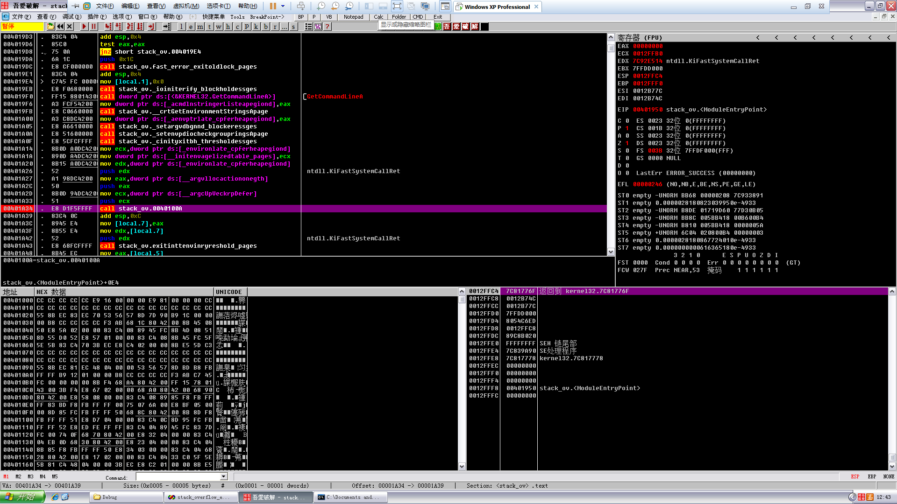

然后F7跟入，这是主函数领空，关于这种领空的提醒以后就不说啦，可以看到user32.dll的调用

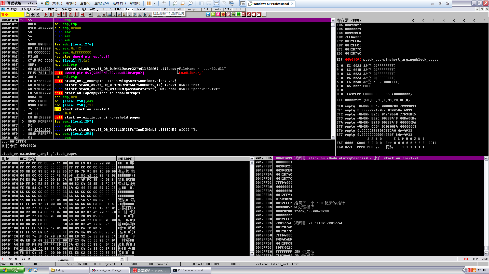

往下拉，找到verify_password ()函数的调用代码，至于怎么看出来这是哪个函数的调用的问题？多调试就会有经验了

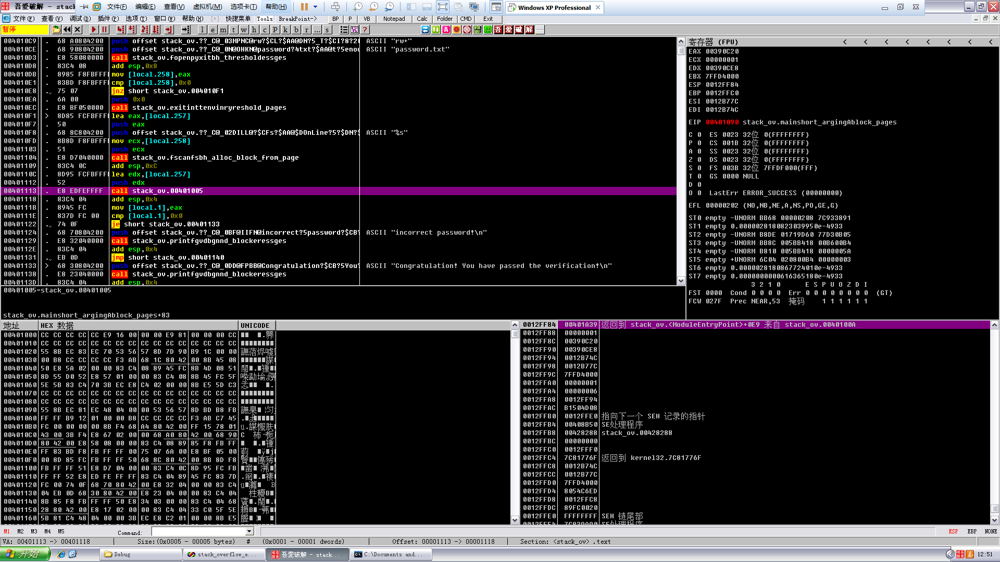

F4运行到这里，或者下断然后F9运行到这都行，看个人喜欢，以后直接说运行到这，个人喜欢下断，然后F9

F7跟进去，以后F7这些快捷键也尽量少提，因为随着代码越来越长，分析的时候如果连这些基本的都要提，那么还是先回去看前面的分析好了

跟进来后往下拉，根据前面的几次分析，咱们已经能很快的知道buffer数组在内存中的大概相对位置了，所以在如图位置下断，原因参见上一篇文章

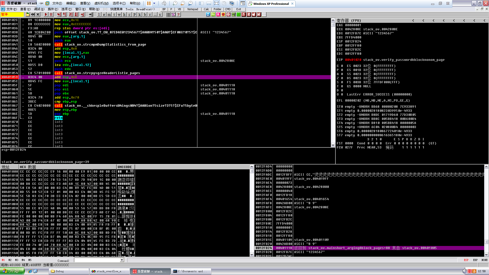

运行起来，观察栈的布局

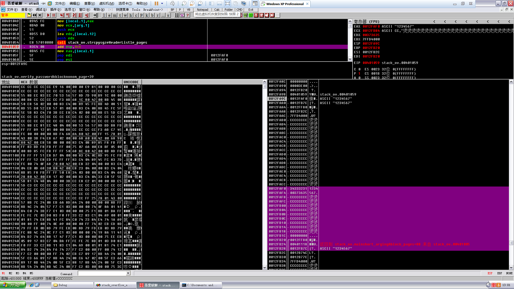

```
0012FAF0   34333231  1234
0012FAF4   00373635  567.
0012FAF8   CCCCCCCC  烫烫
0012FAFC   CCCCCCCC  烫烫
0012FB00   CCCCCCCC  烫烫
0012FB04   CCCCCCCC  烫烫
0012FB08   CCCCCCCC  烫烫
0012FB0C   CCCCCCCC  烫烫
0012FB10   CCCCCCCC  烫烫
0012FB14   CCCCCCCC  烫烫
0012FB18   CCCCCCCC  烫烫
0012FB1C   00000000  ....
0012FB20  /0012FF80  €.
0012FB24  |00401118  @.  返回到 stack_ov.mainshort_argingAblock_pages+88 来自 stack_ov.00401005
0012FB28  |0012FB7C  |?.   ASCII "1234567"

```

然后修改password.txt为11个“4321”

运行观察栈的布局

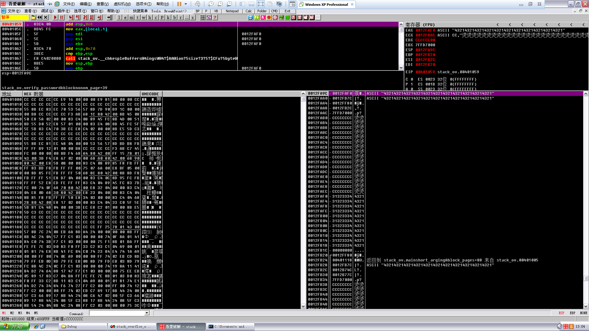

```
0012FAF0   31323334  4321
0012FAF4   31323334  4321
0012FAF8   31323334  4321
0012FAFC   31323334  4321
0012FB00   31323334  4321
0012FB04   31323334  4321
0012FB08   31323334  4321
0012FB0C   31323334  4321
0012FB10   31323334  4321
0012FB14   31323334  4321
0012FB18   31323334  4321
0012FB1C   00000000  ....
0012FB20  /0012FF80  €.
0012FB24  |00401118  @.  返回到 stack_ov.mainshort_argingAblock_pages+88 来自 stack_ov.00401005
0012FB28  |0012FB7C  |?.   ASCII "43214321432143214321432143214321432143214321"
```

如果是按照前面的，那接下来就很清楚了，但是接下来我们是要植入代码，所以要加点新东西进去

打开Dependency Walker，在Tools里可以找到，然后随便拉一个图标进去

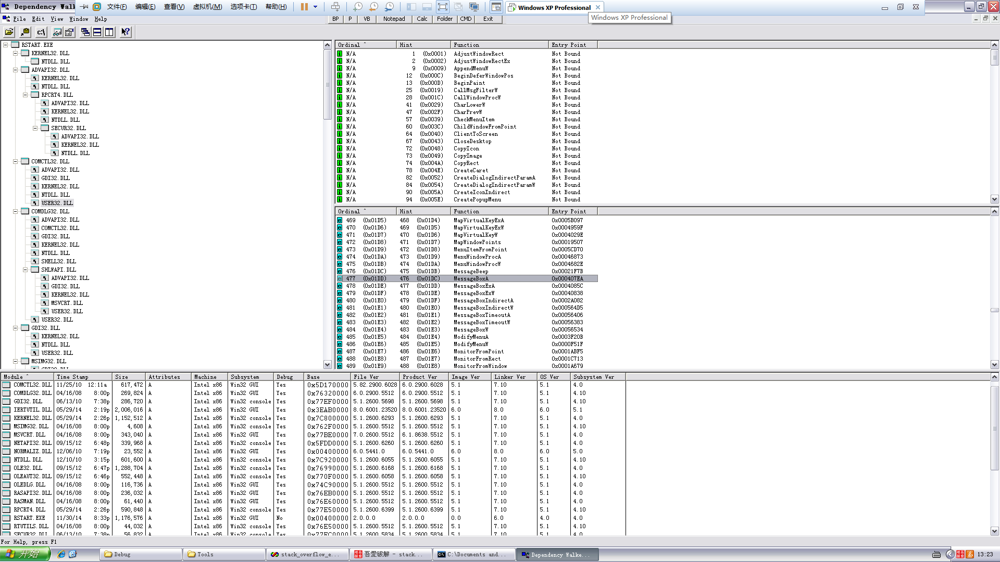

然后可以看到user32.dll的基址，以及MessageBoxA的偏移

```
0x77D10000 + 0x000407EA = 0x77D507EA
```

用工具计算

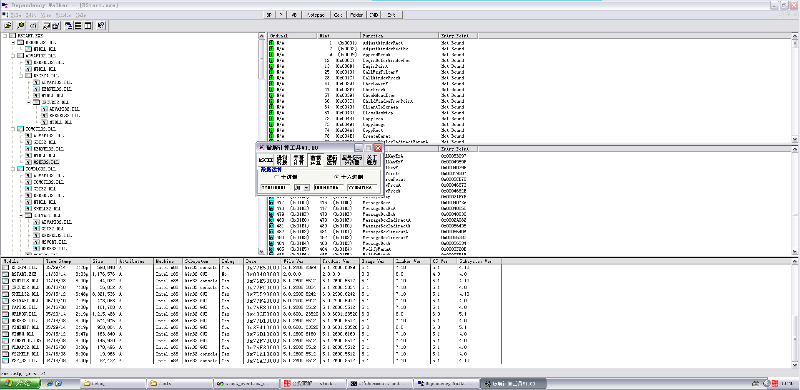

不同计算机情况不一样 ，这个一定要在自己的计算机重新计算

然后就可以编辑password.txt了，一定要注意最后`mov eax,77D507EA`，要根据自己计算机计算

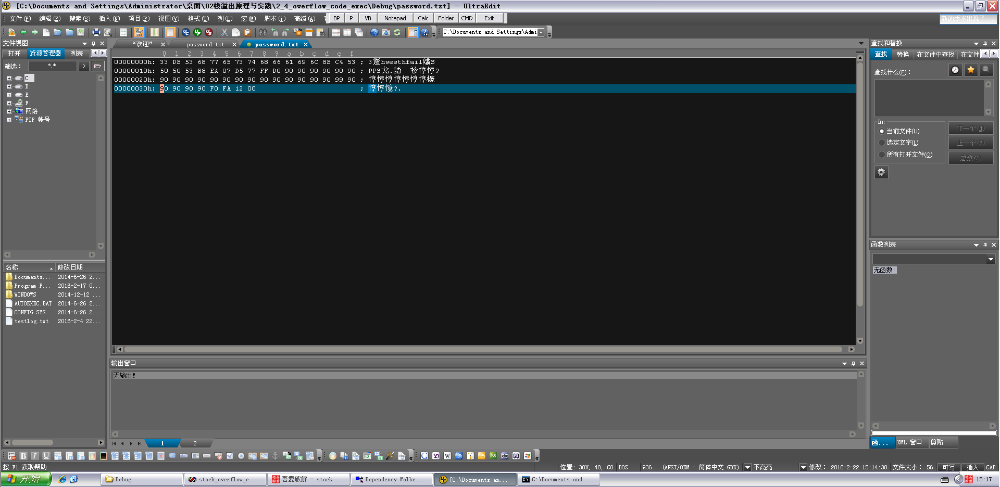

运行起来走啊走，来看看刚刚写的代码

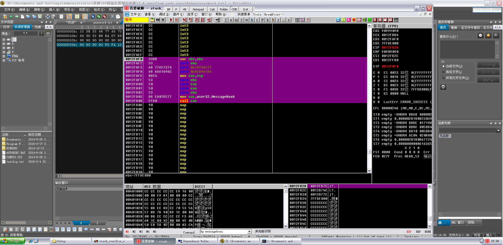

继续走

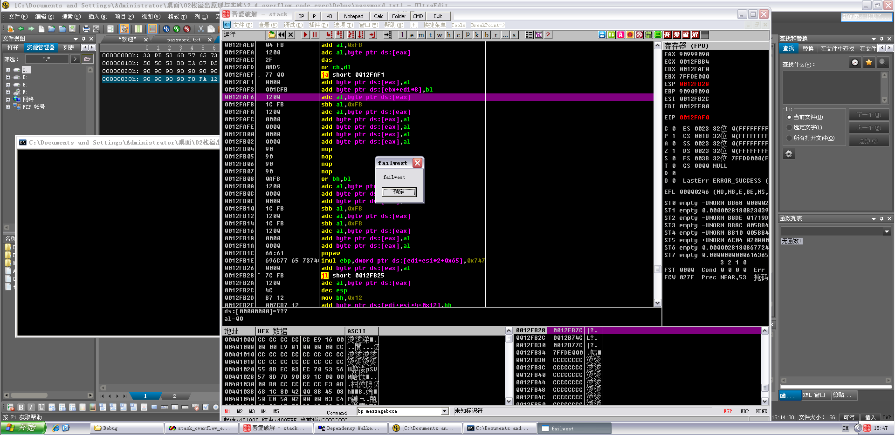

弹出来了

点击确定，继续运行

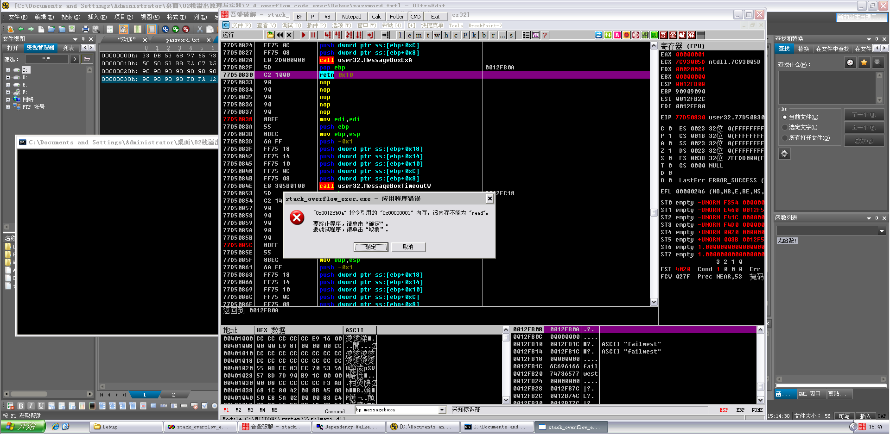

因为调用完MessageBoxA后，没有写后续代码让它退出，所以崩溃了


