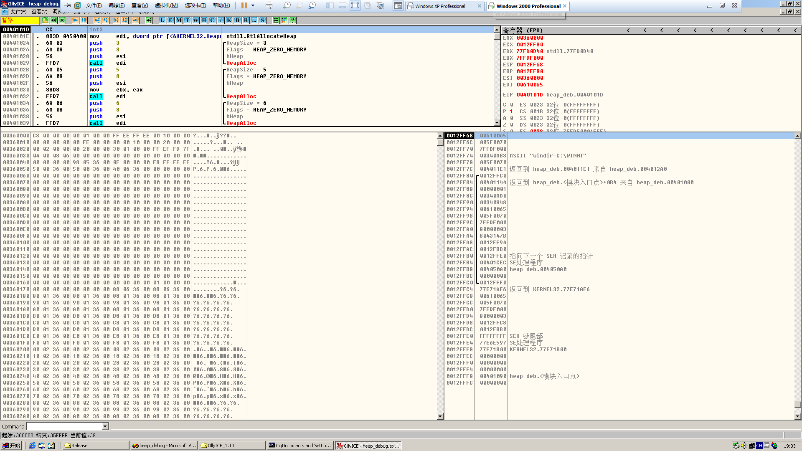
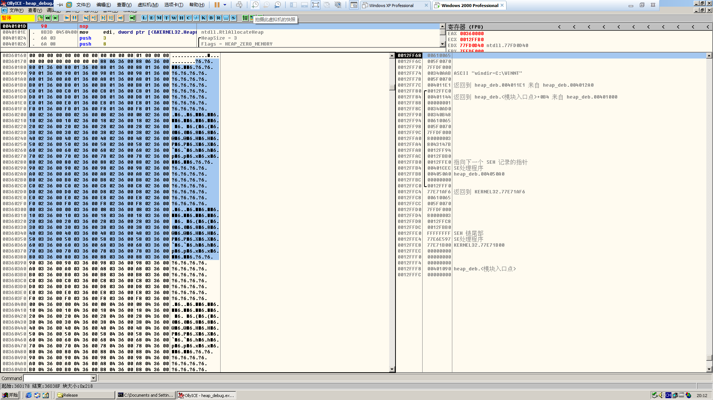
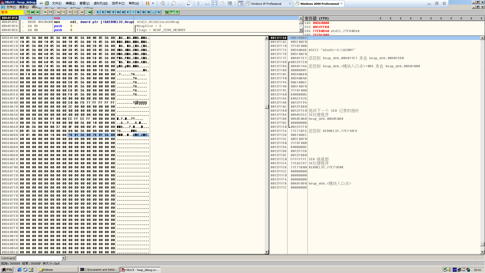

# Heap FreeList

**Author：wnagzihxain
Mail：tudouboom@163.com**

```
#include <windows.h>

int main()
{
	HLOCAL h1, h2, h3, h4, h5, h6;
	HANDLE hp;
	hp = HeapCreate(0, 0x1000, 0x10000);
	__asm int 3
 
	h1 = HeapAlloc(hp, HEAP_ZERO_MEMORY, 3);
	h2 = HeapAlloc(hp, HEAP_ZERO_MEMORY, 5);
	h3 = HeapAlloc(hp, HEAP_ZERO_MEMORY, 6);
	h4 = HeapAlloc(hp, HEAP_ZERO_MEMORY, 8);
	h5 = HeapAlloc(hp, HEAP_ZERO_MEMORY, 19);
	h6 = HeapAlloc(hp, HEAP_ZERO_MEMORY, 24);
	
	//free block and prevent coaleses
	HeapFree(hp, 0, h1); //free to freelist[2] 
	HeapFree(hp, 0, h3); //free to freelist[2] 
	HeapFree(hp, 0, h5); //free to freelist[4]
	
	HeapFree(hp, 0, h4); //coalese h3, h4, h5, link the large block to freelist[8]
	return 0;
}
```

这里的环境是win 2000 sp4，然后打了一个安装VMtools的补丁，再安装VMtools

关于OD，设置成默认调试器就行了，然后编译生成release版本，打开后中断，点取消进入OD

这里可以看到已经断在了我们设置的中断位置，注意寄存器EAX的值，这是整个堆区的起始位置，所以跳到`0x00360000`看看



从`0x00360000`开始一段就是堆区的各种信息了，然后中间一堆`0x00`就是虚分配索引，因为刚刚初始化没有任何记录所以全是`0`

要说明的是这里的快表并没有使用，因为我们创建的是不可扩展的堆，所以在`0x00360584`处的快表指针始终为NULL，那么接下来就只是空表的操作了

接下来就是关键了，看`0x00360178`，标记的部分是部分空表索引区，可以看到`0x00360178`处的值指向的是`0x00360688`，而接下来其它的索引都是指向自己本身



跳到`0x00360688`，可以看到这个位置的指针是指向`0x00360178`

补充一点：其实这个堆块的内存起始位置是`0x00360680`，因为跳过了8字节块首直接指向了数据区，所以直接是`0x00360688`，这个空闲的堆块也被称为尾块



再来注意下内存`0x00360680`的值为`0x00080130`，`0x0130`表示这个堆块大小为`0x0130`，计算单位是8字节，`0x0008`表示`Previous chunk size`，堆块大小包括块首

现在来看整个堆区的布局

这是初始化的堆区
```
00360000  C8 00 00 00 00 01 00 00 FF EE FF EE 00 10 00 00  ?.....??..
00360010  00 00 00 00 00 FE 00 00 00 00 10 00 00 20 00 00  .....?..... ..
00360020  00 02 00 00 00 20 00 00 30 01 00 00 FF EF FD 7F  .... ..0..稞
00360030  04 00 08 06 00 00 00 00 00 00 00 00 00 00 00 00  .............
00360040  00 00 00 00 98 05 36 00 0F 00 00 00 F8 FF FF FF  ....?6....?
00360050  50 00 36 00 50 00 36 00 40 06 36 00 00 00 00 00  P.6.P.6.@6.....
00360060  00 00 00 00 00 00 00 00 00 00 00 00 00 00 00 00  ................
00360070  00 00 00 00 00 00 00 00 00 00 00 00 00 00 00 00  ................
00360080  00 00 00 00 00 00 00 00 00 00 00 00 00 00 00 00  ................
00360090  00 00 00 00 00 00 00 00 00 00 00 00 00 00 00 00  ................
003600A0  00 00 00 00 00 00 00 00 00 00 00 00 00 00 00 00  ................
003600B0  00 00 00 00 00 00 00 00 00 00 00 00 00 00 00 00  ................
003600C0  00 00 00 00 00 00 00 00 00 00 00 00 00 00 00 00  ................
003600D0  00 00 00 00 00 00 00 00 00 00 00 00 00 00 00 00  ................
003600E0  00 00 00 00 00 00 00 00 00 00 00 00 00 00 00 00  ................
003600F0  00 00 00 00 00 00 00 00 00 00 00 00 00 00 00 00  ................
00360100  00 00 00 00 00 00 00 00 00 00 00 00 00 00 00 00  ................
00360110  00 00 00 00 00 00 00 00 00 00 00 00 00 00 00 00  ................
00360120  00 00 00 00 00 00 00 00 00 00 00 00 00 00 00 00  ................
00360130  00 00 00 00 00 00 00 00 00 00 00 00 00 00 00 00  ................
00360140  00 00 00 00 00 00 00 00 00 00 00 00 00 00 00 00  ................
00360150  00 00 00 00 00 00 00 00 00 00 00 00 00 00 00 00  ................
00360160  00 00 00 00 00 00 00 00 00 00 00 00 01 00 00 00  ...............
00360170  00 00 00 00 00 00 00 00 88 06 36 00 88 06 36 00  ........?6.?6.
00360180  80 01 36 00 80 01 36 00 88 01 36 00 88 01 36 00  €6.€6.?6.?6.
00360190  90 01 36 00 90 01 36 00 98 01 36 00 98 01 36 00  ?6.?6.?6.?6.
003601A0  A0 01 36 00 A0 01 36 00 A8 01 36 00 A8 01 36 00  ?6.?6.?6.?6.
003601B0  B0 01 36 00 B0 01 36 00 B8 01 36 00 B8 01 36 00  ?6.?6.?6.?6.
003601C0  C0 01 36 00 C0 01 36 00 C8 01 36 00 C8 01 36 00  ?6.?6.?6.?6.
003601D0  D0 01 36 00 D0 01 36 00 D8 01 36 00 D8 01 36 00  ?6.?6.?6.?6.
003601E0  E0 01 36 00 E0 01 36 00 E8 01 36 00 E8 01 36 00  ?6.?6.?6.?6.
003601F0  F0 01 36 00 F0 01 36 00 F8 01 36 00 F8 01 36 00  ?6.?6.?6.?6.
00360200  00 02 36 00 00 02 36 00 08 02 36 00 08 02 36 00  .6..6.6.6.
00360210  10 02 36 00 10 02 36 00 18 02 36 00 18 02 36 00  6.6.6.6.
00360220  20 02 36 00 20 02 36 00 28 02 36 00 28 02 36 00   6. 6.(6.(6.
00360230  30 02 36 00 30 02 36 00 38 02 36 00 38 02 36 00  06.06.86.86.
00360240  40 02 36 00 40 02 36 00 48 02 36 00 48 02 36 00  @6.@6.H6.H6.
00360250  50 02 36 00 50 02 36 00 58 02 36 00 58 02 36 00  P6.P6.X6.X6.
00360260  60 02 36 00 60 02 36 00 68 02 36 00 68 02 36 00  `6.`6.h6.h6.
00360270  70 02 36 00 70 02 36 00 78 02 36 00 78 02 36 00  p6.p6.x6.x6.
00360280  80 02 36 00 80 02 36 00 88 02 36 00 88 02 36 00  €6.€6.?6.?6.
00360290  90 02 36 00 90 02 36 00 98 02 36 00 98 02 36 00  ?6.?6.?6.?6.
003602A0  A0 02 36 00 A0 02 36 00 A8 02 36 00 A8 02 36 00  ?6.?6.?6.?6.
003602B0  B0 02 36 00 B0 02 36 00 B8 02 36 00 B8 02 36 00  ?6.?6.?6.?6.
003602C0  C0 02 36 00 C0 02 36 00 C8 02 36 00 C8 02 36 00  ?6.?6.?6.?6.
003602D0  D0 02 36 00 D0 02 36 00 D8 02 36 00 D8 02 36 00  ?6.?6.?6.?6.
003602E0  E0 02 36 00 E0 02 36 00 E8 02 36 00 E8 02 36 00  ?6.?6.?6.?6.
003602F0  F0 02 36 00 F0 02 36 00 F8 02 36 00 F8 02 36 00  ?6.?6.?6.?6.
00360300  00 03 36 00 00 03 36 00 08 03 36 00 08 03 36 00  .6..6.6.6.
00360310  10 03 36 00 10 03 36 00 18 03 36 00 18 03 36 00  6.6.6.6.
00360320  20 03 36 00 20 03 36 00 28 03 36 00 28 03 36 00   6. 6.(6.(6.
00360330  30 03 36 00 30 03 36 00 38 03 36 00 38 03 36 00  06.06.86.86.
00360340  40 03 36 00 40 03 36 00 48 03 36 00 48 03 36 00  @6.@6.H6.H6.
00360350  50 03 36 00 50 03 36 00 58 03 36 00 58 03 36 00  P6.P6.X6.X6.
00360360  60 03 36 00 60 03 36 00 68 03 36 00 68 03 36 00  `6.`6.h6.h6.
00360370  70 03 36 00 70 03 36 00 78 03 36 00 78 03 36 00  p6.p6.x6.x6.
00360380  80 03 36 00 80 03 36 00 88 03 36 00 88 03 36 00  €6.€6.?6.?6.
00360390  90 03 36 00 90 03 36 00 98 03 36 00 98 03 36 00  ?6.?6.?6.?6.
003603A0  A0 03 36 00 A0 03 36 00 A8 03 36 00 A8 03 36 00  ?6.?6.?6.?6.
003603B0  B0 03 36 00 B0 03 36 00 B8 03 36 00 B8 03 36 00  ?6.?6.?6.?6.
003603C0  C0 03 36 00 C0 03 36 00 C8 03 36 00 C8 03 36 00  ?6.?6.?6.?6.
003603D0  D0 03 36 00 D0 03 36 00 D8 03 36 00 D8 03 36 00  ?6.?6.?6.?6.
003603E0  E0 03 36 00 E0 03 36 00 E8 03 36 00 E8 03 36 00  ?6.?6.?6.?6.
003603F0  F0 03 36 00 F0 03 36 00 F8 03 36 00 F8 03 36 00  ?6.?6.?6.?6.
00360400  00 04 36 00 00 04 36 00 08 04 36 00 08 04 36 00  .6..6.6.6.
00360410  10 04 36 00 10 04 36 00 18 04 36 00 18 04 36 00  6.6.6.6.
00360420  20 04 36 00 20 04 36 00 28 04 36 00 28 04 36 00   6. 6.(6.(6.
00360430  30 04 36 00 30 04 36 00 38 04 36 00 38 04 36 00  06.06.86.86.
00360440  40 04 36 00 40 04 36 00 48 04 36 00 48 04 36 00  @6.@6.H6.H6.
00360450  50 04 36 00 50 04 36 00 58 04 36 00 58 04 36 00  P6.P6.X6.X6.
00360460  60 04 36 00 60 04 36 00 68 04 36 00 68 04 36 00  `6.`6.h6.h6.
00360470  70 04 36 00 70 04 36 00 78 04 36 00 78 04 36 00  p6.p6.x6.x6.
00360480  80 04 36 00 80 04 36 00 88 04 36 00 88 04 36 00  €6.€6.?6.?6.
00360490  90 04 36 00 90 04 36 00 98 04 36 00 98 04 36 00  ?6.?6.?6.?6.
003604A0  A0 04 36 00 A0 04 36 00 A8 04 36 00 A8 04 36 00  ?6.?6.?6.?6.
003604B0  B0 04 36 00 B0 04 36 00 B8 04 36 00 B8 04 36 00  ?6.?6.?6.?6.
003604C0  C0 04 36 00 C0 04 36 00 C8 04 36 00 C8 04 36 00  ?6.?6.?6.?6.
003604D0  D0 04 36 00 D0 04 36 00 D8 04 36 00 D8 04 36 00  ?6.?6.?6.?6.
003604E0  E0 04 36 00 E0 04 36 00 E8 04 36 00 E8 04 36 00  ?6.?6.?6.?6.
003604F0  F0 04 36 00 F0 04 36 00 F8 04 36 00 F8 04 36 00  ?6.?6.?6.?6.
00360500  00 05 36 00 00 05 36 00 08 05 36 00 08 05 36 00  .6..6.6.6.
00360510  10 05 36 00 10 05 36 00 18 05 36 00 18 05 36 00  6.6.6.6.
00360520  20 05 36 00 20 05 36 00 28 05 36 00 28 05 36 00   6. 6.(6.(6.
00360530  30 05 36 00 30 05 36 00 38 05 36 00 38 05 36 00  06.06.86.86.
00360540  40 05 36 00 40 05 36 00 48 05 36 00 48 05 36 00  @6.@6.H6.H6.
00360550  50 05 36 00 50 05 36 00 58 05 36 00 58 05 36 00  P6.P6.X6.X6.
00360560  60 05 36 00 60 05 36 00 68 05 36 00 68 05 36 00  `6.`6.h6.h6.
00360570  70 05 36 00 70 05 36 00 08 06 36 00 00 00 00 00  p6.p6.6.....
00360580  00 00 00 00 00 00 00 00 00 00 00 00 00 10 36 00  .............6.
00360590  00 F0 00 00 00 00 00 00 A8 05 36 00 00 00 00 00  .?.....?6.....
003605A0  00 00 00 00 00 00 00 00 B8 05 36 00 00 00 00 00  ........?6.....
003605B0  00 00 00 00 00 00 00 00 C8 05 36 00 00 00 00 00  ........?6.....
003605C0  00 00 00 00 00 00 00 00 D8 05 36 00 00 00 00 00  ........?6.....
003605D0  00 00 00 00 00 00 00 00 E8 05 36 00 00 00 00 00  ........?6.....
003605E0  00 00 00 00 00 00 00 00 F8 05 36 00 00 00 00 00  ........?6.....
003605F0  00 00 00 00 00 00 00 00 00 00 00 00 00 00 00 00  ................
00360600  00 00 00 00 00 00 00 00 C0 06 FD 77 FF FF FF FF  ........?齱
00360610  00 00 00 00 00 00 00 00 2C 00 00 00 00 00 00 00  ........,.......
00360620  00 00 00 00 00 00 00 00 00 00 00 00 00 00 00 00  ................
00360630  00 00 00 00 00 00 00 00 00 00 00 00 00 00 00 00  ................
00360640  08 00 C8 00 00 01 00 00 EE FF EE FF 00 00 00 00  .?...??....
00360650  00 00 36 00 00 F0 00 00 00 00 36 00 10 00 00 00  ..6..?...6....
00360660  80 06 36 00 00 00 37 00 0F 00 00 00 01 00 00 00  €6...7.......
00360670  88 05 36 00 00 00 00 00 80 06 36 00 00 00 00 00  ?6.....€6.....
00360680  30 01 08 00 00 10 00 00 78 01 36 00 78 01 36 00  0....x6.x6.
00360690  00 00 00 00 00 00 00 00 00 00 00 00 00 00 00 00  ................
003606A0  00 00 00 00 00 00 00 00 00 00 00 00 00 00 00 00  ................
003606B0  00 00 00 00 00 00 00 00 00 00 00 00 00 00 00 00  ................
003606C0  00 00 00 00 00 00 00 00 00 00 00 00 00 00 00 00  ................
003606D0  00 00 00 00 00 00 00 00 00 00 00 00 00 00 00 00  ................
003606E0  00 00 00 00 00 00 00 00 00 00 00 00 00 00 00 00  ................
003606F0  00 00 00 00 00 00 00 00 00 00 00 00 00 00 00 00  ................
00360700  00 00 00 00 00 00 00 00 00 00 00 00 00 00 00 00  ................
```

### 申请第一次

C语言
```
h1 = HeapAlloc(hp, HEAP_ZERO_MEMORY, 3);
```

汇编
```
00401024  |.  6A 03         push    3                                ; /HeapSize = 3
00401026  |.  6A 08         push    8                                ; |Flags = HEAP_ZERO_MEMORY
00401028  |.  56            push    esi                              ; |hHeap
00401029  |.  FFD7          call    edi                              ; \HeapAlloc
```

运行完后的堆区
```
00360000  C8 00 00 00 00 01 00 00 FF EE FF EE 00 10 00 00  ?.....??..
00360010  00 00 00 00 00 FE 00 00 00 00 10 00 00 20 00 00  .....?..... ..
00360020  00 02 00 00 00 20 00 00 2E 01 00 00 FF EF FD 7F  .... .....稞
00360030  04 00 08 06 00 00 00 00 00 00 00 00 00 00 00 00  .............
00360040  00 00 00 00 98 05 36 00 0F 00 00 00 F8 FF FF FF  ....?6....?
00360050  50 00 36 00 50 00 36 00 40 06 36 00 00 00 00 00  P.6.P.6.@6.....
00360060  00 00 00 00 00 00 00 00 00 00 00 00 00 00 00 00  ................
00360070  00 00 00 00 00 00 00 00 00 00 00 00 00 00 00 00  ................
00360080  00 00 00 00 00 00 00 00 00 00 00 00 00 00 00 00  ................
00360090  00 00 00 00 00 00 00 00 00 00 00 00 00 00 00 00  ................
003600A0  00 00 00 00 00 00 00 00 00 00 00 00 00 00 00 00  ................
003600B0  00 00 00 00 00 00 00 00 00 00 00 00 00 00 00 00  ................
003600C0  00 00 00 00 00 00 00 00 00 00 00 00 00 00 00 00  ................
003600D0  00 00 00 00 00 00 00 00 00 00 00 00 00 00 00 00  ................
003600E0  00 00 00 00 00 00 00 00 00 00 00 00 00 00 00 00  ................
003600F0  00 00 00 00 00 00 00 00 00 00 00 00 00 00 00 00  ................
00360100  00 00 00 00 00 00 00 00 00 00 00 00 00 00 00 00  ................
00360110  00 00 00 00 00 00 00 00 00 00 00 00 00 00 00 00  ................
00360120  00 00 00 00 00 00 00 00 00 00 00 00 00 00 00 00  ................
00360130  00 00 00 00 00 00 00 00 00 00 00 00 00 00 00 00  ................
00360140  00 00 00 00 00 00 00 00 00 00 00 00 00 00 00 00  ................
00360150  00 00 00 00 00 00 00 00 00 00 00 00 00 00 00 00  ................
00360160  00 00 00 00 00 00 00 00 00 00 00 00 01 00 00 00  ...............
00360170  00 00 00 00 00 00 00 00 98 06 36 00 98 06 36 00  ........?6.?6.
00360180  80 01 36 00 80 01 36 00 88 01 36 00 88 01 36 00  €6.€6.?6.?6.
00360190  90 01 36 00 90 01 36 00 98 01 36 00 98 01 36 00  ?6.?6.?6.?6.
003601A0  A0 01 36 00 A0 01 36 00 A8 01 36 00 A8 01 36 00  ?6.?6.?6.?6.
003601B0  B0 01 36 00 B0 01 36 00 B8 01 36 00 B8 01 36 00  ?6.?6.?6.?6.
003601C0  C0 01 36 00 C0 01 36 00 C8 01 36 00 C8 01 36 00  ?6.?6.?6.?6.
003601D0  D0 01 36 00 D0 01 36 00 D8 01 36 00 D8 01 36 00  ?6.?6.?6.?6.
003601E0  E0 01 36 00 E0 01 36 00 E8 01 36 00 E8 01 36 00  ?6.?6.?6.?6.
003601F0  F0 01 36 00 F0 01 36 00 F8 01 36 00 F8 01 36 00  ?6.?6.?6.?6.
00360200  00 02 36 00 00 02 36 00 08 02 36 00 08 02 36 00  .6..6.6.6.
00360210  10 02 36 00 10 02 36 00 18 02 36 00 18 02 36 00  6.6.6.6.
00360220  20 02 36 00 20 02 36 00 28 02 36 00 28 02 36 00   6. 6.(6.(6.
00360230  30 02 36 00 30 02 36 00 38 02 36 00 38 02 36 00  06.06.86.86.
00360240  40 02 36 00 40 02 36 00 48 02 36 00 48 02 36 00  @6.@6.H6.H6.
00360250  50 02 36 00 50 02 36 00 58 02 36 00 58 02 36 00  P6.P6.X6.X6.
00360260  60 02 36 00 60 02 36 00 68 02 36 00 68 02 36 00  `6.`6.h6.h6.
00360270  70 02 36 00 70 02 36 00 78 02 36 00 78 02 36 00  p6.p6.x6.x6.
00360280  80 02 36 00 80 02 36 00 88 02 36 00 88 02 36 00  €6.€6.?6.?6.
00360290  90 02 36 00 90 02 36 00 98 02 36 00 98 02 36 00  ?6.?6.?6.?6.
003602A0  A0 02 36 00 A0 02 36 00 A8 02 36 00 A8 02 36 00  ?6.?6.?6.?6.
003602B0  B0 02 36 00 B0 02 36 00 B8 02 36 00 B8 02 36 00  ?6.?6.?6.?6.
003602C0  C0 02 36 00 C0 02 36 00 C8 02 36 00 C8 02 36 00  ?6.?6.?6.?6.
003602D0  D0 02 36 00 D0 02 36 00 D8 02 36 00 D8 02 36 00  ?6.?6.?6.?6.
003602E0  E0 02 36 00 E0 02 36 00 E8 02 36 00 E8 02 36 00  ?6.?6.?6.?6.
003602F0  F0 02 36 00 F0 02 36 00 F8 02 36 00 F8 02 36 00  ?6.?6.?6.?6.
00360300  00 03 36 00 00 03 36 00 08 03 36 00 08 03 36 00  .6..6.6.6.
00360310  10 03 36 00 10 03 36 00 18 03 36 00 18 03 36 00  6.6.6.6.
00360320  20 03 36 00 20 03 36 00 28 03 36 00 28 03 36 00   6. 6.(6.(6.
00360330  30 03 36 00 30 03 36 00 38 03 36 00 38 03 36 00  06.06.86.86.
00360340  40 03 36 00 40 03 36 00 48 03 36 00 48 03 36 00  @6.@6.H6.H6.
00360350  50 03 36 00 50 03 36 00 58 03 36 00 58 03 36 00  P6.P6.X6.X6.
00360360  60 03 36 00 60 03 36 00 68 03 36 00 68 03 36 00  `6.`6.h6.h6.
00360370  70 03 36 00 70 03 36 00 78 03 36 00 78 03 36 00  p6.p6.x6.x6.
00360380  80 03 36 00 80 03 36 00 88 03 36 00 88 03 36 00  €6.€6.?6.?6.
00360390  90 03 36 00 90 03 36 00 98 03 36 00 98 03 36 00  ?6.?6.?6.?6.
003603A0  A0 03 36 00 A0 03 36 00 A8 03 36 00 A8 03 36 00  ?6.?6.?6.?6.
003603B0  B0 03 36 00 B0 03 36 00 B8 03 36 00 B8 03 36 00  ?6.?6.?6.?6.
003603C0  C0 03 36 00 C0 03 36 00 C8 03 36 00 C8 03 36 00  ?6.?6.?6.?6.
003603D0  D0 03 36 00 D0 03 36 00 D8 03 36 00 D8 03 36 00  ?6.?6.?6.?6.
003603E0  E0 03 36 00 E0 03 36 00 E8 03 36 00 E8 03 36 00  ?6.?6.?6.?6.
003603F0  F0 03 36 00 F0 03 36 00 F8 03 36 00 F8 03 36 00  ?6.?6.?6.?6.
00360400  00 04 36 00 00 04 36 00 08 04 36 00 08 04 36 00  .6..6.6.6.
00360410  10 04 36 00 10 04 36 00 18 04 36 00 18 04 36 00  6.6.6.6.
00360420  20 04 36 00 20 04 36 00 28 04 36 00 28 04 36 00   6. 6.(6.(6.
00360430  30 04 36 00 30 04 36 00 38 04 36 00 38 04 36 00  06.06.86.86.
00360440  40 04 36 00 40 04 36 00 48 04 36 00 48 04 36 00  @6.@6.H6.H6.
00360450  50 04 36 00 50 04 36 00 58 04 36 00 58 04 36 00  P6.P6.X6.X6.
00360460  60 04 36 00 60 04 36 00 68 04 36 00 68 04 36 00  `6.`6.h6.h6.
00360470  70 04 36 00 70 04 36 00 78 04 36 00 78 04 36 00  p6.p6.x6.x6.
00360480  80 04 36 00 80 04 36 00 88 04 36 00 88 04 36 00  €6.€6.?6.?6.
00360490  90 04 36 00 90 04 36 00 98 04 36 00 98 04 36 00  ?6.?6.?6.?6.
003604A0  A0 04 36 00 A0 04 36 00 A8 04 36 00 A8 04 36 00  ?6.?6.?6.?6.
003604B0  B0 04 36 00 B0 04 36 00 B8 04 36 00 B8 04 36 00  ?6.?6.?6.?6.
003604C0  C0 04 36 00 C0 04 36 00 C8 04 36 00 C8 04 36 00  ?6.?6.?6.?6.
003604D0  D0 04 36 00 D0 04 36 00 D8 04 36 00 D8 04 36 00  ?6.?6.?6.?6.
003604E0  E0 04 36 00 E0 04 36 00 E8 04 36 00 E8 04 36 00  ?6.?6.?6.?6.
003604F0  F0 04 36 00 F0 04 36 00 F8 04 36 00 F8 04 36 00  ?6.?6.?6.?6.
00360500  00 05 36 00 00 05 36 00 08 05 36 00 08 05 36 00  .6..6.6.6.
00360510  10 05 36 00 10 05 36 00 18 05 36 00 18 05 36 00  6.6.6.6.
00360520  20 05 36 00 20 05 36 00 28 05 36 00 28 05 36 00   6. 6.(6.(6.
00360530  30 05 36 00 30 05 36 00 38 05 36 00 38 05 36 00  06.06.86.86.
00360540  40 05 36 00 40 05 36 00 48 05 36 00 48 05 36 00  @6.@6.H6.H6.
00360550  50 05 36 00 50 05 36 00 58 05 36 00 58 05 36 00  P6.P6.X6.X6.
00360560  60 05 36 00 60 05 36 00 68 05 36 00 68 05 36 00  `6.`6.h6.h6.
00360570  70 05 36 00 70 05 36 00 08 06 36 00 00 00 00 00  p6.p6.6.....
00360580  00 00 00 00 00 00 00 00 00 00 00 00 00 10 36 00  .............6.
00360590  00 F0 00 00 00 00 00 00 A8 05 36 00 00 00 00 00  .?.....?6.....
003605A0  00 00 00 00 00 00 00 00 B8 05 36 00 00 00 00 00  ........?6.....
003605B0  00 00 00 00 00 00 00 00 C8 05 36 00 00 00 00 00  ........?6.....
003605C0  00 00 00 00 00 00 00 00 D8 05 36 00 00 00 00 00  ........?6.....
003605D0  00 00 00 00 00 00 00 00 E8 05 36 00 00 00 00 00  ........?6.....
003605E0  00 00 00 00 00 00 00 00 F8 05 36 00 00 00 00 00  ........?6.....
003605F0  00 00 00 00 00 00 00 00 00 00 00 00 00 00 00 00  ................
00360600  00 00 00 00 00 00 00 00 C0 06 FD 77 FF FF FF FF  ........?齱
00360610  00 00 00 00 00 00 00 00 2C 00 00 00 00 00 00 00  ........,.......
00360620  00 00 00 00 00 00 00 00 00 00 00 00 00 00 00 00  ................
00360630  00 00 00 00 00 00 00 00 00 00 00 00 00 00 00 00  ................
00360640  08 00 C8 00 00 01 00 00 EE FF EE FF 00 00 00 00  .?...??....
00360650  00 00 36 00 00 F0 00 00 00 00 36 00 10 00 00 00  ..6..?...6....
00360660  80 06 36 00 00 00 37 00 0F 00 00 00 01 00 00 00  €6...7.......
00360670  88 05 36 00 00 00 00 00 90 06 36 00 00 00 00 00  ?6.....?6.....
00360680  02 00 08 00 00 01 0D 00 00 00 00 00 78 01 36 00  .........x6.
00360690  2E 01 02 00 00 10 00 00 78 01 36 00 78 01 36 00  .....x6.x6.
003606A0  00 00 00 00 00 00 00 00 00 00 00 00 00 00 00 00  ................
003606B0  00 00 00 00 00 00 00 00 00 00 00 00 00 00 00 00  ................
003606C0  00 00 00 00 00 00 00 00 00 00 00 00 00 00 00 00  ................
003606D0  00 00 00 00 00 00 00 00 00 00 00 00 00 00 00 00  ................
003606E0  00 00 00 00 00 00 00 00 00 00 00 00 00 00 00 00  ................
003606F0  00 00 00 00 00 00 00 00 00 00 00 00 00 00 00 00  ................
00360700  00 00 00 00 00 00 00 00 00 00 00 00 00 00 00 00  ................
00360710  00 00 00 00 00 00 00 00 00 00 00 00 00 00 00 00  ................
```

来对比一下都哪里发生了变化

内存`0x00360028`处的`0x00000130`变成了`0x0000012E`，减小了2个堆单位，一个堆单位是8字节，也就是说减小了16个字节，而这个数字的意思就是尾块还有多少可以分配的空间，因为分配的时候会带上块首，所以第一次申请了3个字节加上块首8个字节，最终一共申请的是11个字节，所以实际就分配了16个字节也就是两个堆单位

同时注意到内存`0x00360178`的变化\
```
0x00360178  88 06 36 00 88 06 36 00
```

变成了
```
0x00360178  98 06 36 00 98 06 36 00
```

上面是数据在内存的表示，实际是`0x00360688`变成了`0x00360698`，因为是16进制，所以是相差了16字节

前面说了`0x00360688`处的堆块其实应该从`0x00360680`开始，所以`0x00360680`开始的16字节数据为
```
0x00360680  30 01 08 00 00 10 00 00 78 01 36 00 78 01 36 00
```

最前面两个字节代表`0x130`个堆单位

然后看看分配第一次后`0x00360680`的值，也就是刚分配的空间
```
0x00360680  02 00 08 00 00 01 0D 00 00 00 00 00 78 01 36 00
```

前面8字节是块首，`0x0002`表示两个堆单位

那么`0x00360698`处变成了什么呢？
```
0x00360690  2E 01 02 00 00 10 00 00 78 01 36 00 78 01 36 00
```

前面提到过，`0x00360178`处是`freelist[0]`，指向的是尾块，所以现在`0x00360178`处的指针变成了`0x00360698`，也就是说现在尾块的起始位置是`0x00360690`

块首的前两个字节是代表堆块的大小，所以`0x012E`的确是现在未分配堆块的大小，和前面的数据是匹配的

以上就是第一次分配内存里的部分变化，也是比较直观可见的变化，接下来看看其余五次的申请，过程和第一次是一样的，只是数据会有所不同

### 申请第二次

C语言代码
```
h2 = HeapAlloc(hp, HEAP_ZERO_MEMORY, 5);
```

汇编
```
0040102B  |.  6A 05         push    5                                ; /HeapSize = 5
0040102D  |.  6A 08         push    8                                ; |Flags = HEAP_ZERO_MEMORY
0040102F  |.  56            push    esi                              ; |hHeap
00401030  |.  8BD8          mov     ebx, eax                         ; |
00401032  |.  FFD7          call    edi                              ; \HeapAlloc
```

运行完后的堆区
```
00360000  C8 00 00 00 00 01 00 00 FF EE FF EE 00 10 00 00  ?.....??..
00360010  00 00 00 00 00 FE 00 00 00 00 10 00 00 20 00 00  .....?..... ..
00360020  00 02 00 00 00 20 00 00 2C 01 00 00 FF EF FD 7F  .... ..,..稞
00360030  04 00 08 06 00 00 00 00 00 00 00 00 00 00 00 00  .............
00360040  00 00 00 00 98 05 36 00 0F 00 00 00 F8 FF FF FF  ....?6....?
00360050  50 00 36 00 50 00 36 00 40 06 36 00 00 00 00 00  P.6.P.6.@6.....
00360060  00 00 00 00 00 00 00 00 00 00 00 00 00 00 00 00  ................
00360070  00 00 00 00 00 00 00 00 00 00 00 00 00 00 00 00  ................
00360080  00 00 00 00 00 00 00 00 00 00 00 00 00 00 00 00  ................
00360090  00 00 00 00 00 00 00 00 00 00 00 00 00 00 00 00  ................
003600A0  00 00 00 00 00 00 00 00 00 00 00 00 00 00 00 00  ................
003600B0  00 00 00 00 00 00 00 00 00 00 00 00 00 00 00 00  ................
003600C0  00 00 00 00 00 00 00 00 00 00 00 00 00 00 00 00  ................
003600D0  00 00 00 00 00 00 00 00 00 00 00 00 00 00 00 00  ................
003600E0  00 00 00 00 00 00 00 00 00 00 00 00 00 00 00 00  ................
003600F0  00 00 00 00 00 00 00 00 00 00 00 00 00 00 00 00  ................
00360100  00 00 00 00 00 00 00 00 00 00 00 00 00 00 00 00  ................
00360110  00 00 00 00 00 00 00 00 00 00 00 00 00 00 00 00  ................
00360120  00 00 00 00 00 00 00 00 00 00 00 00 00 00 00 00  ................
00360130  00 00 00 00 00 00 00 00 00 00 00 00 00 00 00 00  ................
00360140  00 00 00 00 00 00 00 00 00 00 00 00 00 00 00 00  ................
00360150  00 00 00 00 00 00 00 00 00 00 00 00 00 00 00 00  ................
00360160  00 00 00 00 00 00 00 00 00 00 00 00 01 00 00 00  ...............
00360170  00 00 00 00 00 00 00 00 A8 06 36 00 A8 06 36 00  ........?6.?6.
00360180  80 01 36 00 80 01 36 00 88 01 36 00 88 01 36 00  €6.€6.?6.?6.
00360190  90 01 36 00 90 01 36 00 98 01 36 00 98 01 36 00  ?6.?6.?6.?6.
003601A0  A0 01 36 00 A0 01 36 00 A8 01 36 00 A8 01 36 00  ?6.?6.?6.?6.
003601B0  B0 01 36 00 B0 01 36 00 B8 01 36 00 B8 01 36 00  ?6.?6.?6.?6.
003601C0  C0 01 36 00 C0 01 36 00 C8 01 36 00 C8 01 36 00  ?6.?6.?6.?6.
003601D0  D0 01 36 00 D0 01 36 00 D8 01 36 00 D8 01 36 00  ?6.?6.?6.?6.
003601E0  E0 01 36 00 E0 01 36 00 E8 01 36 00 E8 01 36 00  ?6.?6.?6.?6.
003601F0  F0 01 36 00 F0 01 36 00 F8 01 36 00 F8 01 36 00  ?6.?6.?6.?6.
00360200  00 02 36 00 00 02 36 00 08 02 36 00 08 02 36 00  .6..6.6.6.
00360210  10 02 36 00 10 02 36 00 18 02 36 00 18 02 36 00  6.6.6.6.
00360220  20 02 36 00 20 02 36 00 28 02 36 00 28 02 36 00   6. 6.(6.(6.
00360230  30 02 36 00 30 02 36 00 38 02 36 00 38 02 36 00  06.06.86.86.
00360240  40 02 36 00 40 02 36 00 48 02 36 00 48 02 36 00  @6.@6.H6.H6.
00360250  50 02 36 00 50 02 36 00 58 02 36 00 58 02 36 00  P6.P6.X6.X6.
00360260  60 02 36 00 60 02 36 00 68 02 36 00 68 02 36 00  `6.`6.h6.h6.
00360270  70 02 36 00 70 02 36 00 78 02 36 00 78 02 36 00  p6.p6.x6.x6.
00360280  80 02 36 00 80 02 36 00 88 02 36 00 88 02 36 00  €6.€6.?6.?6.
00360290  90 02 36 00 90 02 36 00 98 02 36 00 98 02 36 00  ?6.?6.?6.?6.
003602A0  A0 02 36 00 A0 02 36 00 A8 02 36 00 A8 02 36 00  ?6.?6.?6.?6.
003602B0  B0 02 36 00 B0 02 36 00 B8 02 36 00 B8 02 36 00  ?6.?6.?6.?6.
003602C0  C0 02 36 00 C0 02 36 00 C8 02 36 00 C8 02 36 00  ?6.?6.?6.?6.
003602D0  D0 02 36 00 D0 02 36 00 D8 02 36 00 D8 02 36 00  ?6.?6.?6.?6.
003602E0  E0 02 36 00 E0 02 36 00 E8 02 36 00 E8 02 36 00  ?6.?6.?6.?6.
003602F0  F0 02 36 00 F0 02 36 00 F8 02 36 00 F8 02 36 00  ?6.?6.?6.?6.
00360300  00 03 36 00 00 03 36 00 08 03 36 00 08 03 36 00  .6..6.6.6.
00360310  10 03 36 00 10 03 36 00 18 03 36 00 18 03 36 00  6.6.6.6.
00360320  20 03 36 00 20 03 36 00 28 03 36 00 28 03 36 00   6. 6.(6.(6.
00360330  30 03 36 00 30 03 36 00 38 03 36 00 38 03 36 00  06.06.86.86.
00360340  40 03 36 00 40 03 36 00 48 03 36 00 48 03 36 00  @6.@6.H6.H6.
00360350  50 03 36 00 50 03 36 00 58 03 36 00 58 03 36 00  P6.P6.X6.X6.
00360360  60 03 36 00 60 03 36 00 68 03 36 00 68 03 36 00  `6.`6.h6.h6.
00360370  70 03 36 00 70 03 36 00 78 03 36 00 78 03 36 00  p6.p6.x6.x6.
00360380  80 03 36 00 80 03 36 00 88 03 36 00 88 03 36 00  €6.€6.?6.?6.
00360390  90 03 36 00 90 03 36 00 98 03 36 00 98 03 36 00  ?6.?6.?6.?6.
003603A0  A0 03 36 00 A0 03 36 00 A8 03 36 00 A8 03 36 00  ?6.?6.?6.?6.
003603B0  B0 03 36 00 B0 03 36 00 B8 03 36 00 B8 03 36 00  ?6.?6.?6.?6.
003603C0  C0 03 36 00 C0 03 36 00 C8 03 36 00 C8 03 36 00  ?6.?6.?6.?6.
003603D0  D0 03 36 00 D0 03 36 00 D8 03 36 00 D8 03 36 00  ?6.?6.?6.?6.
003603E0  E0 03 36 00 E0 03 36 00 E8 03 36 00 E8 03 36 00  ?6.?6.?6.?6.
003603F0  F0 03 36 00 F0 03 36 00 F8 03 36 00 F8 03 36 00  ?6.?6.?6.?6.
00360400  00 04 36 00 00 04 36 00 08 04 36 00 08 04 36 00  .6..6.6.6.
00360410  10 04 36 00 10 04 36 00 18 04 36 00 18 04 36 00  6.6.6.6.
00360420  20 04 36 00 20 04 36 00 28 04 36 00 28 04 36 00   6. 6.(6.(6.
00360430  30 04 36 00 30 04 36 00 38 04 36 00 38 04 36 00  06.06.86.86.
00360440  40 04 36 00 40 04 36 00 48 04 36 00 48 04 36 00  @6.@6.H6.H6.
00360450  50 04 36 00 50 04 36 00 58 04 36 00 58 04 36 00  P6.P6.X6.X6.
00360460  60 04 36 00 60 04 36 00 68 04 36 00 68 04 36 00  `6.`6.h6.h6.
00360470  70 04 36 00 70 04 36 00 78 04 36 00 78 04 36 00  p6.p6.x6.x6.
00360480  80 04 36 00 80 04 36 00 88 04 36 00 88 04 36 00  €6.€6.?6.?6.
00360490  90 04 36 00 90 04 36 00 98 04 36 00 98 04 36 00  ?6.?6.?6.?6.
003604A0  A0 04 36 00 A0 04 36 00 A8 04 36 00 A8 04 36 00  ?6.?6.?6.?6.
003604B0  B0 04 36 00 B0 04 36 00 B8 04 36 00 B8 04 36 00  ?6.?6.?6.?6.
003604C0  C0 04 36 00 C0 04 36 00 C8 04 36 00 C8 04 36 00  ?6.?6.?6.?6.
003604D0  D0 04 36 00 D0 04 36 00 D8 04 36 00 D8 04 36 00  ?6.?6.?6.?6.
003604E0  E0 04 36 00 E0 04 36 00 E8 04 36 00 E8 04 36 00  ?6.?6.?6.?6.
003604F0  F0 04 36 00 F0 04 36 00 F8 04 36 00 F8 04 36 00  ?6.?6.?6.?6.
00360500  00 05 36 00 00 05 36 00 08 05 36 00 08 05 36 00  .6..6.6.6.
00360510  10 05 36 00 10 05 36 00 18 05 36 00 18 05 36 00  6.6.6.6.
00360520  20 05 36 00 20 05 36 00 28 05 36 00 28 05 36 00   6. 6.(6.(6.
00360530  30 05 36 00 30 05 36 00 38 05 36 00 38 05 36 00  06.06.86.86.
00360540  40 05 36 00 40 05 36 00 48 05 36 00 48 05 36 00  @6.@6.H6.H6.
00360550  50 05 36 00 50 05 36 00 58 05 36 00 58 05 36 00  P6.P6.X6.X6.
00360560  60 05 36 00 60 05 36 00 68 05 36 00 68 05 36 00  `6.`6.h6.h6.
00360570  70 05 36 00 70 05 36 00 08 06 36 00 00 00 00 00  p6.p6.6.....
00360580  00 00 00 00 00 00 00 00 00 00 00 00 00 10 36 00  .............6.
00360590  00 F0 00 00 00 00 00 00 A8 05 36 00 00 00 00 00  .?.....?6.....
003605A0  00 00 00 00 00 00 00 00 B8 05 36 00 00 00 00 00  ........?6.....
003605B0  00 00 00 00 00 00 00 00 C8 05 36 00 00 00 00 00  ........?6.....
003605C0  00 00 00 00 00 00 00 00 D8 05 36 00 00 00 00 00  ........?6.....
003605D0  00 00 00 00 00 00 00 00 E8 05 36 00 00 00 00 00  ........?6.....
003605E0  00 00 00 00 00 00 00 00 F8 05 36 00 00 00 00 00  ........?6.....
003605F0  00 00 00 00 00 00 00 00 00 00 00 00 00 00 00 00  ................
00360600  00 00 00 00 00 00 00 00 C0 06 FD 77 FF FF FF FF  ........?齱
00360610  00 00 00 00 00 00 00 00 2C 00 00 00 00 00 00 00  ........,.......
00360620  00 00 00 00 00 00 00 00 00 00 00 00 00 00 00 00  ................
00360630  00 00 00 00 00 00 00 00 00 00 00 00 00 00 00 00  ................
00360640  08 00 C8 00 00 01 00 00 EE FF EE FF 00 00 00 00  .?...??....
00360650  00 00 36 00 00 F0 00 00 00 00 36 00 10 00 00 00  ..6..?...6....
00360660  80 06 36 00 00 00 37 00 0F 00 00 00 01 00 00 00  €6...7.......
00360670  88 05 36 00 00 00 00 00 A0 06 36 00 00 00 00 00  ?6.....?6.....
00360680  02 00 08 00 00 01 0D 00 00 00 00 00 78 01 36 00  .........x6.
00360690  02 00 02 00 00 01 0B 00 00 00 00 00 00 01 36 00  .........6.
003606A0  2C 01 02 00 00 10 00 00 78 01 36 00 78 01 36 00  ,....x6.x6.
003606B0  00 00 00 00 00 00 00 00 00 00 00 00 00 00 00 00  ................
003606C0  00 00 00 00 00 00 00 00 00 00 00 00 00 00 00 00  ................
003606D0  00 00 00 00 00 00 00 00 00 00 00 00 00 00 00 00  ................
003606E0  00 00 00 00 00 00 00 00 00 00 00 00 00 00 00 00  ................
003606F0  00 00 00 00 00 00 00 00 00 00 00 00 00 00 00 00  ................
00360700  00 00 00 00 00 00 00 00 00 00 00 00 00 00 00 00  ................
00360710  00 00 00 00 00 00 00 00 00 00 00 00 00 00 00 00  ................
```

尾块可分配的大小变为`0x0000012C`个堆单位
```
0x00360020  00 02 00 00 00 20 00 00 2C 01 00 00 FF EF FD 7F
```

尾块数据区的起始位置变为`0x003606A8`
```
0x00360170  00 00 00 00 00 00 00 00 A8 06 36 00 A8 06 36 00
```

这是刚申请的堆块
```
0x00360690  02 00 02 00 00 01 0B 00 00 00 00 00 00 01 36 00
```

### 申请第三次

C语言代码
```
h3 = HeapAlloc(hp, HEAP_ZERO_MEMORY, 6);
```

汇编
```
00401034  |.  6A 06         push    6                                ; /HeapSize = 6
00401036  |.  6A 08         push    8                                ; |Flags = HEAP_ZERO_MEMORY
00401038  |.  56            push    esi                              ; |hHeap
00401039  |.  FFD7          call    edi                              ; \HeapAlloc
```

运行完的堆区
```
00360000  C8 00 00 00 00 01 00 00 FF EE FF EE 00 10 00 00  ?.....??..
00360010  00 00 00 00 00 FE 00 00 00 00 10 00 00 20 00 00  .....?..... ..
00360020  00 02 00 00 00 20 00 00 2A 01 00 00 FF EF FD 7F  .... ..*..稞
00360030  04 00 08 06 00 00 00 00 00 00 00 00 00 00 00 00  .............
00360040  00 00 00 00 98 05 36 00 0F 00 00 00 F8 FF FF FF  ....?6....?
00360050  50 00 36 00 50 00 36 00 40 06 36 00 00 00 00 00  P.6.P.6.@6.....
00360060  00 00 00 00 00 00 00 00 00 00 00 00 00 00 00 00  ................
00360070  00 00 00 00 00 00 00 00 00 00 00 00 00 00 00 00  ................
00360080  00 00 00 00 00 00 00 00 00 00 00 00 00 00 00 00  ................
00360090  00 00 00 00 00 00 00 00 00 00 00 00 00 00 00 00  ................
003600A0  00 00 00 00 00 00 00 00 00 00 00 00 00 00 00 00  ................
003600B0  00 00 00 00 00 00 00 00 00 00 00 00 00 00 00 00  ................
003600C0  00 00 00 00 00 00 00 00 00 00 00 00 00 00 00 00  ................
003600D0  00 00 00 00 00 00 00 00 00 00 00 00 00 00 00 00  ................
003600E0  00 00 00 00 00 00 00 00 00 00 00 00 00 00 00 00  ................
003600F0  00 00 00 00 00 00 00 00 00 00 00 00 00 00 00 00  ................
00360100  00 00 00 00 00 00 00 00 00 00 00 00 00 00 00 00  ................
00360110  00 00 00 00 00 00 00 00 00 00 00 00 00 00 00 00  ................
00360120  00 00 00 00 00 00 00 00 00 00 00 00 00 00 00 00  ................
00360130  00 00 00 00 00 00 00 00 00 00 00 00 00 00 00 00  ................
00360140  00 00 00 00 00 00 00 00 00 00 00 00 00 00 00 00  ................
00360150  00 00 00 00 00 00 00 00 00 00 00 00 00 00 00 00  ................
00360160  00 00 00 00 00 00 00 00 00 00 00 00 01 00 00 00  ...............
00360170  00 00 00 00 00 00 00 00 B8 06 36 00 B8 06 36 00  ........?6.?6.
00360180  80 01 36 00 80 01 36 00 88 01 36 00 88 01 36 00  €6.€6.?6.?6.
00360190  90 01 36 00 90 01 36 00 98 01 36 00 98 01 36 00  ?6.?6.?6.?6.
003601A0  A0 01 36 00 A0 01 36 00 A8 01 36 00 A8 01 36 00  ?6.?6.?6.?6.
003601B0  B0 01 36 00 B0 01 36 00 B8 01 36 00 B8 01 36 00  ?6.?6.?6.?6.
003601C0  C0 01 36 00 C0 01 36 00 C8 01 36 00 C8 01 36 00  ?6.?6.?6.?6.
003601D0  D0 01 36 00 D0 01 36 00 D8 01 36 00 D8 01 36 00  ?6.?6.?6.?6.
003601E0  E0 01 36 00 E0 01 36 00 E8 01 36 00 E8 01 36 00  ?6.?6.?6.?6.
003601F0  F0 01 36 00 F0 01 36 00 F8 01 36 00 F8 01 36 00  ?6.?6.?6.?6.
00360200  00 02 36 00 00 02 36 00 08 02 36 00 08 02 36 00  .6..6.6.6.
00360210  10 02 36 00 10 02 36 00 18 02 36 00 18 02 36 00  6.6.6.6.
00360220  20 02 36 00 20 02 36 00 28 02 36 00 28 02 36 00   6. 6.(6.(6.
00360230  30 02 36 00 30 02 36 00 38 02 36 00 38 02 36 00  06.06.86.86.
00360240  40 02 36 00 40 02 36 00 48 02 36 00 48 02 36 00  @6.@6.H6.H6.
00360250  50 02 36 00 50 02 36 00 58 02 36 00 58 02 36 00  P6.P6.X6.X6.
00360260  60 02 36 00 60 02 36 00 68 02 36 00 68 02 36 00  `6.`6.h6.h6.
00360270  70 02 36 00 70 02 36 00 78 02 36 00 78 02 36 00  p6.p6.x6.x6.
00360280  80 02 36 00 80 02 36 00 88 02 36 00 88 02 36 00  €6.€6.?6.?6.
00360290  90 02 36 00 90 02 36 00 98 02 36 00 98 02 36 00  ?6.?6.?6.?6.
003602A0  A0 02 36 00 A0 02 36 00 A8 02 36 00 A8 02 36 00  ?6.?6.?6.?6.
003602B0  B0 02 36 00 B0 02 36 00 B8 02 36 00 B8 02 36 00  ?6.?6.?6.?6.
003602C0  C0 02 36 00 C0 02 36 00 C8 02 36 00 C8 02 36 00  ?6.?6.?6.?6.
003602D0  D0 02 36 00 D0 02 36 00 D8 02 36 00 D8 02 36 00  ?6.?6.?6.?6.
003602E0  E0 02 36 00 E0 02 36 00 E8 02 36 00 E8 02 36 00  ?6.?6.?6.?6.
003602F0  F0 02 36 00 F0 02 36 00 F8 02 36 00 F8 02 36 00  ?6.?6.?6.?6.
00360300  00 03 36 00 00 03 36 00 08 03 36 00 08 03 36 00  .6..6.6.6.
00360310  10 03 36 00 10 03 36 00 18 03 36 00 18 03 36 00  6.6.6.6.
00360320  20 03 36 00 20 03 36 00 28 03 36 00 28 03 36 00   6. 6.(6.(6.
00360330  30 03 36 00 30 03 36 00 38 03 36 00 38 03 36 00  06.06.86.86.
00360340  40 03 36 00 40 03 36 00 48 03 36 00 48 03 36 00  @6.@6.H6.H6.
00360350  50 03 36 00 50 03 36 00 58 03 36 00 58 03 36 00  P6.P6.X6.X6.
00360360  60 03 36 00 60 03 36 00 68 03 36 00 68 03 36 00  `6.`6.h6.h6.
00360370  70 03 36 00 70 03 36 00 78 03 36 00 78 03 36 00  p6.p6.x6.x6.
00360380  80 03 36 00 80 03 36 00 88 03 36 00 88 03 36 00  €6.€6.?6.?6.
00360390  90 03 36 00 90 03 36 00 98 03 36 00 98 03 36 00  ?6.?6.?6.?6.
003603A0  A0 03 36 00 A0 03 36 00 A8 03 36 00 A8 03 36 00  ?6.?6.?6.?6.
003603B0  B0 03 36 00 B0 03 36 00 B8 03 36 00 B8 03 36 00  ?6.?6.?6.?6.
003603C0  C0 03 36 00 C0 03 36 00 C8 03 36 00 C8 03 36 00  ?6.?6.?6.?6.
003603D0  D0 03 36 00 D0 03 36 00 D8 03 36 00 D8 03 36 00  ?6.?6.?6.?6.
003603E0  E0 03 36 00 E0 03 36 00 E8 03 36 00 E8 03 36 00  ?6.?6.?6.?6.
003603F0  F0 03 36 00 F0 03 36 00 F8 03 36 00 F8 03 36 00  ?6.?6.?6.?6.
00360400  00 04 36 00 00 04 36 00 08 04 36 00 08 04 36 00  .6..6.6.6.
00360410  10 04 36 00 10 04 36 00 18 04 36 00 18 04 36 00  6.6.6.6.
00360420  20 04 36 00 20 04 36 00 28 04 36 00 28 04 36 00   6. 6.(6.(6.
00360430  30 04 36 00 30 04 36 00 38 04 36 00 38 04 36 00  06.06.86.86.
00360440  40 04 36 00 40 04 36 00 48 04 36 00 48 04 36 00  @6.@6.H6.H6.
00360450  50 04 36 00 50 04 36 00 58 04 36 00 58 04 36 00  P6.P6.X6.X6.
00360460  60 04 36 00 60 04 36 00 68 04 36 00 68 04 36 00  `6.`6.h6.h6.
00360470  70 04 36 00 70 04 36 00 78 04 36 00 78 04 36 00  p6.p6.x6.x6.
00360480  80 04 36 00 80 04 36 00 88 04 36 00 88 04 36 00  €6.€6.?6.?6.
00360490  90 04 36 00 90 04 36 00 98 04 36 00 98 04 36 00  ?6.?6.?6.?6.
003604A0  A0 04 36 00 A0 04 36 00 A8 04 36 00 A8 04 36 00  ?6.?6.?6.?6.
003604B0  B0 04 36 00 B0 04 36 00 B8 04 36 00 B8 04 36 00  ?6.?6.?6.?6.
003604C0  C0 04 36 00 C0 04 36 00 C8 04 36 00 C8 04 36 00  ?6.?6.?6.?6.
003604D0  D0 04 36 00 D0 04 36 00 D8 04 36 00 D8 04 36 00  ?6.?6.?6.?6.
003604E0  E0 04 36 00 E0 04 36 00 E8 04 36 00 E8 04 36 00  ?6.?6.?6.?6.
003604F0  F0 04 36 00 F0 04 36 00 F8 04 36 00 F8 04 36 00  ?6.?6.?6.?6.
00360500  00 05 36 00 00 05 36 00 08 05 36 00 08 05 36 00  .6..6.6.6.
00360510  10 05 36 00 10 05 36 00 18 05 36 00 18 05 36 00  6.6.6.6.
00360520  20 05 36 00 20 05 36 00 28 05 36 00 28 05 36 00   6. 6.(6.(6.
00360530  30 05 36 00 30 05 36 00 38 05 36 00 38 05 36 00  06.06.86.86.
00360540  40 05 36 00 40 05 36 00 48 05 36 00 48 05 36 00  @6.@6.H6.H6.
00360550  50 05 36 00 50 05 36 00 58 05 36 00 58 05 36 00  P6.P6.X6.X6.
00360560  60 05 36 00 60 05 36 00 68 05 36 00 68 05 36 00  `6.`6.h6.h6.
00360570  70 05 36 00 70 05 36 00 08 06 36 00 00 00 00 00  p6.p6.6.....
00360580  00 00 00 00 00 00 00 00 00 00 00 00 00 10 36 00  .............6.
00360590  00 F0 00 00 00 00 00 00 A8 05 36 00 00 00 00 00  .?.....?6.....
003605A0  00 00 00 00 00 00 00 00 B8 05 36 00 00 00 00 00  ........?6.....
003605B0  00 00 00 00 00 00 00 00 C8 05 36 00 00 00 00 00  ........?6.....
003605C0  00 00 00 00 00 00 00 00 D8 05 36 00 00 00 00 00  ........?6.....
003605D0  00 00 00 00 00 00 00 00 E8 05 36 00 00 00 00 00  ........?6.....
003605E0  00 00 00 00 00 00 00 00 F8 05 36 00 00 00 00 00  ........?6.....
003605F0  00 00 00 00 00 00 00 00 00 00 00 00 00 00 00 00  ................
00360600  00 00 00 00 00 00 00 00 C0 06 FD 77 FF FF FF FF  ........?齱
00360610  00 00 00 00 00 00 00 00 2C 00 00 00 00 00 00 00  ........,.......
00360620  00 00 00 00 00 00 00 00 00 00 00 00 00 00 00 00  ................
00360630  00 00 00 00 00 00 00 00 00 00 00 00 00 00 00 00  ................
00360640  08 00 C8 00 00 01 00 00 EE FF EE FF 00 00 00 00  .?...??....
00360650  00 00 36 00 00 F0 00 00 00 00 36 00 10 00 00 00  ..6..?...6....
00360660  80 06 36 00 00 00 37 00 0F 00 00 00 01 00 00 00  €6...7.......
00360670  88 05 36 00 00 00 00 00 B0 06 36 00 00 00 00 00  ?6.....?6.....
00360680  02 00 08 00 00 01 0D 00 00 00 00 00 78 01 36 00  .........x6.
00360690  02 00 02 00 00 01 0B 00 00 00 00 00 00 01 36 00  .........6.
003606A0  02 00 02 00 00 01 0A 00 00 00 00 00 00 00 36 00  ...........6.
003606B0  2A 01 02 00 00 10 00 00 78 01 36 00 78 01 36 00  *....x6.x6.
003606C0  00 00 00 00 00 00 00 00 00 00 00 00 00 00 00 00  ................
003606D0  00 00 00 00 00 00 00 00 00 00 00 00 00 00 00 00  ................
003606E0  00 00 00 00 00 00 00 00 00 00 00 00 00 00 00 00  ................
003606F0  00 00 00 00 00 00 00 00 00 00 00 00 00 00 00 00  ................
00360700  00 00 00 00 00 00 00 00 00 00 00 00 00 00 00 00  ................
00360710  00 00 00 00 00 00 00 00 00 00 00 00 00 00 00 00  ................
```

尾块可分配的空间变为`0x0000012A`个堆单位
```
0x00360020  00 02 00 00 00 20 00 00 2A 01 00 00 FF EF FD 7F
```

尾块数据区的起始位置变为`0x003606B8`
```
0x00360170  00 00 00 00 00 00 00 00 B8 06 36 00 B8 06 36 00
```

刚分配的堆块
```
0x003606A0  02 00 02 00 00 01 0A 00 00 00 00 00 00 00 36 00
```

### 申请第四次

C语言代码
```
h4 = HeapAlloc(hp, HEAP_ZERO_MEMORY, 8);
```

汇编
```
0040103B  |.  6A 08         push    8                                ; /HeapSize = 8
0040103D  |.  6A 08         push    8                                ; |Flags = HEAP_ZERO_MEMORY
0040103F  |.  56            push    esi                              ; |hHeap
00401040  |.  8945 FC       mov     dword ptr [ebp-4], eax           ; |
00401043  |.  FFD7          call    edi                              ; \HeapAlloc
```

运行完的堆区
```
00360000  C8 00 00 00 00 01 00 00 FF EE FF EE 00 10 00 00  ?.....??..
00360010  00 00 00 00 00 FE 00 00 00 00 10 00 00 20 00 00  .....?..... ..
00360020  00 02 00 00 00 20 00 00 28 01 00 00 FF EF FD 7F  .... ..(..稞
00360030  04 00 08 06 00 00 00 00 00 00 00 00 00 00 00 00   .............
00360040  00 00 00 00 98 05 36 00 0F 00 00 00 F8 FF FF FF  ....?6....?
00360050  50 00 36 00 50 00 36 00 40 06 36 00 00 00 00 00  P.6.P.6.@6.....
00360060  00 00 00 00 00 00 00 00 00 00 00 00 00 00 00 00  ................
00360070  00 00 00 00 00 00 00 00 00 00 00 00 00 00 00 00  ................
00360080  00 00 00 00 00 00 00 00 00 00 00 00 00 00 00 00  ................
00360090  00 00 00 00 00 00 00 00 00 00 00 00 00 00 00 00  ................
003600A0  00 00 00 00 00 00 00 00 00 00 00 00 00 00 00 00  ................
003600B0  00 00 00 00 00 00 00 00 00 00 00 00 00 00 00 00  ................
003600C0  00 00 00 00 00 00 00 00 00 00 00 00 00 00 00 00  ................
003600D0  00 00 00 00 00 00 00 00 00 00 00 00 00 00 00 00  ................
003600E0  00 00 00 00 00 00 00 00 00 00 00 00 00 00 00 00  ................
003600F0  00 00 00 00 00 00 00 00 00 00 00 00 00 00 00 00  ................
00360100  00 00 00 00 00 00 00 00 00 00 00 00 00 00 00 00  ................
00360110  00 00 00 00 00 00 00 00 00 00 00 00 00 00 00 00  ................
00360120  00 00 00 00 00 00 00 00 00 00 00 00 00 00 00 00  ................
00360130  00 00 00 00 00 00 00 00 00 00 00 00 00 00 00 00  ................
00360140  00 00 00 00 00 00 00 00 00 00 00 00 00 00 00 00  ................
00360150  00 00 00 00 00 00 00 00 00 00 00 00 00 00 00 00  ................
00360160  00 00 00 00 00 00 00 00 00 00 00 00 01 00 00 00  ...............
00360170  00 00 00 00 00 00 00 00 C8 06 36 00 C8 06 36 00  ........?6.?6.
00360180  80 01 36 00 80 01 36 00 88 01 36 00 88 01 36 00  €6.€6.?6.?6.
00360190  90 01 36 00 90 01 36 00 98 01 36 00 98 01 36 00  ?6.?6.?6.?6.
003601A0  A0 01 36 00 A0 01 36 00 A8 01 36 00 A8 01 36 00  ?6.?6.?6.?6.
003601B0  B0 01 36 00 B0 01 36 00 B8 01 36 00 B8 01 36 00  ?6.?6.?6.?6.
003601C0  C0 01 36 00 C0 01 36 00 C8 01 36 00 C8 01 36 00  ?6.?6.?6.?6.
003601D0  D0 01 36 00 D0 01 36 00 D8 01 36 00 D8 01 36 00  ?6.?6.?6.?6.
003601E0  E0 01 36 00 E0 01 36 00 E8 01 36 00 E8 01 36 00  ?6.?6.?6.?6.
003601F0  F0 01 36 00 F0 01 36 00 F8 01 36 00 F8 01 36 00  ?6.?6.?6.?6.
00360200  00 02 36 00 00 02 36 00 08 02 36 00 08 02 36 00  .6..6.6.6.
00360210  10 02 36 00 10 02 36 00 18 02 36 00 18 02 36 00  6.6.6.6.
00360220  20 02 36 00 20 02 36 00 28 02 36 00 28 02 36 00   6. 6.(6.(6.
00360230  30 02 36 00 30 02 36 00 38 02 36 00 38 02 36 00  06.06.86.86.
00360240  40 02 36 00 40 02 36 00 48 02 36 00 48 02 36 00  @6.@6.H6.H6.
00360250  50 02 36 00 50 02 36 00 58 02 36 00 58 02 36 00  P6.P6.X6.X6.
00360260  60 02 36 00 60 02 36 00 68 02 36 00 68 02 36 00  `6.`6.h6.h6.
00360270  70 02 36 00 70 02 36 00 78 02 36 00 78 02 36 00  p6.p6.x6.x6.
00360280  80 02 36 00 80 02 36 00 88 02 36 00 88 02 36 00  €6.€6.?6.?6.
00360290  90 02 36 00 90 02 36 00 98 02 36 00 98 02 36 00  ?6.?6.?6.?6.
003602A0  A0 02 36 00 A0 02 36 00 A8 02 36 00 A8 02 36 00  ?6.?6.?6.?6.
003602B0  B0 02 36 00 B0 02 36 00 B8 02 36 00 B8 02 36 00  ?6.?6.?6.?6.
003602C0  C0 02 36 00 C0 02 36 00 C8 02 36 00 C8 02 36 00  ?6.?6.?6.?6.
003602D0  D0 02 36 00 D0 02 36 00 D8 02 36 00 D8 02 36 00  ?6.?6.?6.?6.
003602E0  E0 02 36 00 E0 02 36 00 E8 02 36 00 E8 02 36 00  ?6.?6.?6.?6.
003602F0  F0 02 36 00 F0 02 36 00 F8 02 36 00 F8 02 36 00  ?6.?6.?6.?6.
00360300  00 03 36 00 00 03 36 00 08 03 36 00 08 03 36 00  . 6.. 6. 6. 6.
00360310  10 03 36 00 10 03 36 00 18 03 36 00 18 03 36 00   6. 6. 6. 6.
00360320  20 03 36 00 20 03 36 00 28 03 36 00 28 03 36 00    6.  6.( 6.( 6.
00360330  30 03 36 00 30 03 36 00 38 03 36 00 38 03 36 00  0 6.0 6.8 6.8 6.
00360340  40 03 36 00 40 03 36 00 48 03 36 00 48 03 36 00  @ 6.@ 6.H 6.H 6.
00360350  50 03 36 00 50 03 36 00 58 03 36 00 58 03 36 00  P 6.P 6.X 6.X 6.
00360360  60 03 36 00 60 03 36 00 68 03 36 00 68 03 36 00  ` 6.` 6.h 6.h 6.
00360370  70 03 36 00 70 03 36 00 78 03 36 00 78 03 36 00  p 6.p 6.x 6.x 6.
00360380  80 03 36 00 80 03 36 00 88 03 36 00 88 03 36 00  € 6.€ 6.?6.?6.
00360390  90 03 36 00 90 03 36 00 98 03 36 00 98 03 36 00  ?6.?6.?6.?6.
003603A0  A0 03 36 00 A0 03 36 00 A8 03 36 00 A8 03 36 00  ?6.?6.?6.?6.
003603B0  B0 03 36 00 B0 03 36 00 B8 03 36 00 B8 03 36 00  ?6.?6.?6.?6.
003603C0  C0 03 36 00 C0 03 36 00 C8 03 36 00 C8 03 36 00  ?6.?6.?6.?6.
003603D0  D0 03 36 00 D0 03 36 00 D8 03 36 00 D8 03 36 00  ?6.?6.?6.?6.
003603E0  E0 03 36 00 E0 03 36 00 E8 03 36 00 E8 03 36 00  ?6.?6.?6.?6.
003603F0  F0 03 36 00 F0 03 36 00 F8 03 36 00 F8 03 36 00  ?6.?6.?6.?6.
00360400  00 04 36 00 00 04 36 00 08 04 36 00 08 04 36 00  . 6.. 6. 6. 6.
00360410  10 04 36 00 10 04 36 00 18 04 36 00 18 04 36 00   6. 6. 6. 6.
00360420  20 04 36 00 20 04 36 00 28 04 36 00 28 04 36 00    6.  6.( 6.( 6.
00360430  30 04 36 00 30 04 36 00 38 04 36 00 38 04 36 00  0 6.0 6.8 6.8 6.
00360440  40 04 36 00 40 04 36 00 48 04 36 00 48 04 36 00  @ 6.@ 6.H 6.H 6.
00360450  50 04 36 00 50 04 36 00 58 04 36 00 58 04 36 00  P 6.P 6.X 6.X 6.
00360460  60 04 36 00 60 04 36 00 68 04 36 00 68 04 36 00  ` 6.` 6.h 6.h 6.
00360470  70 04 36 00 70 04 36 00 78 04 36 00 78 04 36 00  p 6.p 6.x 6.x 6.
00360480  80 04 36 00 80 04 36 00 88 04 36 00 88 04 36 00  € 6.€ 6.?6.?6.
00360490  90 04 36 00 90 04 36 00 98 04 36 00 98 04 36 00  ?6.?6.?6.?6.
003604A0  A0 04 36 00 A0 04 36 00 A8 04 36 00 A8 04 36 00  ?6.?6.?6.?6.
003604B0  B0 04 36 00 B0 04 36 00 B8 04 36 00 B8 04 36 00  ?6.?6.?6.?6.
003604C0  C0 04 36 00 C0 04 36 00 C8 04 36 00 C8 04 36 00  ?6.?6.?6.?6.
003604D0  D0 04 36 00 D0 04 36 00 D8 04 36 00 D8 04 36 00  ?6.?6.?6.?6.
003604E0  E0 04 36 00 E0 04 36 00 E8 04 36 00 E8 04 36 00  ?6.?6.?6.?6.
003604F0  F0 04 36 00 F0 04 36 00 F8 04 36 00 F8 04 36 00  ?6.?6.?6.?6.
00360500  00 05 36 00 00 05 36 00 08 05 36 00 08 05 36 00  .6..6.6.6.
00360510  10 05 36 00 10 05 36 00 18 05 36 00 18 05 36 00  6.6.6.6.
00360520  20 05 36 00 20 05 36 00 28 05 36 00 28 05 36 00   6. 6.(6.(6.
00360530  30 05 36 00 30 05 36 00 38 05 36 00 38 05 36 00  06.06.86.86.
00360540  40 05 36 00 40 05 36 00 48 05 36 00 48 05 36 00  @6.@6.H6.H6.
00360550  50 05 36 00 50 05 36 00 58 05 36 00 58 05 36 00  P6.P6.X6.X6.
00360560  60 05 36 00 60 05 36 00 68 05 36 00 68 05 36 00  `6.`6.h6.h6.
00360570  70 05 36 00 70 05 36 00 08 06 36 00 00 00 00 00  p6.p6.6.....
00360580  00 00 00 00 00 00 00 00 00 00 00 00 00 10 36 00  .............6.
00360590  00 F0 00 00 00 00 00 00 A8 05 36 00 00 00 00 00  .?.....?6.....
003605A0  00 00 00 00 00 00 00 00 B8 05 36 00 00 00 00 00  ........?6.....
003605B0  00 00 00 00 00 00 00 00 C8 05 36 00 00 00 00 00  ........?6.....
003605C0  00 00 00 00 00 00 00 00 D8 05 36 00 00 00 00 00  ........?6.....
003605D0  00 00 00 00 00 00 00 00 E8 05 36 00 00 00 00 00  ........?6.....
003605E0  00 00 00 00 00 00 00 00 F8 05 36 00 00 00 00 00  ........?6.....
003605F0  00 00 00 00 00 00 00 00 00 00 00 00 00 00 00 00  ................
00360600  00 00 00 00 00 00 00 00 C0 06 FD 77 FF FF FF FF  ........?齱
00360610  00 00 00 00 00 00 00 00 2C 00 00 00 00 00 00 00  ........,.......
00360620  00 00 00 00 00 00 00 00 00 00 00 00 00 00 00 00  ................
00360630  00 00 00 00 00 00 00 00 00 00 00 00 00 00 00 00  ................
00360640  08 00 C8 00 00 01 00 00 EE FF EE FF 00 00 00 00  .?...??....
00360650  00 00 36 00 00 F0 00 00 00 00 36 00 10 00 00 00  ..6..?...6....
00360660  80 06 36 00 00 00 37 00 0F 00 00 00 01 00 00 00  €6...7.......
00360670  88 05 36 00 00 00 00 00 C0 06 36 00 00 00 00 00  ?6.....?6.....
00360680  02 00 08 00 00 01 0D 00 00 00 00 00 78 01 36 00  .........x6.
00360690  02 00 02 00 00 01 0B 00 00 00 00 00 00 01 36 00  .........6.
003606A0  02 00 02 00 00 01 0A 00 00 00 00 00 00 00 36 00  ...........6.
003606B0  02 00 02 00 00 01 08 00 00 00 00 00 00 00 00 00  ............
003606C0  28 01 02 00 00 10 00 00 78 01 36 00 78 01 36 00  (....x6.x6.
003606D0  00 00 00 00 00 00 00 00 00 00 00 00 00 00 00 00  ................
003606E0  00 00 00 00 00 00 00 00 00 00 00 00 00 00 00 00  ................
003606F0  00 00 00 00 00 00 00 00 00 00 00 00 00 00 00 00  ................
00360700  00 00 00 00 00 00 00 00 00 00 00 00 00 00 00 00  ................
00360710  00 00 00 00 00 00 00 00 00 00 00 00 00 00 00 00  ................
```

尾块可分配的空间变为`0x00000128`个堆单位
```
0x00360020  00 02 00 00 00 20 00 00 28 01 00 00 FF EF FD 7F
```

尾块数据区的起始位置变为`0x003606C8`
```
0x00360170  00 00 00 00 00 00 00 00 C8 06 36 00 C8 06 36 00
```

刚分配的堆块
```
0x003606B0  02 00 02 00 00 01 08 00 00 00 00 00 00 00 00 00
```

### 申请第五次

C语言
```
h5 = HeapAlloc(hp, HEAP_ZERO_MEMORY, 19);
```

汇编
```
00401045  |.  6A 13         push    13                               ; /HeapSize = 13 (19.)
00401047  |.  6A 08         push    8                                ; |Flags = HEAP_ZERO_MEMORY
00401049  |.  56            push    esi                              ; |hHeap
0040104A  |.  8945 F4       mov     dword ptr [ebp-C], eax           ; |
0040104D  |.  FFD7          call    edi                              ; \HeapAlloc
```

运行完的堆区
```
00360000  C8 00 00 00 00 01 00 00 FF EE FF EE 00 10 00 00  ?.....??..
00360010  00 00 00 00 00 FE 00 00 00 00 10 00 00 20 00 00  .....?..... ..
00360020  00 02 00 00 00 20 00 00 24 01 00 00 FF EF FD 7F  .... ..$..稞
00360030  04 00 08 06 00 00 00 00 00 00 00 00 00 00 00 00   .............
00360040  00 00 00 00 98 05 36 00 0F 00 00 00 F8 FF FF FF  ....?6....?
00360050  50 00 36 00 50 00 36 00 40 06 36 00 00 00 00 00  P.6.P.6.@6.....
00360060  00 00 00 00 00 00 00 00 00 00 00 00 00 00 00 00  ................
00360070  00 00 00 00 00 00 00 00 00 00 00 00 00 00 00 00  ................
00360080  00 00 00 00 00 00 00 00 00 00 00 00 00 00 00 00  ................
00360090  00 00 00 00 00 00 00 00 00 00 00 00 00 00 00 00  ................
003600A0  00 00 00 00 00 00 00 00 00 00 00 00 00 00 00 00  ................
003600B0  00 00 00 00 00 00 00 00 00 00 00 00 00 00 00 00  ................
003600C0  00 00 00 00 00 00 00 00 00 00 00 00 00 00 00 00  ................
003600D0  00 00 00 00 00 00 00 00 00 00 00 00 00 00 00 00  ................
003600E0  00 00 00 00 00 00 00 00 00 00 00 00 00 00 00 00  ................
003600F0  00 00 00 00 00 00 00 00 00 00 00 00 00 00 00 00  ................
00360100  00 00 00 00 00 00 00 00 00 00 00 00 00 00 00 00  ................
00360110  00 00 00 00 00 00 00 00 00 00 00 00 00 00 00 00  ................
00360120  00 00 00 00 00 00 00 00 00 00 00 00 00 00 00 00  ................
00360130  00 00 00 00 00 00 00 00 00 00 00 00 00 00 00 00  ................
00360140  00 00 00 00 00 00 00 00 00 00 00 00 00 00 00 00  ................
00360150  00 00 00 00 00 00 00 00 00 00 00 00 00 00 00 00  ................
00360160  00 00 00 00 00 00 00 00 00 00 00 00 01 00 00 00  ...............
00360170  00 00 00 00 00 00 00 00 E8 06 36 00 E8 06 36 00  ........?6.?6.
00360180  80 01 36 00 80 01 36 00 88 01 36 00 88 01 36 00  €6.€6.?6.?6.
00360190  90 01 36 00 90 01 36 00 98 01 36 00 98 01 36 00  ?6.?6.?6.?6.
003601A0  A0 01 36 00 A0 01 36 00 A8 01 36 00 A8 01 36 00  ?6.?6.?6.?6.
003601B0  B0 01 36 00 B0 01 36 00 B8 01 36 00 B8 01 36 00  ?6.?6.?6.?6.
003601C0  C0 01 36 00 C0 01 36 00 C8 01 36 00 C8 01 36 00  ?6.?6.?6.?6.
003601D0  D0 01 36 00 D0 01 36 00 D8 01 36 00 D8 01 36 00  ?6.?6.?6.?6.
003601E0  E0 01 36 00 E0 01 36 00 E8 01 36 00 E8 01 36 00  ?6.?6.?6.?6.
003601F0  F0 01 36 00 F0 01 36 00 F8 01 36 00 F8 01 36 00  ?6.?6.?6.?6.
00360200  00 02 36 00 00 02 36 00 08 02 36 00 08 02 36 00  .6..6.6.6.
00360210  10 02 36 00 10 02 36 00 18 02 36 00 18 02 36 00  6.6.6.6.
00360220  20 02 36 00 20 02 36 00 28 02 36 00 28 02 36 00   6. 6.(6.(6.
00360230  30 02 36 00 30 02 36 00 38 02 36 00 38 02 36 00  06.06.86.86.
00360240  40 02 36 00 40 02 36 00 48 02 36 00 48 02 36 00  @6.@6.H6.H6.
00360250  50 02 36 00 50 02 36 00 58 02 36 00 58 02 36 00  P6.P6.X6.X6.
00360260  60 02 36 00 60 02 36 00 68 02 36 00 68 02 36 00  `6.`6.h6.h6.
00360270  70 02 36 00 70 02 36 00 78 02 36 00 78 02 36 00  p6.p6.x6.x6.
00360280  80 02 36 00 80 02 36 00 88 02 36 00 88 02 36 00  €6.€6.?6.?6.
00360290  90 02 36 00 90 02 36 00 98 02 36 00 98 02 36 00  ?6.?6.?6.?6.
003602A0  A0 02 36 00 A0 02 36 00 A8 02 36 00 A8 02 36 00  ?6.?6.?6.?6.
003602B0  B0 02 36 00 B0 02 36 00 B8 02 36 00 B8 02 36 00  ?6.?6.?6.?6.
003602C0  C0 02 36 00 C0 02 36 00 C8 02 36 00 C8 02 36 00  ?6.?6.?6.?6.
003602D0  D0 02 36 00 D0 02 36 00 D8 02 36 00 D8 02 36 00  ?6.?6.?6.?6.
003602E0  E0 02 36 00 E0 02 36 00 E8 02 36 00 E8 02 36 00  ?6.?6.?6.?6.
003602F0  F0 02 36 00 F0 02 36 00 F8 02 36 00 F8 02 36 00  ?6.?6.?6.?6.
00360300  00 03 36 00 00 03 36 00 08 03 36 00 08 03 36 00  . 6.. 6. 6. 6.
00360310  10 03 36 00 10 03 36 00 18 03 36 00 18 03 36 00   6. 6. 6. 6.
00360320  20 03 36 00 20 03 36 00 28 03 36 00 28 03 36 00    6.  6.( 6.( 6.
00360330  30 03 36 00 30 03 36 00 38 03 36 00 38 03 36 00  0 6.0 6.8 6.8 6.
00360340  40 03 36 00 40 03 36 00 48 03 36 00 48 03 36 00  @ 6.@ 6.H 6.H 6.
00360350  50 03 36 00 50 03 36 00 58 03 36 00 58 03 36 00  P 6.P 6.X 6.X 6.
00360360  60 03 36 00 60 03 36 00 68 03 36 00 68 03 36 00  ` 6.` 6.h 6.h 6.
00360370  70 03 36 00 70 03 36 00 78 03 36 00 78 03 36 00  p 6.p 6.x 6.x 6.
00360380  80 03 36 00 80 03 36 00 88 03 36 00 88 03 36 00  € 6.€ 6.?6.?6.
00360390  90 03 36 00 90 03 36 00 98 03 36 00 98 03 36 00  ?6.?6.?6.?6.
003603A0  A0 03 36 00 A0 03 36 00 A8 03 36 00 A8 03 36 00  ?6.?6.?6.?6.
003603B0  B0 03 36 00 B0 03 36 00 B8 03 36 00 B8 03 36 00  ?6.?6.?6.?6.
003603C0  C0 03 36 00 C0 03 36 00 C8 03 36 00 C8 03 36 00  ?6.?6.?6.?6.
003603D0  D0 03 36 00 D0 03 36 00 D8 03 36 00 D8 03 36 00  ?6.?6.?6.?6.
003603E0  E0 03 36 00 E0 03 36 00 E8 03 36 00 E8 03 36 00  ?6.?6.?6.?6.
003603F0  F0 03 36 00 F0 03 36 00 F8 03 36 00 F8 03 36 00  ?6.?6.?6.?6.
00360400  00 04 36 00 00 04 36 00 08 04 36 00 08 04 36 00  . 6.. 6. 6. 6.
00360410  10 04 36 00 10 04 36 00 18 04 36 00 18 04 36 00   6. 6. 6. 6.
00360420  20 04 36 00 20 04 36 00 28 04 36 00 28 04 36 00    6.  6.( 6.( 6.
00360430  30 04 36 00 30 04 36 00 38 04 36 00 38 04 36 00  0 6.0 6.8 6.8 6.
00360440  40 04 36 00 40 04 36 00 48 04 36 00 48 04 36 00  @ 6.@ 6.H 6.H 6.
00360450  50 04 36 00 50 04 36 00 58 04 36 00 58 04 36 00  P 6.P 6.X 6.X 6.
00360460  60 04 36 00 60 04 36 00 68 04 36 00 68 04 36 00  ` 6.` 6.h 6.h 6.
00360470  70 04 36 00 70 04 36 00 78 04 36 00 78 04 36 00  p 6.p 6.x 6.x 6.
00360480  80 04 36 00 80 04 36 00 88 04 36 00 88 04 36 00  € 6.€ 6.?6.?6.
00360490  90 04 36 00 90 04 36 00 98 04 36 00 98 04 36 00  ?6.?6.?6.?6.
003604A0  A0 04 36 00 A0 04 36 00 A8 04 36 00 A8 04 36 00  ?6.?6.?6.?6.
003604B0  B0 04 36 00 B0 04 36 00 B8 04 36 00 B8 04 36 00  ?6.?6.?6.?6.
003604C0  C0 04 36 00 C0 04 36 00 C8 04 36 00 C8 04 36 00  ?6.?6.?6.?6.
003604D0  D0 04 36 00 D0 04 36 00 D8 04 36 00 D8 04 36 00  ?6.?6.?6.?6.
003604E0  E0 04 36 00 E0 04 36 00 E8 04 36 00 E8 04 36 00  ?6.?6.?6.?6.
003604F0  F0 04 36 00 F0 04 36 00 F8 04 36 00 F8 04 36 00  ?6.?6.?6.?6.
00360500  00 05 36 00 00 05 36 00 08 05 36 00 08 05 36 00  .6..6.6.6.
00360510  10 05 36 00 10 05 36 00 18 05 36 00 18 05 36 00  6.6.6.6.
00360520  20 05 36 00 20 05 36 00 28 05 36 00 28 05 36 00   6. 6.(6.(6.
00360530  30 05 36 00 30 05 36 00 38 05 36 00 38 05 36 00  06.06.86.86.
00360540  40 05 36 00 40 05 36 00 48 05 36 00 48 05 36 00  @6.@6.H6.H6.
00360550  50 05 36 00 50 05 36 00 58 05 36 00 58 05 36 00  P6.P6.X6.X6.
00360560  60 05 36 00 60 05 36 00 68 05 36 00 68 05 36 00  `6.`6.h6.h6.
00360570  70 05 36 00 70 05 36 00 08 06 36 00 00 00 00 00  p6.p6.6.....
00360580  00 00 00 00 00 00 00 00 00 00 00 00 00 10 36 00  .............6.
00360590  00 F0 00 00 00 00 00 00 A8 05 36 00 00 00 00 00  .?.....?6.....
003605A0  00 00 00 00 00 00 00 00 B8 05 36 00 00 00 00 00  ........?6.....
003605B0  00 00 00 00 00 00 00 00 C8 05 36 00 00 00 00 00  ........?6.....
003605C0  00 00 00 00 00 00 00 00 D8 05 36 00 00 00 00 00  ........?6.....
003605D0  00 00 00 00 00 00 00 00 E8 05 36 00 00 00 00 00  ........?6.....
003605E0  00 00 00 00 00 00 00 00 F8 05 36 00 00 00 00 00  ........?6.....
003605F0  00 00 00 00 00 00 00 00 00 00 00 00 00 00 00 00  ................
00360600  00 00 00 00 00 00 00 00 C0 06 FD 77 FF FF FF FF  ........?齱
00360610  00 00 00 00 00 00 00 00 2C 00 00 00 00 00 00 00  ........,.......
00360620  00 00 00 00 00 00 00 00 00 00 00 00 00 00 00 00  ................
00360630  00 00 00 00 00 00 00 00 00 00 00 00 00 00 00 00  ................
00360640  08 00 C8 00 00 01 00 00 EE FF EE FF 00 00 00 00  .?...??....
00360650  00 00 36 00 00 F0 00 00 00 00 36 00 10 00 00 00  ..6..?...6....
00360660  80 06 36 00 00 00 37 00 0F 00 00 00 01 00 00 00  €6...7.......
00360670  88 05 36 00 00 00 00 00 E0 06 36 00 00 00 00 00  ?6.....?6.....
00360680  02 00 08 00 00 01 0D 00 00 00 00 00 78 01 36 00  .........x6.
00360690  02 00 02 00 00 01 0B 00 00 00 00 00 00 01 36 00  .........6.
003606A0  02 00 02 00 00 01 0A 00 00 00 00 00 00 00 36 00  ...........6.
003606B0  02 00 02 00 00 01 08 00 00 00 00 00 00 00 00 00  ............
003606C0  04 00 02 00 00 01 0D 00 00 00 00 00 00 00 00 00   .............
003606D0  00 00 00 00 00 00 00 00 00 00 00 00 00 00 00 00  ................
003606E0  24 01 04 00 00 10 00 00 78 01 36 00 78 01 36 00  $ ....x6.x6.
003606F0  00 00 00 00 00 00 00 00 00 00 00 00 00 00 00 00  ................
00360700  00 00 00 00 00 00 00 00 00 00 00 00 00 00 00 00  ................
00360710  00 00 00 00 00 00 00 00 00 00 00 00 00 00 00 00  ................
```

可分配尾块空间为`0x00000124`个堆单位
```
0x00360020  00 02 00 00 00 20 00 00 24 01 00 00 FF EF FD 7F
```

尾块数据区的起始位置为`0x003606E8`
```
0x00360170  00 00 00 00 00 00 00 00 E8 06 36 00 E8 06 36 00
```

刚分配的堆块
```
0x003606C0  04 00 02 00 00 01 0D 00 00 00 00 00 00 00 00 00
0x003606D0  00 00 00 00 00 00 00 00 00 00 00 00 00 00 00 00
```

### 申请第六次

C语言代码
```
h6 = HeapAlloc(hp, HEAP_ZERO_MEMORY, 24);
```

汇编
```
0040104F  |.  6A 18         push    18                               ; /HeapSize = 18 (24.)
00401051  |.  6A 08         push    8                                ; |Flags = HEAP_ZERO_MEMORY
00401053  |.  56            push    esi                              ; |hHeap
00401054  |.  8945 F8       mov     dword ptr [ebp-8], eax           ; |
00401057  |.  FFD7          call    edi                              ; \HeapAlloc
```

运行完的堆区
```
00360000  C8 00 00 00 00 01 00 00 FF EE FF EE 00 10 00 00  ?.....??..
00360010  00 00 00 00 00 FE 00 00 00 00 10 00 00 20 00 00  .....?..... ..
00360020  00 02 00 00 00 20 00 00 20 01 00 00 FF EF FD 7F  .... .. ..稞
00360030  04 00 08 06 00 00 00 00 00 00 00 00 00 00 00 00   .............
00360040  00 00 00 00 98 05 36 00 0F 00 00 00 F8 FF FF FF  ....?6....?
00360050  50 00 36 00 50 00 36 00 40 06 36 00 00 00 00 00  P.6.P.6.@6.....
00360060  00 00 00 00 00 00 00 00 00 00 00 00 00 00 00 00  ................
00360070  00 00 00 00 00 00 00 00 00 00 00 00 00 00 00 00  ................
00360080  00 00 00 00 00 00 00 00 00 00 00 00 00 00 00 00  ................
00360090  00 00 00 00 00 00 00 00 00 00 00 00 00 00 00 00  ................
003600A0  00 00 00 00 00 00 00 00 00 00 00 00 00 00 00 00  ................
003600B0  00 00 00 00 00 00 00 00 00 00 00 00 00 00 00 00  ................
003600C0  00 00 00 00 00 00 00 00 00 00 00 00 00 00 00 00  ................
003600D0  00 00 00 00 00 00 00 00 00 00 00 00 00 00 00 00  ................
003600E0  00 00 00 00 00 00 00 00 00 00 00 00 00 00 00 00  ................
003600F0  00 00 00 00 00 00 00 00 00 00 00 00 00 00 00 00  ................
00360100  00 00 00 00 00 00 00 00 00 00 00 00 00 00 00 00  ................
00360110  00 00 00 00 00 00 00 00 00 00 00 00 00 00 00 00  ................
00360120  00 00 00 00 00 00 00 00 00 00 00 00 00 00 00 00  ................
00360130  00 00 00 00 00 00 00 00 00 00 00 00 00 00 00 00  ................
00360140  00 00 00 00 00 00 00 00 00 00 00 00 00 00 00 00  ................
00360150  00 00 00 00 00 00 00 00 00 00 00 00 00 00 00 00  ................
00360160  00 00 00 00 00 00 00 00 00 00 00 00 01 00 00 00  ...............
00360170  00 00 00 00 00 00 00 00 08 07 36 00 08 07 36 00  ........6.6.
00360180  80 01 36 00 80 01 36 00 88 01 36 00 88 01 36 00  €6.€6.?6.?6.
00360190  90 01 36 00 90 01 36 00 98 01 36 00 98 01 36 00  ?6.?6.?6.?6.
003601A0  A0 01 36 00 A0 01 36 00 A8 01 36 00 A8 01 36 00  ?6.?6.?6.?6.
003601B0  B0 01 36 00 B0 01 36 00 B8 01 36 00 B8 01 36 00  ?6.?6.?6.?6.
003601C0  C0 01 36 00 C0 01 36 00 C8 01 36 00 C8 01 36 00  ?6.?6.?6.?6.
003601D0  D0 01 36 00 D0 01 36 00 D8 01 36 00 D8 01 36 00  ?6.?6.?6.?6.
003601E0  E0 01 36 00 E0 01 36 00 E8 01 36 00 E8 01 36 00  ?6.?6.?6.?6.
003601F0  F0 01 36 00 F0 01 36 00 F8 01 36 00 F8 01 36 00  ?6.?6.?6.?6.
00360200  00 02 36 00 00 02 36 00 08 02 36 00 08 02 36 00  .6..6.6.6.
00360210  10 02 36 00 10 02 36 00 18 02 36 00 18 02 36 00  6.6.6.6.
00360220  20 02 36 00 20 02 36 00 28 02 36 00 28 02 36 00   6. 6.(6.(6.
00360230  30 02 36 00 30 02 36 00 38 02 36 00 38 02 36 00  06.06.86.86.
00360240  40 02 36 00 40 02 36 00 48 02 36 00 48 02 36 00  @6.@6.H6.H6.
00360250  50 02 36 00 50 02 36 00 58 02 36 00 58 02 36 00  P6.P6.X6.X6.
00360260  60 02 36 00 60 02 36 00 68 02 36 00 68 02 36 00  `6.`6.h6.h6.
00360270  70 02 36 00 70 02 36 00 78 02 36 00 78 02 36 00  p6.p6.x6.x6.
00360280  80 02 36 00 80 02 36 00 88 02 36 00 88 02 36 00  €6.€6.?6.?6.
00360290  90 02 36 00 90 02 36 00 98 02 36 00 98 02 36 00  ?6.?6.?6.?6.
003602A0  A0 02 36 00 A0 02 36 00 A8 02 36 00 A8 02 36 00  ?6.?6.?6.?6.
003602B0  B0 02 36 00 B0 02 36 00 B8 02 36 00 B8 02 36 00  ?6.?6.?6.?6.
003602C0  C0 02 36 00 C0 02 36 00 C8 02 36 00 C8 02 36 00  ?6.?6.?6.?6.
003602D0  D0 02 36 00 D0 02 36 00 D8 02 36 00 D8 02 36 00  ?6.?6.?6.?6.
003602E0  E0 02 36 00 E0 02 36 00 E8 02 36 00 E8 02 36 00  ?6.?6.?6.?6.
003602F0  F0 02 36 00 F0 02 36 00 F8 02 36 00 F8 02 36 00  ?6.?6.?6.?6.
00360300  00 03 36 00 00 03 36 00 08 03 36 00 08 03 36 00  . 6.. 6. 6. 6.
00360310  10 03 36 00 10 03 36 00 18 03 36 00 18 03 36 00   6. 6. 6. 6.
00360320  20 03 36 00 20 03 36 00 28 03 36 00 28 03 36 00    6.  6.( 6.( 6.
00360330  30 03 36 00 30 03 36 00 38 03 36 00 38 03 36 00  0 6.0 6.8 6.8 6.
00360340  40 03 36 00 40 03 36 00 48 03 36 00 48 03 36 00  @ 6.@ 6.H 6.H 6.
00360350  50 03 36 00 50 03 36 00 58 03 36 00 58 03 36 00  P 6.P 6.X 6.X 6.
00360360  60 03 36 00 60 03 36 00 68 03 36 00 68 03 36 00  ` 6.` 6.h 6.h 6.
00360370  70 03 36 00 70 03 36 00 78 03 36 00 78 03 36 00  p 6.p 6.x 6.x 6.
00360380  80 03 36 00 80 03 36 00 88 03 36 00 88 03 36 00  € 6.€ 6.?6.?6.
00360390  90 03 36 00 90 03 36 00 98 03 36 00 98 03 36 00  ?6.?6.?6.?6.
003603A0  A0 03 36 00 A0 03 36 00 A8 03 36 00 A8 03 36 00  ?6.?6.?6.?6.
003603B0  B0 03 36 00 B0 03 36 00 B8 03 36 00 B8 03 36 00  ?6.?6.?6.?6.
003603C0  C0 03 36 00 C0 03 36 00 C8 03 36 00 C8 03 36 00  ?6.?6.?6.?6.
003603D0  D0 03 36 00 D0 03 36 00 D8 03 36 00 D8 03 36 00  ?6.?6.?6.?6.
003603E0  E0 03 36 00 E0 03 36 00 E8 03 36 00 E8 03 36 00  ?6.?6.?6.?6.
003603F0  F0 03 36 00 F0 03 36 00 F8 03 36 00 F8 03 36 00  ?6.?6.?6.?6.
00360400  00 04 36 00 00 04 36 00 08 04 36 00 08 04 36 00  . 6.. 6. 6. 6.
00360410  10 04 36 00 10 04 36 00 18 04 36 00 18 04 36 00   6. 6. 6. 6.
00360420  20 04 36 00 20 04 36 00 28 04 36 00 28 04 36 00    6.  6.( 6.( 6.
00360430  30 04 36 00 30 04 36 00 38 04 36 00 38 04 36 00  0 6.0 6.8 6.8 6.
00360440  40 04 36 00 40 04 36 00 48 04 36 00 48 04 36 00  @ 6.@ 6.H 6.H 6.
00360450  50 04 36 00 50 04 36 00 58 04 36 00 58 04 36 00  P 6.P 6.X 6.X 6.
00360460  60 04 36 00 60 04 36 00 68 04 36 00 68 04 36 00  ` 6.` 6.h 6.h 6.
00360470  70 04 36 00 70 04 36 00 78 04 36 00 78 04 36 00  p 6.p 6.x 6.x 6.
00360480  80 04 36 00 80 04 36 00 88 04 36 00 88 04 36 00  € 6.€ 6.?6.?6.
00360490  90 04 36 00 90 04 36 00 98 04 36 00 98 04 36 00  ?6.?6.?6.?6.
003604A0  A0 04 36 00 A0 04 36 00 A8 04 36 00 A8 04 36 00  ?6.?6.?6.?6.
003604B0  B0 04 36 00 B0 04 36 00 B8 04 36 00 B8 04 36 00  ?6.?6.?6.?6.
003604C0  C0 04 36 00 C0 04 36 00 C8 04 36 00 C8 04 36 00  ?6.?6.?6.?6.
003604D0  D0 04 36 00 D0 04 36 00 D8 04 36 00 D8 04 36 00  ?6.?6.?6.?6.
003604E0  E0 04 36 00 E0 04 36 00 E8 04 36 00 E8 04 36 00  ?6.?6.?6.?6.
003604F0  F0 04 36 00 F0 04 36 00 F8 04 36 00 F8 04 36 00  ?6.?6.?6.?6.
00360500  00 05 36 00 00 05 36 00 08 05 36 00 08 05 36 00  .6..6.6.6.
00360510  10 05 36 00 10 05 36 00 18 05 36 00 18 05 36 00  6.6.6.6.
00360520  20 05 36 00 20 05 36 00 28 05 36 00 28 05 36 00   6. 6.(6.(6.
00360530  30 05 36 00 30 05 36 00 38 05 36 00 38 05 36 00  06.06.86.86.
00360540  40 05 36 00 40 05 36 00 48 05 36 00 48 05 36 00  @6.@6.H6.H6.
00360550  50 05 36 00 50 05 36 00 58 05 36 00 58 05 36 00  P6.P6.X6.X6.
00360560  60 05 36 00 60 05 36 00 68 05 36 00 68 05 36 00  `6.`6.h6.h6.
00360570  70 05 36 00 70 05 36 00 08 06 36 00 00 00 00 00  p6.p6.6.....
00360580  00 00 00 00 00 00 00 00 00 00 00 00 00 10 36 00  .............6.
00360590  00 F0 00 00 00 00 00 00 A8 05 36 00 00 00 00 00  .?.....?6.....
003605A0  00 00 00 00 00 00 00 00 B8 05 36 00 00 00 00 00  ........?6.....
003605B0  00 00 00 00 00 00 00 00 C8 05 36 00 00 00 00 00  ........?6.....
003605C0  00 00 00 00 00 00 00 00 D8 05 36 00 00 00 00 00  ........?6.....
003605D0  00 00 00 00 00 00 00 00 E8 05 36 00 00 00 00 00  ........?6.....
003605E0  00 00 00 00 00 00 00 00 F8 05 36 00 00 00 00 00  ........?6.....
003605F0  00 00 00 00 00 00 00 00 00 00 00 00 00 00 00 00  ................
00360600  00 00 00 00 00 00 00 00 C0 06 FD 77 FF FF FF FF  ........?齱
00360610  00 00 00 00 00 00 00 00 2C 00 00 00 00 00 00 00  ........,.......
00360620  00 00 00 00 00 00 00 00 00 00 00 00 00 00 00 00  ................
00360630  00 00 00 00 00 00 00 00 00 00 00 00 00 00 00 00  ................
00360640  08 00 C8 00 00 01 00 00 EE FF EE FF 00 00 00 00  .?...??....
00360650  00 00 36 00 00 F0 00 00 00 00 36 00 10 00 00 00  ..6..?...6....
00360660  80 06 36 00 00 00 37 00 0F 00 00 00 01 00 00 00  €6...7.......
00360670  88 05 36 00 00 00 00 00 00 07 36 00 00 00 00 00  ?6......6.....
00360680  02 00 08 00 00 01 0D 00 00 00 00 00 78 01 36 00  .........x6.
00360690  02 00 02 00 00 01 0B 00 00 00 00 00 00 01 36 00  .........6.
003606A0  02 00 02 00 00 01 0A 00 00 00 00 00 00 00 36 00  ...........6.
003606B0  02 00 02 00 00 01 08 00 00 00 00 00 00 00 00 00  ............
003606C0  04 00 02 00 00 01 0D 00 00 00 00 00 00 00 00 00   .............
003606D0  00 00 00 00 00 00 00 00 00 00 00 00 00 00 00 00  ................
003606E0  04 00 04 00 00 01 08 00 00 00 00 00 00 00 00 00   . ...........
003606F0  00 00 00 00 00 00 00 00 00 00 00 00 00 00 00 00  ................
00360700  20 01 04 00 00 10 00 00 78 01 36 00 78 01 36 00    ....x6.x6.
00360710  00 00 00 00 00 00 00 00 00 00 00 00 00 00 00 00  ................
```

尾块可分配空间变为`0x00000120`个堆单位
```
0x00360020  00 02 00 00 00 20 00 00 20 01 00 00 FF EF FD 7F
```

尾块数据区的起始位置变为`0x00360708`
```
0x00360170  00 00 00 00 00 00 00 00 08 07 36 00 08 07 36 00
```

刚分配的堆区
```
0x003606E0  04 00 04 00 00 01 08 00 00 00 00 00 00 00 00 00
0x003606F0  00 00 00 00 00 00 00 00 00 00 00 00 00 00 00 00
```

然后就是释放了

### 释放第一次

C语言代码
```
HeapFree(hp, 0, h1); //free to freelist[2]
```

汇编
```
00401059  |.  8B3D 4C504000 mov     edi, dword ptr [<&KERNEL32.HeapFree>]   ;  ntdll.RtlFreeHeap
0040105F  |.  53            push    ebx                                     ; /pMemory
00401060  |.  6A 00         push    0                                       ; |Flags = 0
00401062  |.  56            push    esi                                     ; |hHeap
00401063  |.  FFD7          call    edi                                     ; \HeapFree
```

释放完的堆区
```
00360000  C8 00 00 00 00 01 00 00 FF EE FF EE 00 10 00 00  ?.....??..
00360010  00 00 00 00 00 FE 00 00 00 00 10 00 00 20 00 00  .....?..... ..
00360020  00 02 00 00 00 20 00 00 22 01 00 00 FF EF FD 7F  .... .."..稞
00360030  04 00 08 06 00 00 00 00 00 00 00 00 00 00 00 00   .............
00360040  00 00 00 00 98 05 36 00 0F 00 00 00 F8 FF FF FF  ....?6....?
00360050  50 00 36 00 50 00 36 00 40 06 36 00 00 00 00 00  P.6.P.6.@6.....
00360060  00 00 00 00 00 00 00 00 00 00 00 00 00 00 00 00  ................
00360070  00 00 00 00 00 00 00 00 00 00 00 00 00 00 00 00  ................
00360080  00 00 00 00 00 00 00 00 00 00 00 00 00 00 00 00  ................
00360090  00 00 00 00 00 00 00 00 00 00 00 00 00 00 00 00  ................
003600A0  00 00 00 00 00 00 00 00 00 00 00 00 00 00 00 00  ................
003600B0  00 00 00 00 00 00 00 00 00 00 00 00 00 00 00 00  ................
003600C0  00 00 00 00 00 00 00 00 00 00 00 00 00 00 00 00  ................
003600D0  00 00 00 00 00 00 00 00 00 00 00 00 00 00 00 00  ................
003600E0  00 00 00 00 00 00 00 00 00 00 00 00 00 00 00 00  ................
003600F0  00 00 00 00 00 00 00 00 00 00 00 00 00 00 00 00  ................
00360100  00 00 00 00 00 00 00 00 00 00 00 00 00 00 00 00  ................
00360110  00 00 00 00 00 00 00 00 00 00 00 00 00 00 00 00  ................
00360120  00 00 00 00 00 00 00 00 00 00 00 00 00 00 00 00  ................
00360130  00 00 00 00 00 00 00 00 00 00 00 00 00 00 00 00  ................
00360140  00 00 00 00 00 00 00 00 00 00 00 00 00 00 00 00  ................
00360150  00 00 00 00 00 00 00 00 04 00 00 00 00 00 00 00  ........ .......
00360160  00 00 00 00 00 00 00 00 00 00 00 00 01 00 00 00  ...............
00360170  00 00 00 00 00 00 00 00 08 07 36 00 08 07 36 00  ........6.6.
00360180  80 01 36 00 80 01 36 00 88 06 36 00 88 06 36 00  €6.€6.?6.?6.
00360190  90 01 36 00 90 01 36 00 98 01 36 00 98 01 36 00  ?6.?6.?6.?6.
003601A0  A0 01 36 00 A0 01 36 00 A8 01 36 00 A8 01 36 00  ?6.?6.?6.?6.
003601B0  B0 01 36 00 B0 01 36 00 B8 01 36 00 B8 01 36 00  ?6.?6.?6.?6.
003601C0  C0 01 36 00 C0 01 36 00 C8 01 36 00 C8 01 36 00  ?6.?6.?6.?6.
003601D0  D0 01 36 00 D0 01 36 00 D8 01 36 00 D8 01 36 00  ?6.?6.?6.?6.
003601E0  E0 01 36 00 E0 01 36 00 E8 01 36 00 E8 01 36 00  ?6.?6.?6.?6.
003601F0  F0 01 36 00 F0 01 36 00 F8 01 36 00 F8 01 36 00  ?6.?6.?6.?6.
00360200  00 02 36 00 00 02 36 00 08 02 36 00 08 02 36 00  .6..6.6.6.
00360210  10 02 36 00 10 02 36 00 18 02 36 00 18 02 36 00  6.6.6.6.
00360220  20 02 36 00 20 02 36 00 28 02 36 00 28 02 36 00   6. 6.(6.(6.
00360230  30 02 36 00 30 02 36 00 38 02 36 00 38 02 36 00  06.06.86.86.
00360240  40 02 36 00 40 02 36 00 48 02 36 00 48 02 36 00  @6.@6.H6.H6.
00360250  50 02 36 00 50 02 36 00 58 02 36 00 58 02 36 00  P6.P6.X6.X6.
00360260  60 02 36 00 60 02 36 00 68 02 36 00 68 02 36 00  `6.`6.h6.h6.
00360270  70 02 36 00 70 02 36 00 78 02 36 00 78 02 36 00  p6.p6.x6.x6.
00360280  80 02 36 00 80 02 36 00 88 02 36 00 88 02 36 00  €6.€6.?6.?6.
00360290  90 02 36 00 90 02 36 00 98 02 36 00 98 02 36 00  ?6.?6.?6.?6.
003602A0  A0 02 36 00 A0 02 36 00 A8 02 36 00 A8 02 36 00  ?6.?6.?6.?6.
003602B0  B0 02 36 00 B0 02 36 00 B8 02 36 00 B8 02 36 00  ?6.?6.?6.?6.
003602C0  C0 02 36 00 C0 02 36 00 C8 02 36 00 C8 02 36 00  ?6.?6.?6.?6.
003602D0  D0 02 36 00 D0 02 36 00 D8 02 36 00 D8 02 36 00  ?6.?6.?6.?6.
003602E0  E0 02 36 00 E0 02 36 00 E8 02 36 00 E8 02 36 00  ?6.?6.?6.?6.
003602F0  F0 02 36 00 F0 02 36 00 F8 02 36 00 F8 02 36 00  ?6.?6.?6.?6.
00360300  00 03 36 00 00 03 36 00 08 03 36 00 08 03 36 00  . 6.. 6. 6. 6.
00360310  10 03 36 00 10 03 36 00 18 03 36 00 18 03 36 00   6. 6. 6. 6.
00360320  20 03 36 00 20 03 36 00 28 03 36 00 28 03 36 00    6.  6.( 6.( 6.
00360330  30 03 36 00 30 03 36 00 38 03 36 00 38 03 36 00  0 6.0 6.8 6.8 6.
00360340  40 03 36 00 40 03 36 00 48 03 36 00 48 03 36 00  @ 6.@ 6.H 6.H 6.
00360350  50 03 36 00 50 03 36 00 58 03 36 00 58 03 36 00  P 6.P 6.X 6.X 6.
00360360  60 03 36 00 60 03 36 00 68 03 36 00 68 03 36 00  ` 6.` 6.h 6.h 6.
00360370  70 03 36 00 70 03 36 00 78 03 36 00 78 03 36 00  p 6.p 6.x 6.x 6.
00360380  80 03 36 00 80 03 36 00 88 03 36 00 88 03 36 00  € 6.€ 6.?6.?6.
00360390  90 03 36 00 90 03 36 00 98 03 36 00 98 03 36 00  ?6.?6.?6.?6.
003603A0  A0 03 36 00 A0 03 36 00 A8 03 36 00 A8 03 36 00  ?6.?6.?6.?6.
003603B0  B0 03 36 00 B0 03 36 00 B8 03 36 00 B8 03 36 00  ?6.?6.?6.?6.
003603C0  C0 03 36 00 C0 03 36 00 C8 03 36 00 C8 03 36 00  ?6.?6.?6.?6.
003603D0  D0 03 36 00 D0 03 36 00 D8 03 36 00 D8 03 36 00  ?6.?6.?6.?6.
003603E0  E0 03 36 00 E0 03 36 00 E8 03 36 00 E8 03 36 00  ?6.?6.?6.?6.
003603F0  F0 03 36 00 F0 03 36 00 F8 03 36 00 F8 03 36 00  ?6.?6.?6.?6.
00360400  00 04 36 00 00 04 36 00 08 04 36 00 08 04 36 00  . 6.. 6. 6. 6.
00360410  10 04 36 00 10 04 36 00 18 04 36 00 18 04 36 00   6. 6. 6. 6.
00360420  20 04 36 00 20 04 36 00 28 04 36 00 28 04 36 00    6.  6.( 6.( 6.
00360430  30 04 36 00 30 04 36 00 38 04 36 00 38 04 36 00  0 6.0 6.8 6.8 6.
00360440  40 04 36 00 40 04 36 00 48 04 36 00 48 04 36 00  @ 6.@ 6.H 6.H 6.
00360450  50 04 36 00 50 04 36 00 58 04 36 00 58 04 36 00  P 6.P 6.X 6.X 6.
00360460  60 04 36 00 60 04 36 00 68 04 36 00 68 04 36 00  ` 6.` 6.h 6.h 6.
00360470  70 04 36 00 70 04 36 00 78 04 36 00 78 04 36 00  p 6.p 6.x 6.x 6.
00360480  80 04 36 00 80 04 36 00 88 04 36 00 88 04 36 00  € 6.€ 6.?6.?6.
00360490  90 04 36 00 90 04 36 00 98 04 36 00 98 04 36 00  ?6.?6.?6.?6.
003604A0  A0 04 36 00 A0 04 36 00 A8 04 36 00 A8 04 36 00  ?6.?6.?6.?6.
003604B0  B0 04 36 00 B0 04 36 00 B8 04 36 00 B8 04 36 00  ?6.?6.?6.?6.
003604C0  C0 04 36 00 C0 04 36 00 C8 04 36 00 C8 04 36 00  ?6.?6.?6.?6.
003604D0  D0 04 36 00 D0 04 36 00 D8 04 36 00 D8 04 36 00  ?6.?6.?6.?6.
003604E0  E0 04 36 00 E0 04 36 00 E8 04 36 00 E8 04 36 00  ?6.?6.?6.?6.
003604F0  F0 04 36 00 F0 04 36 00 F8 04 36 00 F8 04 36 00  ?6.?6.?6.?6.
00360500  00 05 36 00 00 05 36 00 08 05 36 00 08 05 36 00  .6..6.6.6.
00360510  10 05 36 00 10 05 36 00 18 05 36 00 18 05 36 00  6.6.6.6.
00360520  20 05 36 00 20 05 36 00 28 05 36 00 28 05 36 00   6. 6.(6.(6.
00360530  30 05 36 00 30 05 36 00 38 05 36 00 38 05 36 00  06.06.86.86.
00360540  40 05 36 00 40 05 36 00 48 05 36 00 48 05 36 00  @6.@6.H6.H6.
00360550  50 05 36 00 50 05 36 00 58 05 36 00 58 05 36 00  P6.P6.X6.X6.
00360560  60 05 36 00 60 05 36 00 68 05 36 00 68 05 36 00  `6.`6.h6.h6.
00360570  70 05 36 00 70 05 36 00 08 06 36 00 00 00 00 00  p6.p6.6.....
00360580  00 00 00 00 00 00 00 00 00 00 00 00 00 10 36 00  .............6.
00360590  00 F0 00 00 00 00 00 00 A8 05 36 00 00 00 00 00  .?.....?6.....
003605A0  00 00 00 00 00 00 00 00 B8 05 36 00 00 00 00 00  ........?6.....
003605B0  00 00 00 00 00 00 00 00 C8 05 36 00 00 00 00 00  ........?6.....
003605C0  00 00 00 00 00 00 00 00 D8 05 36 00 00 00 00 00  ........?6.....
003605D0  00 00 00 00 00 00 00 00 E8 05 36 00 00 00 00 00  ........?6.....
003605E0  00 00 00 00 00 00 00 00 F8 05 36 00 00 00 00 00  ........?6.....
003605F0  00 00 00 00 00 00 00 00 00 00 00 00 00 00 00 00  ................
00360600  00 00 00 00 00 00 00 00 C0 06 FD 77 FF FF FF FF  ........?齱
00360610  00 00 00 00 00 00 00 00 2C 00 00 00 00 00 00 00  ........,.......
00360620  00 00 00 00 00 00 00 00 00 00 00 00 00 00 00 00  ................
00360630  00 00 00 00 00 00 00 00 00 00 00 00 00 00 00 00  ................
00360640  08 00 C8 00 00 01 00 00 EE FF EE FF 00 00 00 00  .?...??....
00360650  00 00 36 00 00 F0 00 00 00 00 36 00 10 00 00 00  ..6..?...6....
00360660  80 06 36 00 00 00 37 00 0F 00 00 00 01 00 00 00  €6...7.......
00360670  88 05 36 00 00 00 00 00 00 07 36 00 00 00 00 00  ?6......6.....
00360680  02 00 08 00 00 00 0D 00 88 01 36 00 88 01 36 00  ......?6.?6.
00360690  02 00 02 00 00 01 0B 00 00 00 00 00 00 01 36 00  .........6.
003606A0  02 00 02 00 00 01 0A 00 00 00 00 00 00 00 36 00  ...........6.
003606B0  02 00 02 00 00 01 08 00 00 00 00 00 00 00 00 00  ............
003606C0  04 00 02 00 00 01 0D 00 00 00 00 00 00 00 00 00   .............
003606D0  00 00 00 00 00 00 00 00 00 00 00 00 00 00 00 00  ................
003606E0  04 00 04 00 00 01 08 00 00 00 00 00 00 00 00 00   . ...........
003606F0  00 00 00 00 00 00 00 00 00 00 00 00 00 00 00 00  ................
00360700  20 01 04 00 00 10 00 00 78 01 36 00 78 01 36 00    ....x6.x6.
00360710  00 00 00 00 00 00 00 00 00 00 00 00 00 00 00 00  ................
```

尾块可分配的空间变为`0x00000122`个堆单位
```
0x00360020  00 02 00 00 00 20 00 00 22 01 00 00 FF EF FD 7F
```

`Freelist[0]`指向的地方没有变，依旧是`0x00360708`
```
0x00360170  00 00 00 00 00 00 00 00 08 07 36 00 08 07 36 00
```

`Freelist[2]`变了，变为了`0x00360688`，是h1申请的空间
```
0x00360180  80 01 36 00 80 01 36 00 88 06 36 00 88 06 36 00
```

因为直接指向了数据区，所以其实是这一整个堆块，注意后面的指针
```
0x00360680  02 00 08 00 00 00 0D 00 88 01 36 00 88 01 36 00
```

### 释放第二次

C语言代码
```
HeapFree(hp, 0, h3); //free to freelist[2]
```

汇编
```
00401065  |.  8B45 FC       mov     eax, dword ptr [ebp-4]
00401068  |.  50            push    eax                                     ; /pMemory
00401069  |.  6A 00         push    0                                       ; |Flags = 0
0040106B  |.  56            push    esi                                     ; |hHeap
0040106C  |.  FFD7          call    edi                                     ; \HeapFree
```

释放后的堆区
```
00360000  C8 00 00 00 00 01 00 00 FF EE FF EE 00 10 00 00  ?.....??..
00360010  00 00 00 00 00 FE 00 00 00 00 10 00 00 20 00 00  .....?..... ..
00360020  00 02 00 00 00 20 00 00 24 01 00 00 FF EF FD 7F  .... ..$..稞
00360030  04 00 08 06 00 00 00 00 00 00 00 00 00 00 00 00   .............
00360040  00 00 00 00 98 05 36 00 0F 00 00 00 F8 FF FF FF  ....?6....?
00360050  50 00 36 00 50 00 36 00 40 06 36 00 00 00 00 00  P.6.P.6.@6.....
00360060  00 00 00 00 00 00 00 00 00 00 00 00 00 00 00 00  ................
00360070  00 00 00 00 00 00 00 00 00 00 00 00 00 00 00 00  ................
00360080  00 00 00 00 00 00 00 00 00 00 00 00 00 00 00 00  ................
00360090  00 00 00 00 00 00 00 00 00 00 00 00 00 00 00 00  ................
003600A0  00 00 00 00 00 00 00 00 00 00 00 00 00 00 00 00  ................
003600B0  00 00 00 00 00 00 00 00 00 00 00 00 00 00 00 00  ................
003600C0  00 00 00 00 00 00 00 00 00 00 00 00 00 00 00 00  ................
003600D0  00 00 00 00 00 00 00 00 00 00 00 00 00 00 00 00  ................
003600E0  00 00 00 00 00 00 00 00 00 00 00 00 00 00 00 00  ................
003600F0  00 00 00 00 00 00 00 00 00 00 00 00 00 00 00 00  ................
00360100  00 00 00 00 00 00 00 00 00 00 00 00 00 00 00 00  ................
00360110  00 00 00 00 00 00 00 00 00 00 00 00 00 00 00 00  ................
00360120  00 00 00 00 00 00 00 00 00 00 00 00 00 00 00 00  ................
00360130  00 00 00 00 00 00 00 00 00 00 00 00 00 00 00 00  ................
00360140  00 00 00 00 00 00 00 00 00 00 00 00 00 00 00 00  ................
00360150  00 00 00 00 00 00 00 00 04 00 00 00 00 00 00 00  ........ .......
00360160  00 00 00 00 00 00 00 00 00 00 00 00 01 00 00 00  ...............
00360170  00 00 00 00 00 00 00 00 08 07 36 00 08 07 36 00  ........6.6.
00360180  80 01 36 00 80 01 36 00 88 06 36 00 A8 06 36 00  €6.€6.?6.?6.
00360190  90 01 36 00 90 01 36 00 98 01 36 00 98 01 36 00  ?6.?6.?6.?6.
003601A0  A0 01 36 00 A0 01 36 00 A8 01 36 00 A8 01 36 00  ?6.?6.?6.?6.
003601B0  B0 01 36 00 B0 01 36 00 B8 01 36 00 B8 01 36 00  ?6.?6.?6.?6.
003601C0  C0 01 36 00 C0 01 36 00 C8 01 36 00 C8 01 36 00  ?6.?6.?6.?6.
003601D0  D0 01 36 00 D0 01 36 00 D8 01 36 00 D8 01 36 00  ?6.?6.?6.?6.
003601E0  E0 01 36 00 E0 01 36 00 E8 01 36 00 E8 01 36 00  ?6.?6.?6.?6.
003601F0  F0 01 36 00 F0 01 36 00 F8 01 36 00 F8 01 36 00  ?6.?6.?6.?6.
00360200  00 02 36 00 00 02 36 00 08 02 36 00 08 02 36 00  .6..6.6.6.
00360210  10 02 36 00 10 02 36 00 18 02 36 00 18 02 36 00  6.6.6.6.
00360220  20 02 36 00 20 02 36 00 28 02 36 00 28 02 36 00   6. 6.(6.(6.
00360230  30 02 36 00 30 02 36 00 38 02 36 00 38 02 36 00  06.06.86.86.
00360240  40 02 36 00 40 02 36 00 48 02 36 00 48 02 36 00  @6.@6.H6.H6.
00360250  50 02 36 00 50 02 36 00 58 02 36 00 58 02 36 00  P6.P6.X6.X6.
00360260  60 02 36 00 60 02 36 00 68 02 36 00 68 02 36 00  `6.`6.h6.h6.
00360270  70 02 36 00 70 02 36 00 78 02 36 00 78 02 36 00  p6.p6.x6.x6.
00360280  80 02 36 00 80 02 36 00 88 02 36 00 88 02 36 00  €6.€6.?6.?6.
00360290  90 02 36 00 90 02 36 00 98 02 36 00 98 02 36 00  ?6.?6.?6.?6.
003602A0  A0 02 36 00 A0 02 36 00 A8 02 36 00 A8 02 36 00  ?6.?6.?6.?6.
003602B0  B0 02 36 00 B0 02 36 00 B8 02 36 00 B8 02 36 00  ?6.?6.?6.?6.
003602C0  C0 02 36 00 C0 02 36 00 C8 02 36 00 C8 02 36 00  ?6.?6.?6.?6.
003602D0  D0 02 36 00 D0 02 36 00 D8 02 36 00 D8 02 36 00  ?6.?6.?6.?6.
003602E0  E0 02 36 00 E0 02 36 00 E8 02 36 00 E8 02 36 00  ?6.?6.?6.?6.
003602F0  F0 02 36 00 F0 02 36 00 F8 02 36 00 F8 02 36 00  ?6.?6.?6.?6.
00360300  00 03 36 00 00 03 36 00 08 03 36 00 08 03 36 00  . 6.. 6. 6. 6.
00360310  10 03 36 00 10 03 36 00 18 03 36 00 18 03 36 00   6. 6. 6. 6.
00360320  20 03 36 00 20 03 36 00 28 03 36 00 28 03 36 00    6.  6.( 6.( 6.
00360330  30 03 36 00 30 03 36 00 38 03 36 00 38 03 36 00  0 6.0 6.8 6.8 6.
00360340  40 03 36 00 40 03 36 00 48 03 36 00 48 03 36 00  @ 6.@ 6.H 6.H 6.
00360350  50 03 36 00 50 03 36 00 58 03 36 00 58 03 36 00  P 6.P 6.X 6.X 6.
00360360  60 03 36 00 60 03 36 00 68 03 36 00 68 03 36 00  ` 6.` 6.h 6.h 6.
00360370  70 03 36 00 70 03 36 00 78 03 36 00 78 03 36 00  p 6.p 6.x 6.x 6.
00360380  80 03 36 00 80 03 36 00 88 03 36 00 88 03 36 00  € 6.€ 6.?6.?6.
00360390  90 03 36 00 90 03 36 00 98 03 36 00 98 03 36 00  ?6.?6.?6.?6.
003603A0  A0 03 36 00 A0 03 36 00 A8 03 36 00 A8 03 36 00  ?6.?6.?6.?6.
003603B0  B0 03 36 00 B0 03 36 00 B8 03 36 00 B8 03 36 00  ?6.?6.?6.?6.
003603C0  C0 03 36 00 C0 03 36 00 C8 03 36 00 C8 03 36 00  ?6.?6.?6.?6.
003603D0  D0 03 36 00 D0 03 36 00 D8 03 36 00 D8 03 36 00  ?6.?6.?6.?6.
003603E0  E0 03 36 00 E0 03 36 00 E8 03 36 00 E8 03 36 00  ?6.?6.?6.?6.
003603F0  F0 03 36 00 F0 03 36 00 F8 03 36 00 F8 03 36 00  ?6.?6.?6.?6.
00360400  00 04 36 00 00 04 36 00 08 04 36 00 08 04 36 00  . 6.. 6. 6. 6.
00360410  10 04 36 00 10 04 36 00 18 04 36 00 18 04 36 00   6. 6. 6. 6.
00360420  20 04 36 00 20 04 36 00 28 04 36 00 28 04 36 00    6.  6.( 6.( 6.
00360430  30 04 36 00 30 04 36 00 38 04 36 00 38 04 36 00  0 6.0 6.8 6.8 6.
00360440  40 04 36 00 40 04 36 00 48 04 36 00 48 04 36 00  @ 6.@ 6.H 6.H 6.
00360450  50 04 36 00 50 04 36 00 58 04 36 00 58 04 36 00  P 6.P 6.X 6.X 6.
00360460  60 04 36 00 60 04 36 00 68 04 36 00 68 04 36 00  ` 6.` 6.h 6.h 6.
00360470  70 04 36 00 70 04 36 00 78 04 36 00 78 04 36 00  p 6.p 6.x 6.x 6.
00360480  80 04 36 00 80 04 36 00 88 04 36 00 88 04 36 00  € 6.€ 6.?6.?6.
00360490  90 04 36 00 90 04 36 00 98 04 36 00 98 04 36 00  ?6.?6.?6.?6.
003604A0  A0 04 36 00 A0 04 36 00 A8 04 36 00 A8 04 36 00  ?6.?6.?6.?6.
003604B0  B0 04 36 00 B0 04 36 00 B8 04 36 00 B8 04 36 00  ?6.?6.?6.?6.
003604C0  C0 04 36 00 C0 04 36 00 C8 04 36 00 C8 04 36 00  ?6.?6.?6.?6.
003604D0  D0 04 36 00 D0 04 36 00 D8 04 36 00 D8 04 36 00  ?6.?6.?6.?6.
003604E0  E0 04 36 00 E0 04 36 00 E8 04 36 00 E8 04 36 00  ?6.?6.?6.?6.
003604F0  F0 04 36 00 F0 04 36 00 F8 04 36 00 F8 04 36 00  ?6.?6.?6.?6.
00360500  00 05 36 00 00 05 36 00 08 05 36 00 08 05 36 00  .6..6.6.6.
00360510  10 05 36 00 10 05 36 00 18 05 36 00 18 05 36 00  6.6.6.6.
00360520  20 05 36 00 20 05 36 00 28 05 36 00 28 05 36 00   6. 6.(6.(6.
00360530  30 05 36 00 30 05 36 00 38 05 36 00 38 05 36 00  06.06.86.86.
00360540  40 05 36 00 40 05 36 00 48 05 36 00 48 05 36 00  @6.@6.H6.H6.
00360550  50 05 36 00 50 05 36 00 58 05 36 00 58 05 36 00  P6.P6.X6.X6.
00360560  60 05 36 00 60 05 36 00 68 05 36 00 68 05 36 00  `6.`6.h6.h6.
00360570  70 05 36 00 70 05 36 00 08 06 36 00 00 00 00 00  p6.p6.6.....
00360580  00 00 00 00 00 00 00 00 00 00 00 00 00 10 36 00  .............6.
00360590  00 F0 00 00 00 00 00 00 A8 05 36 00 00 00 00 00  .?.....?6.....
003605A0  00 00 00 00 00 00 00 00 B8 05 36 00 00 00 00 00  ........?6.....
003605B0  00 00 00 00 00 00 00 00 C8 05 36 00 00 00 00 00  ........?6.....
003605C0  00 00 00 00 00 00 00 00 D8 05 36 00 00 00 00 00  ........?6.....
003605D0  00 00 00 00 00 00 00 00 E8 05 36 00 00 00 00 00  ........?6.....
003605E0  00 00 00 00 00 00 00 00 F8 05 36 00 00 00 00 00  ........?6.....
003605F0  00 00 00 00 00 00 00 00 00 00 00 00 00 00 00 00  ................
00360600  00 00 00 00 00 00 00 00 C0 06 FD 77 FF FF FF FF  ........?齱
00360610  00 00 00 00 00 00 00 00 2C 00 00 00 00 00 00 00  ........,.......
00360620  00 00 00 00 00 00 00 00 00 00 00 00 00 00 00 00  ................
00360630  00 00 00 00 00 00 00 00 00 00 00 00 00 00 00 00  ................
00360640  08 00 C8 00 00 01 00 00 EE FF EE FF 00 00 00 00  .?...??....
00360650  00 00 36 00 00 F0 00 00 00 00 36 00 10 00 00 00  ..6..?...6....
00360660  80 06 36 00 00 00 37 00 0F 00 00 00 01 00 00 00  €6...7.......
00360670  88 05 36 00 00 00 00 00 00 07 36 00 00 00 00 00  ?6......6.....
00360680  02 00 08 00 00 00 0D 00 A8 06 36 00 88 01 36 00  ......?6.?6.
00360690  02 00 02 00 00 01 0B 00 00 00 00 00 00 01 36 00  .........6.
003606A0  02 00 02 00 00 00 0A 00 88 01 36 00 88 06 36 00  ......?6.?6.
003606B0  02 00 02 00 00 01 08 00 00 00 00 00 00 00 00 00  ............
003606C0  04 00 02 00 00 01 0D 00 00 00 00 00 00 00 00 00   .............
003606D0  00 00 00 00 00 00 00 00 00 00 00 00 00 00 00 00  ................
003606E0  04 00 04 00 00 01 08 00 00 00 00 00 00 00 00 00   . ...........
003606F0  00 00 00 00 00 00 00 00 00 00 00 00 00 00 00 00  ................
00360700  20 01 04 00 00 10 00 00 78 01 36 00 78 01 36 00    ....x6.x6.
00360710  00 00 00 00 00 00 00 00 00 00 00 00 00 00 00 00  ................
```

可分配空间变为`0x00000124`个堆单位
```
0x00360020  00 02 00 00 00 20 00 00 24 01 00 00 FF EF FD 7F
```

`Freelist[0]`指向的地方没有变，依旧是`0x00360708`
```
0x00360170  00 00 00 00 00 00 00 00 08 07 36 00 08 07 36 00
```

`Freelist[2]`发生了变化
```
0x00360180  80 01 36 00 80 01 36 00 88 06 36 00 A8 06 36 00
```

分别看`0x00360688`和`0x003606A8`
```
0x00360680  02 00 08 00 00 00 0D 00 A8 06 36 00 88 01 36 00
0x003606A0  02 00 02 00 00 00 0A 00 88 01 36 00 88 06 36 00
```

目前一共释放了h1和h3
```
0x00360188  0x00360688  0x003606A8
0x00360688  0x003606A8  0x00360188
0x003606A8  0x00360188  0x00360688
```

观察上面三组数据，`0x00360688`当作内存地址值，可以找到`0x003606A8`，把`0x003606A8`当作内存地址值，可以找到`0x00360188`，最右边那列也是一样，不过需要倒过来，也就是说构成了一个双向链表

### 释放第三次

C语言代码
```
HeapFree(hp, 0, h5); //free to freelist[4]
```

汇编
```
0040106E  |.  8B4D F8       mov     ecx, dword ptr [ebp-8]
00401071  |.  51            push    ecx                                     ; /pMemory
00401072  |.  6A 00         push    0                                       ; |Flags = 0
00401074  |.  56            push    esi                                     ; |hHeap
00401075  |.  FFD7          call    edi                                     ; \HeapFree
```

释放后的堆区
```
00360000  C8 00 00 00 00 01 00 00 FF EE FF EE 00 10 00 00  ?.....??..
00360010  00 00 00 00 00 FE 00 00 00 00 10 00 00 20 00 00  .....?..... ..
00360020  00 02 00 00 00 20 00 00 28 01 00 00 FF EF FD 7F  .... ..(..稞
00360030  04 00 08 06 00 00 00 00 00 00 00 00 00 00 00 00   .............
00360040  00 00 00 00 98 05 36 00 0F 00 00 00 F8 FF FF FF  ....?6....?
00360050  50 00 36 00 50 00 36 00 40 06 36 00 00 00 00 00  P.6.P.6.@6.....
00360060  00 00 00 00 00 00 00 00 00 00 00 00 00 00 00 00  ................
00360070  00 00 00 00 00 00 00 00 00 00 00 00 00 00 00 00  ................
00360080  00 00 00 00 00 00 00 00 00 00 00 00 00 00 00 00  ................
00360090  00 00 00 00 00 00 00 00 00 00 00 00 00 00 00 00  ................
003600A0  00 00 00 00 00 00 00 00 00 00 00 00 00 00 00 00  ................
003600B0  00 00 00 00 00 00 00 00 00 00 00 00 00 00 00 00  ................
003600C0  00 00 00 00 00 00 00 00 00 00 00 00 00 00 00 00  ................
003600D0  00 00 00 00 00 00 00 00 00 00 00 00 00 00 00 00  ................
003600E0  00 00 00 00 00 00 00 00 00 00 00 00 00 00 00 00  ................
003600F0  00 00 00 00 00 00 00 00 00 00 00 00 00 00 00 00  ................
00360100  00 00 00 00 00 00 00 00 00 00 00 00 00 00 00 00  ................
00360110  00 00 00 00 00 00 00 00 00 00 00 00 00 00 00 00  ................
00360120  00 00 00 00 00 00 00 00 00 00 00 00 00 00 00 00  ................
00360130  00 00 00 00 00 00 00 00 00 00 00 00 00 00 00 00  ................
00360140  00 00 00 00 00 00 00 00 00 00 00 00 00 00 00 00  ................
00360150  00 00 00 00 00 00 00 00 14 00 00 00 00 00 00 00  ...............
00360160  00 00 00 00 00 00 00 00 00 00 00 00 01 00 00 00  ...............
00360170  00 00 00 00 00 00 00 00 08 07 36 00 08 07 36 00  ........6.6.
00360180  80 01 36 00 80 01 36 00 88 06 36 00 A8 06 36 00  €6.€6.?6.?6.
00360190  90 01 36 00 90 01 36 00 C8 06 36 00 C8 06 36 00  ?6.?6.?6.?6.
003601A0  A0 01 36 00 A0 01 36 00 A8 01 36 00 A8 01 36 00  ?6.?6.?6.?6.
003601B0  B0 01 36 00 B0 01 36 00 B8 01 36 00 B8 01 36 00  ?6.?6.?6.?6.
003601C0  C0 01 36 00 C0 01 36 00 C8 01 36 00 C8 01 36 00  ?6.?6.?6.?6.
003601D0  D0 01 36 00 D0 01 36 00 D8 01 36 00 D8 01 36 00  ?6.?6.?6.?6.
003601E0  E0 01 36 00 E0 01 36 00 E8 01 36 00 E8 01 36 00  ?6.?6.?6.?6.
003601F0  F0 01 36 00 F0 01 36 00 F8 01 36 00 F8 01 36 00  ?6.?6.?6.?6.
00360200  00 02 36 00 00 02 36 00 08 02 36 00 08 02 36 00  .6..6.6.6.
00360210  10 02 36 00 10 02 36 00 18 02 36 00 18 02 36 00  6.6.6.6.
00360220  20 02 36 00 20 02 36 00 28 02 36 00 28 02 36 00   6. 6.(6.(6.
00360230  30 02 36 00 30 02 36 00 38 02 36 00 38 02 36 00  06.06.86.86.
00360240  40 02 36 00 40 02 36 00 48 02 36 00 48 02 36 00  @6.@6.H6.H6.
00360250  50 02 36 00 50 02 36 00 58 02 36 00 58 02 36 00  P6.P6.X6.X6.
00360260  60 02 36 00 60 02 36 00 68 02 36 00 68 02 36 00  `6.`6.h6.h6.
00360270  70 02 36 00 70 02 36 00 78 02 36 00 78 02 36 00  p6.p6.x6.x6.
00360280  80 02 36 00 80 02 36 00 88 02 36 00 88 02 36 00  €6.€6.?6.?6.
00360290  90 02 36 00 90 02 36 00 98 02 36 00 98 02 36 00  ?6.?6.?6.?6.
003602A0  A0 02 36 00 A0 02 36 00 A8 02 36 00 A8 02 36 00  ?6.?6.?6.?6.
003602B0  B0 02 36 00 B0 02 36 00 B8 02 36 00 B8 02 36 00  ?6.?6.?6.?6.
003602C0  C0 02 36 00 C0 02 36 00 C8 02 36 00 C8 02 36 00  ?6.?6.?6.?6.
003602D0  D0 02 36 00 D0 02 36 00 D8 02 36 00 D8 02 36 00  ?6.?6.?6.?6.
003602E0  E0 02 36 00 E0 02 36 00 E8 02 36 00 E8 02 36 00  ?6.?6.?6.?6.
003602F0  F0 02 36 00 F0 02 36 00 F8 02 36 00 F8 02 36 00  ?6.?6.?6.?6.
00360300  00 03 36 00 00 03 36 00 08 03 36 00 08 03 36 00  . 6.. 6. 6. 6.
00360310  10 03 36 00 10 03 36 00 18 03 36 00 18 03 36 00   6. 6. 6. 6.
00360320  20 03 36 00 20 03 36 00 28 03 36 00 28 03 36 00    6.  6.( 6.( 6.
00360330  30 03 36 00 30 03 36 00 38 03 36 00 38 03 36 00  0 6.0 6.8 6.8 6.
00360340  40 03 36 00 40 03 36 00 48 03 36 00 48 03 36 00  @ 6.@ 6.H 6.H 6.
00360350  50 03 36 00 50 03 36 00 58 03 36 00 58 03 36 00  P 6.P 6.X 6.X 6.
00360360  60 03 36 00 60 03 36 00 68 03 36 00 68 03 36 00  ` 6.` 6.h 6.h 6.
00360370  70 03 36 00 70 03 36 00 78 03 36 00 78 03 36 00  p 6.p 6.x 6.x 6.
00360380  80 03 36 00 80 03 36 00 88 03 36 00 88 03 36 00  € 6.€ 6.?6.?6.
00360390  90 03 36 00 90 03 36 00 98 03 36 00 98 03 36 00  ?6.?6.?6.?6.
003603A0  A0 03 36 00 A0 03 36 00 A8 03 36 00 A8 03 36 00  ?6.?6.?6.?6.
003603B0  B0 03 36 00 B0 03 36 00 B8 03 36 00 B8 03 36 00  ?6.?6.?6.?6.
003603C0  C0 03 36 00 C0 03 36 00 C8 03 36 00 C8 03 36 00  ?6.?6.?6.?6.
003603D0  D0 03 36 00 D0 03 36 00 D8 03 36 00 D8 03 36 00  ?6.?6.?6.?6.
003603E0  E0 03 36 00 E0 03 36 00 E8 03 36 00 E8 03 36 00  ?6.?6.?6.?6.
003603F0  F0 03 36 00 F0 03 36 00 F8 03 36 00 F8 03 36 00  ?6.?6.?6.?6.
00360400  00 04 36 00 00 04 36 00 08 04 36 00 08 04 36 00  . 6.. 6. 6. 6.
00360410  10 04 36 00 10 04 36 00 18 04 36 00 18 04 36 00   6. 6. 6. 6.
00360420  20 04 36 00 20 04 36 00 28 04 36 00 28 04 36 00    6.  6.( 6.( 6.
00360430  30 04 36 00 30 04 36 00 38 04 36 00 38 04 36 00  0 6.0 6.8 6.8 6.
00360440  40 04 36 00 40 04 36 00 48 04 36 00 48 04 36 00  @ 6.@ 6.H 6.H 6.
00360450  50 04 36 00 50 04 36 00 58 04 36 00 58 04 36 00  P 6.P 6.X 6.X 6.
00360460  60 04 36 00 60 04 36 00 68 04 36 00 68 04 36 00  ` 6.` 6.h 6.h 6.
00360470  70 04 36 00 70 04 36 00 78 04 36 00 78 04 36 00  p 6.p 6.x 6.x 6.
00360480  80 04 36 00 80 04 36 00 88 04 36 00 88 04 36 00  € 6.€ 6.?6.?6.
00360490  90 04 36 00 90 04 36 00 98 04 36 00 98 04 36 00  ?6.?6.?6.?6.
003604A0  A0 04 36 00 A0 04 36 00 A8 04 36 00 A8 04 36 00  ?6.?6.?6.?6.
003604B0  B0 04 36 00 B0 04 36 00 B8 04 36 00 B8 04 36 00  ?6.?6.?6.?6.
003604C0  C0 04 36 00 C0 04 36 00 C8 04 36 00 C8 04 36 00  ?6.?6.?6.?6.
003604D0  D0 04 36 00 D0 04 36 00 D8 04 36 00 D8 04 36 00  ?6.?6.?6.?6.
003604E0  E0 04 36 00 E0 04 36 00 E8 04 36 00 E8 04 36 00  ?6.?6.?6.?6.
003604F0  F0 04 36 00 F0 04 36 00 F8 04 36 00 F8 04 36 00  ?6.?6.?6.?6.
00360500  00 05 36 00 00 05 36 00 08 05 36 00 08 05 36 00  .6..6.6.6.
00360510  10 05 36 00 10 05 36 00 18 05 36 00 18 05 36 00  6.6.6.6.
00360520  20 05 36 00 20 05 36 00 28 05 36 00 28 05 36 00   6. 6.(6.(6.
00360530  30 05 36 00 30 05 36 00 38 05 36 00 38 05 36 00  06.06.86.86.
00360540  40 05 36 00 40 05 36 00 48 05 36 00 48 05 36 00  @6.@6.H6.H6.
00360550  50 05 36 00 50 05 36 00 58 05 36 00 58 05 36 00  P6.P6.X6.X6.
00360560  60 05 36 00 60 05 36 00 68 05 36 00 68 05 36 00  `6.`6.h6.h6.
00360570  70 05 36 00 70 05 36 00 08 06 36 00 00 00 00 00  p6.p6.6.....
00360580  00 00 00 00 00 00 00 00 00 00 00 00 00 10 36 00  .............6.
00360590  00 F0 00 00 00 00 00 00 A8 05 36 00 00 00 00 00  .?.....?6.....
003605A0  00 00 00 00 00 00 00 00 B8 05 36 00 00 00 00 00  ........?6.....
003605B0  00 00 00 00 00 00 00 00 C8 05 36 00 00 00 00 00  ........?6.....
003605C0  00 00 00 00 00 00 00 00 D8 05 36 00 00 00 00 00  ........?6.....
003605D0  00 00 00 00 00 00 00 00 E8 05 36 00 00 00 00 00  ........?6.....
003605E0  00 00 00 00 00 00 00 00 F8 05 36 00 00 00 00 00  ........?6.....
003605F0  00 00 00 00 00 00 00 00 00 00 00 00 00 00 00 00  ................
00360600  00 00 00 00 00 00 00 00 C0 06 FD 77 FF FF FF FF  ........?齱
00360610  00 00 00 00 00 00 00 00 2C 00 00 00 00 00 00 00  ........,.......
00360620  00 00 00 00 00 00 00 00 00 00 00 00 00 00 00 00  ................
00360630  00 00 00 00 00 00 00 00 00 00 00 00 00 00 00 00  ................
00360640  08 00 C8 00 00 01 00 00 EE FF EE FF 00 00 00 00  .?...??....
00360650  00 00 36 00 00 F0 00 00 00 00 36 00 10 00 00 00  ..6..?...6....
00360660  80 06 36 00 00 00 37 00 0F 00 00 00 01 00 00 00  €6...7.......
00360670  88 05 36 00 00 00 00 00 00 07 36 00 00 00 00 00  ?6......6.....
00360680  02 00 08 00 00 00 0D 00 A8 06 36 00 88 01 36 00  ......?6.?6.
00360690  02 00 02 00 00 01 0B 00 00 00 00 00 00 01 36 00  .........6.
003606A0  02 00 02 00 00 00 0A 00 88 01 36 00 88 06 36 00  ......?6.?6.
003606B0  02 00 02 00 00 01 08 00 00 00 00 00 00 00 00 00  ............
003606C0  04 00 02 00 00 00 0D 00 98 01 36 00 98 01 36 00   ......?6.?6.
003606D0  00 00 00 00 00 00 00 00 00 00 00 00 00 00 00 00  ................
003606E0  04 00 04 00 00 01 08 00 00 00 00 00 00 00 00 00   . ...........
003606F0  00 00 00 00 00 00 00 00 00 00 00 00 00 00 00 00  ................
00360700  20 01 04 00 00 10 00 00 78 01 36 00 78 01 36 00    ....x6.x6.
00360710  00 00 00 00 00 00 00 00 00 00 00 00 00 00 00 00  ................
```

可分配的空间变成了`0x00000128`个堆单位
```
0x00360020  00 02 00 00 00 20 00 00 28 01 00 00 FF EF FD 7F
```

`Freelist[0]`指向的地方没有变，依旧是`0x00360708`
```
0x00360170  00 00 00 00 00 00 00 00 08 07 36 00 08 07 36 00
```

`Freelist[4]`处的值发生了变化
```
0x00360190  90 01 36 00 90 01 36 00 C8 06 36 00 C8 06 36 00
```

现在一共释放了h1，h3，h5，然后`Freelist[2]`串着h1和h3，`Freelist[4]`串着h5

还有h2，h4，h6没有释放

### 释放第四次

C语言代码
```
HeapFree(hp, 0, h4); //coalese h3,h4,h5,link the large block to freelist[8]
```

汇编
```
00401077  |.  8B55 F4       mov     edx, dword ptr [ebp-C]
0040107A  |.  52            push    edx                                     ; /pMemory
0040107B  |.  6A 00         push    0                                       ; |Flags = 0
0040107D  |.  56            push    esi                                     ; |hHeap
0040107E  |.  FFD7          call    edi                                     ; \HeapFree
```

释放完的堆区
```
00360000  C8 00 00 00 00 01 00 00 FF EE FF EE 00 10 00 00  ?.....??..
00360010  00 00 00 00 00 FE 00 00 00 00 10 00 00 20 00 00  .....?..... ..
00360020  00 02 00 00 00 20 00 00 2A 01 00 00 FF EF FD 7F  .... ..*..稞
00360030  04 00 08 06 00 00 00 00 00 00 00 00 00 00 00 00   .............
00360040  00 00 00 00 98 05 36 00 0F 00 00 00 F8 FF FF FF  ....?6....?
00360050  50 00 36 00 50 00 36 00 40 06 36 00 00 00 00 00  P.6.P.6.@6.....
00360060  00 00 00 00 00 00 00 00 00 00 00 00 00 00 00 00  ................
00360070  00 00 00 00 00 00 00 00 00 00 00 00 00 00 00 00  ................
00360080  00 00 00 00 00 00 00 00 00 00 00 00 00 00 00 00  ................
00360090  00 00 00 00 00 00 00 00 00 00 00 00 00 00 00 00  ................
003600A0  00 00 00 00 00 00 00 00 00 00 00 00 00 00 00 00  ................
003600B0  00 00 00 00 00 00 00 00 00 00 00 00 00 00 00 00  ................
003600C0  00 00 00 00 00 00 00 00 00 00 00 00 00 00 00 00  ................
003600D0  00 00 00 00 00 00 00 00 00 00 00 00 00 00 00 00  ................
003600E0  00 00 00 00 00 00 00 00 00 00 00 00 00 00 00 00  ................
003600F0  00 00 00 00 00 00 00 00 00 00 00 00 00 00 00 00  ................
00360100  00 00 00 00 00 00 00 00 00 00 00 00 00 00 00 00  ................
00360110  00 00 00 00 00 00 00 00 00 00 00 00 00 00 00 00  ................
00360120  00 00 00 00 00 00 00 00 00 00 00 00 00 00 00 00  ................
00360130  00 00 00 00 00 00 00 00 00 00 00 00 00 00 00 00  ................
00360140  00 00 00 00 00 00 00 00 00 00 00 00 00 00 00 00  ................
00360150  00 00 00 00 00 00 00 00 04 01 00 00 00 00 00 00  ........ ......
00360160  00 00 00 00 00 00 00 00 00 00 00 00 01 00 00 00  ...............
00360170  00 00 00 00 00 00 00 00 08 07 36 00 08 07 36 00  ........6.6.
00360180  80 01 36 00 80 01 36 00 88 06 36 00 88 06 36 00  €6.€6.?6.?6.
00360190  90 01 36 00 90 01 36 00 98 01 36 00 98 01 36 00  ?6.?6.?6.?6.
003601A0  A0 01 36 00 A0 01 36 00 A8 01 36 00 A8 01 36 00  ?6.?6.?6.?6.
003601B0  B0 01 36 00 B0 01 36 00 A8 06 36 00 A8 06 36 00  ?6.?6.?6.?6.
003601C0  C0 01 36 00 C0 01 36 00 C8 01 36 00 C8 01 36 00  ?6.?6.?6.?6.
003601D0  D0 01 36 00 D0 01 36 00 D8 01 36 00 D8 01 36 00  ?6.?6.?6.?6.
003601E0  E0 01 36 00 E0 01 36 00 E8 01 36 00 E8 01 36 00  ?6.?6.?6.?6.
003601F0  F0 01 36 00 F0 01 36 00 F8 01 36 00 F8 01 36 00  ?6.?6.?6.?6.
00360200  00 02 36 00 00 02 36 00 08 02 36 00 08 02 36 00  .6..6.6.6.
00360210  10 02 36 00 10 02 36 00 18 02 36 00 18 02 36 00  6.6.6.6.
00360220  20 02 36 00 20 02 36 00 28 02 36 00 28 02 36 00   6. 6.(6.(6.
00360230  30 02 36 00 30 02 36 00 38 02 36 00 38 02 36 00  06.06.86.86.
00360240  40 02 36 00 40 02 36 00 48 02 36 00 48 02 36 00  @6.@6.H6.H6.
00360250  50 02 36 00 50 02 36 00 58 02 36 00 58 02 36 00  P6.P6.X6.X6.
00360260  60 02 36 00 60 02 36 00 68 02 36 00 68 02 36 00  `6.`6.h6.h6.
00360270  70 02 36 00 70 02 36 00 78 02 36 00 78 02 36 00  p6.p6.x6.x6.
00360280  80 02 36 00 80 02 36 00 88 02 36 00 88 02 36 00  €6.€6.?6.?6.
00360290  90 02 36 00 90 02 36 00 98 02 36 00 98 02 36 00  ?6.?6.?6.?6.
003602A0  A0 02 36 00 A0 02 36 00 A8 02 36 00 A8 02 36 00  ?6.?6.?6.?6.
003602B0  B0 02 36 00 B0 02 36 00 B8 02 36 00 B8 02 36 00  ?6.?6.?6.?6.
003602C0  C0 02 36 00 C0 02 36 00 C8 02 36 00 C8 02 36 00  ?6.?6.?6.?6.
003602D0  D0 02 36 00 D0 02 36 00 D8 02 36 00 D8 02 36 00  ?6.?6.?6.?6.
003602E0  E0 02 36 00 E0 02 36 00 E8 02 36 00 E8 02 36 00  ?6.?6.?6.?6.
003602F0  F0 02 36 00 F0 02 36 00 F8 02 36 00 F8 02 36 00  ?6.?6.?6.?6.
00360300  00 03 36 00 00 03 36 00 08 03 36 00 08 03 36 00  . 6.. 6. 6. 6.
00360310  10 03 36 00 10 03 36 00 18 03 36 00 18 03 36 00   6. 6. 6. 6.
00360320  20 03 36 00 20 03 36 00 28 03 36 00 28 03 36 00    6.  6.( 6.( 6.
00360330  30 03 36 00 30 03 36 00 38 03 36 00 38 03 36 00  0 6.0 6.8 6.8 6.
00360340  40 03 36 00 40 03 36 00 48 03 36 00 48 03 36 00  @ 6.@ 6.H 6.H 6.
00360350  50 03 36 00 50 03 36 00 58 03 36 00 58 03 36 00  P 6.P 6.X 6.X 6.
00360360  60 03 36 00 60 03 36 00 68 03 36 00 68 03 36 00  ` 6.` 6.h 6.h 6.
00360370  70 03 36 00 70 03 36 00 78 03 36 00 78 03 36 00  p 6.p 6.x 6.x 6.
00360380  80 03 36 00 80 03 36 00 88 03 36 00 88 03 36 00  € 6.€ 6.?6.?6.
00360390  90 03 36 00 90 03 36 00 98 03 36 00 98 03 36 00  ?6.?6.?6.?6.
003603A0  A0 03 36 00 A0 03 36 00 A8 03 36 00 A8 03 36 00  ?6.?6.?6.?6.
003603B0  B0 03 36 00 B0 03 36 00 B8 03 36 00 B8 03 36 00  ?6.?6.?6.?6.
003603C0  C0 03 36 00 C0 03 36 00 C8 03 36 00 C8 03 36 00  ?6.?6.?6.?6.
003603D0  D0 03 36 00 D0 03 36 00 D8 03 36 00 D8 03 36 00  ?6.?6.?6.?6.
003603E0  E0 03 36 00 E0 03 36 00 E8 03 36 00 E8 03 36 00  ?6.?6.?6.?6.
003603F0  F0 03 36 00 F0 03 36 00 F8 03 36 00 F8 03 36 00  ?6.?6.?6.?6.
00360400  00 04 36 00 00 04 36 00 08 04 36 00 08 04 36 00  . 6.. 6. 6. 6.
00360410  10 04 36 00 10 04 36 00 18 04 36 00 18 04 36 00   6. 6. 6. 6.
00360420  20 04 36 00 20 04 36 00 28 04 36 00 28 04 36 00    6.  6.( 6.( 6.
00360430  30 04 36 00 30 04 36 00 38 04 36 00 38 04 36 00  0 6.0 6.8 6.8 6.
00360440  40 04 36 00 40 04 36 00 48 04 36 00 48 04 36 00  @ 6.@ 6.H 6.H 6.
00360450  50 04 36 00 50 04 36 00 58 04 36 00 58 04 36 00  P 6.P 6.X 6.X 6.
00360460  60 04 36 00 60 04 36 00 68 04 36 00 68 04 36 00  ` 6.` 6.h 6.h 6.
00360470  70 04 36 00 70 04 36 00 78 04 36 00 78 04 36 00  p 6.p 6.x 6.x 6.
00360480  80 04 36 00 80 04 36 00 88 04 36 00 88 04 36 00  € 6.€ 6.?6.?6.
00360490  90 04 36 00 90 04 36 00 98 04 36 00 98 04 36 00  ?6.?6.?6.?6.
003604A0  A0 04 36 00 A0 04 36 00 A8 04 36 00 A8 04 36 00  ?6.?6.?6.?6.
003604B0  B0 04 36 00 B0 04 36 00 B8 04 36 00 B8 04 36 00  ?6.?6.?6.?6.
003604C0  C0 04 36 00 C0 04 36 00 C8 04 36 00 C8 04 36 00  ?6.?6.?6.?6.
003604D0  D0 04 36 00 D0 04 36 00 D8 04 36 00 D8 04 36 00  ?6.?6.?6.?6.
003604E0  E0 04 36 00 E0 04 36 00 E8 04 36 00 E8 04 36 00  ?6.?6.?6.?6.
003604F0  F0 04 36 00 F0 04 36 00 F8 04 36 00 F8 04 36 00  ?6.?6.?6.?6.
00360500  00 05 36 00 00 05 36 00 08 05 36 00 08 05 36 00  .6..6.6.6.
00360510  10 05 36 00 10 05 36 00 18 05 36 00 18 05 36 00  6.6.6.6.
00360520  20 05 36 00 20 05 36 00 28 05 36 00 28 05 36 00   6. 6.(6.(6.
00360530  30 05 36 00 30 05 36 00 38 05 36 00 38 05 36 00  06.06.86.86.
00360540  40 05 36 00 40 05 36 00 48 05 36 00 48 05 36 00  @6.@6.H6.H6.
00360550  50 05 36 00 50 05 36 00 58 05 36 00 58 05 36 00  P6.P6.X6.X6.
00360560  60 05 36 00 60 05 36 00 68 05 36 00 68 05 36 00  `6.`6.h6.h6.
00360570  70 05 36 00 70 05 36 00 08 06 36 00 00 00 00 00  p6.p6.6.....
00360580  00 00 00 00 00 00 00 00 00 00 00 00 00 10 36 00  .............6.
00360590  00 F0 00 00 00 00 00 00 A8 05 36 00 00 00 00 00  .?.....?6.....
003605A0  00 00 00 00 00 00 00 00 B8 05 36 00 00 00 00 00  ........?6.....
003605B0  00 00 00 00 00 00 00 00 C8 05 36 00 00 00 00 00  ........?6.....
003605C0  00 00 00 00 00 00 00 00 D8 05 36 00 00 00 00 00  ........?6.....
003605D0  00 00 00 00 00 00 00 00 E8 05 36 00 00 00 00 00  ........?6.....
003605E0  00 00 00 00 00 00 00 00 F8 05 36 00 00 00 00 00  ........?6.....
003605F0  00 00 00 00 00 00 00 00 00 00 00 00 00 00 00 00  ................
00360600  00 00 00 00 00 00 00 00 C0 06 FD 77 FF FF FF FF  ........?齱
00360610  00 00 00 00 00 00 00 00 2C 00 00 00 00 00 00 00  ........,.......
00360620  00 00 00 00 00 00 00 00 00 00 00 00 00 00 00 00  ................
00360630  00 00 00 00 00 00 00 00 00 00 00 00 00 00 00 00  ................
00360640  08 00 C8 00 00 01 00 00 EE FF EE FF 00 00 00 00  .?...??....
00360650  00 00 36 00 00 F0 00 00 00 00 36 00 10 00 00 00  ..6..?...6....
00360660  80 06 36 00 00 00 37 00 0F 00 00 00 01 00 00 00  €6...7.......
00360670  88 05 36 00 00 00 00 00 00 07 36 00 00 00 00 00  ?6......6.....
00360680  02 00 08 00 00 00 0D 00 88 01 36 00 88 01 36 00  ......?6.?6.
00360690  02 00 02 00 00 01 0B 00 00 00 00 00 00 01 36 00  .........6.
003606A0  08 00 02 00 00 00 0A 00 B8 01 36 00 B8 01 36 00  ......?6.?6.
003606B0  02 00 02 00 00 01 08 00 00 00 00 00 00 00 00 00  ............
003606C0  04 00 04 00 00 00 0D 00 98 01 36 00 98 01 36 00   . .....?6.?6.
003606D0  00 00 00 00 00 00 00 00 00 00 00 00 00 00 00 00  ................
003606E0  04 00 08 00 00 01 08 00 00 00 00 00 00 00 00 00   ............
003606F0  00 00 00 00 00 00 00 00 00 00 00 00 00 00 00 00  ................
00360700  20 01 04 00 00 10 00 00 78 01 36 00 78 01 36 00    ....x6.x6.
00360710  00 00 00 00 00 00 00 00 00 00 00 00 00 00 00 00  ................
```

释放后可分配空间为`0x0000012A`个堆单位
```
0x00360020  00 02 00 00 00 20 00 00 2A 01 00 00 FF EF FD 7F
```

`Freelist[0]`指向的地方没有变，依旧是`0x00360708`
```
0x00360170  00 00 00 00 00 00 00 00 08 07 36 00 08 07 36 00
```

注意`Freelist[2]`和`Freelist[4]`和`Freelist[8]`前后的变化

前

```
0x00360180  80 01 36 00 80 01 36 00(1) 88 06 36 00 A8 06 36 00(2)
0x00360190  90 01 36 00 90 01 36 00(3) C8 06 36 00 C8 06 36 00(4)
0x003601B0  B0 01 36 00 B0 01 36 00(7) B8 01 36 00 B8 01 36 00(8)
```

后
```
0x00360180  80 01 36 00 80 01 36 00(1) 88 06 36 00 88 06 36 00(2)
0x00360190  90 01 36 00 90 01 36 00(3) 98 01 36 00 98 01 36 00(4)
0x003601B0  B0 01 36 00 B0 01 36 00(7) A8 06 36 00 A8 06 36 00(8)
```

可以看到`Freelist[4]`原来串着的h5没了，`0x00360198`处的指针已经指向了自身

而`Freelist[8]`发生了变化，值为`0x003606A8`，跳过去
```
0x003606A0  08 00 02 00 00 00 0A 00 B8 01 36 00 B8 01 36 00
```

可以看到这里出现了一个大小为8个堆单位的堆块

而原先这里是h3的空间

```
h3  0x003606A0  02 00 02 00 00 00 0A 00 88 01 36 00 88 06 36 00
h4  0x003606B0  02 00 02 00 00 01 08 00 00 00 00 00 00 00 00 00
h5  0x003606C0  04 00 02 00 00 00 0D 00 98 01 36 00 98 01 36 00
```

因为当h4被释放的时候，h3，h4，h5发生了合并，大小为8个堆单位，所以串在了`Freelist[8]`上

既然合并了，那么h3，h4和h5自然的要从`Freelist[2]`和`Freelist[4]`上面卸掉下来

现在的堆区情况：h2和h6未被释放，`Freelist[2]`和`Freelist[8]`各串着一个堆块


