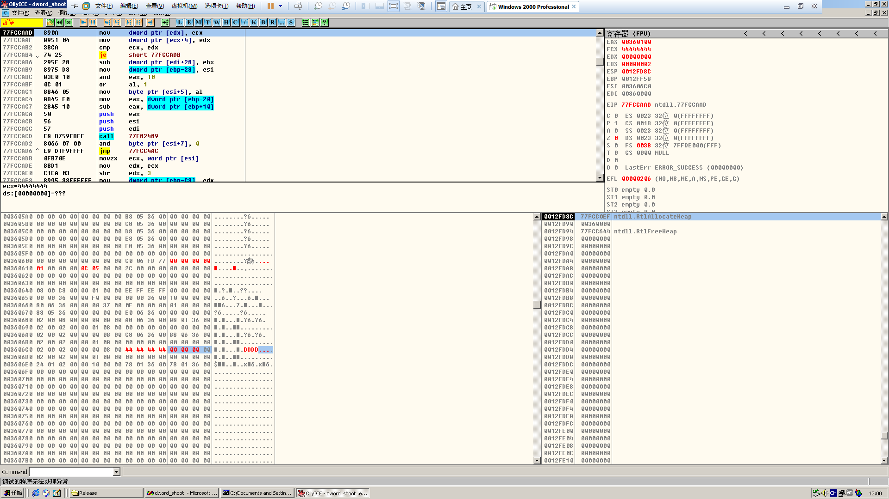

# Dword shooting in heap overrun

**Author：wnagzihxain
Mail：tudouboom@163.com**

```
#include <windows.h>

int main()
{
	HLOCAL h1, h2, h3, h4, h5, h6;
	HANDLE hp;
	hp = HeapCreate(0, 0x1000, 0x10000);
	h1 = HeapAlloc(hp, HEAP_ZERO_MEMORY, 8);
	h2 = HeapAlloc(hp, HEAP_ZERO_MEMORY, 8);
	h3 = HeapAlloc(hp, HEAP_ZERO_MEMORY, 8);
	h4 = HeapAlloc(hp, HEAP_ZERO_MEMORY, 8);
	h5 = HeapAlloc(hp, HEAP_ZERO_MEMORY, 8);
	h6 = HeapAlloc(hp, HEAP_ZERO_MEMORY, 8);
 
	_asm int 3	//used to break the process
	//free the odd blocks to prevent coalesing
	HeapFree(hp, 0, h1); 
	HeapFree(hp, 0, h3); 
	HeapFree(hp, 0, h5); //now freelist[2] got 3 entries
	
	//will allocate from freelist[2] which means unlink the last entry (h5)
	h1 = HeapAlloc(hp, HEAP_ZERO_MEMORY, 8); 
		
	return 0;
}
```


断在int 3后，观察下堆区
```
00360000  C8 00 00 00 00 01 00 00 FF EE FF EE 00 10 00 00  ?.....??..
00360010  00 00 00 00 00 FE 00 00 00 00 10 00 00 20 00 00  .....?..... ..
00360020  00 02 00 00 00 20 00 00 24 01 00 00 FF EF FD 7F  .... ..$..稞
00360030  04 00 08 06 00 00 00 00 00 00 00 00 00 00 00 00   .............
00360040  00 00 00 00 98 05 36 00 0F 00 00 00 F8 FF FF FF  ....?6....?
00360050  50 00 36 00 50 00 36 00 40 06 36 00 00 00 00 00  P.6.P.6.@6.....
00360060  00 00 00 00 00 00 00 00 00 00 00 00 00 00 00 00  ................
00360070  00 00 00 00 00 00 00 00 00 00 00 00 00 00 00 00  ................
00360080  00 00 00 00 00 00 00 00 00 00 00 00 00 00 00 00  ................
00360090  00 00 00 00 00 00 00 00 00 00 00 00 00 00 00 00  ................
003600A0  00 00 00 00 00 00 00 00 00 00 00 00 00 00 00 00  ................
003600B0  00 00 00 00 00 00 00 00 00 00 00 00 00 00 00 00  ................
003600C0  00 00 00 00 00 00 00 00 00 00 00 00 00 00 00 00  ................
003600D0  00 00 00 00 00 00 00 00 00 00 00 00 00 00 00 00  ................
003600E0  00 00 00 00 00 00 00 00 00 00 00 00 00 00 00 00  ................
003600F0  00 00 00 00 00 00 00 00 00 00 00 00 00 00 00 00  ................
00360100  00 00 00 00 00 00 00 00 00 00 00 00 00 00 00 00  ................
00360110  00 00 00 00 00 00 00 00 00 00 00 00 00 00 00 00  ................
00360120  00 00 00 00 00 00 00 00 00 00 00 00 00 00 00 00  ................
00360130  00 00 00 00 00 00 00 00 00 00 00 00 00 00 00 00  ................
00360140  00 00 00 00 00 00 00 00 00 00 00 00 00 00 00 00  ................
00360150  00 00 00 00 00 00 00 00 00 00 00 00 00 00 00 00  ................
00360160  00 00 00 00 00 00 00 00 00 00 00 00 01 00 00 00  ...............
00360170  00 00 00 00 00 00 00 00 E8 06 36 00 E8 06 36 00  ........?6.?6.
00360180  80 01 36 00 80 01 36 00 88 01 36 00 88 01 36 00  €6.€6.?6.?6.
00360190  90 01 36 00 90 01 36 00 98 01 36 00 98 01 36 00  ?6.?6.?6.?6.
003601A0  A0 01 36 00 A0 01 36 00 A8 01 36 00 A8 01 36 00  ?6.?6.?6.?6.
003601B0  B0 01 36 00 B0 01 36 00 B8 01 36 00 B8 01 36 00  ?6.?6.?6.?6.
003601C0  C0 01 36 00 C0 01 36 00 C8 01 36 00 C8 01 36 00  ?6.?6.?6.?6.
003601D0  D0 01 36 00 D0 01 36 00 D8 01 36 00 D8 01 36 00  ?6.?6.?6.?6.
003601E0  E0 01 36 00 E0 01 36 00 E8 01 36 00 E8 01 36 00  ?6.?6.?6.?6.
003601F0  F0 01 36 00 F0 01 36 00 F8 01 36 00 F8 01 36 00  ?6.?6.?6.?6.
00360200  00 02 36 00 00 02 36 00 08 02 36 00 08 02 36 00  .6..6.6.6.
00360210  10 02 36 00 10 02 36 00 18 02 36 00 18 02 36 00  6.6.6.6.
00360220  20 02 36 00 20 02 36 00 28 02 36 00 28 02 36 00   6. 6.(6.(6.
00360230  30 02 36 00 30 02 36 00 38 02 36 00 38 02 36 00  06.06.86.86.
00360240  40 02 36 00 40 02 36 00 48 02 36 00 48 02 36 00  @6.@6.H6.H6.
00360250  50 02 36 00 50 02 36 00 58 02 36 00 58 02 36 00  P6.P6.X6.X6.
00360260  60 02 36 00 60 02 36 00 68 02 36 00 68 02 36 00  `6.`6.h6.h6.
00360270  70 02 36 00 70 02 36 00 78 02 36 00 78 02 36 00  p6.p6.x6.x6.
00360280  80 02 36 00 80 02 36 00 88 02 36 00 88 02 36 00  €6.€6.?6.?6.
00360290  90 02 36 00 90 02 36 00 98 02 36 00 98 02 36 00  ?6.?6.?6.?6.
003602A0  A0 02 36 00 A0 02 36 00 A8 02 36 00 A8 02 36 00  ?6.?6.?6.?6.
003602B0  B0 02 36 00 B0 02 36 00 B8 02 36 00 B8 02 36 00  ?6.?6.?6.?6.
003602C0  C0 02 36 00 C0 02 36 00 C8 02 36 00 C8 02 36 00  ?6.?6.?6.?6.
003602D0  D0 02 36 00 D0 02 36 00 D8 02 36 00 D8 02 36 00  ?6.?6.?6.?6.
003602E0  E0 02 36 00 E0 02 36 00 E8 02 36 00 E8 02 36 00  ?6.?6.?6.?6.
003602F0  F0 02 36 00 F0 02 36 00 F8 02 36 00 F8 02 36 00  ?6.?6.?6.?6.
00360300  00 03 36 00 00 03 36 00 08 03 36 00 08 03 36 00  . 6.. 6. 6. 6.
00360310  10 03 36 00 10 03 36 00 18 03 36 00 18 03 36 00   6. 6. 6. 6.
00360320  20 03 36 00 20 03 36 00 28 03 36 00 28 03 36 00    6.  6.( 6.( 6.
00360330  30 03 36 00 30 03 36 00 38 03 36 00 38 03 36 00  0 6.0 6.8 6.8 6.
00360340  40 03 36 00 40 03 36 00 48 03 36 00 48 03 36 00  @ 6.@ 6.H 6.H 6.
00360350  50 03 36 00 50 03 36 00 58 03 36 00 58 03 36 00  P 6.P 6.X 6.X 6.
00360360  60 03 36 00 60 03 36 00 68 03 36 00 68 03 36 00  ` 6.` 6.h 6.h 6.
00360370  70 03 36 00 70 03 36 00 78 03 36 00 78 03 36 00  p 6.p 6.x 6.x 6.
00360380  80 03 36 00 80 03 36 00 88 03 36 00 88 03 36 00  € 6.€ 6.?6.?6.
00360390  90 03 36 00 90 03 36 00 98 03 36 00 98 03 36 00  ?6.?6.?6.?6.
003603A0  A0 03 36 00 A0 03 36 00 A8 03 36 00 A8 03 36 00  ?6.?6.?6.?6.
003603B0  B0 03 36 00 B0 03 36 00 B8 03 36 00 B8 03 36 00  ?6.?6.?6.?6.
003603C0  C0 03 36 00 C0 03 36 00 C8 03 36 00 C8 03 36 00  ?6.?6.?6.?6.
003603D0  D0 03 36 00 D0 03 36 00 D8 03 36 00 D8 03 36 00  ?6.?6.?6.?6.
003603E0  E0 03 36 00 E0 03 36 00 E8 03 36 00 E8 03 36 00  ?6.?6.?6.?6.
003603F0  F0 03 36 00 F0 03 36 00 F8 03 36 00 F8 03 36 00  ?6.?6.?6.?6.
00360400  00 04 36 00 00 04 36 00 08 04 36 00 08 04 36 00  . 6.. 6. 6. 6.
00360410  10 04 36 00 10 04 36 00 18 04 36 00 18 04 36 00   6. 6. 6. 6.
00360420  20 04 36 00 20 04 36 00 28 04 36 00 28 04 36 00    6.  6.( 6.( 6.
00360430  30 04 36 00 30 04 36 00 38 04 36 00 38 04 36 00  0 6.0 6.8 6.8 6.
00360440  40 04 36 00 40 04 36 00 48 04 36 00 48 04 36 00  @ 6.@ 6.H 6.H 6.
00360450  50 04 36 00 50 04 36 00 58 04 36 00 58 04 36 00  P 6.P 6.X 6.X 6.
00360460  60 04 36 00 60 04 36 00 68 04 36 00 68 04 36 00  ` 6.` 6.h 6.h 6.
00360470  70 04 36 00 70 04 36 00 78 04 36 00 78 04 36 00  p 6.p 6.x 6.x 6.
00360480  80 04 36 00 80 04 36 00 88 04 36 00 88 04 36 00  € 6.€ 6.?6.?6.
00360490  90 04 36 00 90 04 36 00 98 04 36 00 98 04 36 00  ?6.?6.?6.?6.
003604A0  A0 04 36 00 A0 04 36 00 A8 04 36 00 A8 04 36 00  ?6.?6.?6.?6.
003604B0  B0 04 36 00 B0 04 36 00 B8 04 36 00 B8 04 36 00  ?6.?6.?6.?6.
003604C0  C0 04 36 00 C0 04 36 00 C8 04 36 00 C8 04 36 00  ?6.?6.?6.?6.
003604D0  D0 04 36 00 D0 04 36 00 D8 04 36 00 D8 04 36 00  ?6.?6.?6.?6.
003604E0  E0 04 36 00 E0 04 36 00 E8 04 36 00 E8 04 36 00  ?6.?6.?6.?6.
003604F0  F0 04 36 00 F0 04 36 00 F8 04 36 00 F8 04 36 00  ?6.?6.?6.?6.
00360500  00 05 36 00 00 05 36 00 08 05 36 00 08 05 36 00  .6..6.6.6.
00360510  10 05 36 00 10 05 36 00 18 05 36 00 18 05 36 00  6.6.6.6.
00360520  20 05 36 00 20 05 36 00 28 05 36 00 28 05 36 00   6. 6.(6.(6.
00360530  30 05 36 00 30 05 36 00 38 05 36 00 38 05 36 00  06.06.86.86.
00360540  40 05 36 00 40 05 36 00 48 05 36 00 48 05 36 00  @6.@6.H6.H6.
00360550  50 05 36 00 50 05 36 00 58 05 36 00 58 05 36 00  P6.P6.X6.X6.
00360560  60 05 36 00 60 05 36 00 68 05 36 00 68 05 36 00  `6.`6.h6.h6.
00360570  70 05 36 00 70 05 36 00 08 06 36 00 00 00 00 00  p6.p6.6.....
00360580  00 00 00 00 00 00 00 00 00 00 00 00 00 10 36 00  .............6.
00360590  00 F0 00 00 00 00 00 00 A8 05 36 00 00 00 00 00  .?.....?6.....
003605A0  00 00 00 00 00 00 00 00 B8 05 36 00 00 00 00 00  ........?6.....
003605B0  00 00 00 00 00 00 00 00 C8 05 36 00 00 00 00 00  ........?6.....
003605C0  00 00 00 00 00 00 00 00 D8 05 36 00 00 00 00 00  ........?6.....
003605D0  00 00 00 00 00 00 00 00 E8 05 36 00 00 00 00 00  ........?6.....
003605E0  00 00 00 00 00 00 00 00 F8 05 36 00 00 00 00 00  ........?6.....
003605F0  00 00 00 00 00 00 00 00 00 00 00 00 00 00 00 00  ................
00360600  00 00 00 00 00 00 00 00 C0 06 FD 77 FF FF FF FF  ........?齱
00360610  00 00 00 00 00 00 00 00 2C 00 00 00 00 00 00 00  ........,.......
00360620  00 00 00 00 00 00 00 00 00 00 00 00 00 00 00 00  ................
00360630  00 00 00 00 00 00 00 00 00 00 00 00 00 00 00 00  ................
00360640  08 00 C8 00 00 01 00 00 EE FF EE FF 00 00 00 00  .?...??....
00360650  00 00 36 00 00 F0 00 00 00 00 36 00 10 00 00 00  ..6..?...6....
00360660  80 06 36 00 00 00 37 00 0F 00 00 00 01 00 00 00  €6...7.......
00360670  88 05 36 00 00 00 00 00 E0 06 36 00 00 00 00 00  ?6.....?6.....
00360680  02 00 08 00 00 01 08 00 00 00 00 00 00 00 00 00  ............
00360690  02 00 02 00 00 01 08 00 00 00 00 00 00 00 00 00  ............
003606A0  02 00 02 00 00 01 08 00 00 00 00 00 00 00 00 00  ............
003606B0  02 00 02 00 00 01 08 00 00 00 00 00 00 00 00 00  ............
003606C0  02 00 02 00 00 01 08 00 00 00 00 00 00 00 00 00  ............
003606D0  02 00 02 00 00 01 08 00 00 00 00 00 00 00 00 00  ............
003606E0  24 01 02 00 00 10 00 00 78 01 36 00 78 01 36 00  $....x6.x6.
003606F0  00 00 00 00 00 00 00 00 00 00 00 00 00 00 00 00  ................
00360700  00 00 00 00 00 00 00 00 00 00 00 00 00 00 00 00  ................
00360710  00 00 00 00 00 00 00 00 00 00 00 00 00 00 00 00  ................
```

这是分配的6个堆块
```
00360680  02 00 08 00 00 01 08 00 00 00 00 00 00 00 00 00  ............
00360690  02 00 02 00 00 01 08 00 00 00 00 00 00 00 00 00  ............
003606A0  02 00 02 00 00 01 08 00 00 00 00 00 00 00 00 00  ............
003606B0  02 00 02 00 00 01 08 00 00 00 00 00 00 00 00 00  ............
003606C0  02 00 02 00 00 01 08 00 00 00 00 00 00 00 00 00  ............
003606D0  02 00 02 00 00 01 08 00 00 00 00 00 00 00 00 00  ............
```

然后nop掉`int 3`，F4走完释放，之所以这样释放是为了不让堆块合并，前面学习空表的时候有说过空表串着的堆块如果在堆区连续是会合并的
```
HeapFree(hp,0,h1); 
HeapFree(hp,0,h3); 
HeapFree(hp,0,h5); //now freelist[2] got 3 entries
00401056  |.  53            push    ebx                              ; /pMemory
00401057  |.  8B1D 4C504000 mov     ebx, dword ptr [<&KERNEL32.HeapF>; |ntdll.RtlFreeHeap
0040105D  |.  6A 00         push    0                                ; |Flags = 0
0040105F  |.  56            push    esi                              ; |hHeap
00401060  |.  FFD3          call    ebx                              ; \HeapFree
00401062  |.  8B45 FC       mov     eax, dword ptr [ebp-4]
00401065  |.  50            push    eax                              ; /pMemory
00401066  |.  6A 00         push    0                                ; |Flags = 0
00401068  |.  56            push    esi                              ; |hHeap
00401069  |.  FFD3          call    ebx                              ; \HeapFree
0040106B  |.  8B4D F8       mov     ecx, dword ptr [ebp-8]
0040106E  |.  51            push    ecx                              ; /pMemory
0040106F  |.  6A 00         push    0                                ; |Flags = 0
00401071  |.  56            push    esi                              ; |hHeap
00401072  |.  FFD3          call    ebx                              ; \HeapFree
```

然后来观察堆区的布局
```
00360000  C8 00 00 00 00 01 00 00 FF EE FF EE 00 10 00 00  ?.....??..
00360010  00 00 00 00 00 FE 00 00 00 00 10 00 00 20 00 00  .....?..... ..
00360020  00 02 00 00 00 20 00 00 2A 01 00 00 FF EF FD 7F  .... ..*..稞
00360030  04 00 08 06 00 00 00 00 00 00 00 00 00 00 00 00   .............
00360040  00 00 00 00 98 05 36 00 0F 00 00 00 F8 FF FF FF  ....?6....?
00360050  50 00 36 00 50 00 36 00 40 06 36 00 00 00 00 00  P.6.P.6.@6.....
00360060  00 00 00 00 00 00 00 00 00 00 00 00 00 00 00 00  ................
00360070  00 00 00 00 00 00 00 00 00 00 00 00 00 00 00 00  ................
00360080  00 00 00 00 00 00 00 00 00 00 00 00 00 00 00 00  ................
00360090  00 00 00 00 00 00 00 00 00 00 00 00 00 00 00 00  ................
003600A0  00 00 00 00 00 00 00 00 00 00 00 00 00 00 00 00  ................
003600B0  00 00 00 00 00 00 00 00 00 00 00 00 00 00 00 00  ................
003600C0  00 00 00 00 00 00 00 00 00 00 00 00 00 00 00 00  ................
003600D0  00 00 00 00 00 00 00 00 00 00 00 00 00 00 00 00  ................
003600E0  00 00 00 00 00 00 00 00 00 00 00 00 00 00 00 00  ................
003600F0  00 00 00 00 00 00 00 00 00 00 00 00 00 00 00 00  ................
00360100  00 00 00 00 00 00 00 00 00 00 00 00 00 00 00 00  ................
00360110  00 00 00 00 00 00 00 00 00 00 00 00 00 00 00 00  ................
00360120  00 00 00 00 00 00 00 00 00 00 00 00 00 00 00 00  ................
00360130  00 00 00 00 00 00 00 00 00 00 00 00 00 00 00 00  ................
00360140  00 00 00 00 00 00 00 00 00 00 00 00 00 00 00 00  ................
00360150  00 00 00 00 00 00 00 00 04 00 00 00 00 00 00 00  ........ .......
00360160  00 00 00 00 00 00 00 00 00 00 00 00 01 00 00 00  ...............
00360170  00 00 00 00 00 00 00 00 E8 06 36 00 E8 06 36 00  ........?6.?6.
00360180  80 01 36 00 80 01 36 00 88 06 36 00 C8 06 36 00  €6.€6.?6.?6.
00360190  90 01 36 00 90 01 36 00 98 01 36 00 98 01 36 00  ?6.?6.?6.?6.
003601A0  A0 01 36 00 A0 01 36 00 A8 01 36 00 A8 01 36 00  ?6.?6.?6.?6.
003601B0  B0 01 36 00 B0 01 36 00 B8 01 36 00 B8 01 36 00  ?6.?6.?6.?6.
003601C0  C0 01 36 00 C0 01 36 00 C8 01 36 00 C8 01 36 00  ?6.?6.?6.?6.
003601D0  D0 01 36 00 D0 01 36 00 D8 01 36 00 D8 01 36 00  ?6.?6.?6.?6.
003601E0  E0 01 36 00 E0 01 36 00 E8 01 36 00 E8 01 36 00  ?6.?6.?6.?6.
003601F0  F0 01 36 00 F0 01 36 00 F8 01 36 00 F8 01 36 00  ?6.?6.?6.?6.
00360200  00 02 36 00 00 02 36 00 08 02 36 00 08 02 36 00  .6..6.6.6.
00360210  10 02 36 00 10 02 36 00 18 02 36 00 18 02 36 00  6.6.6.6.
00360220  20 02 36 00 20 02 36 00 28 02 36 00 28 02 36 00   6. 6.(6.(6.
00360230  30 02 36 00 30 02 36 00 38 02 36 00 38 02 36 00  06.06.86.86.
00360240  40 02 36 00 40 02 36 00 48 02 36 00 48 02 36 00  @6.@6.H6.H6.
00360250  50 02 36 00 50 02 36 00 58 02 36 00 58 02 36 00  P6.P6.X6.X6.
00360260  60 02 36 00 60 02 36 00 68 02 36 00 68 02 36 00  `6.`6.h6.h6.
00360270  70 02 36 00 70 02 36 00 78 02 36 00 78 02 36 00  p6.p6.x6.x6.
00360280  80 02 36 00 80 02 36 00 88 02 36 00 88 02 36 00  €6.€6.?6.?6.
00360290  90 02 36 00 90 02 36 00 98 02 36 00 98 02 36 00  ?6.?6.?6.?6.
003602A0  A0 02 36 00 A0 02 36 00 A8 02 36 00 A8 02 36 00  ?6.?6.?6.?6.
003602B0  B0 02 36 00 B0 02 36 00 B8 02 36 00 B8 02 36 00  ?6.?6.?6.?6.
003602C0  C0 02 36 00 C0 02 36 00 C8 02 36 00 C8 02 36 00  ?6.?6.?6.?6.
003602D0  D0 02 36 00 D0 02 36 00 D8 02 36 00 D8 02 36 00  ?6.?6.?6.?6.
003602E0  E0 02 36 00 E0 02 36 00 E8 02 36 00 E8 02 36 00  ?6.?6.?6.?6.
003602F0  F0 02 36 00 F0 02 36 00 F8 02 36 00 F8 02 36 00  ?6.?6.?6.?6.
00360300  00 03 36 00 00 03 36 00 08 03 36 00 08 03 36 00  . 6.. 6. 6. 6.
00360310  10 03 36 00 10 03 36 00 18 03 36 00 18 03 36 00   6. 6. 6. 6.
00360320  20 03 36 00 20 03 36 00 28 03 36 00 28 03 36 00    6.  6.( 6.( 6.
00360330  30 03 36 00 30 03 36 00 38 03 36 00 38 03 36 00  0 6.0 6.8 6.8 6.
00360340  40 03 36 00 40 03 36 00 48 03 36 00 48 03 36 00  @ 6.@ 6.H 6.H 6.
00360350  50 03 36 00 50 03 36 00 58 03 36 00 58 03 36 00  P 6.P 6.X 6.X 6.
00360360  60 03 36 00 60 03 36 00 68 03 36 00 68 03 36 00  ` 6.` 6.h 6.h 6.
00360370  70 03 36 00 70 03 36 00 78 03 36 00 78 03 36 00  p 6.p 6.x 6.x 6.
00360380  80 03 36 00 80 03 36 00 88 03 36 00 88 03 36 00  € 6.€ 6.?6.?6.
00360390  90 03 36 00 90 03 36 00 98 03 36 00 98 03 36 00  ?6.?6.?6.?6.
003603A0  A0 03 36 00 A0 03 36 00 A8 03 36 00 A8 03 36 00  ?6.?6.?6.?6.
003603B0  B0 03 36 00 B0 03 36 00 B8 03 36 00 B8 03 36 00  ?6.?6.?6.?6.
003603C0  C0 03 36 00 C0 03 36 00 C8 03 36 00 C8 03 36 00  ?6.?6.?6.?6.
003603D0  D0 03 36 00 D0 03 36 00 D8 03 36 00 D8 03 36 00  ?6.?6.?6.?6.
003603E0  E0 03 36 00 E0 03 36 00 E8 03 36 00 E8 03 36 00  ?6.?6.?6.?6.
003603F0  F0 03 36 00 F0 03 36 00 F8 03 36 00 F8 03 36 00  ?6.?6.?6.?6.
00360400  00 04 36 00 00 04 36 00 08 04 36 00 08 04 36 00  . 6.. 6. 6. 6.
00360410  10 04 36 00 10 04 36 00 18 04 36 00 18 04 36 00   6. 6. 6. 6.
00360420  20 04 36 00 20 04 36 00 28 04 36 00 28 04 36 00    6.  6.( 6.( 6.
00360430  30 04 36 00 30 04 36 00 38 04 36 00 38 04 36 00  0 6.0 6.8 6.8 6.
00360440  40 04 36 00 40 04 36 00 48 04 36 00 48 04 36 00  @ 6.@ 6.H 6.H 6.
00360450  50 04 36 00 50 04 36 00 58 04 36 00 58 04 36 00  P 6.P 6.X 6.X 6.
00360460  60 04 36 00 60 04 36 00 68 04 36 00 68 04 36 00  ` 6.` 6.h 6.h 6.
00360470  70 04 36 00 70 04 36 00 78 04 36 00 78 04 36 00  p 6.p 6.x 6.x 6.
00360480  80 04 36 00 80 04 36 00 88 04 36 00 88 04 36 00  € 6.€ 6.?6.?6.
00360490  90 04 36 00 90 04 36 00 98 04 36 00 98 04 36 00  ?6.?6.?6.?6.
003604A0  A0 04 36 00 A0 04 36 00 A8 04 36 00 A8 04 36 00  ?6.?6.?6.?6.
003604B0  B0 04 36 00 B0 04 36 00 B8 04 36 00 B8 04 36 00  ?6.?6.?6.?6.
003604C0  C0 04 36 00 C0 04 36 00 C8 04 36 00 C8 04 36 00  ?6.?6.?6.?6.
003604D0  D0 04 36 00 D0 04 36 00 D8 04 36 00 D8 04 36 00  ?6.?6.?6.?6.
003604E0  E0 04 36 00 E0 04 36 00 E8 04 36 00 E8 04 36 00  ?6.?6.?6.?6.
003604F0  F0 04 36 00 F0 04 36 00 F8 04 36 00 F8 04 36 00  ?6.?6.?6.?6.
00360500  00 05 36 00 00 05 36 00 08 05 36 00 08 05 36 00  .6..6.6.6.
00360510  10 05 36 00 10 05 36 00 18 05 36 00 18 05 36 00  6.6.6.6.
00360520  20 05 36 00 20 05 36 00 28 05 36 00 28 05 36 00   6. 6.(6.(6.
00360530  30 05 36 00 30 05 36 00 38 05 36 00 38 05 36 00  06.06.86.86.
00360540  40 05 36 00 40 05 36 00 48 05 36 00 48 05 36 00  @6.@6.H6.H6.
00360550  50 05 36 00 50 05 36 00 58 05 36 00 58 05 36 00  P6.P6.X6.X6.
00360560  60 05 36 00 60 05 36 00 68 05 36 00 68 05 36 00  `6.`6.h6.h6.
00360570  70 05 36 00 70 05 36 00 08 06 36 00 00 00 00 00  p6.p6.6.....
00360580  00 00 00 00 00 00 00 00 00 00 00 00 00 10 36 00  .............6.
00360590  00 F0 00 00 00 00 00 00 A8 05 36 00 00 00 00 00  .?.....?6.....
003605A0  00 00 00 00 00 00 00 00 B8 05 36 00 00 00 00 00  ........?6.....
003605B0  00 00 00 00 00 00 00 00 C8 05 36 00 00 00 00 00  ........?6.....
003605C0  00 00 00 00 00 00 00 00 D8 05 36 00 00 00 00 00  ........?6.....
003605D0  00 00 00 00 00 00 00 00 E8 05 36 00 00 00 00 00  ........?6.....
003605E0  00 00 00 00 00 00 00 00 F8 05 36 00 00 00 00 00  ........?6.....
003605F0  00 00 00 00 00 00 00 00 00 00 00 00 00 00 00 00  ................
00360600  00 00 00 00 00 00 00 00 C0 06 FD 77 FF FF FF FF  ........?齱
00360610  00 00 00 00 00 00 00 00 2C 00 00 00 00 00 00 00  ........,.......
00360620  00 00 00 00 00 00 00 00 00 00 00 00 00 00 00 00  ................
00360630  00 00 00 00 00 00 00 00 00 00 00 00 00 00 00 00  ................
00360640  08 00 C8 00 00 01 00 00 EE FF EE FF 00 00 00 00  .?...??....
00360650  00 00 36 00 00 F0 00 00 00 00 36 00 10 00 00 00  ..6..?...6....
00360660  80 06 36 00 00 00 37 00 0F 00 00 00 01 00 00 00  €6...7.......
00360670  88 05 36 00 00 00 00 00 E0 06 36 00 00 00 00 00  ?6.....?6.....
00360680  02 00 08 00 00 00 08 00 A8 06 36 00 88 01 36 00  .....?6.?6.
00360690  02 00 02 00 00 01 08 00 00 00 00 00 00 00 00 00  ............
003606A0  02 00 02 00 00 00 08 00 C8 06 36 00 88 06 36 00  .....?6.?6.
003606B0  02 00 02 00 00 01 08 00 00 00 00 00 00 00 00 00  ............
003606C0  02 00 02 00 00 00 08 00 88 01 36 00 A8 06 36 00  .....?6.?6.
003606D0  02 00 02 00 00 01 08 00 00 00 00 00 00 00 00 00  ............
003606E0  24 01 02 00 00 10 00 00 78 01 36 00 78 01 36 00  $....x6.x6.
003606F0  00 00 00 00 00 00 00 00 00 00 00 00 00 00 00 00  ................
00360700  00 00 00 00 00 00 00 00 00 00 00 00 00 00 00 00  ................
00360710  00 00 00 00 00 00 00 00 00 00 00 00 00 00 00 00  ................
```

可以看到`Freelist[2]`已经串上了堆块，指向了`0x00360688`
```
0x00360180  80 01 36 00 80 01 36 00 88 06 36 00 C8 06 36 00
```

跳到`0x00360688`，又指向了`0x003606A8`
```
0x00360680  02 00 08 00 00 00 08 00 A8 06 36 00 88 01 36 00
```

跳到`0x003606A8`，又指向了`0x003606C8`
```
0x003606A0  02 00 02 00 00 00 08 00 C8 06 36 00 88 06 36 00
```

跳到`0x003606C8`，发现跳回了`Freelist[2]`

所以总结一下
```
    0x00360180  80 01 36 00 80 01 36 00 88 06 36 00 C8 06 36 00
h1  0x00360680  02 00 08 00 00 00 08 00 A8 06 36 00 88 01 36 00
h3  0x003606A0  02 00 02 00 00 00 08 00 C8 06 36 00 88 06 36 00
h5  0x003606C0  02 00 02 00 00 00 08 00 88 01 36 00 A8 06 36 00
```

前向指针flink指向下一个堆块，后向指针指向前一个堆块

其实到这里就可以看出来申请`Freelist[2]`堆块时的伪代码了
```
int remove(ListNode * node)
{
	node->blink->flink = node->flink;
	node->flink->blink = node->blink;
	return 0;
}
```

咱们以申请一个8字节空间为例，加上8字节块首一共16字节所以会从`Freelist[2]`里分配，这里未使用快表，因为前面创建堆区的时候是不可扩展的堆区
```
h5->flink = 0x00360188
h5->blink = 0x003606A8
node->blink->flink = node->flink;
```

此时会把h5的前向指针也就是`0x003606A8`赋值给h3的前向指针，这样前向指针刚好串成一个环，h5就分配出去了，而`node->blink`就是h5的后向指针，也就是将h5的前向指针写入h5的后向指针指向的地址

我们在释放完三个堆块之后修改h5的前向指针和后向指针

前向指针修改为`0x44444444`，后向指针修改为`0x00000000`

F8单步，可以看到找不到`0x00000000`，内存访问出错了



这是DWORDSHOOT的原理，下一篇笔记会写如何通过shellcode来进行DWORDSHOOT


