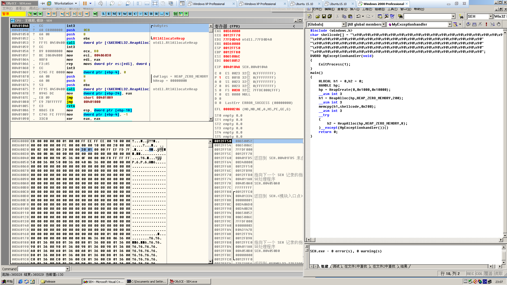
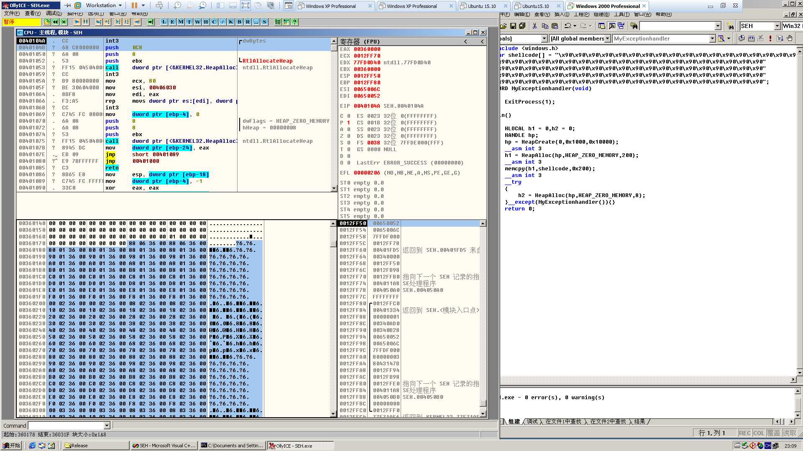
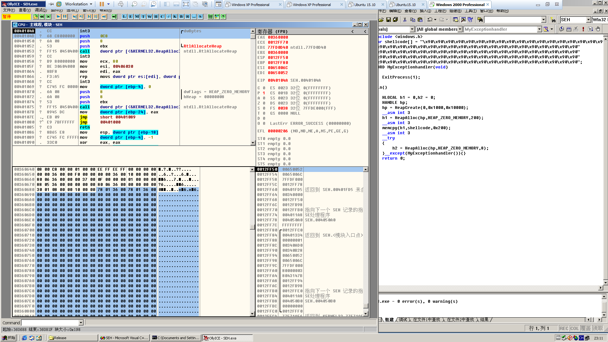
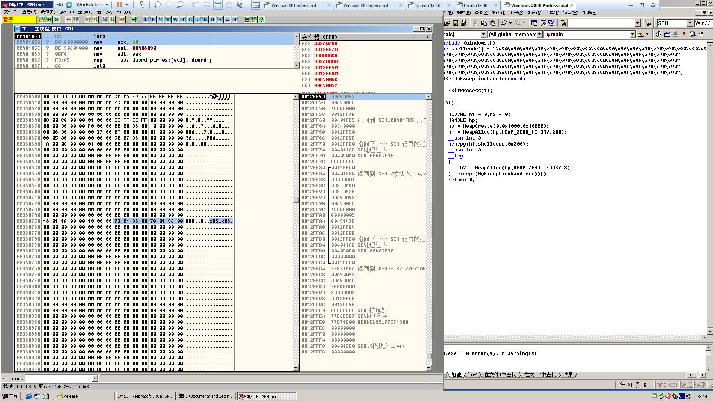
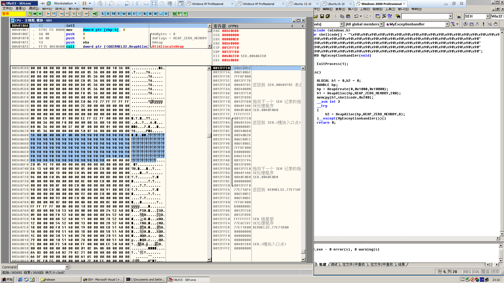
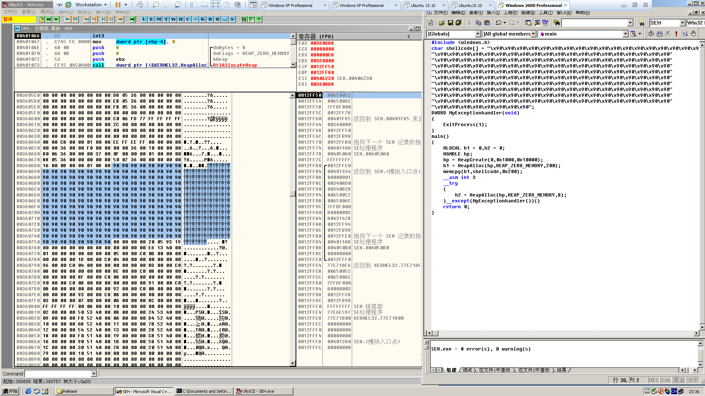
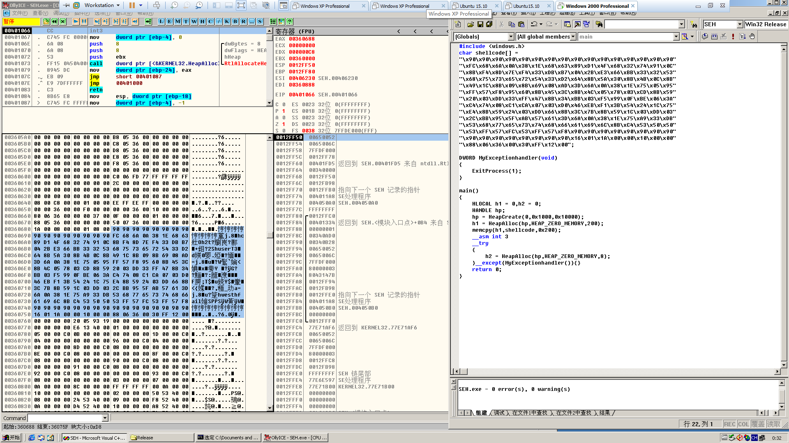
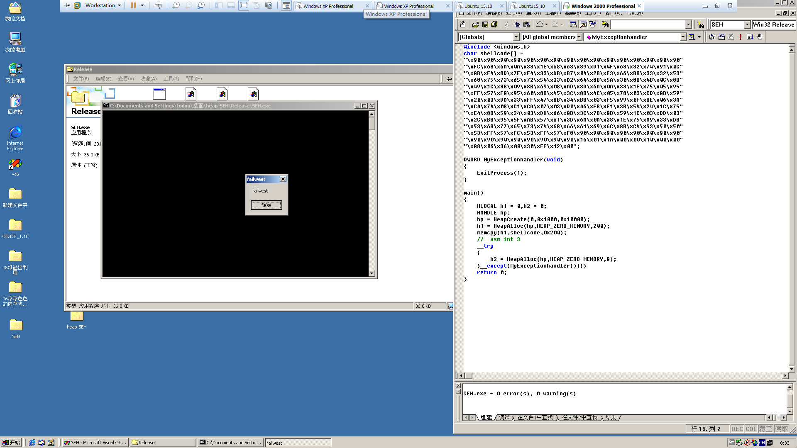

# Using SEH in heap overflow

**Author：wnagzihxain
Mail：tudouboom@163.com**

```
#include <windows.h>

char shellcode[] = "\x90\x90\x90\x90\x90\x90\x90\x90\x90\x90\x90\x90\x90\x90\x90\x90\x90\x90\x90\x90"
"\x90\x90\x90\x90\x90\x90\x90\x90\x90\x90\x90\x90\x90\x90\x90\x90\x90\x90\x90\x90"
"\x90\x90\x90\x90\x90\x90\x90\x90\x90\x90\x90\x90\x90\x90\x90\x90\x90\x90\x90\x90"
"\x90\x90\x90\x90\x90\x90\x90\x90\x90\x90\x90\x90\x90\x90\x90\x90\x90\x90\x90\x90"
"\x90\x90\x90\x90\x90\x90\x90\x90\x90\x90\x90\x90\x90\x90\x90\x90\x90\x90\x90\x90";

DWORD MyExceptionhandler(void)
{
	ExitProcess(1);
}
int main()
{
	HLOCAL h1 = 0, h2 = 0;
	HANDLE hp;
	hp = HeapCreate(0, 0x1000, 0x10000);
    __asm int 3
	h1 = HeapAlloc(hp, HEAP_ZERO_MEMORY, 200);
	__asm int 3
	memcpy(h1, shellcode, 0x200);
	__asm int 3
	__try
	{
		h2 = HeapAlloc(hp, HEAP_ZERO_MEMORY, 8);
	}__except(MyExceptionhandler()){}
	return 0;
}
```

在第一个断点，可以看到创建堆块后的初始状态，标记出来的是0x130个堆单位，一个堆单位8字节



然后来看看空表指针部分，那么在前面调试`堆溢出DWORD SHOOT`的时候有说过，如果申请的堆不可扩展那么这个堆是不会使用快表的，所以`0x00360688`这个位置就是尾块数据区的起始，其它指针都指向自身，等待分配



尾块的情况，除了指针指向了空表，其它都是空



去除第一个断点

看看分配后的情况，主要看尾块的指针，这时候尾块的起始位置已经变成了`0x00360178`（堆块信息在前八字节，下面统一跳过，以指针为标准）



这是分配的空间，接下来我们\x90填充看看



略微有一丝尴尬没有！！！！！！

0x00360750尾块乱掉了！！！！！！

没有关系，我们要做的就是能完整的填充shellcode，现在计算一下，先填满前面的空间，因为`DWORD SHOOT`是让flink写入blink指向的内存，也就是`*blink = flink;`



那么接下来就是找SEH链，就你了
```
0012FF74 004011A8 SE处理程序
```

然后开始填充shellcode，注意长度

记得最开始留点空间给`\x90`，直接填充shellcode是会出错的，然后记得修复堆块首的信息，大概是这样



然后去掉断点执行一下



妥妥的


