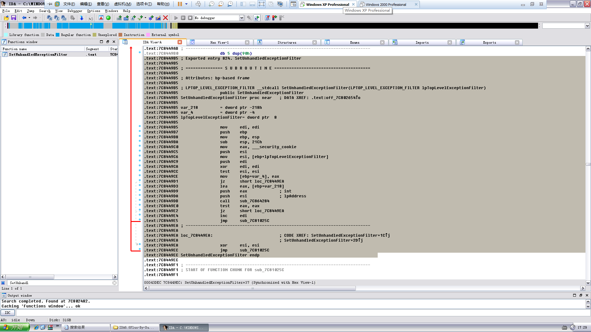

# Using other exception handling to attack

**Author：wnagzihxain
Mail：tudouboom@163.com**

## 1.V.E.H利用
从windows xp开始，在全面兼容以前SEH异常处理机制的情况下，又加入了一种新的异常处理：VEH（Vectored Exception Handler，向量化异常处理）

(1)VEH和进程异常处理类似，都是基于进程，而且需要使用API注册回调函数
```
PVOID AddVectoredExceptionHandler(
	ULONG FirstHandler,
	PVECTORED_EXCEPTION_HANDLER VectoredHandler
);
```

(2)MSDN上对VEH结构的描述
```
Struct _VECTORED_EXCEPTION_NODE
{
	DWORD m_pNextNode;
	DWORD m_pPreviousNode;
	DWORD m_pfnVectoredHandler;
}
```

(3)可以注册多个VEH，VEH结构体之间串成双向链表，可以看到结构体里面有两个指针，比SEH多了一个前向指针

(4)调试器处理优先级高于VEH，VEH优先级高于SEH，也就是说呢，`KiUserExceptionDispatcher()`先检查是不是被调试了，然后检查VEH，最后检查SEH链表

(5)VEH注册位置可以指定，SEH注册位置不能指定

(6)VEH保存在堆中

(7)最后呢，unwind操作只会对SEH产生作用，不会影响VEH

如果能在堆溢出的时候使用DWORD SHOOT来修改VEH头节点的指针，在处理异常的时候就能够执行shellcode

## 2.攻击TEB中的SEH头节点
前面有说，异常处理机制会遍历SEH链表，而第一个SEH指针在TEB第一个DWORD位置，而且永远指向离栈顶最近的SEH

那么如果能用DWORD SHOOT来修改这个指针，使其指向shellcode的起始位置，就可以执行shellcode

一个进程可能有多个线程，每个线程有一个线程环境块TEB，第一个TEB开始于地址`0x7FFDE000`，然后接下来每一个线程的TEB以间隔`0x1000`字节的规则向内存低址增长，如果一个线程退出，那么对应的TEB也会被销毁，空间会被以后的线程重复使用

当遇到多线程的程序时，那么对应的TEB在什么位置就不好说了，这也是一个局限

## 3.攻击UEF
UEF(`UnhandledExceptionFilter()`)，系统默认的异常处理函数，是系统处理异常的最后一个环节，当我们构造的异常所有异常处理都处理不了，那么系统就会调用这个异常处理，我们只需要利用DWORD SHOOT来修改这个异常的调用句柄，就可以执行shellcode

但是不同的系统这个句柄也不愿意，所以我们来反汇编一下`kernel32.dll`

小书包里掏出IDA，搜`SetUnhandledExceptionFilter()`



## 4.攻击PEB中的函数指针
前面有一章我们使用`ExitProcess()`来结束进程，`ExitProcess()`在结束进程时会调用临界区的`RtlEnterCriticalSection()`和`RtlLeaveCriticalSection()`

而`ExitProcess()`调用这两个函数的时候是通过调用PEB里的两个指针，所以呢，我们可以使用DWORD SHOOT来修改这对指针，改为shellcode的入口就可以了，而且这种办法比TEB可靠的多

## 参考
[VEH, VCH, UEF Windows向量化异常处理机制详解](http://blog.csdn.net/mycsersoft/article/details/33307655)