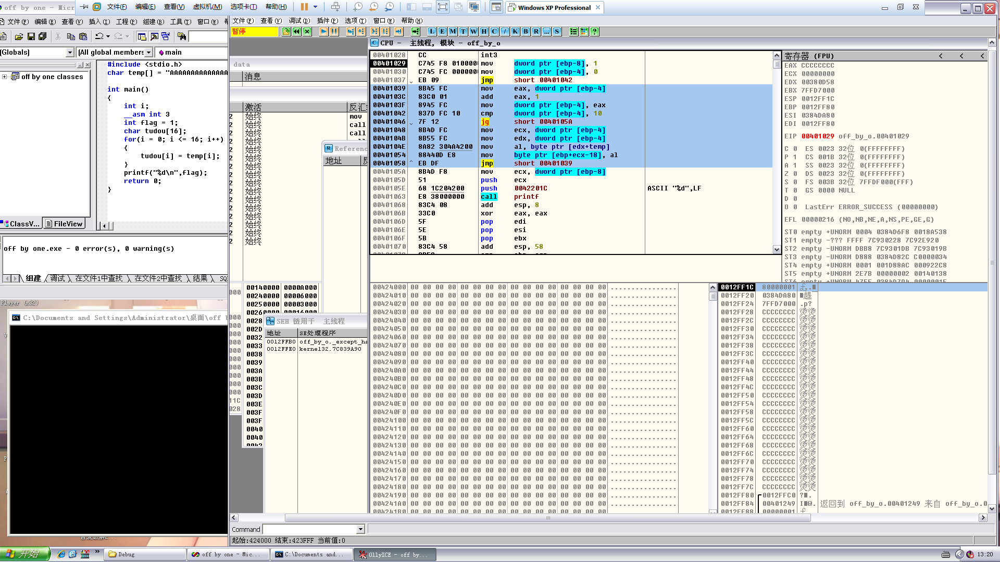
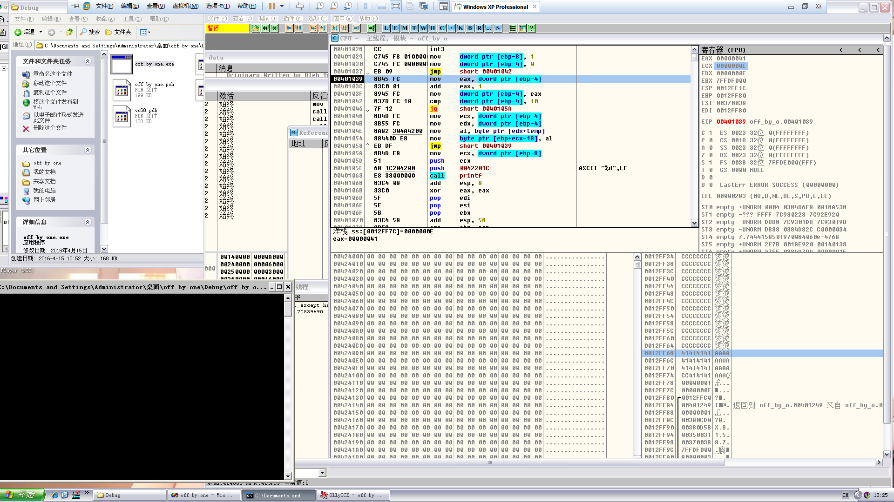
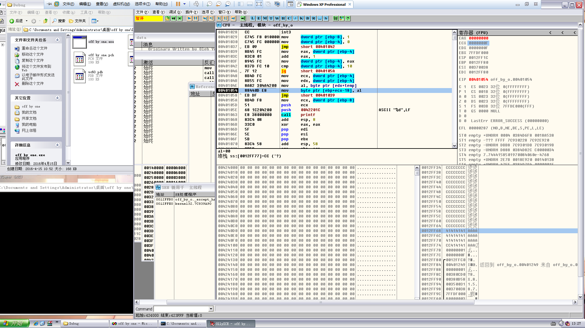
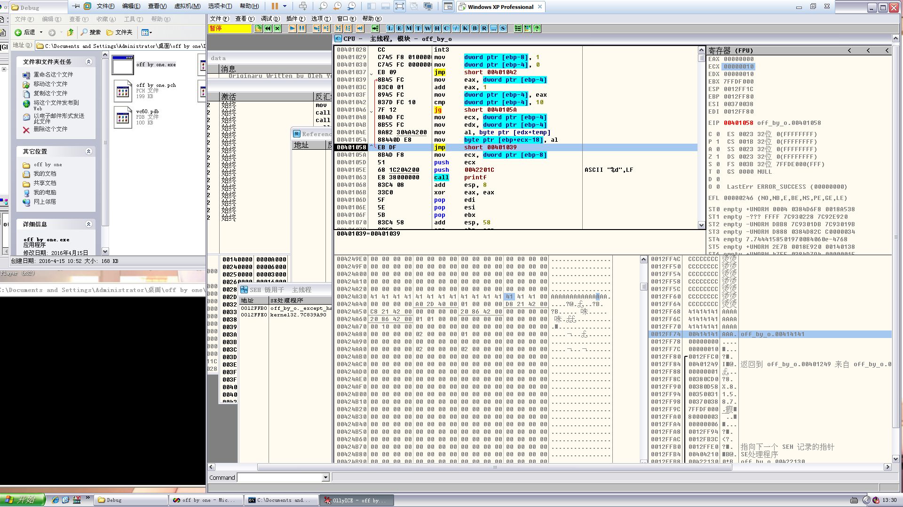
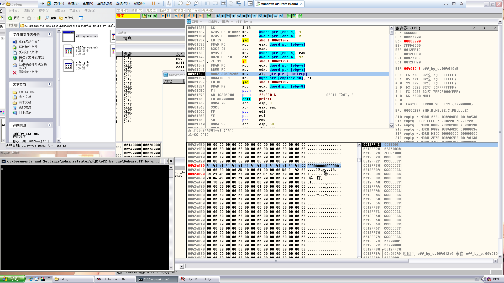

# Off by one Vulnerability

**Author：wnagzihxain
Mail：tudouboom@163.com**

```
#include <stdio.h>

char temp[] = "AAAAAAAAAAAAAAA";

int main()
{
	int i;
	//__asm int 3
	int flag = 1;
	char tudou[16];
	for(i = 0; i <= 16; i++)
	{
		tudou[i] = temp[i];
	}
	printf("%d\n", flag);
	return 0;
}
```

`Off by one`利用的话还是有不少限制的，但是用得好还是有很大危害的，上面这个程序是我自己写的，来测试一下

中断后的界面，标记出来的代码段是for循环



那我们就往下走，来到第15次赋值



注意寄存器的值，ECX作为计数器，现在是`0x0000000E`，然后循环那里的条件是
```
00401042    837D FC 10      cmp     dword ptr [ebp-4], 10
```

也就是说，还有两次，那么我们继续走，这次走完是把结束符赋值给字符串尾部



可以看到al的值是`00`

继续走下去，还有一次循环



可以看到我们下面的1被覆盖掉了，这里要说明一点，因为这里是小端序，但是OD又把顺序给反过来了，所以需要自己弄清楚哪个地址对应哪个字符

但是为什么会被覆盖成0呢？

为什么覆盖的不是其它的值呢？

来看这两句，这里将某处的字符传给al，然后al再传给目的地址
``` 
0040104E    8A82 304A4200   mov     al, byte ptr [edx+temp]
00401054    88440D E8       mov     byte ptr [ebp+ecx-18], al
```

我们可以在这里看出来


 
```
ds:[00424A30]=41 ('A')
al=CC ('?)
```

然后为什么覆盖的是0就很清楚了，然后修改EBP的话，需要下面跟着的就是EBP，然后因为是小端序，所以修改的是最小的一个字节，也就是使EBP在256个字节的的范围内移动