# Exploiting Format String Vulnerability

**Author：wnagzihxain
Mail：tudouboom@163.com**

这是一个格式化串的漏洞，来看看代码
```
#include <iostream>
using namespace std;

int main()
{
	//__asm int 3
	int a = 1;
	int b = 2;
	printf("a = %d, b = %d\n", a, b);
	//printf("a = %d, b = %d\n");
	printf("a = %d, b = %d, c = %d\n");
	return 0;
}
```

这个是最开始的代码，没啥问题

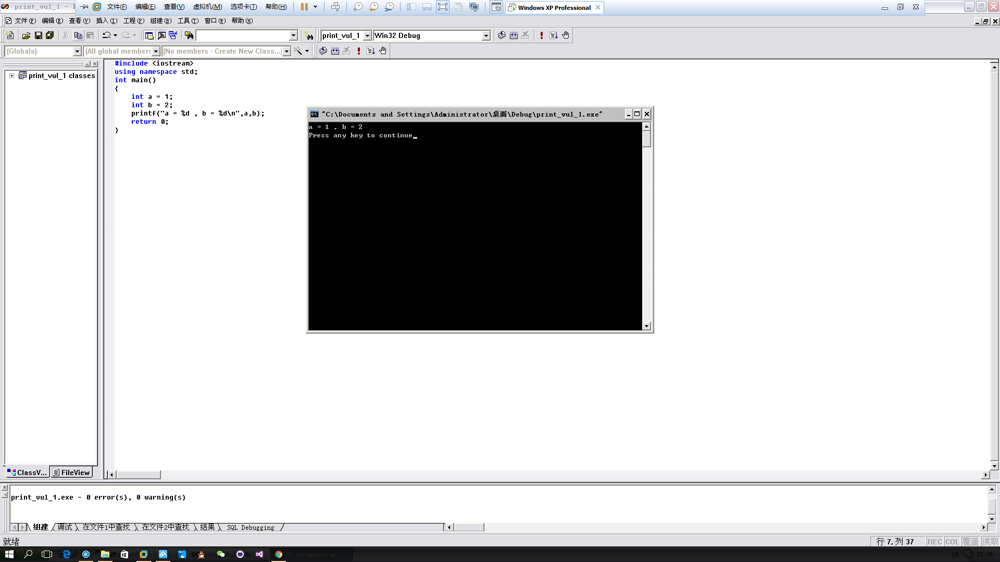

然后看看加了一句代码

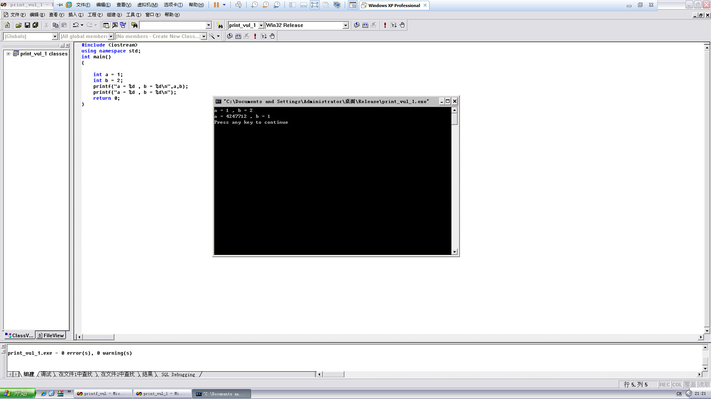

可以看到没有报错，输出了不知道是什么的东西，那么，加个断点上OD调戏一下吧，不对，是调试（￣∞￣）

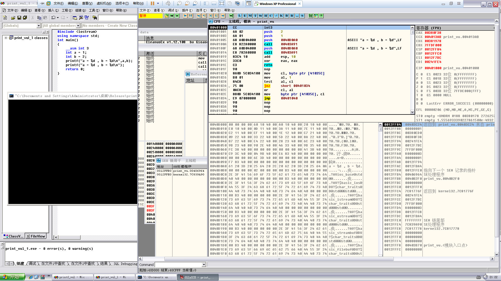

大概就是这样，加个int断点，然后中断后直接取消，就会进入调试器了

我们来看看汇编，这一段代码就是main函数
``` 
00401000    90              nop
00401001    6A 02           push    2
00401003    6A 01           push    1
00401005    68 A0D04000     push    0040D0A0                         ; ASCII "a = %d, b = %d",LF
0040100A    E8 822A0000     call    00403A91
0040100F    68 A0D04000     push    0040D0A0                         ; ASCII "a = %d, b = %d",LF
00401014    E8 782A0000     call    00403A91
00401019    83C4 10         add     esp, 10
0040101C    33C0            xor     eax, eax
0040101E    C3              retn
```

先是int中断，这里我已经nop掉了，然后从最右开始压栈
``` 
printf("a = %d, b = %d\n", a, b);
```

然后`push    0040D0A0`，这里的`0040D0A0`是什么呢？

去数据区找找，其实很明显的可以看出来是什么
``` 
0040D0A0  61 20 3D 20 25 64 20 2C 20 62 20 3D 20 25 64 0A  a = %d, b = %d.
```

然后就是调用printf函数，调用完了之后又把这句压栈，但是没有参数压进去，然后会发生什么呢？往下看

这是调用完第一个call，也就是正常输出a，b

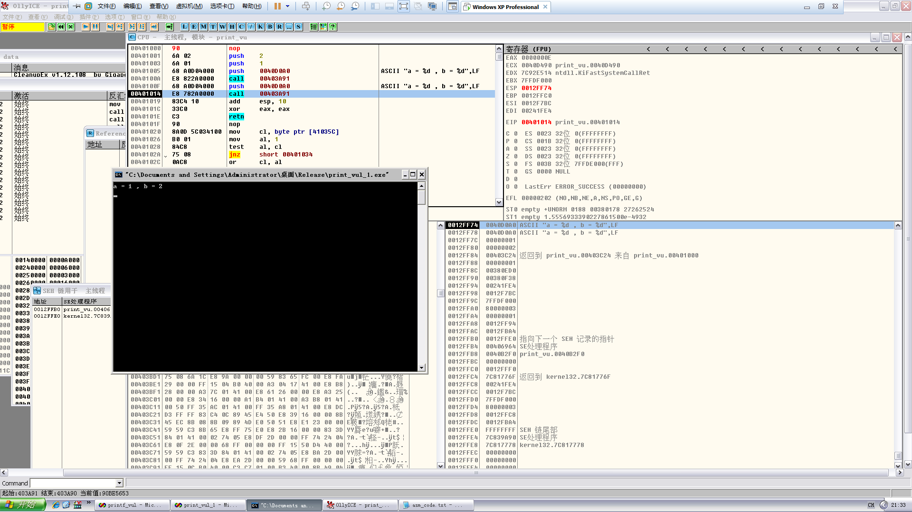

这里可以看到输出了不知道是什么的数字，我们来转换一下进制看看，发现就是紧跟着的`"a = %d , b = %d\n"`的指针，那么就可以解释清楚了，因为没有参数压栈，所以第二个call把跟在它下面的两个数据拿来当数据输出了，所以b的值变成了1，也就是原来是a的值

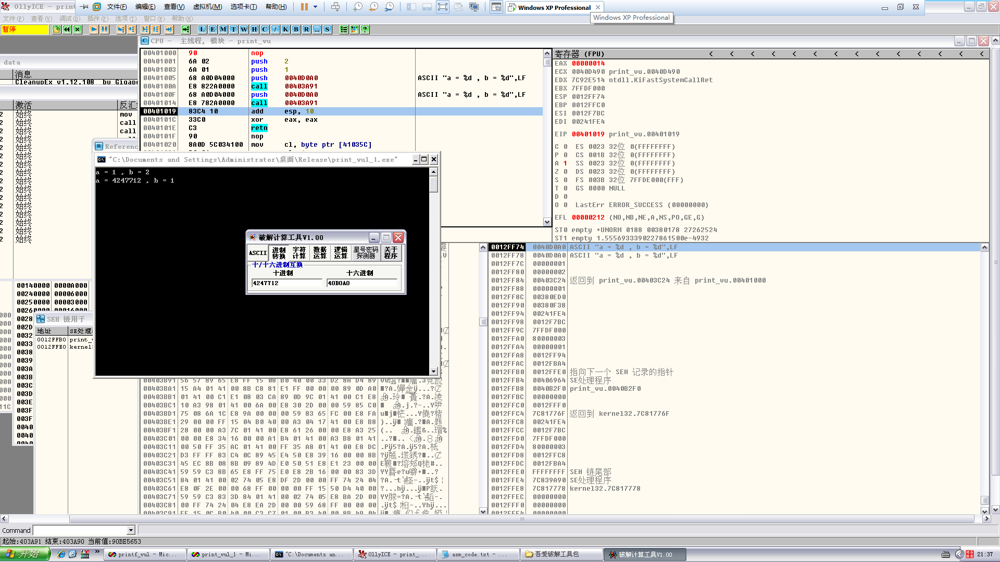

怎么能不然b露个脸，所以加个`%d`把b的值输出来，妥妥的

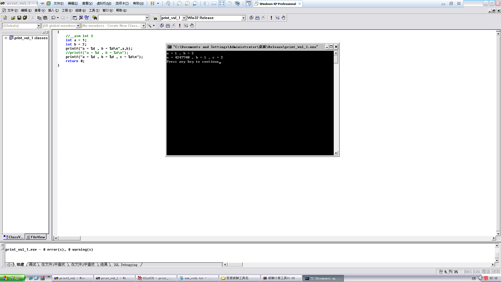

上面只是小小的bug调试，接下来看看格式化串漏洞

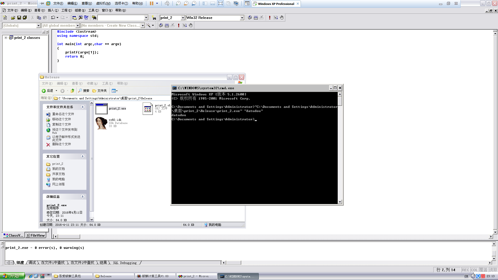

一切都很和谐，那我们来测一测其他输入

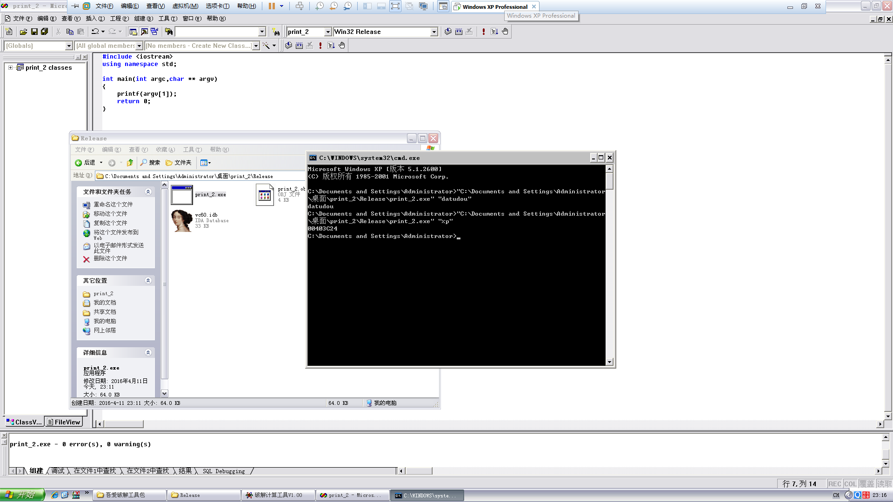

好像输出了什么不该输出的东西，下断点上OD

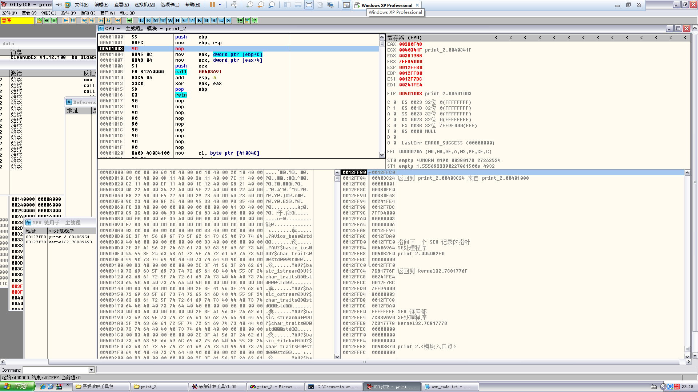

走下去，这里是关键，获取后面的参数，可以看到是ECX的值是`%s`，然后被压栈

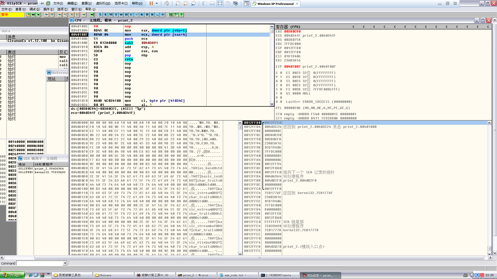

压栈后的整个栈布局，所以像`printf`一样，`%p`是输出16进制，所以下面的数据就被输出来了，下面的数据刚好是EBP

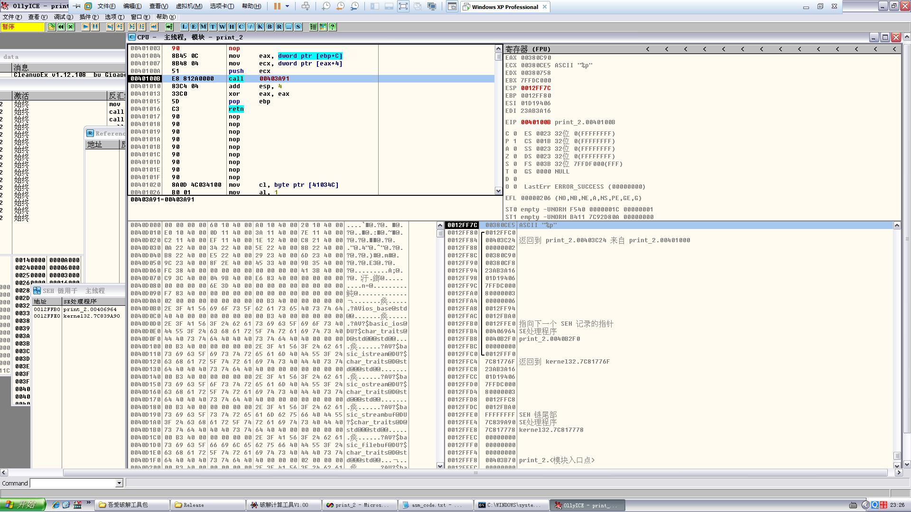

看！！！！！！

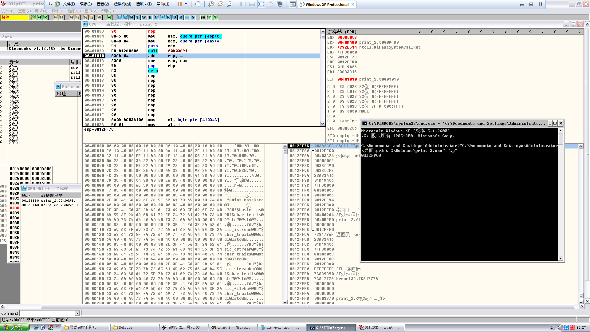

有意思啊，接下来还有一个，关于`%n`的，这个少见，我也没有听说过，但是看起来是很好玩

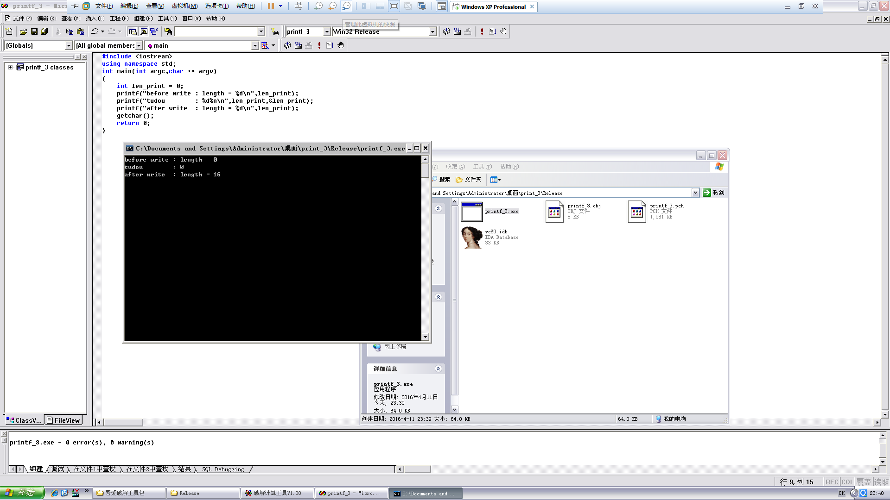

大概就是这样的，但是现在VS已经默认关闭了`%n`的使用，看来是玩不了了

那么格式化串的漏洞就是这些内容，学习了汇编之后虽然用的还不是很顺但是看代码的时候感觉好多了，真的！